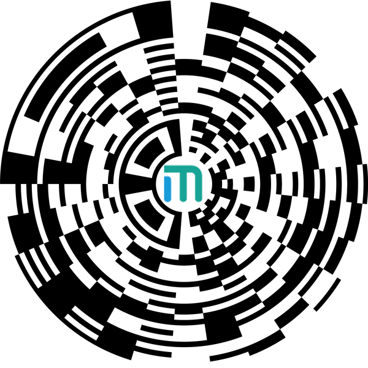
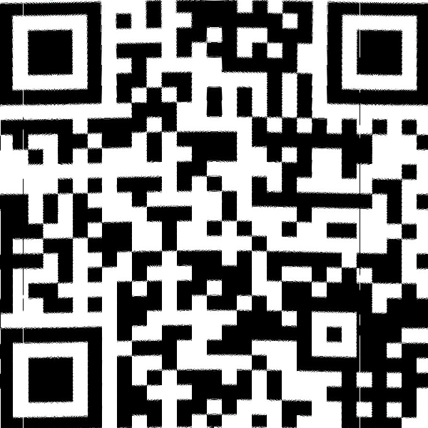

# 一个初赛题

题目是从下面的图片中可以看到什么？



可以看出是一个卷曲的二维码，用`canvas`获得原图的每一点的 `(r, g, b, a)` 的值，将原图上的每一点映射到一个正常的二维码的直角坐标系中的点，解得答案：



解题源码：

```html
<!DOCTYPE html>
<html lang="en">
<head>
    <meta charset="UTF-8">
    <title>Title</title>
</head>
<body>
<canvas id="canvas"></canvas>
<canvas id="QRCode"></canvas>
<script type="text/javascript">
    var canvas = document.getElementById('canvas')
    var qr = document.getElementById('QRCode');
    var context = canvas.getContext('2d')
    var QRContext = qr.getContext('2d')

    var image = new Image()

    window.addEventListener('load', function () {
        image.src = 'y_600.png'
        image.onload = function () {
            qr.width = canvas.width = image.width
            qr.height = canvas.height = image.height
            context.drawImage(image, 0, 0, canvas.width, canvas.height)
            QRCodeHandler()
        }
    })

    function QRCodeHandler() {
        var imageData = context.getImageData(0, 0, canvas.width, canvas.height)
        var pixelData = imageData.data
        // 深拷贝一份 图像数据
        var QRPixelData = pixelData.slice(0)
        // angle 从 0度 到 360度，将 0-360等分为600份，因为映射到答案是 600 * 600 的一个二维码图片，这里对原图的一个圆周600等分，每一等份都是对应答案的x轴的1px
        for (var angle = 0; angle < 360; angle += 360 / 600) {
            // 转换为弧度制
            theta = angle * Math.PI / 180
            // 每一个 从图片中心发出，与水平向左方向成 theta 角的直线，与题目卷曲的二维码的边界的两个焦点
            var x1 = -45 * Math.cos(theta)
            var x2 = -300 * Math.cos(theta)
            // 每一个theta角度的射线，扫描到的部分等分为600份，每一份对应答案的y轴的1px
            var delta_x = (x1 - x2) / 600
            var x, y
            // qr_y, qr_x 为答案的每一点的坐标
            for (var qr_y = 0; qr_y < 600; qr_y++) {
                // x, y 为题目原图的每一点的坐标
                x = Math.ceil(x1 - delta_x * qr_y) + 300
                y = 300 - Math.ceil(-(x1 - delta_x * qr_y) * Math.tan(theta))
                // 原图的图像信息
                var pos = y * 600 + x
                var r = QRPixelData[4 * pos + 0]
                var g = QRPixelData[4 * pos + 1]
                var b = QRPixelData[4 * pos + 2]
                var a = QRPixelData[4 * pos + 3]
                // 映射到答案的每一点上
                qr_x = Math.ceil(angle * 600 / 360)
                var qr_pos = qr_y * 600 + qr_x
                pixelData[4 * qr_pos + 0] = r
                pixelData[4 * qr_pos + 1] = g
                pixelData[4 * qr_pos + 2] = b
                pixelData[4 * qr_pos + 3] = a
            }
        }
        // 绘制答案
        QRContext.putImageData(imageData, 0, 0, 0, 0, qr.width, qr.height)
    }
</script>
</body>
</html>
```