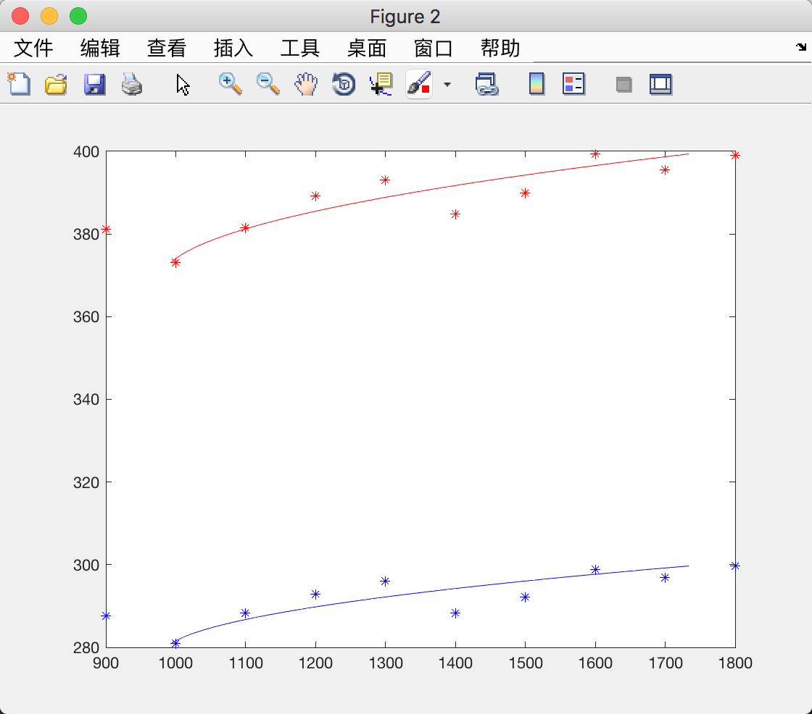
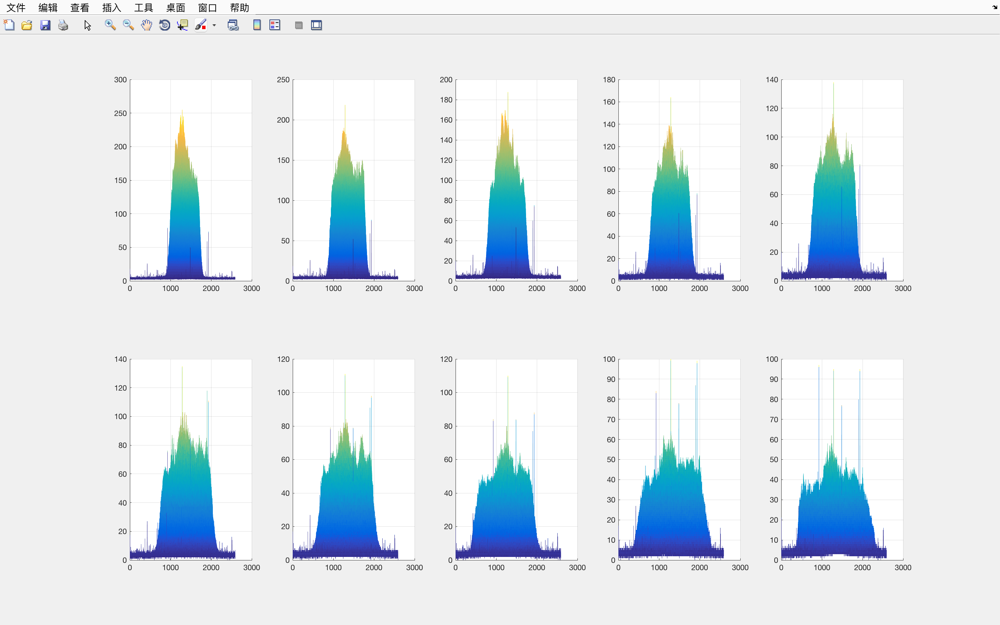

# Matlab 一次激光实验

```matlab
lambda = 1550;
% 将图像文件读入到 matlab 中的矩阵
imgs = zeros(10, 5, 1944, 2592);
ave_imgs = zeros(10, 1944, 2592);

for i = 1 : 10
   for j = 1 : 5
       img_name = sprintf('./experiment4/%d_%d.bmp', i, j);
       imgs(i, j, :, :) = double(imread(img_name));
   end
end

% 求平均值以消除噪声
ave_imgs = mean(imgs, 2);

% 设定背景噪声阈值，去除激光光斑图像的背景噪声
% 用 subplot 和 imshow 命令将 10 个位置的激光光斑图像记录在一副图像中
figure(1);
for i = 1 : 10
    img(1:1944, 1:2592) = [ave_imgs(i, 1, :, :)];
    subplot(2, 5, i);
    mesh(img);
    view(0, 0);
    hold on;
end
% 阈值 T 什么鬼

% 计算激光光斑的重心
Xs = zeros(1, 10);
Ys = zeros(1, 10);
for i = 1 : 10
    img(1:1944, 1:2592) = [ave_imgs(i, 1, :, :)];
    [X, Y] = meshgrid(1:2592, 1:1944);
    XC = sum(sum(X .* img)) / sum(sum(img));
    YC = sum(sum(Y .* img)) / sum(sum(img));
    WX = 2 * sqrt(sum(sum(((X - XC) .^ 2))) / sum(sum(img)));
    WY = 2 * sqrt(sum(sum(((Y - YC) .^ 2))) / sum(sum(img)));
    Xs(i) = WX;
    Ys(i) = WY;
end
% scatter(Xs, Ys);

% 得到拟合系数A, B, C
z = [900:100:1800];
figure(2);
% z ~ x
p = polyfit(Xs, z, 2);
x = linspace(min(Xs), max(Xs));
Z = polyval(p, x);
% z ~ y
p = polyfit(Ys, z, 2);
y = linspace(min(Ys), max(Ys));
Z = polyval(p, y);
plot(z, Xs, 'r*', Z, x, 'r-', z, Ys, 'b*', Z, y, 'b-');
% [A, B, C] = p;
X_A = p(1);
X_B = p(2);
X_C = p(3);
% 用公式(4.27)算出高斯光束 (x, y) 两个方向上的发散角 ?R 、束腰半径 ?R0 、束腰位置 L0 和 M 2 因子
X_theta_R = sqrt(X_A)
X_L_0 = - X_B / (2 * X_A)
X_w_R0 = sqrt(X_C - (X_B ^ 2) / (4 * X_A))
X_M2 = pi / lambda * sqrt(X_A * X_C - (X_B ^ 2) / 4)
% [A, B, C] = p;
Y_A = p(1);
Y_B = p(2);
Y_C = p(3);
% 用公式(4.27)算出高斯光束 (x, y) 两个方向上的发散角 ?R 、束腰半径 ?R0 、束腰位置 L0 和 M 2 因子
Y_theta_R = sqrt(Y_A)
Y_L_0 = - Y_B / (2 * Y_A)
Y_w_R0 = sqrt(Y_C - (Y_B ^ 2) / (4 * Y_A))
Y_M2 = pi / lambda * sqrt(Y_A * Y_C - (Y_B ^ 2) / 4)

% 用 subplot 和 imshow 命令将 10 个位置的激光光斑图像记录在一副图像中
% figure(2);
% for i = 1 : 10
%    img_name = sprintf('./experiment4/%d_1.bmp', i);
%    img = double(imread(img_name));
%    subplot(2, 5, i);
%    imshow(img, [min(min(img)), max(max(img))]);
% end
```



