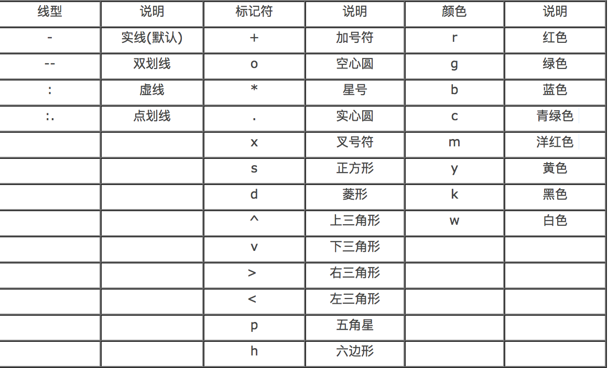
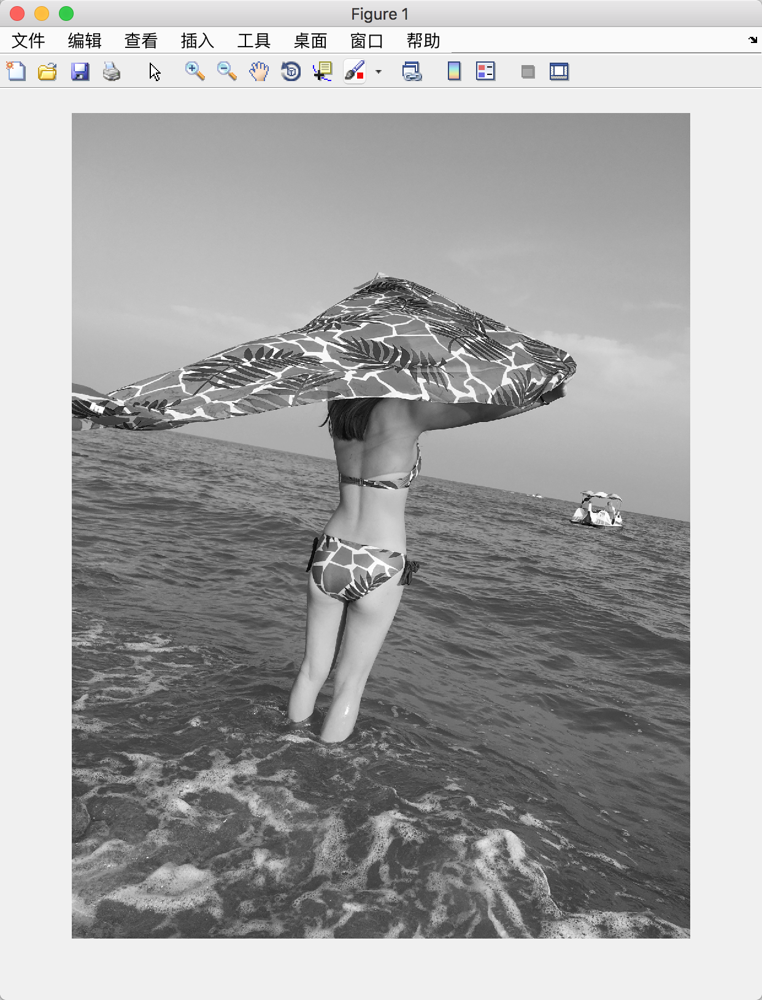
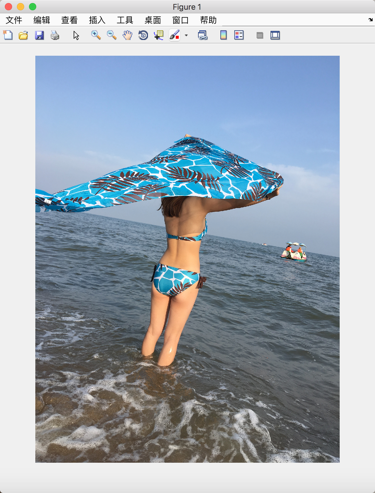
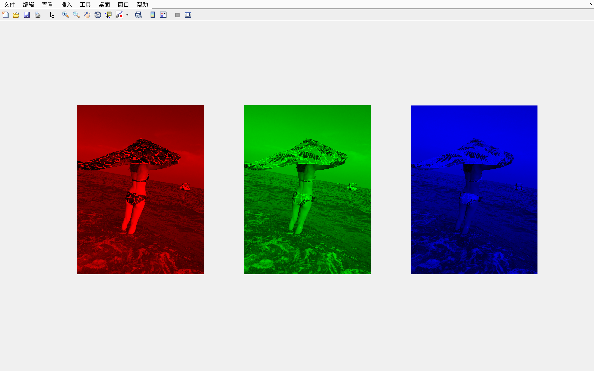
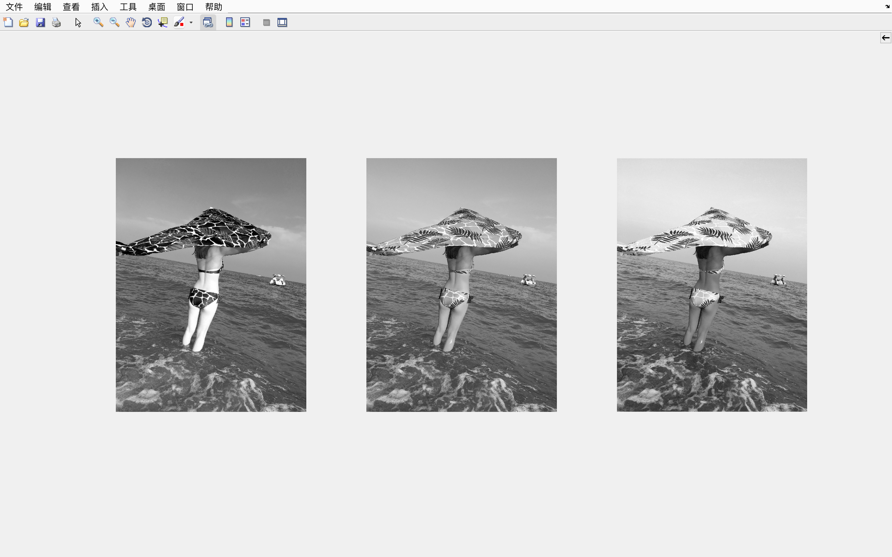

# Matlab 笔记 —— 图形

## plot

`plot(X1,Y1,...)`
- 如果 `X` 和 `Y` 都是数组，按列取坐标数据绘图，此时它们必须具有相同的尺寸；
- 如果 `X` 和 `Y` 其中一个是向量另一个为数组，`X` 和 `Y` 中尺寸相等的方向对应绘制多条曲线；
- 如果 `X` 和 `Y` 其中一个是标量另一个为向量，那么将绘制垂直X或者Y轴离散的点

X       | Y      |                                  |       备注
--------|--------|----------------------------------|----------------------
m×n     | m×n    |      按列取坐标数据绘制n条曲线   | X和Y必须具有相同的尺寸
1×n或n×1|m×n或n×m|  自动匹配尺寸相同方向绘制m条曲线 | 任意四种组合，效果一样
m×n或n×m|1×n或n×1|              同上                |       同上
1×1     |1×n或n×1|          绘制垂直X轴离散点       | Y可以任意向量
1×n或n×1|1×1     |          绘制垂直Y轴离散点       | X可以任意向量

```matlab
plot(X1, Y1, LineSpec1, X2, Y2, LineSpec2,...);
```

此时完全等效于

```matlab
plot(X1, Y1, LineSpec1, ...);
hlod all;
plot(X2, Y2, LineSpec2, ...);
```




## imshow

```matlab
imshow(I)
imshow(X,map)
imshow(filename)
imshow(I,[low high])
imshow(___,Name,Value)
```

Examples:

```matlab
img = imread('./IMG_5533.jpg');
I = rgb2gray(img);
imshow(I);
```



```matlab
[img, map] = imread('./IMG_5533.jpg');
imshow(img, map);
% 或者直接
img = imread('./IMG_5533.jpg');
imshow(img);
```



```matlab
img = imread('./IMG_5533.jpg');
% R, G, B 每个像素必须为三个维度，才可以显示为彩色图像，否则为灰度图像
R(:, :, 1) = img(:, :, 1); R(:, :, 2:3) = 0;
G(:, :, 2) = img(:, :, 2); G(:, :, 1) = 0; G(:, :, 3) = 0;
B(:, :, 3) = img(:, :, 3); B(:, :, 1:2) = 0;
figure(1);
subplot(1, 3, 1);
imshow(R, [0, 255]);
subplot(1, 3, 2);
imshow(G, [0, 255]);
subplot(1, 3, 3);
imshow(B, [0, 255]);
```



imshow()显示图像时对double型是认为在0~1范围内，即大于1时都是显示为白色，而imshow显示uint8型时是0~255范围

解决范围在 0-255 之间的 double 型数据显示为白色图像的方法：

1. 自定义调色板：

```matlab
imshow(Image,[low,high])
```

其中，`low` 和 `high` 分别为数据数组的最小值和最大值

如：

```matlab
img = double(imread('./IMG_5533.jpg'));
R = img(:, :, 1);
G = img(:, :, 2);
B = img(:, :, 3);
figure(1);
% R, G, B 每个像素只有一个维度，因而显示为灰度图像
subplot(1, 3, 1);
imshow(R, [0, 255]);
subplot(1, 3, 2);
imshow(G, [0, 255]);
subplot(1, 3, 3);
imshow(B, [0, 255]);
```



2. imshow(I / 256)

即：

```matlab
img = double(imread('./IMG_5533.jpg'));
R = img(:, :, 1);
G = img(:, :, 2);
B = img(:, :, 3);
figure(1);
subplot(1, 3, 1);
imshow(R / 256);
subplot(1, 3, 2);
imshow(G / 256);
subplot(1, 3, 3);
imshow(B / 256);
```