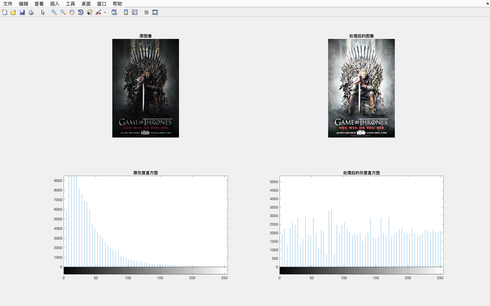
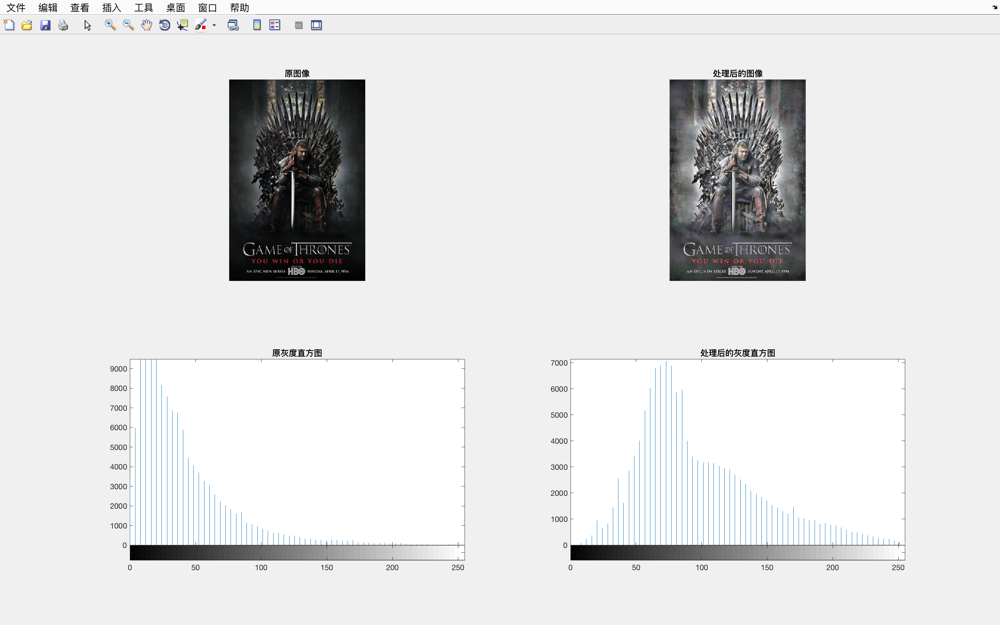

# 基于直方图优化的图像去雾技术

```matlab
img = imread('./gray2.jpg');
RemoveFogByGlobalHisteq(img, 1);
function In = RemoveFogByGlobalHisteq(I, flag)
    R = I(:, :, 1);
    G = I(:, :, 2);
    B = I(:, :, 3);
    % 对 R, G, B 分量进行全局直方图均衡化
    M = histeq(R);
    N = histeq(G);
    L = histeq(B);
    % 集成全局直方图均衡化后的分量得到结果图像
    In = cat(3, M, N, L);
    % 显示
    if flag
        figure;
        subplot(2, 2, 1); imshow(I); title('原图像', 'FontWeight', 'Bold');
        subplot(2, 2, 2); imshow(In); title('处理后的图像', 'FontWeight', 'Bold');
        % 灰度化，用于计算直方图
        Q = rgb2gray(I);
        W = rgb2gray(In);
        subplot(2, 2, 3); imhist(Q, 64); title('原灰度直方图', 'FontWeight', 'Bold');
        subplot(2, 2, 4); imhist(W, 64); title('处理后的灰度直方图', 'FontWeight', 'Bold');
    end
end
```



```matlab
img = imread('./gray2.jpg');
RemoveFogByLocalHisteq(img, 1);
function In = RemoveFogByLocalHisteq(I, flag)
    % 对 R, G, B 分量进行局部直方图均衡化
    M = GetLocalHisteq(I(:, :, 1));
    N = GetLocalHisteq(I(:, :, 2));
    L = GetLocalHisteq(I(:, :, 3));
    % 集成局部直方图均衡化后的分量得到结果图像
    In = cat(3, M, N, L);
    % 显示
    if flag
        figure;
        subplot(2, 2, 1); imshow(I); title('原图像', 'FontWeight', 'Bold');
        subplot(2, 2, 2); imshow(In); title('处理后的图像', 'FontWeight', 'Bold');
        % 灰度化，用于计算直方图
        Q = rgb2gray(I);
        W = rgb2gray(In);
        subplot(2, 2, 3); imhist(Q, 64); title('原灰度直方图', 'FontWeight', 'Bold');
        subplot(2, 2, 4); imhist(W, 64); title('处理后的灰度直方图', 'FontWeight', 'Bold');
    end
end

function g = GetLocalHisteq(I)
    % 对灰度图像进行局部直方图均衡化
    g = adapthisteq(I, 'clipLimit', 0.02, 'Distribution', 'rayleigh');
end
```



```matlab
img = imread('./gray2.jpg');
RemoveFogByGlobalHisteq(img, 1);
function In = RemoveFogByGlobalHisteq(I, flag)
    fr = I(:, :, 1);
    fg = I(:, :, 2);
    fb = I(:, :, 3);
    % 数据类型归一化
    mr = mat2gray(fr);
    mg = mat2gray(fg);
    mb = mat2gray(fb);
    % alpha 参数
    alpha = 1200;
    % 定义模版大小
    n = 128;
    % 计算中心
    n1 = floor((n + 1) / 2);
    for i = 1 : n
        for j = 1 : n
            % 高斯函数
            b(i, j) = exp(-((i - n1)^2 + (j - n1)^2) / (4 * alpha)) / (pi * alpha);
        end
    end

    % 卷积滤波
    nr1 = imfilter(mr, b, 'conv', 'replicate');
    ng1 = imfilter(mg, b, 'conv', 'replicate');
    nb1 = imfilter(mb, b, 'conv', 'replicate');
    ur1 = log(nr1);
    ug1 = log(ng1);
    ub1 = log(nb1);
    tr1 = log(mr);
    tg1 = log(mg);
    tb1 = log(mb);
    yr1 = (ur1 - tr1) / 3;
    yg1 = (ug1 - tg1) / 3;
    yb1 = (ub1 - tb1) / 3;
    % 定义 beta 参数
    beta = 55;
    % 定义模版大小
    x = 32;
    % 计算中心
    x1 = floor((x + 1) / 2);
    for i = 1 : n
        for j = 1 : n
            % 高斯函数
            a(i, j) = exp(-((i - x1)^2 + (j - x1)^2) / (4 * beta)) / (6 * pi * beta);
        end
    end

    % 卷积滤波
    nr2 = imfilter(mr, a, 'conv', 'replicate');
    ng2 = imfilter(mg, a, 'conv', 'replicate');
    nb2 = imfilter(mb, a, 'conv', 'replicate');
    ur2 = log(nr2);
    ug2 = log(ng2);
    ub2 = log(nb2);
    tr2 = log(mr);
    tg2 = log(mg);
    tb2 = log(mb);
    yr2 = (ur2 - tr2) / 3;
    yg2 = (ug2 - tg2) / 3;
    yb2 = (ub2 - tb2) / 3;
    % 定义 beta 参数
    eta = 13944.5;
    % 定义模版大小
    l = 500;
    % 计算中心
    l1 = floor((l + 1) / 2);
    for i = 1 : n
        for j = 1 : n
            % 高斯函数
            e(i, j) = exp(-((i - l1)^2 + (j - l1)^2) / (4 * eta)) / (4 * pi * eta);
        end
    end

     % 卷积滤波
    nr3 = imfilter(mr, e, 'conv', 'replicate');
    ng3 = imfilter(mg, e, 'conv', 'replicate');
    nb3 = imfilter(mb, e, 'conv', 'replicate');
    ur3 = log(nr3);
    ug3 = log(ng3);
    ub3 = log(nb3);
    tr3 = log(mr);
    tg3 = log(mg);
    tb3 = log(mb);
    yr3 = (ur3 - tr3) / 3;
    yg3 = (ug3 - tg3) / 3;
    yb3 = (ub3 - tb3) / 3;
    dr = yr1 + yr2 + yr3;
    dg = yg1 + yg2 + yg3;
    db = yb1 + yb2 + yb3;
    cr = im2uint8(dr);
    cg = im2uint8(dg);
    cb = im2uint8(db);

    % 集成处理后的分量得到结果图像
    In = cat(3, cr, cg, cb);
    % 显示
    if flag
        figure;
        subplot(2, 2, 1); imshow(I); title('原图像', 'FontWeight', 'Bold');
        subplot(2, 2, 2); imshow(In); title('处理后的图像', 'FontWeight', 'Bold');
        % 灰度化，用于计算直方图
        Q = rgb2gray(I);
        W = rgb2gray(In);
        subplot(2, 2, 3); imhist(Q, 64); title('原灰度直方图', 'FontWeight', 'Bold');
        subplot(2, 2, 4); imhist(W, 64); title('处理后的灰度直方图', 'FontWeight', 'Bold');
    end
end
```