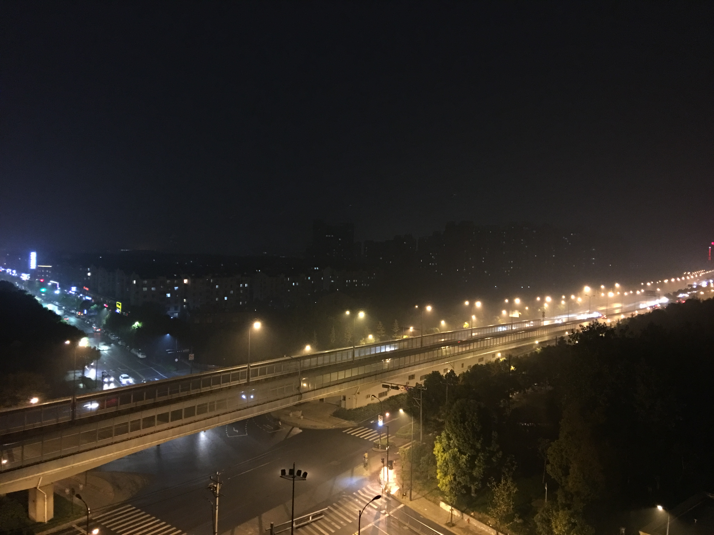
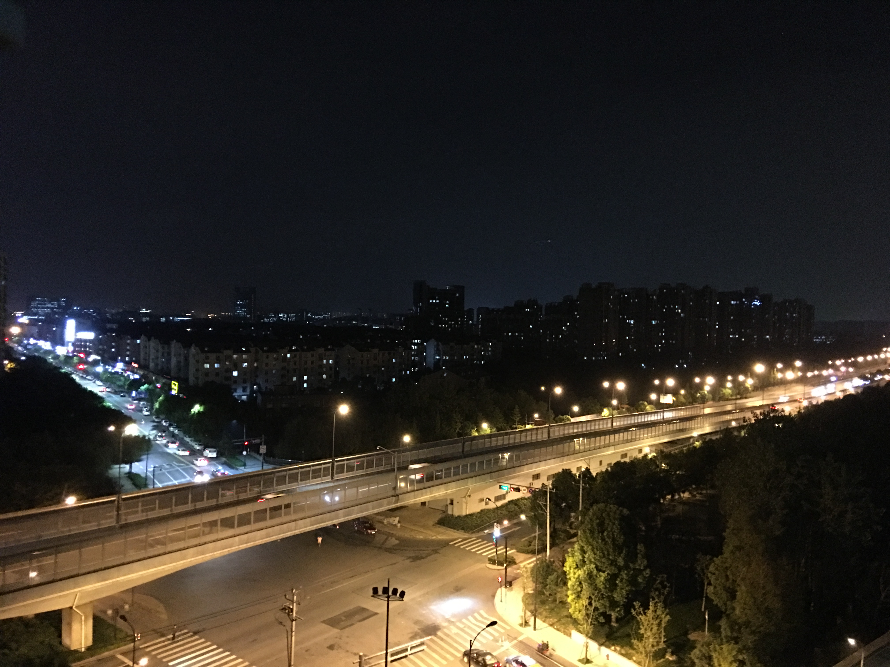

# 杭州记忆

今天：2017年11月14日，距离上个月（10月15日）来杭州差不多一个月了。正如一个月前独自一人来到这个城市一样，这两天的杭州一直下雨，仿佛刻意安排，让我可以更好地回忆一样。

写下这篇文章的时候，顺便拍下了窗外的风光。

嗯，仿佛和上个月的此时此刻没什么不同，只是因为雾气让城市更加朦胧了。

其实这并不是我与杭州的第一次交集。去年的国庆是我第一次来到这个城市 —— 杭州，和丽丽宝贝。那时单纯地来到这个城市游玩儿，只为一睹西湖风光。也没有想到，一年之后，会选择深造学习，更没有想到会来到杭州。

第一次来杭州之前，并没有了解这里的历史和景点，那时的印象好像只有杭州和西湖互为代名词这么简单。不过，西湖，这两个字仿佛可以一直在我的印象中等价，每一次来到杭州，或长或短，都去西湖边走一走。包括现在，每周我也都会去西湖边走一走。或从苏堤，或从山上，或从城边，看一看西湖。仿佛只有这样，才可以让我感受到 —— "哦，我在杭州"。

已经记不清了初见西湖时的心情。记忆中没有激动，
