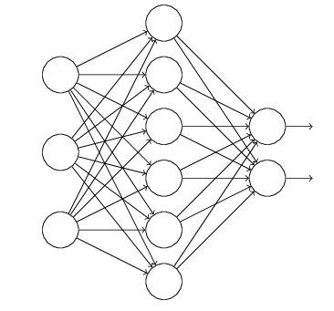
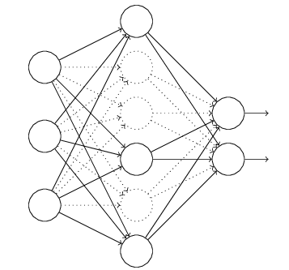
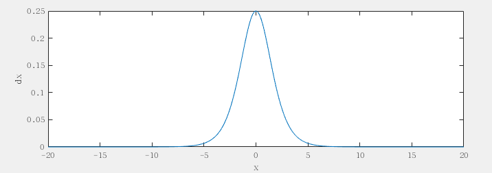
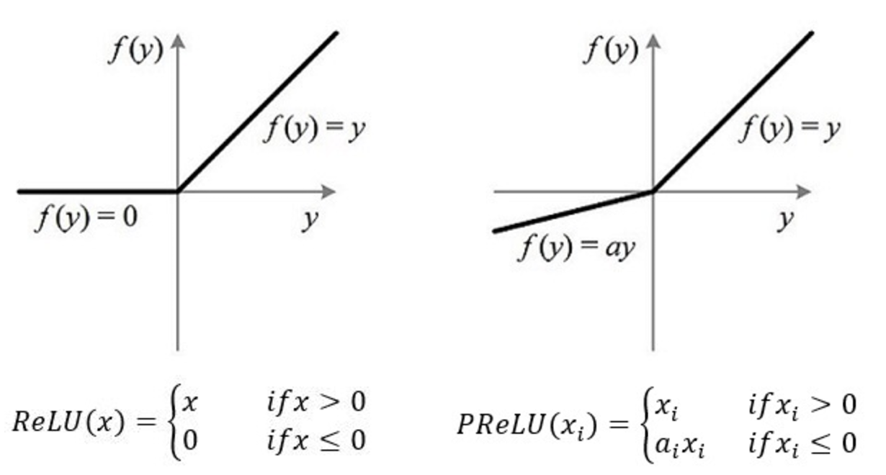

# 如果你是面试官，你怎么去判断一个面试者的深度学习水平？

参考问题 [【知乎】如果你是面试官，你怎么去判断一个面试者的深度学习水平？](https://www.zhihu.com/question/41233373)，整理回答

### CNN 最成功的应用是在 CV，那为什么 NLP 和 Speech 的很多问题也可以用 CNN 解出来？为什么 AlphaGo 里也用了 CNN ？这几个不相关的问题的相似性在哪里？ CNN 通过什么手段抓住了这个共性？

这几个问题的共性就在于：**研究的对象有局部相关性**（存在局部与整体的关系，由低层次的特征经过组合，组成高层次的特征，并且得到不同特征之间的空间相关性。）
我个人认为，**CNN 是通过卷机提取对象之间的局部相关性的**，但是知乎上有人给出的回答：

> CNN抓住此共性的手段主要有四个：局部连接／权值共享／池化操作／多层次结构
>
> 局部连接使网络可以提取数据的局部特征；权值共享大大降低了网络的训练难度，一个Filter只提取一个特征，在整个图片（或者语音／文本） 中进行卷积；池化操作与多层次结构一起，实现了数据的降维，将低层次的局部特征组合成为较高层次的特征，从而对整个图片进行表示

文本是符合局部相关这个条件的，即相邻的（甚至是相隔较远的）字词间是有联系的！

卷积的过程实际上是一种模式匹配的过程，在CV的人脸识别中一个卷积核匹配的可能是眼镜或者鼻子等局部部位，而对于NLP的文本分类任务，一个卷积核匹配的则是特定的关键词或关键短语。后面提取出来的特征实际上就是表示句子中是否出现过这样的关键词或者关键短语，相当于低维空间的词袋模型，这样的特征信息对文本分类任务自然是非常有用的

在 NLP 问题中，卷积核可以理解为一个滑动窗口。以 2-gram 模型为例：假设文本中的字都是用向量 `w_1, w_2, ..., w_n` 表示的，卷积核 `(a, b)` 跟这个序列卷积就得到了向量序列  `a*x_1 + b*x_2, a*x_2 + b*x_3, ..., a*x_n-1 + b*x_n` ，也就是对句子中的每个 `2-gram` 构造了个向量表示.

不过这有一个缺陷：文本和图像不一样，窗口内字词的文法特征不一定可以被同一卷机核合理提取出来，如短语 `"Game of Throne"`, `"Google and Microsoft"` 和 `"I love Programming"` ，如果用同样的一个卷积核，即同样的加权方式显然是不合理的，因为显然修饰关系、并列结构和主谓宾结构是不同意义上的语义组合。

解决这个问题一个最直接的办法就是让每个窗口里的权重 `(a, b)` 随着它见到的词变化，这可以通过 `attention` 来给每个窗口生成 `(a, b)` 。当然，这样做法的代价是会引入更多的参数

### 为什么很多做人脸的Paper会最后加入一个Local Connected Conv？

DeepFace 先进行了两次全卷积＋一次池化，提取了低层次的边缘／纹理等特征。

后接了3个Local-Conv层，这里是用Local-Conv的原因是，人脸在不同的区域存在不同的特征（眼睛／鼻子／嘴的分布位置相对固定），当不存在全局的局部特征分布时，Local-Conv更适合特征的提取。

### 对 dropout 的理解

假设我们要训练这样一个神经网络

输入是x输出是y，正常的流程是：我们首先把x通过网络前向传播然后后把误差反向传播以决定 如何更新参数让网络进行学习

使用 dropout 之后过程：

1. 首先随机（临时）删掉网络中一半的隐藏神经元，输入输出神经元保持不变（下图中虚线为部分临时被删除的神经元）

2. 然后把输入x通过修改后的网络前向传播，然后把得到的损失结果通过修改的网络反向传播。一小批训练样本执行完这个过程后就按照随机梯度下降法更新（没有被删除的神经元）对应的参数（w，b）。

3. 然后继续重复这一过程：

    1. 恢复被删掉的神经元（此时 被删除的神经元 保持原样，而没有被删除的神经元已经有所更新）
    2. 从隐藏神经元中随机选择一个一半大小的子集 临时删除掉（备份被删除神经元的参数）。
    3. 对一小批训练样本，先前向传播然后反向传播损失并根据随机梯度下降法更新参数（w，b） （没有被删除的那一部分参数得到更新，删除的神经元参数保持被删除前的结果）

### 为什么 dropout 可以解决过拟合

1. 取平均的作用：

    先回到正常的模型（没有dropout），我们用相同的训练数据去训练5个不同的神经网络，一般会得到5个不同的结果，此时我们可以采用 “5个结果取均值”或者“多数取胜的投票策略”去决定最终结果。（例如 3个网络判断结果为数字9,那么很有可能真正的结果就是数字9，其它两个网络给出了错误结果）。这种“综合起来取平均”的策略通常可以有效防止过拟合问题。因为不同的网络可能产生不同的过拟合，取平均则有可能让一些“相反的”拟合互相抵消。dropout掉不同的隐藏神经元就类似在训练不同的网络（随机删掉一半隐藏神经元导致网络结构已经不同)，整个dropout过程就相当于 对很多个不同的神经网络取平均。而不同的网络产生不同的过拟合，一些互为“反向”的拟合相互抵消就可以达到整体上减少过拟合。

2. 减少神经元之间复杂的共适应关系：

    因为dropout程序导致两个神经元不一定每次都在一个dropout网络中出现。（这样权值的更新不再依赖于有固定关系的隐含节点的共同作用，阻止了某些特征仅仅在其它特定特征下才有效果的情况）。 迫使网络去学习更加鲁棒的特征 （这些特征在其它的神经元的随机子集中也存在）。换句话说假如我们的神经网络是在做出某种预测，它不应该对一些特定的线索片段太过敏感，即使丢失特定的线索，它也应该可以从众多其它线索中学习一些共同的模式（鲁棒性）。（这个角度看 dropout就有点像L1，L2正则，减少权重使得网络对丢失特定神经元连接的鲁棒性提高）

### 什么造成梯度消失问题?

神经网络的训练中，通过改变神经元的权重，使网络的输出值尽可能逼近标签以降低误差值，训练普遍使用BP算法，核心思想是，计算出输出与标签间的损失函数值，然后计算其相对于每个神经元的梯度，进行权值的迭代。

梯度消失会造成权值更新缓慢，模型训练难度增加。造成梯度消失的一个原因是，许多激活函数将输出值挤压在很小的区间内，在激活函数两端较大范围的定义域内梯度为0。造成学习停止

如 Sigmoid 函数：

Sigmoid层是这样反向传递梯度的

当输入为0时，sigmoid函数的导函数最大值为0.25，当输入数据的绝对值增大时，导函数值迅速减小，马上就会接近于0

这便是导致深度神经网络学习的更慢的“元凶”，由于这里多了一个Sigmoid层，梯度值经过Sigmoid层时，会减小很多，梯度就像是“消失了”（vanishing gradient），导致模型学习的非常慢

### Activation Function 各有什么优劣

对于深层网络，sigmoid函数反向传播时，很容易就会出现梯度消失的情况（在sigmoid接近饱和区时，变换太缓慢，导数趋于0，这种情况会造成信息丢失

Relu会使一部分神经元的输出为0，这样就造成了网络的稀疏性，并且减少了参数的相互依存关系，缓解了过拟合问题的发生

**PReLu:**

