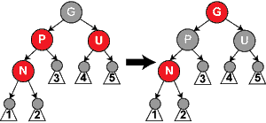
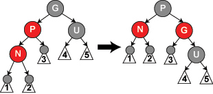

# 红黑树 (Red–black tree)

> 红黑树是一种自平衡二叉查找树，是在计算机科学中用到的一种数据结构，典型的用途是实现关联数组。它的操作有着良好的最坏情况运行时间，并且在实践中是高效的：它可以在O(log n)时间内做查找，插入和删除，这里的n是树中元素的数目

红黑树是每个节点都带有颜色属性的二叉查找树，颜色为红色或黑色。在二叉查找树强制一般要求以外，对于任何有效的红黑树，增加了如下的额外要求：

- 节点是红色或黑色
- 根是黑色
- 所有叶子都是黑色（叶子是NIL节点）
- 每个红色节点必须有两个黑色的子节点。（从每个叶子到根的所有路径上不能有两个连续的红色节点。）
- 从任一节点到其每个叶子的所有简单路径都包含相同数目的黑色节点


因为每一个红黑树也是一个特化的二叉查找树，因此**红黑树上的只读操作与普通二叉查找树上的只读操作相同**。然而，在红黑树上进行插入操作和删除操作会导致不再匹配红黑树的性质。恢复红黑树的性质需要少量（`O(log n`)）的颜色变更（实际是非常快速的）和不超过三次树旋转（对于插入操作是两次）。虽然插入和删除很复杂，但操作时间仍可以保持为`O(log n`)次。


辅助函数定义：

```c
#include <cstdio>
#include <algorithm>
using namespace std;
const int RED = 1;
const int BLACK = 0;
typedef int Color;

struct Node {
    int val;
    Node *left, *right, *parent;
    Color color;
};

Node* grandparent (Node* n) {
    return n->parent->parent;
}

Node* uncle (Node* n) {
    if (n->parent == grandparent(n)->left)
        return grandparent(n)->right;
    else
        return grandparent(n)->left;
}

Node* sibling (Node* n) {
    if (n == n->parent->left)
        return n->parent->right;
    else
        return n->parent->left;
}

void rotate_left (Node* n) {
    Node* temp = n->right;
    n->right = temp->left;
    temp->left = n;
    n = temp;
}

void rotate_right (Node* n) {
    Node* temp = n->left;
    n->left = temp->right;
    temp->right = n;
    n = temp;
}
```


## 插入

**首先以二叉查找树的方法增加节点并标记它为红色。（如果设为黑色，就会导致根到叶子的路径上有一条路上，多一个额外的黑节点，这个是很难调整的。但是设为红色节点后，可能会导致出现两个连续红色节点的冲突，那么可以通过颜色调换（color flips）和树旋转来调整。）**

**case 1:** 新节点N位于树的根上，没有父节点。在这种情形下，把它重绘为黑色以满足性质2。因为它在每个路径上对黑节点数目增加一，性质5匹配

```c
void insert_case1 (Node* n) {
    if (n->parent == NULL)
        n->color = BLACK;
    else
        insert_case2(n);
}
```

**case 2:** 新节点的父节点P是黑色，所以性质4没有失效（新节点是红色的）。在这种情形下，树仍是有效的。性质5也未受到威胁，尽管新节点N有两个黑色叶子子节点；但由于新节点N是红色，通过它的每个子节点的路径就都有同通过它所取代的黑色的叶子的路径同样数目的黑色节点，所以依然满足这个性质

```c
void insert_case2 (Node* n) {
    if (n->parent->color == BLACK)
        return;
    else
        insert_case3(n);
}
```

**case 3:**
如果父节点P和叔父节点U二者都是红色，（此时新插入节点N做为P的左子节点或右子节点都属于情形3，这里右图仅显示N做为P左子的情形）则可以将它们两个重绘为黑色并重绘祖父节点G为红色（用来保持性质5）。现在新节点N有了一个黑色的父节点P。因为通过父节点P或叔父节点U的任何路径都必定通过祖父节点G，在这些路径上的黑节点数目没有改变。但是，红色的祖父节点G可能是根节点，这就违反了性质2，也有可能祖父节点G的父节点是红色的，这就违反了性质4。为了解决这个问题，在祖父节点G上递归地进行情形1的整个过程。（把G当成是新加入的节点进行各种情形的检查）



```c
void insert_case3 (Node* n) {
    if (uncle(n) != NULL && uncle(n)->color == RED) {
        n->parent->color = BLACK;
        uncle(n)->color = BLACK;
        grandparent(n)->color = RED;
        insert_case1(grandparent(n));
    } else {
        insert_case4(n);
    }
}
```

**case 4:**
父节点P是红色而叔父节点U是黑色或缺少，并且新节点N是其父节点P的右子节点而父节点P又是其父节点的左子节点。在这种情形下，进行一次左旋转调换新节点和其父节点的角色;接着，按情形5处理以前的父节点P以解决仍然失效的性质4。注意这个改变会导致某些路径通过它们以前不通过的新节点N（比如图中1号叶子节点）或不通过节点P（比如图中3号叶子节点），但由于这两个节点都是红色的，所以性质5仍有效


```c
void insert_case4 (Node* n) {
    if (n == n->parent->right && n->parent == grandparent(n)->left) {
        rotate_left(n->parent);
        insert_case5(n->left);
    } else if (n == n->parent->left && n->parent == grandparent(n)->right){
        rotate_right(n->parent);
        insert_case5(n->right);
    }
}
```

**case5:**
父节点P是红色而叔父节点U是黑色或缺少，新节点N是其父节点的左子节点，而父节点P又是其父节点G的左子节点。在这种情形下，进行针对祖父节点G的一次右旋转；在旋转产生的树中，以前的父节点P现在是新节点N和以前的祖父节点G的父节点。知道以前的祖父节点G是黑色，否则父节点P就不可能是红色（如果P和G都是红色就违反了性质4，所以G必须是黑色）。切换以前的父节点P和祖父节点G的颜色，结果的树满足性质4。性质5也仍然保持满足，因为通过这三个节点中任何一个的所有路径以前都通过祖父节点G，现在它们都通过以前的父节点P。在各自的情形下，这都是三个节点中唯一的黑色节点



```c
void insert_case5 (Node* n) {
    n->parent->color = BLACK;
    grandparent(n)->color = RED;
    if (n == n->parent->left && n->parent == grandparent(n)->left)
        rotate_right(grandparent(n));
    else
        rotate_left(grandparent(n));
}
```


## 删除

果需要删除的节点有两个儿子，那么问题可以被转化成删除另一个只有一个儿子的节点的问题（为了表述方便，这里所指的儿子，为非叶子节点的儿子）。对于二叉查找树，在删除带有两个非叶子儿子的节点的时候，找到要么在它的左子树中的最大元素、要么在它的右子树中的最小元素，并把它的值转移到要删除的节点中（如在这里所展示的那样）。接着删除从中复制出值的那个节点，它必定有少于两个非叶子的儿子。因为只是复制了一个值，不违反任何性质，这就把问题简化为如何删除最多有一个儿子的节点的问题。它不关心这个节点是最初要删除的节点还是从中复制出值的那个节点。

在本文余下的部分中，只需要讨论删除只有一个儿子的节点（如果它两个儿子都为空，即均为叶子，任意将其中一个看作它的儿子）。如果删除一个红色节点（此时该节点的儿子将都为叶子节点），它的父亲和儿子一定是黑色的。所以可以简单的用它的黑色儿子替换它，并不会破坏性质3和性质4。通过被删除节点的所有路径只是少了一个红色节点，这样可以继续保证性质5。另一种简单情况是在被删除节点是黑色而它的儿子是红色的时候。如果只是去除这个黑色节点，用它的红色儿子顶替上来的话，会破坏性质5，但是如果重绘它的儿子为黑色，则曾经通过它的所有路径将通过它的黑色儿子，这样可以继续保持性质5。

需要进一步讨论的是在要删除的节点和它的儿子二者都是黑色的时候，这是一种复杂的情况。首先把要删除的节点替换为它的儿子。出于方便，称呼这个儿子为N（在新的位置上），称呼它的兄弟（它父亲的另一个儿子）为S。在下面的示意图中，还是使用P称呼N的父亲，SL称呼S的左儿子，SR称呼S的右儿子。将使用下述函数找到兄弟节点：

```c
void delete_one_child (Node* n) {
    Node *child = is_leaf(n->left) ? n->right : n->left;
    replace_node(child, n);
    if (n->color == BLACK) {
        if (child->color == RED)
            child->color = BLACK;
        else
            delete_case1(n);
    }
    delete n;
}
```

**case 1:**
N是新的根。在这种情形下，我们就做完了。我们从所有路径去除了一个黑色节点，而新根是黑色的，所以性质都保持着

**case 2:**
S是红色。在这种情形下我们在N的父亲上做左旋转，把红色兄弟转换成N的祖父，我们接着对调N的父亲和祖父的颜色。完成这两个操作后，尽管所有路径上黑色节点的数目没有改变，但现在N有了一个黑色的兄弟和一个红色的父亲（它的新兄弟是黑色因为它是红色S的一个儿子），所以我们可以接下去按情形4、情形5或情形6来处理


```c
void delete_case2 (Node* n) {
    Node* s = sibling(n);
    if (s->color == RED) {
        n->parent->color = RED;
        s->color = BLACK;
        if (n == n->parent->left)
            rotate_left(n->parent);
        else
            rotate_right(n->parent);
    }
    delete_case3(n);
}
```

**case 3:**
N的父亲、S和S的儿子都是黑色的。在这种情形下，我们简单的重绘S为红色。结果是通过S的所有路径，它们就是以前不通过N的那些路径，都少了一个黑色节点。因为删除N的初始的父亲使通过N的所有路径少了一个黑色节点，这使事情都平衡了起来。但是，通过P的所有路径现在比不通过P的路径少了一个黑色节点，所以仍然违反性质5。要修正这个问题，我们要从情形1开始，在P上做重新平衡处理。


```c
void delete_case3 (Node* n) {
    Node* s = sibling(n);
    if ((n->parent->color == BLACK)
        && (s->color == BLACK)
        && (s->left->color == BLACK)
        && (s->right->color == BLACK)) {
        s->color = RED;
        delete_case1(n->parent);
    } else {
        delete_case4(n);
    }
}
```

**case 4:**
S和S的儿子都是黑色，但是N的父亲是红色。在这种情形下，我们简单的交换N的兄弟和父亲的颜色。这不影响不通过N的路径的黑色节点的数目，但是它在通过N的路径上对黑色节点数目增加了一，添补了在这些路径上删除的黑色节点。


```c
void delete_case4 (Node* n) {
    Node *s = sibling(n);

    if ((n->parent->color == RED)
        && (s->color == BLACK)
        && (s->left->color == BLACK)
        && (s->right->color == BLACK)) {
            s->color = RED;
            n->parent->color = BLACK;
        } else
            delete_case5 (n);
}
```

**case 5:**
S是黑色，S的左儿子是红色，S的右儿子是黑色，而N是它父亲的左儿子。在这种情形下我们在S上做右旋转，这样S的左儿子成为S的父亲和N的新兄弟。我们接着交换S和它的新父亲的颜色。所有路径仍有同样数目的黑色节点，但是现在N有了一个黑色兄弟，他的右儿子是红色的，所以我们进入了情形6。N和它的父亲都不受这个变换的影响。


```c
void delete_case5 (Node* n) {
    Node *s = sibling(n);

    if (s->color == BLACK) { /* this if statement is trivial,
                            due to Case 2(even though Case two changed the sibling to a sibling's child,
                            the sibling's child can't be red, since no red parent can have a red child). */
        // the following statements just force the red to be on the left of the left of the parent,
        // or right of the right, so case six will rotate correctly.
        if((n == n->parent->left)
           && (s->right->color == BLACK)
           && (s->left->color == RED)) { // this last test is trivial too due to cases 2-4.
            s->color = RED;
            s->left->color = BLACK;
            rotate_right (s);
        } else if ((n == n->parent->right)
                  && (s->left->color == BLACK)
                  && (s->right->color == RED)) {// this last test is trivial too due to cases 2-4.
            s->color = RED;
            s->right->color = BLACK;
            rotate_left (s);
        }
    }
    delete_case6 (n);
}
```

**case 6:**
S是黑色，S的右儿子是红色，而N是它父亲的左儿子。在这种情形下我们在N的父亲上做左旋转，这样S成为N的父亲（P）和S的右儿子的父亲。我们接着交换N的父亲和S的颜色，并使S的右儿子为黑色。子树在它的根上的仍是同样的颜色，所以性质3没有被违反。但是，N现在增加了一个黑色祖先：要么N的父亲变成黑色，要么它是黑色而S被增加为一个黑色祖父。所以，通过N的路径都增加了一个黑色节点。

此时，如果一个路径不通过N，则有两种可能性：
- 它通过N的新兄弟。那么它以前和现在都必定通过S和N的父亲，而它们只是交换了颜色。所以路径保持了同样数目的黑色节点。
- 它通过N的新叔父，S的右儿子。那么它以前通过S、S的父亲和S的右儿子，但是现在只通过S，它被假定为它以前的父亲的颜色，和S的右儿子，它被从红色改变为黑色。合成效果是这个路径通过了同样数目的黑色节点。

在任何情况下，在这些路径上的黑色节点数目都没有改变。所以我们恢复了性质4。在示意图中的白色节点可以是红色或黑色，但是在变换前后都必须指定相同的颜色。


```c
void delete_case6 (Node *n) {
    Node* s = sibling(n);

    s->color = n->parent->color;
    n->parent->color = BLACK;

    if (n == n->parent->left) {
        s->right->color = BLACK;
        rotate_left(n->parent);
    } else {
        s->left->color = BLACK;
        rotate_right(n->parent);
    }
}
```