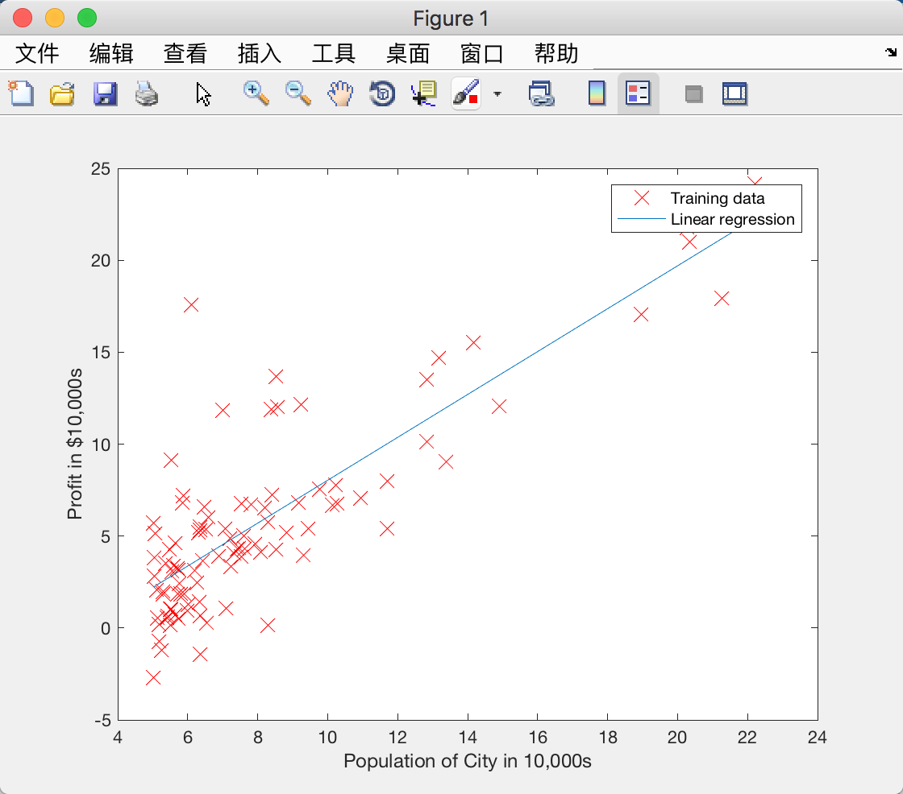
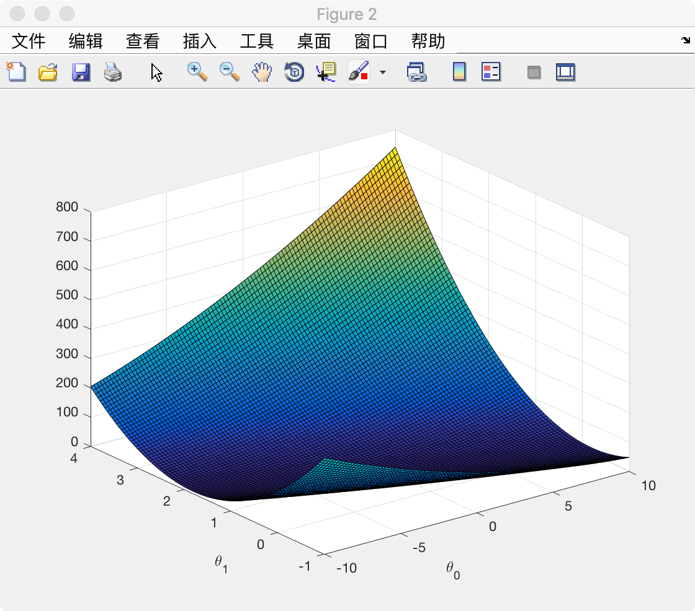
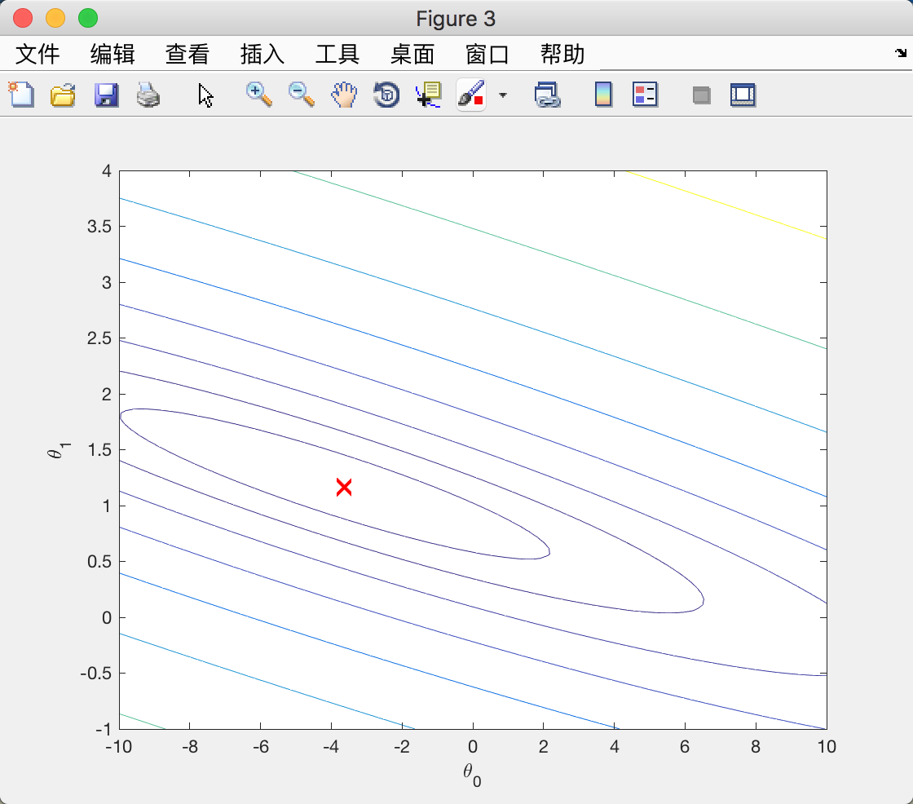
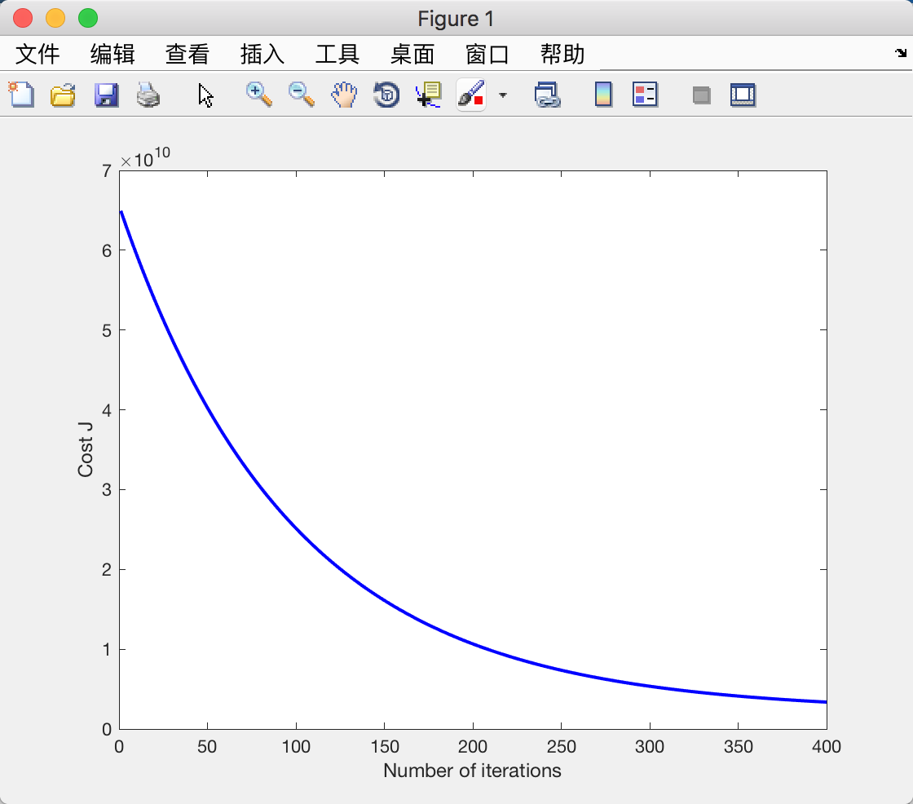

# Linear Regression


## [Warm-up Exercise - Matrix Inverse Vector Products](https://www.coursera.org/learn/machine-learning/supplement/eVOs3/warm-up-exercise-matrix-inverse-vector-products) 热身练习：

**Exercise 1 Cost Function:**

The cost function that we're going to use is the familiar squared error loss function:

```math
f(x) = \Vert Ax - b\Vert ^{2} = \sum_i^{n}\left[(Ax)_i - b_i\right] ^2
```

Implement the cost function f(x) in Octave below. Your function should take in A, b and x and return ∥Ax−b∥2.

Hint: The Octave/Matlab function `norm(v)` gives you `∥v∥` (where v is any vector).

```
function cost = squaredErrorCost(A, b, x)
cost = A * x - b;
cost = norm(cost) ^ 2;
endfunction
```


## [编程作业: Linear Regression](https://www.coursera.org/learn/machine-learning/programming/8f3qT/linear-regression)

### Linear regression with one variable

#### Computing the cost J(θ)

```
% ex1.m
%% =================== Part 3: Cost and Gradient descent ===================

X = [ones(m, 1), data(:,1)]; % Add a column of ones to x
theta = zeros(2, 1); % initialize fitting parameters

% Some gradient descent settings
iterations = 1500;
alpha = 0.01;

fprintf('\nTesting the cost function ...\n')
% compute and display initial cost
J = computeCost(X, y, theta);
fprintf('With theta = [0 ; 0]\nCost computed = %f\n', J);
fprintf('Expected cost value (approx) 32.07\n');

% further testing of the cost function
J = computeCost(X, y, [-1 ; 2]);
fprintf('\nWith theta = [-1 ; 2]\nCost computed = %f\n', J);
fprintf('Expected cost value (approx) 54.24\n');

fprintf('Program paused. Press enter to continue.\n');
pause;

% computeCost.m
function J = computeCost(X, y, theta)
%COMPUTECOST Compute cost for linear regression
%   J = COMPUTECOST(X, y, theta) computes the cost of using theta as the
%   parameter for linear regression to fit the data points in X and y

% Initialize some useful values
m = length(y); % number of training examples

% You need to return the following variables correctly
J = 0;

% ====================== YOUR CODE HERE ======================
% Instructions: Compute the cost of a particular choice of theta
%               You should set J to the cost.

J = [1 / (2 * m)] * (X * theta - y)' * (X * theta - y);

% =========================================================================

end
```

#### Gradient descent

```
% ex1.m
fprintf('\nRunning Gradient Descent ...\n')
% run gradient descent
theta = gradientDescent(X, y, theta, alpha, iterations);

% print theta to screen
fprintf('Theta found by gradient descent:\n');
fprintf('%f\n', theta);
fprintf('Expected theta values (approx)\n');
fprintf(' -3.6303\n  1.1664\n\n');

% Plot the linear fit
hold on; % keep previous plot visible
plot(X(:,2), X*theta, '-')
legend('Training data', 'Linear regression')
hold off % don't overlay any more plots on this figure

% Predict values for population sizes of 35,000 and 70,000
predict1 = [1, 3.5] *theta;
fprintf('For population = 35,000, we predict a profit of %f\n',...
    predict1*10000);
predict2 = [1, 7] * theta;
fprintf('For population = 70,000, we predict a profit of %f\n',...
    predict2*10000);

fprintf('Program paused. Press enter to continue.\n');
pause;

% gradientDescent.m
function [theta, J_history] = gradientDescent(X, y, theta, alpha, num_iters)
%GRADIENTDESCENT Performs gradient descent to learn theta
%   theta = GRADIENTDESCENT(X, y, theta, alpha, num_iters) updates theta by
%   taking num_iters gradient steps with learning rate alpha

% Initialize some useful values
m = length(y); % number of training examples
J_history = zeros(num_iters, 1);

for iter = 1:num_iters

    % ====================== YOUR CODE HERE ======================
    % Instructions: Perform a single gradient step on the parameter vector
    %               theta.
    %
    % Hint: While debugging, it can be useful to print out the values
    %       of the cost function (computeCost) and gradient here.
    %
    theta = theta - alpha * X' * (X * theta - y) / m;
    % ============================================================

    % Save the cost J in every iteration
    J_history(iter) = computeCost(X, y, theta);

end

end
```



#### Visualizing J(θ)

```
% ex1.m
%% ============= Part 4: Visualizing J(theta_0, theta_1) =============
fprintf('Visualizing J(theta_0, theta_1) ...\n')

% Grid over which we will calculate J
theta0_vals = linspace(-10, 10, 100);
theta1_vals = linspace(-1, 4, 100);

% initialize J_vals to a matrix of 0's
J_vals = zeros(length(theta0_vals), length(theta1_vals));

% Fill out J_vals
for i = 1:length(theta0_vals)
    for j = 1:length(theta1_vals)
	  t = [theta0_vals(i); theta1_vals(j)];
	  J_vals(i,j) = computeCost(X, y, t);
    end
end


% Because of the way meshgrids work in the surf command, we need to
% transpose J_vals before calling surf, or else the axes will be flipped
J_vals = J_vals';
% Surface plot
figure;
surf(theta0_vals, theta1_vals, J_vals)
xlabel('\theta_0'); ylabel('\theta_1');

% Contour plot
figure;
% Plot J_vals as 15 contours spaced logarithmically between 0.01 and 100
contour(theta0_vals, theta1_vals, J_vals, logspace(-2, 3, 20))
xlabel('\theta_0'); ylabel('\theta_1');
hold on;
plot(theta(1), theta(2), 'rx', 'MarkerSize', 10, 'LineWidth', 2);
```






### Linear regression with multiple variables

#### Feature Normalization

```
% featureNormalize
function [X_norm, mu, sigma] = featureNormalize(X)
%FEATURENORMALIZE Normalizes the features in X
%   FEATURENORMALIZE(X) returns a normalized version of X where
%   the mean value of each feature is 0 and the standard deviation
%   is 1. This is often a good preprocessing step to do when
%   working with learning algorithms.

% You need to set these values correctly
X_norm = X;
mu = zeros(1, size(X, 2));
sigma = zeros(1, size(X, 2));

% ====================== YOUR CODE HERE ======================
% Instructions: First, for each feature dimension, compute the mean
%               of the feature and subtract it from the dataset,
%               storing the mean value in mu. Next, compute the
%               standard deviation of each feature and divide
%               each feature by it's standard deviation, storing
%               the standard deviation in sigma.
%
%               Note that X is a matrix where each column is a
%               feature and each row is an example. You need
%               to perform the normalization separately for
%               each feature.
%
% Hint: You might find the 'mean' and 'std' functions useful.
%
m = size(X, 1); % 47
num = size(X, 2); % 3
temp = ones(m, 1);
mu = mean(X(:, 1:num));
sigma = std(X(:, 1:num));
X_norm = (X_norm - (temp * mu)) ./ (temp * sigma)
% ============================================================

end
```

#### Gradient Descent

```
% computeCostMulti.m
function J = computeCostMulti(X, y, theta)
%COMPUTECOSTMULTI Compute cost for linear regression with multiple variables
%   J = COMPUTECOSTMULTI(X, y, theta) computes the cost of using theta as the
%   parameter for linear regression to fit the data points in X and y

% Initialize some useful values
m = length(y); % number of training examples

% You need to return the following variables correctly
J = 0;

% ====================== YOUR CODE HERE ======================
% Instructions: Compute the cost of a particular choice of theta
%               You should set J to the cost.

J = sum((X * theta - y) .^ 2) / (2 * m);

% =========================================================================

end


% gradientDescentMulti.m
function [theta, J_history] = gradientDescentMulti(X, y, theta, alpha, num_iters)
%GRADIENTDESCENTMULTI Performs gradient descent to learn theta
%   theta = GRADIENTDESCENTMULTI(x, y, theta, alpha, num_iters) updates theta by
%   taking num_iters gradient steps with learning rate alpha

% Initialize some useful values
m = length(y); % number of training examples
J_history = zeros(num_iters, 1);

for iter = 1:num_iters

    % ====================== YOUR CODE HERE ======================
    % Instructions: Perform a single gradient step on the parameter vector
    %               theta.
    %
    % Hint: While debugging, it can be useful to print out the values
    %       of the cost function (computeCostMulti) and gradient here.
    %

    theta = theta - alpha * X' * (X * theta - y) / m;

    % ============================================================

    % Save the cost J in every iteration
    J_history(iter) = computeCostMulti(X, y, theta);

end

end
```

