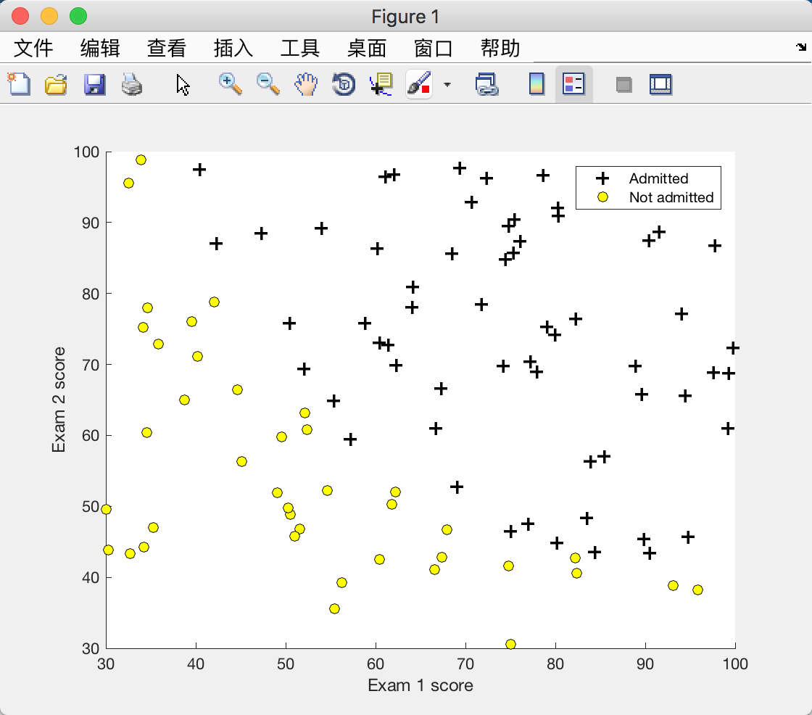
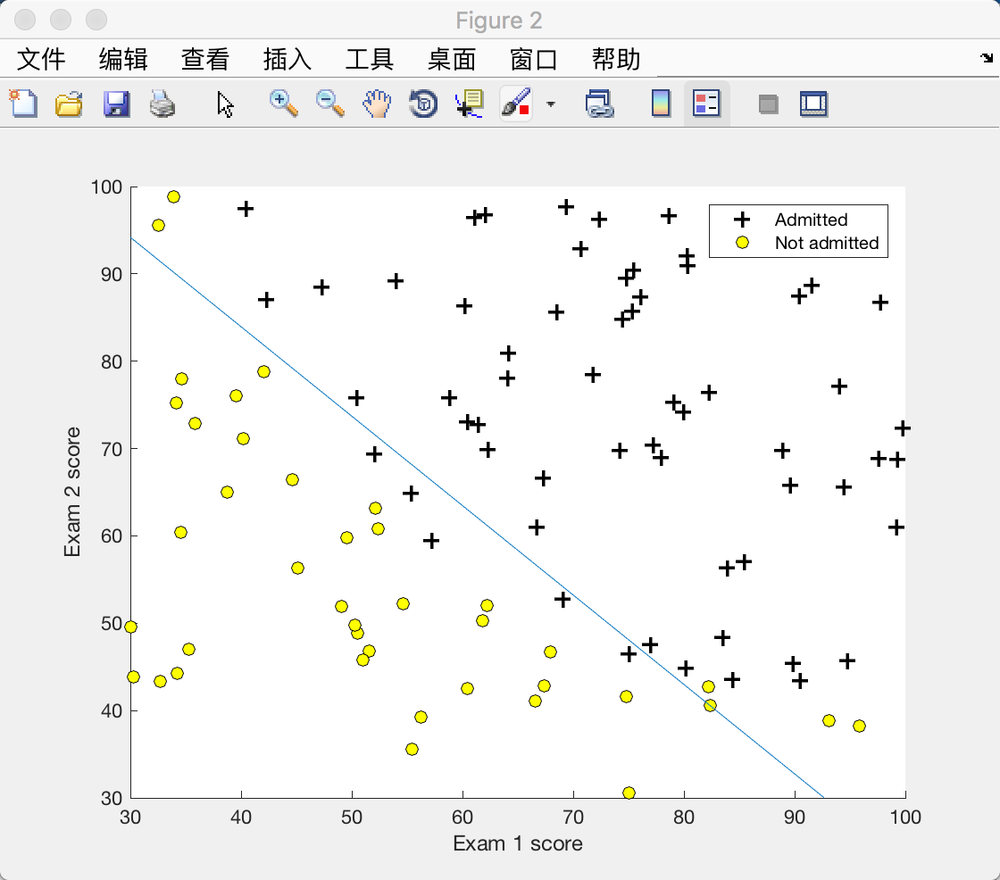
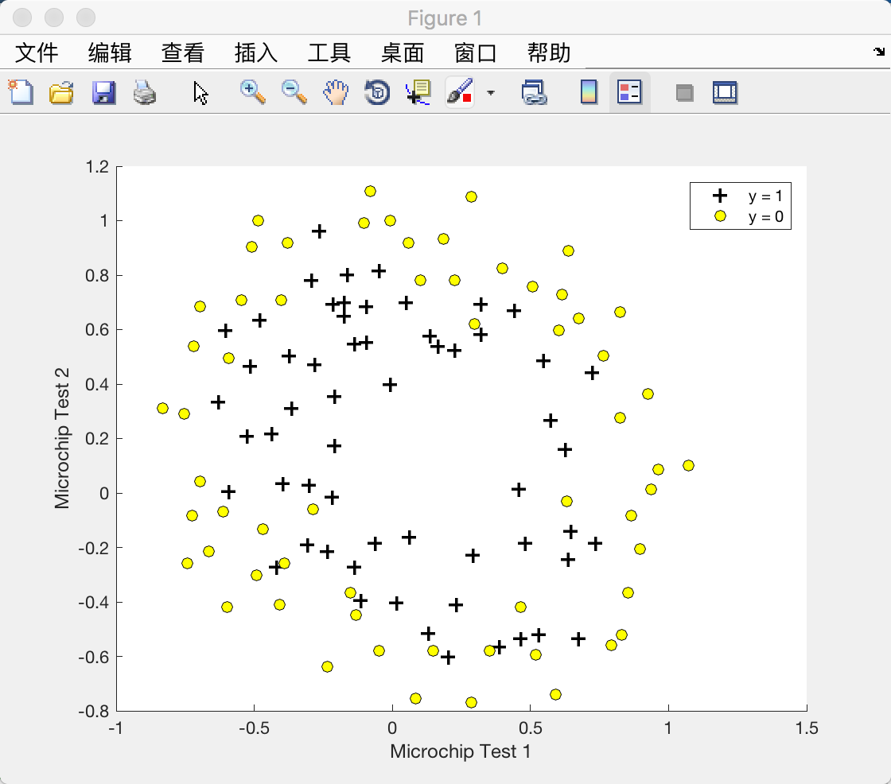
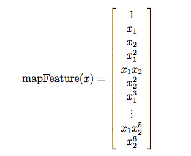
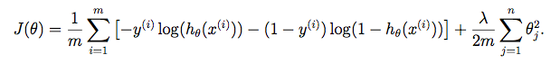
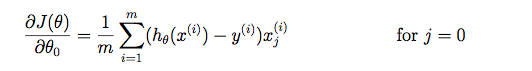
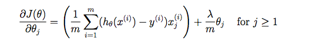
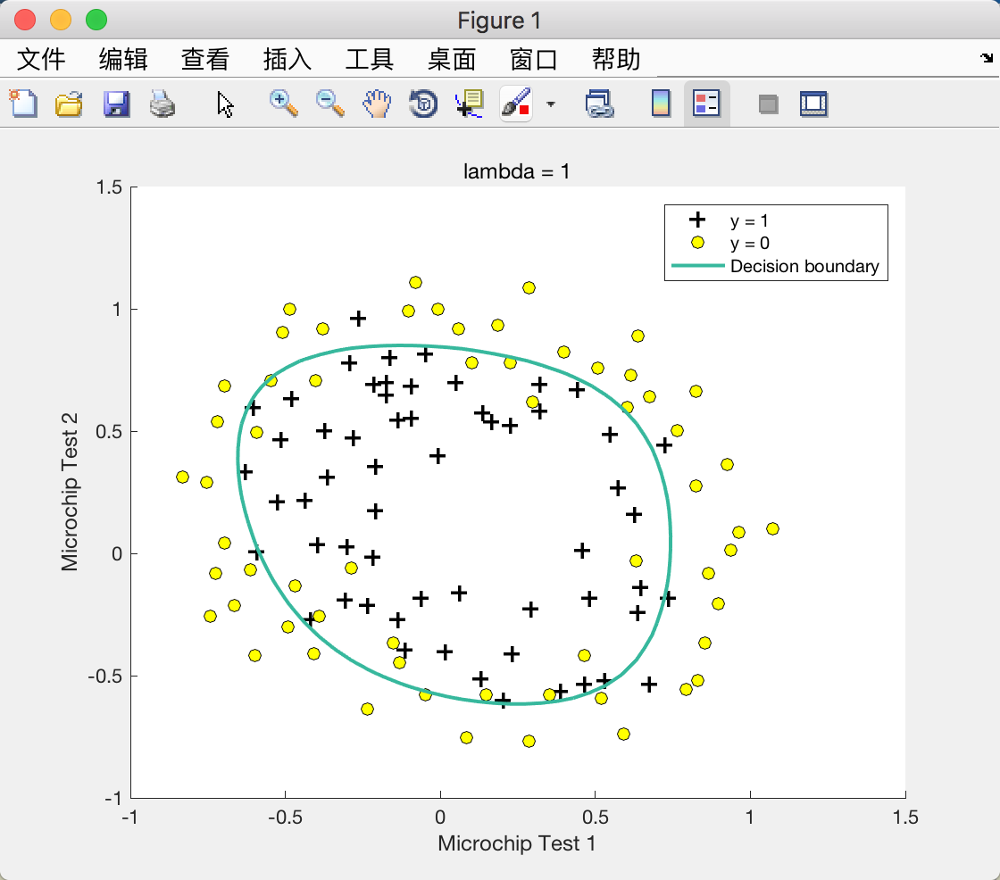
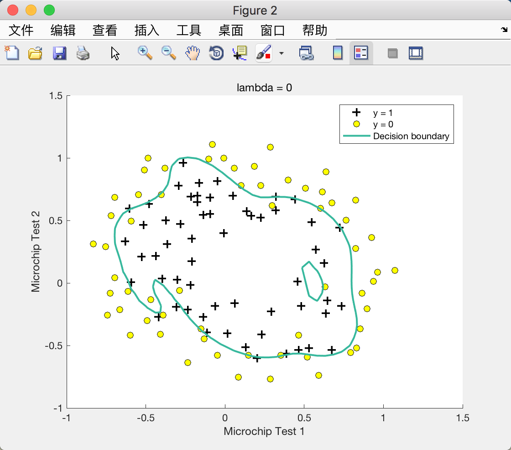
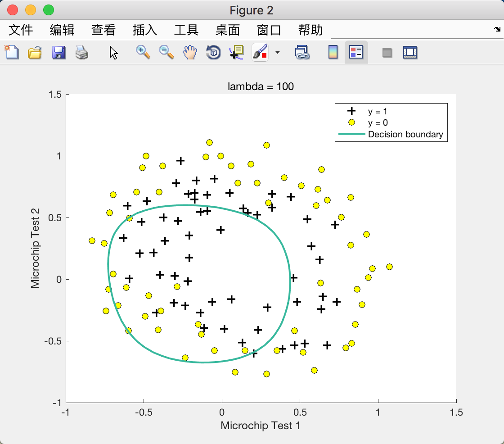

# Logistic Regression

## [编程作业: Logistic Regression](https://www.coursera.org/learn/machine-learning/programming/ixFof/logistic-regression)

## Logistic Regression

### Visualizing the data

```
% plotData.m
function plotData(X, y)
%PLOTDATA Plots the data points X and y into a new figure
%   PLOTDATA(x,y) plots the data points with + for the positive examples
%   and o for the negative examples. X is assumed to be a Mx2 matrix.

% Create New Figure
figure; hold on;

% ====================== YOUR CODE HERE ======================
% Instructions: Plot the positive and negative examples on a
%               2D plot, using the option 'k+' for the positive
%               examples and 'ko' for the negative examples.
%

% Find Indices of Positive and Negative Examples
pos = find(y==1);
neg = find(y==0);

% Plot Examples
plot(X(pos, 1), X(pos, 2), 'k+', 'LineWidth', 2, 'MarkerSize', 7);
plot(X(neg, 1), X(neg, 2), 'ko', 'MarkerFaceColor', 'y', 'MarkerSize', 7);

% =========================================================================

hold off;

end
```



### sigmoid function & Cost function and gradient

```
% sigmoid.m
function g = sigmoid(z)
%SIGMOID Compute sigmoid function
%   g = SIGMOID(z) computes the sigmoid of z.

% You need to return the following variables correctly
g = zeros(size(z));

% ====================== YOUR CODE HERE ======================
% Instructions: Compute the sigmoid of each value of z (z can be a matrix,
%               vector or scalar).
g = 1 ./ (1 + exp(-z));

% =============================================================

end


% costFunction.m
function [J, grad] = costFunction(theta, X, y)
%COSTFUNCTION Compute cost and gradient for logistic regression
%   J = COSTFUNCTION(theta, X, y) computes the cost of using theta as the
%   parameter for logistic regression and the gradient of the cost
%   w.r.t. to the parameters.

% Initialize some useful values
m = length(y); % number of training examples

% You need to return the following variables correctly
J = 0;
grad = zeros(size(theta));

% ====================== YOUR CODE HERE ======================
% Instructions: Compute the cost of a particular choice of theta.
%               You should set J to the cost.
%               Compute the partial derivatives and set grad to the partial
%               derivatives of the cost w.r.t. each parameter in theta
%
% Note: grad should have the same dimensions as theta
%
J = -1 *  sum(y .* log(sigmoid(X * theta)) + (1 - y) .* log(1 - sigmoid(X * theta))) / m;
grad = X' * (sigmoid(X * theta) - y) / m;

% =============================================================

end
```

### Learning parameters using fminunc

```
% ex2.m
%% ============= Part 3: Optimizing using fminunc  =============
%  In this exercise, you will use a built-in function (fminunc) to find the
%  optimal parameters theta.

%  Set options for fminunc
options = optimset('GradObj', 'on', 'MaxIter', 400);

%  Run fminunc to obtain the optimal theta
%  This function will return theta and the cost
[theta, cost] = ...
	fminunc(@(t)(costFunction(t, X, y)), initial_theta, options);
```

### Evaluating logistic regression

```
function p = predict(theta, X)
%PREDICT Predict whether the label is 0 or 1 using learned logistic
%regression parameters theta
%   p = PREDICT(theta, X) computes the predictions for X using a
%   threshold at 0.5 (i.e., if sigmoid(theta'*x) >= 0.5, predict 1)

m = size(X, 1); % Number of training examples

% You need to return the following variables correctly
p = zeros(m, 1);

% ====================== YOUR CODE HERE ======================
% Instructions: Complete the following code to make predictions using
%               your learned logistic regression parameters.
%               You should set p to a vector of 0's and 1's
%
p(sigmoid(X * theta) >= 0.5) = 1;

% =========================================================================

end
```




## Regularized logistic regression

### Visualizing the data



### Map the features



```
% mapFeature.m
function out = mapFeature(X1, X2)
% MAPFEATURE Feature mapping function to polynomial features
%
%   MAPFEATURE(X1, X2) maps the two input features
%   to quadratic features used in the regularization exercise.
%
%   Returns a new feature array with more features, comprising of
%   X1, X2, X1.^2, X2.^2, X1*X2, X1*X2.^2, etc..
%
%   Inputs X1, X2 must be the same size
%

degree = 6;
out = ones(size(X1(:,1)));
for i = 1:degree
    for j = 0:i
        out(:, end+1) = (X1.^(i-j)).*(X2.^j);
    end
end

end
```

### Cost function and gradient

The regularized cost function in logistic regression is:



The gradient of the cost function is a vector where the jth element is defined as follows:





```
% costFunctionReg.m
function [J, grad] = costFunctionReg(theta, X, y, lambda)
%COSTFUNCTIONREG Compute cost and gradient for logistic regression with regularization
%   J = COSTFUNCTIONREG(theta, X, y, lambda) computes the cost of using
%   theta as the parameter for regularized logistic regression and the
%   gradient of the cost w.r.t. to the parameters.

% Initialize some useful values
m = length(y); % number of training examples

% You need to return the following variables correctly
J = 0;
grad = zeros(size(theta));

% ====================== YOUR CODE HERE ======================
% Instructions: Compute the cost of a particular choice of theta.
%               You should set J to the cost.
%               Compute the partial derivatives and set grad to the partial
%               derivatives of the cost w.r.t. each parameter in theta
theta_1 = [0; theta(2:end)];
J = -1 * sum(y .* (log(sigmoid(X * theta))) + (1 - y) .* (log(1 - sigmoid(X * theta)))) / m + lambda * theta_1' * theta_1 / (2 * m);
grad = X' * (sigmoid(X * theta) - y) / m + (lambda / m) * theta_1;

% =============================================================

end
```

### Learning parameters using fminunc

```
%% ============= Part 2: Regularization and Accuracies =============
%  Optional Exercise:
%  In this part, you will get to try different values of lambda and
%  see how regularization affects the decision coundart
%
%  Try the following values of lambda (0, 1, 10, 100).
%
%  How does the decision boundary change when you vary lambda? How does
%  the training set accuracy vary?
%

% Initialize fitting parameters
initial_theta = zeros(size(X, 2), 1);

% Set regularization parameter lambda to 1 (you should vary this)
lambda = 1;

% Set Options
options = optimset('GradObj', 'on', 'MaxIter', 400);

% Optimize
[theta, J, exit_flag] = ...
	fminunc(@(t)(costFunctionReg(t, X, y, lambda)), initial_theta, options);
```

λ = 1 时：



λ = 0 （Overfitting）时：



λ = 100 （Underfitting）时：

