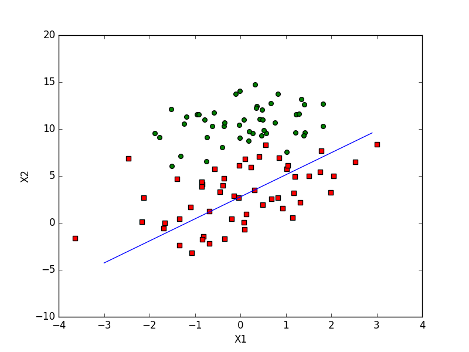
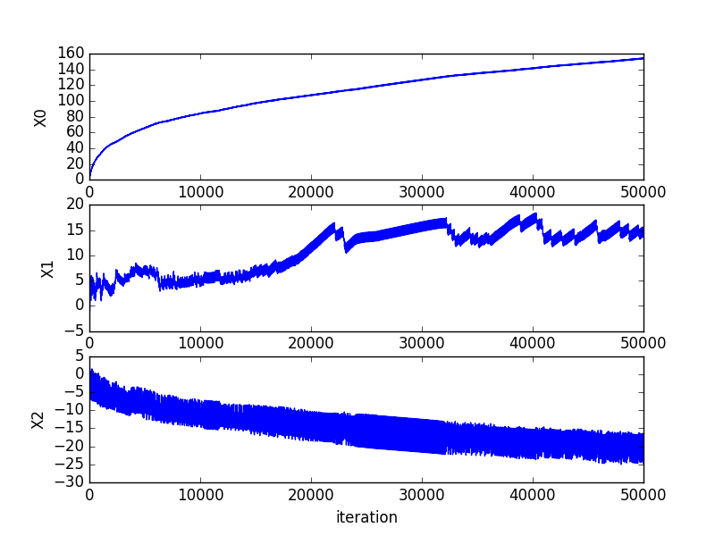
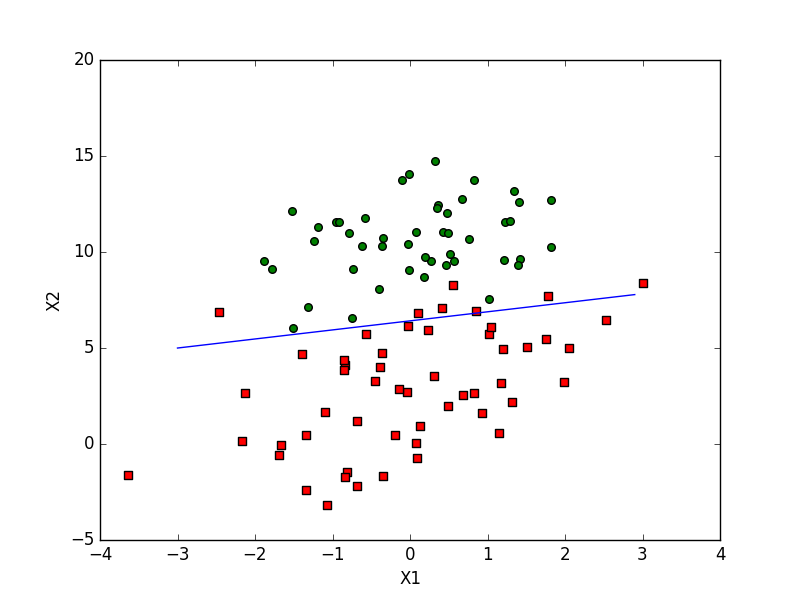
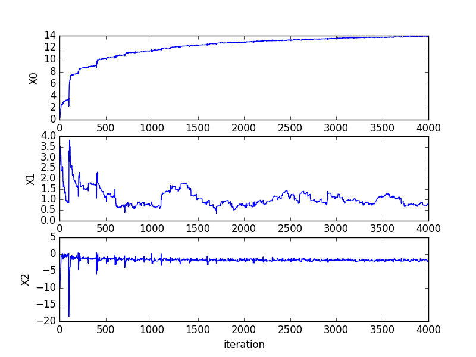

# Logistic回归

* sigmoid函数（阶跃函数）
```math
\sigma(z) = {1 \over 1 + e^{-z}}
```
* 基于最优化方法的最集回归系数确定：
```math
z = w_{0}x_{0} + w_{1}x_{1} + w_{2}x_{2} + \cdots + w_{n}x_{n}
```
* 梯度上升算法的迭代公式:
```math
w := w + \alpha\nabla_{w}f(w)
```
其中
```math
\nabla_{w}f(w)
```
表示函数 ```f(w)``` 的梯度：
```math
\nabla f(x, y) = \begin{pmatrix}
                    \partial f(x, y) \over \partial x \\
                    \\
                    \partial f(x, y) \over \partial y \\
                 \end{pmatrix}
```

```python
# -*- coding: utf-8 -*-
from numpy import *

# Sigmoid 函数
def sigmoid(inX):
    return 1.0 / (1 + exp(-inX))

# 梯度上升算法
def gradAscend(dataMatIn, classLabels):
    # 把 dataMatIn, classLabels 转换为numpy矩阵数据类型
    dataMatrix = mat(dataMatIn)
    labelMat = mat(classLabels).transpose() # 标签向量转置为列向量
    m, n = shape(dataMatrix)
    alpha = 0.001 # 梯度上升算法的迭代公式中的矫正系数
    maxCycles = 500
    weights = ones((n, 1)) # 先设定权重系数全部为1
    for k in range(maxCycles):
        h = sigmoid(dataMatrix * weights)
        error = (labelMat - h) # 误差
        weights = weights + alpha * dataMatrix.transpose() * error
    return weights

# 随机梯度上升算法
def stocGradAscent0(dataMatrix, classLabels):
    m, n = shape(mat(classLabels).transpose())
    alpha = 0.01
    weights = ones(n)
    for i in range(m):
        h = sigmoid(sum(dataMatrix[i] * weights))
        error = classLabels[i] - h # 与梯度上升算法不同，这里h, error都是数，而不是矩阵
        weights = weights + alpha * error * dataMatrix[i]
    return weights

# 改进后的随机梯度算法
def stocGradAscent1(dataMatrix, classLabels, numIter=150):
    m, n = shape(mat(classLabels).transpose())
    weights = ones(n)
    for j in range(numIter):
        dataIndex = list(range(m))
        for i in range(m):
            alpha = 4 / (1.0 + j + i) + 0.01 # alpha在每次迭代的时候都会调整，缓解weights在迭代过程中的高频波动
            randIndex = int(random.uniform(0, len(dataIndex))) # 随机选取样本来更新回归系数
            h = sigmoid(sum(dataMatrix[randIndex] * weights))
            error = classLabels[randIndex] - h  # 与梯度上升算法不同，这里h, error都是数，而不是矩阵
            weights = weights + alpha * error * dataMatrix[randIndex]
            del(dataIndex[randIndex])
    return weights

# Logistic回归分类函数
def classifyVector(inX, weights):
    prob = sigmoid(sum(inX * weights))
    if prob > 0.5:
        return 1.0
    else:
        return 0.0
```

《机器学习·实战》中的测试：
```python
# -*- coding: utf-8 -*-
from numpy import *
import matplotlib.pyplot as plt
import LogisticRegression


# ===================test1===================
def loadDataSet():
    dataMat = []
    labelMat = []
    fr = open('./datas/testSet.txt')
    for line in fr.readlines():
        lineArr = line.strip().split()
        dataMat.append([1.0, float(lineArr[0]), float(lineArr[1])])
        labelMat.append(int(lineArr[2]))
    return dataMat, labelMat

def plotBestFit(weights):
    dataMat, labelMat = loadDataSet()
    dataArr = array(dataMat)
    n = shape(dataArr)[0]
    xcord1 = []
    ycord1 = []
    xcord2 = []
    ycord2 = []
    for i in range(n):
        if int(labelMat[i]) == 1:
            xcord1.append(dataArr[i, 1])
            ycord1.append(dataArr[i, 2])
        else:
            xcord2.append(dataArr[i, 1])
            ycord2.append(dataArr[i, 2])
    fig = plt.figure()
    ax = fig.add_subplot(111)
    ax.scatter(xcord1, ycord1, s=30, c='red', marker='s')
    ax.scatter(xcord2, ycord2, s=30, c='green')
    x = arange(-3.0, 3.0, 0.1)
    y = (-weights[0] - weights[1] * x) / weights[2]
    ax.plot(x, y)
    plt.xlabel('X1')
    plt.ylabel('X2')
    plt.show()


dataMat, labelMat = loadDataSet()
weights = LogisticRegression.gradAscend(array(dataMat), labelMat)
print(weights)
plotBestFit(weights.getA())

weights = LogisticRegression.stocGradAscent0(array(dataMat), labelMat)
print(weights)
plotBestFit(weights)

weights = LogisticRegression.stocGradAscent1(array(dataMat), labelMat)
print(weights)
plotBestFit(weights)


# ===================test2===================
# 从疝气病症预测病马的死亡率
def colicTest():
    frTrain = open('./datas/horseColicTraining.txt')
    frTest = open('./datas/horseColicTest.txt')
    trainingSet = []
    trainingLabels = []
    for line in frTrain.readlines():
        currLine = line.strip().split('\t')
        lineArr = []
        for i in range(21):
            lineArr.append(float(currLine[i]))
        trainingSet.append(lineArr)
        trainingLabels.append(float(currLine[21]))
    trainWeights = LogisticRegression.stocGradAscent1(array(trainingSet), trainingLabels, 1000)
    errorCount = 0
    numTestVec = 0.0
    for line in frTest.readlines():
        numTestVec += 1.0
        currLine = line.strip().split('\t')
        lineArr = []
        for i in range(21):
            lineArr.append(float(currLine[i]))
        if int(LogisticRegression.classifyVector(array(lineArr), trainWeights)) != int(currLine[21]):
            errorCount += 1
    errorRate = (float(errorCount) / numTestVec)
    print("the error rate of this test is: %f" % errorRate)
    return errorRate

def multiTest():
    numTests = 10
    errorSum = 0.0
    for k in range(numTests):
        errorSum += colicTest()
    print("after %d iterations the average error rate is: %f" % (numTests, errorSum / float(numTests)))

multiTest()
```

**注：**
梯度上升算法```gradAscend(dataMatIn, classLabels)```需要遍历整个数据集，处理数量非常大的样本时，计算复杂度过高，而随机梯度上升算法```stocGradAscent0(dataMatrix, classLabels)```一次仅用一个样本点来更新回归函数，可以在新样本到来时对分类器进行增量式更新

随机梯度上升算法```stocGradAscent0(dataMatrix, classLabels)```虽然比梯度上升算法```gradAscend(dataMatIn, classLabels)```计算复杂度小很多，但是回归系数的误差取较大。

* 根据梯度上升算法```gradAscend(dataMatIn, classLabels)```得到的回归直线
```python
weights = LogisticRegression.gradAscend(array(dataMat), labelMat)
print(weights)
plotBestFit(weights.getA())
```


* 根据随机梯度上升算法```stocGradAscent0(dataMatrix, classLabels)```得到的回归直线
```python
weights = LogisticRegression.stocGradAscent0(array(dataMat), labelMat)
print(weights)
plotBestFit(weights)
```


下图展示了函数```stocGradAscent0(dataMatrix, classLabels)```迭代过程中回归系数的变化：



因此对随机梯度上升算法```stocGradAscent0(dataMatrix, classLabels)```进行改进：
* alpha在每次迭代的时候都会调整，缓解weights在迭代过程中的高频波动
* 随机选取样本来更新回归系数

得到改进版的随机梯度上升算法```stocGradAscent1(dataMatrix, classLabels)```:
```python
# 改进后的随机梯度算法
def stocGradAscent1(dataMatrix, classLabels, numIter=150):
    m, n = shape(mat(classLabels).transpose())
    weights = ones(n)
    for j in range(numIter):
        dataIndex = list(range(m))
        for i in range(m):
            alpha = 4 / (1.0 + j + i) + 0.01 # alpha在每次迭代的时候都会调整，缓解weights在迭代过程中的高频波动
            randIndex = int(random.uniform(0, len(dataIndex))) # 随机选取样本来更新回归系数
            h = sigmoid(sum(dataMatrix[randIndex] * weights))
            error = classLabels[randIndex] - h  # 与梯度上升算法不同，这里h, error都是数，而不是矩阵
            weights = weights + alpha * error * dataMatrix[randIndex]
            del(dataIndex[randIndex])
    return weights
```
改进之后，得到的回归直线以及迭代过程中回归系数的变化：
```python
weights = LogisticRegression.stocGradAscent1(array(dataMat), labelMat)
print(weights)
plotBestFit(weights)
```


