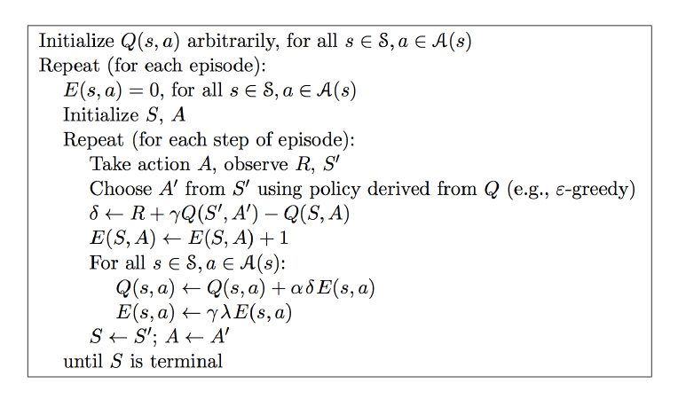

# Q Learning & Sarsa(lambda)

## Q-Learning


## Sarsa

Sarsa:


Sarsa Lambda:




### simple demo1 （Q-Learning & Sarsa）

参考: [https://morvanzhou.github.io/tutorials/machine-learning/reinforcement-learning/2-1-general-rl/](https://morvanzhou.github.io/tutorials/machine-learning/reinforcement-learning/2-1-general-rl/)

例子的环境是一个一维世界，在世界的右边有宝藏，探索者只要得到宝藏尝到了甜头，然后以后就记住了得到宝藏的方法，这就是他用强化学习所学习到的行为

```
-o---T
# T 就是宝藏的位置, o 是探索者的位置
```

```python
import numpy as np
import pandas as pd
import time

N_STATES = 6   # 1维世界的宽度
ACTIONS = ['left', 'right']     # 探索者的可用动作
EPSILON = 0.9   # 贪婪度 greedy
ALPHA = 0.1     # 学习率
GAMMA = 0.9    # 奖励递减值
LAMBDA = 0.9   # Sersa lambda
MAX_EPISODES = 13   # 最大回合数
FRESH_TIME = 0.3    # 移动间隔时间


def build_q_table(n_states, actions):
    table = pd.DataFrame(
        np.zeros((n_states, len(actions))),  # Q table 初始化为 0
        columns=actions  # 列为 actions，行为 states
    )
    return table


def choose_action(state, q_table):
    state_actions = q_table.iloc[state, :]  # 当前 state 下所有的 action
    if (np.random.uniform() > EPSILON or (state_actions.all() == 0)):  # 非贪婪模式 or 未探索
        action_name = np.random.choice(ACTIONS)
    else:
        action_name = state_actions.argmax()
    return action_name


def get_env_feedback(S, A):
    # 只有到达终点才给予 1 的奖励，其他奖励均为 0
    if A == 'right':  # move right
        if S == N_STATES - 2:  # terminate
            next_S = 'terminal'
            R = 1
        else:
            next_S = S + 1
            R = 0
    else:  # move left
        R = 0
        if S == 0:
            next_S = S
        else:
            next_S = S - 1
    return next_S, R


def update_env(S, episode, step_counter):
    env_list = ['-'] * (N_STATES - 1) + ['T']  # environment is '-----T'
    if S == 'terminal':
        interaction = 'Episode %s: total_steps = %s' % (episode + 1, step_counter)
        print('\r{}'.format(interaction), end='')
        time.sleep(2)
        print('\r                                ', end='')
    else:
        env_list[S] = 'o'
        interaction = ''.join(env_list)
        print('\r{}'.format(interaction), end='')
        time.sleep(FRESH_TIME)


def Q_learning():
    q_table = build_q_table(N_STATES, ACTIONS)
    for episode in range(MAX_EPISODES):
        step_counter = 0
        S = 0  # 初始位置
        is_termiante = False
        update_env(S, episode, step_counter)
        while not is_termiante:
            A = choose_action(S, q_table)  # 选择一个 action 进入下一个 state
            next_S, R = get_env_feedback(S, A)
            q_predict = q_table.ix[S, A]  # 估算的(状态-行为)值
            if next_S != 'terminal':
                q_target = R + GAMMA * q_table.iloc[next_S, :].max()  # 实际的(状态-行为)值
            else:
                q_target = R  # 实际的(状态-行为)值 (回合结束)
                is_termiante = True
            q_table.ix[S, A] += ALPHA * (q_target - q_predict)
            S = next_S  # 进入下一状态

            update_env(S, episode, step_counter)
            step_counter += 1
    return q_table


def Sarsa():
    q_table = build_q_table(N_STATES, ACTIONS)
    eligibility_trace = q_table.copy()
    for episode in range(MAX_EPISODES):
        eligibility_trace *= 0  # 每 episode 初始化为 0
        step_counter = 0
        S = 0 # 初始位置
        is_terminate = False
        update_env(S, episode, step_counter)
        while not is_terminate:
            A = choose_action(S, q_table)  # 选择一个 action 进入下一个 state（和 Q-Learning 选择 action 的策略一样）
            next_S, R = get_env_feedback(S, A)
            q_predict = q_table.ix[S, A]
            if next_S != 'terminal':
                next_A = choose_action(next_S, q_table)  # 如果没到终点，则继续选择 next_action
                q_target = R + GAMMA * q_table.ix[next_S, next_A]
            else:
                q_target = R
                is_terminate = True
            error = q_target - q_predict

            eligibility_trace.ix[S, :] *= 0
            eligibility_trace.ix[S, A] = 1

            q_table += ALPHA * error * eligibility_trace

            eligibility_trace *= LAMBDA * GAMMA  # 随着时间衰减 eligibility trace 的值

            S = next_S
            update_env(next_S, episode, step_counter)
            step_counter += 1

    return q_table


if __name__ == "__main__":
    q_table = Sarsa()
    print('\r\nQ-table:\n')
    print(q_table)

```


### simple demo2 （Sarsa）

RL_brain.py

```python
import numpy as np
import pandas as pd


class RL(object):

    def __init__(self, action_space, learning_rate=0.01, reward_decay=0.9, e_greedy=0.9):
        self.actions = action_space
        self.lr = learning_rate
        self.gamma = reward_decay  # 奖励衰减
        self.epsilon = e_greedy  # 贪婪度
        self.q_table = pd.DataFrame(columns=self.actions)  # 初始 q_table，列为 actions，行为 states

    def check_state_exist(self, state):
        if state not in self.q_table.index:
            # 如果没有当前 state，则在 q_table 中插入该 state
            self.q_table = self.q_table.append(
                pd.Series(
                    [0] * len(self.actions),  # 插入一行全 0 的数
                    index=self.q_table.columns,
                    name=state
                )
            )

    def choose_action(self, state):
        self.check_state_exist(state)
        # choose action
        if np.random.uniform() < self.epsilon:  # 贪婪: 选择 Q value 最高的 action
            state_action = self.q_table.ix[state, :]
            # 同一个 state, 可能会有多个相同的 Q action value, 所以我们乱序一下
            state_action = state_action.reindex(np.random.permutation(state_action.index))
            action = state_action.argmax()
        else:  # 探索: 随机选择 action
            action = np.random.choice(self.actions)
        return action

    def learn(self, *args):
        pass


class QLearningTable(RL):

    def __init__(self, actions, learning_rate=0.01, reward_decay=0.9, e_greedy=0.9):
        super(QLearningTable, self).__init__(actions, learning_rate, reward_decay, e_greedy)

    def learn(self, s, a, r, next_s):
        self.check_state_exist(next_s)
        q_predict = self.q_table.ix[s, a]
        if next_s != 'terminal':
            q_target = r + self.gamma * self.q_table.ix[next_s, :].max()
        else:
            q_target = r
        self.ix[s, a] += self.lr * (q_target - q_predict)


class SarsaTable(RL):

    def __init__(self, actions, learning_rate=0.01, reward_decay=0.9, e_greedy=0.9, trace_decay=0.9):
        super(SarsaTable, self).__init__(actions, learning_rate, reward_decay, e_greedy)
        # 后向观测算法, eligibility trace
        self.lamdba = trace_decay
        self.eligibility_trace = self.q_table.copy()

    def learn(self, s, a, r, next_s, next_a):
        self.check_state_exist(next_s)
        q_predict = self.q_table.ix[s, a]
        if next_s != 'terminal':
            q_target = r + self.gamma * self.q_table.ix[next_s, next_a]
        else:
            q_target = r
        error = q_target - q_predict

        # 对于经历过的 state-action, 我们让他+1, 证明他是得到 reward 路途中不可或缺的一环
        # self.eligibility_trace.ix[s, a] += 1
        self.eligibility_trace.ix[s, :] *= 0
        self.eligibility_trace.ix[s, a] = 1

        self.q_table += self.lr * error * self.eligibility_trace

        # 随着时间衰减 eligibility trace 的值, 离获取 reward 越远的步, 他的"不可或缺性"越小
        self.eligibility_trace *= self.gamma * self.lamdba

    def check_state_exist(self, state):
        if state not in self.q_table.index:
            # 和 Q-learning 不同之处在于，既更新 q_table 又更新 eligibility_trace
            to_be_append = pd.Series(
                [0] * len(self.actions),
                index=self.q_table.columns,
                name=state
            )
            # append new state to q_table and eligibility_trace
            self.q_table = self.q_table.append(to_be_append)
            self.eligibility_trace = self.eligibility_trace.append(to_be_append)
```

```python
from maze_env import Maze
from RL_brain import SarsaTable

def update():
    for episode in range(100):
        state = env.reset() # 初始状态
        action = RL.choose_action(str(state))
        RL.eligibility_trace *= 0
        while True:
            env.render()

            # RL take action and get next state and reward
            next_state, reward, done = env.step(action)

            # RL choose action based on next state
            next_action = RL.choose_action(str(next_state))

            # RL learn from this transition (s, a, r, s, a) ==> Sarsa
            RL.learn(str(state), action, reward, str(next_state), next_action)

            # swap state and action
            state = next_state
            action = next_action

            # break while loop when end of this episode
            if done:
                break

    # end of game
    print('game over')
    env.destroy()

if __name__ == "__main__":
    env = Maze()
    RL = SarsaTable(actions=list(range(env.n_actions))) # 0, 1, 2, 3 对应着 up, down, left, right

    env.after(100, update)
    env.mainloop()
```

maze_env.py

```python
"""
Reinforcement learning maze example.
Red rectangle:          explorer.
Black rectangles:       hells       [reward = -1].
Yellow bin circle:      paradise    [reward = +1].
All other states:       ground      [reward = 0].
This script is the environment part of this example.
The RL is in RL_brain.py.
View more on my tutorial page: https://morvanzhou.github.io/tutorials/
"""


import numpy as np
import time
import sys
if sys.version_info.major == 2:
    import Tkinter as tk
else:
    import tkinter as tk


UNIT = 40   # pixels
MAZE_H = 4  # grid height
MAZE_W = 4  # grid width


class Maze(tk.Tk, object):
    def __init__(self):
        super(Maze, self).__init__()
        self.action_space = ['u', 'd', 'l', 'r']
        self.n_actions = len(self.action_space)
        self.title('maze')
        self.geometry('{0}x{1}'.format(MAZE_H * UNIT, MAZE_H * UNIT))
        self._build_maze()

    def _build_maze(self):
        self.canvas = tk.Canvas(self, bg='white',
                           height=MAZE_H * UNIT,
                           width=MAZE_W * UNIT)

        # create grids
        for c in range(0, MAZE_W * UNIT, UNIT):
            x0, y0, x1, y1 = c, 0, c, MAZE_H * UNIT
            self.canvas.create_line(x0, y0, x1, y1)
        for r in range(0, MAZE_H * UNIT, UNIT):
            x0, y0, x1, y1 = 0, r, MAZE_H * UNIT, r
            self.canvas.create_line(x0, y0, x1, y1)

        # create origin
        origin = np.array([20, 20])

        # hell
        hell1_center = origin + np.array([UNIT * 2, UNIT])
        self.hell1 = self.canvas.create_rectangle(
            hell1_center[0] - 15, hell1_center[1] - 15,
            hell1_center[0] + 15, hell1_center[1] + 15,
            fill='black')
        # hell
        hell2_center = origin + np.array([UNIT, UNIT * 2])
        self.hell2 = self.canvas.create_rectangle(
            hell2_center[0] - 15, hell2_center[1] - 15,
            hell2_center[0] + 15, hell2_center[1] + 15,
            fill='black')

        # create oval
        oval_center = origin + UNIT * 2
        self.oval = self.canvas.create_oval(
            oval_center[0] - 15, oval_center[1] - 15,
            oval_center[0] + 15, oval_center[1] + 15,
            fill='yellow')

        # create red rect
        self.rect = self.canvas.create_rectangle(
            origin[0] - 15, origin[1] - 15,
            origin[0] + 15, origin[1] + 15,
            fill='red')

        # pack all
        self.canvas.pack()

    def reset(self):
        self.update()
        time.sleep(0.5)
        self.canvas.delete(self.rect)
        origin = np.array([20, 20])
        self.rect = self.canvas.create_rectangle(
            origin[0] - 15, origin[1] - 15,
            origin[0] + 15, origin[1] + 15,
            fill='red')
        # return state
        return self.canvas.coords(self.rect)

    def step(self, action):
        s = self.canvas.coords(self.rect)
        base_action = np.array([0, 0])
        if action == 0:   # up
            if s[1] > UNIT:
                base_action[1] -= UNIT
        elif action == 1:   # down
            if s[1] < (MAZE_H - 1) * UNIT:
                base_action[1] += UNIT
        elif action == 2:   # right
            if s[0] < (MAZE_W - 1) * UNIT:
                base_action[0] += UNIT
        elif action == 3:   # left
            if s[0] > UNIT:
                base_action[0] -= UNIT

        self.canvas.move(self.rect, base_action[0], base_action[1])  # move agent

        s_ = self.canvas.coords(self.rect)  # next state

        # reward function
        if s_ == self.canvas.coords(self.oval):
            reward = 1
            done = True
        elif s_ in [self.canvas.coords(self.hell1), self.canvas.coords(self.hell2)]:
            reward = -1
            done = True
        else:
            reward = 0
            done = False

        return s_, reward, done

    def render(self):
        time.sleep(0.05)
        self.update()
```