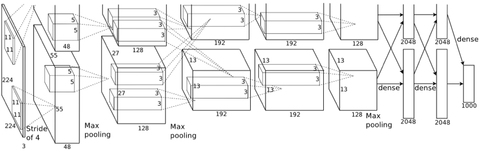
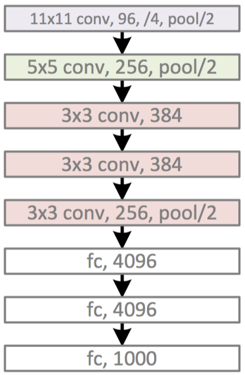

# TensorFlow —— CNN (AlexNet模型)

AlexNet 模型结构：





主要结构由5个卷积层和3个全连接层构成

参考《TensorFlow实现》实现：

```python
from datetime import datetime
import math
import time
import tensorflow as tf

batch_size = 32
num_batches = 100

def print_activation(t):
    print(t.op.name, ' ', t.get_shape().as_list())

def inference(images):
    parameters = []

    # 第一个卷积层
    with tf.name_scope('conv1') as scope:
        kernel = tf.Variable(tf.truncated_normal([11, 11, 3, 64], dtype=tf.float32, stddev=1e-1), name='weights')
        conv = tf.nn.conv2d(images, kernel, [1, 4, 4, 1], padding='SAME')
        biases = tf.Variable(tf.constant(0.0, shape=[64], dtype=tf.float32), trainable=True, name='biases')
        bias = tf.nn.bias_add(conv, biases)
        conv1 = tf.nn.relu(bias, name=scope)
        parameters += [kernel, biases]
    print_activation(conv1)
    # LRN层和池化层
    lrn1 = tf.nn.lrn(conv1, depth_radius=4, bias=1.0, alpha=0.001/9, beta=0.75, name='lrn1')
    pool1 = tf.nn.max_pool(lrn1, ksize=[1, 3, 3, 1], strides=[1, 2, 2, 1], padding='VALID', name='pool1')
    print_activation(pool1)

    # 第二个卷积层
    with tf.name_scope('conv2') as scope:
        kernel = tf.Variable(tf.truncated_normal([5, 5, 64, 192], dtype=tf.float32, stddev=1e-1), name='weights')
        conv = tf.nn.conv2d(pool1, kernel, [1, 1, 1, 1], padding='SAME')
        biases = tf.Variable(tf.constant(0.0, shape=[192], dtype=tf.float32), trainable=True, name='biases')
        bias = tf.nn.bias_add(conv, biases)
        conv2 = tf.nn.relu(bias, name=scope)
        parameters += [kernel, biases]
    print_activation(conv2)
    # LRN层和池化层
    lrn2 = tf.nn.lrn(conv2, depth_radius=4, bias=1.0, alpha=0.001/9, beta=0.75, name='lrn1')
    pool2 = tf.nn.max_pool(lrn2, ksize=[1, 3, 3, 1], strides=[1, 2, 2, 1], padding='VALID', name='pool2')
    print_activation(pool2)

    # 第三个卷积层
    with tf.name_scope('conv3') as scope:
        kernel = tf.Variable(tf.truncated_normal([3, 3, 192, 384], dtype=tf.float32, stddev=1e-1), name='weights')
        conv = tf.nn.conv2d(pool2, kernel, [1, 1, 1, 1], padding='SAME')
        biases = tf.Variable(tf.constant(0.0, shape=[384], dtype=tf.float32), trainable=True, name='biases')
        bias = tf.nn.bias_add(conv, biases)
        conv3 = tf.nn.relu(bias, name=scope)
        parameters += [kernel, biases]
    print_activation(conv3)

    # 第四个卷积层
    with tf.name_scope('conv4') as scope:
        kernel = tf.Variable(tf.truncated_normal([3, 3, 384, 256], dtype=tf.float32, stddev=1e-1), name='weights')
        conv = tf.nn.conv2d(conv3, kernel, [1, 1, 1, 1], padding='SAME')
        biases = tf.Variable(tf.constant(0.0, shape=[256], dtype=tf.float32), trainable=True, name='biases')
        bias = tf.nn.bias_add(conv, biases)
        conv4 = tf.nn.relu(bias, name=scope)
        parameters += [kernel, biases]
    print_activation(conv4)

    # 第五个卷积层
    with tf.name_scope('conv5') as scope:
        kernel = tf.Variable(tf.truncated_normal([3, 3, 256, 256], dtype=tf.float32, stddev=1e-1), name='weights')
        conv = tf.nn.conv2d(conv4, kernel, [1, 1, 1, 1], padding='SAME')
        biases = tf.Variable(tf.constant(0.0, shape=[256], dtype=tf.float32), trainable=True, name='biases')
        bias = tf.nn.bias_add(conv, biases)
        conv5 = tf.nn.relu(bias, name=scope)
        parameters += [kernel, biases]
    print_activation(conv5)
    pool5 = tf.nn.max_pool(conv5, ksize=[1, 3, 3, 1], strides=[1, 2, 2, 1], padding='VALID', name='pool5')
    print_activation(pool5)

    # 全连接层1
    reshape = tf.reshape(pool5, [batch_size, -1])
    dim = reshape.get_shape()[1].value
    weight1 = tf.Variable(tf.truncated_normal(shape=[dim, 4096], stddev=0.1))
    bias1 = tf.Variable(tf.constant(0.1, shape=[4096]))
    output1 = tf.nn.relu(tf.matmul(reshape, weight1) + bias1)

    # 全连接层2
    weight2 = tf.Variable(tf.truncated_normal(shape=[4096, 4096], stddev=0.1))
    bias2 = tf.Variable(tf.constant(0.1, shape=[4096]))
    output2 = tf.nn.relu(tf.matmul(output1, weight2) + bias2)

    # 全连接层3
    weight3 = tf.Variable(tf.truncated_normal(shape=[4096, 1000], stddev=0.1))
    bias3 = tf.Variable(tf.constant(0.1, shape=[1000]))
    output3 = tf.nn.relu(tf.matmul(output2, weight3) + bias3)
    return output3, parameters

# 评估 AlexNet 每轮计算时间的函数
def time_tensorflow_run(session, target, info_string):
    num_steps_burn_in = 10
    total_duration = 0.0
    total_duration_squared = 0.0

    for i in range(num_batches + num_steps_burn_in):
        start_time = time.time()
        _ = session.run(target)
        duration = time.time() - start_time
        if i >= num_steps_burn_in:
            if not i % 10:
                print("%s: step %d, duration = %.3f" % (datetime.now(), i - num_steps_burn_in, duration))
            total_duration += duration
            total_duration_squared += duration * duration

    mn = total_duration / num_batches
    vr = total_duration_squared / num_batches - mn * mn
    sd = math.sqrt(vr)
    print("%s: %s across %d steps, %.3f +/- %.3f sec / batch" % (datetime.now, info_string, num_batches, mn, sd))

# 主函数
def run_benchmark():
    with tf.Graph().as_default():
        image_size = 224
        images = tf.Variable(tf.random_normal([batch_size, image_size, image_size, 3], dtype=tf.float32, stddev=1e-1))
        output, parameters = inference(images)

        sess = tf.InteractiveSession()
        tf.initialize_all_variables().run()
        time_tensorflow_run(sess, output, "Forward")

        objective = tf.nn.l2_loss(output)
        grad = tf.gradients(objective, parameters)
        time_tensorflow_run(sess, grad, "Forward-backward")

# 运行主函数
run_benchmark()
```

测试训练输出示例：

```
conv1   [32, 56, 56, 64]
pool1   [32, 27, 27, 64]
conv2   [32, 27, 27, 192]
pool2   [32, 13, 13, 192]
conv3   [32, 13, 13, 384]
conv4   [32, 13, 13, 256]
conv5   [32, 13, 13, 256]
pool5   [32, 6, 6, 256]
2017-05-03 00:13:42.934972: step 0, duration = 0.914
2017-05-03 00:13:52.317165: step 10, duration = 0.960
2017-05-03 00:14:01.749328: step 20, duration = 0.952
2017-05-03 00:14:11.324922: step 30, duration = 0.958
2017-05-03 00:14:21.056403: step 40, duration = 0.979
2017-05-03 00:14:30.915725: step 50, duration = 1.006
2017-05-03 00:14:40.965094: step 60, duration = 1.012
2017-05-03 00:14:51.269736: step 70, duration = 1.070
2017-05-03 00:15:02.553225: step 80, duration = 1.136
2017-05-03 00:15:15.375791: step 90, duration = 1.275
<built-in method now of type object at 0x101e8b580>: Forward across 100 steps, 1.061 +/- 0.154 sec / batch
2017-05-03 00:16:12.852850: step 0, duration = 4.124
2017-05-03 00:16:59.851884: step 10, duration = 4.252
2017-05-03 00:17:48.025145: step 20, duration = 4.684
2017-05-03 00:18:34.598470: step 30, duration = 4.624
2017-05-03 00:19:23.927816: step 40, duration = 4.393
2017-05-03 00:20:09.554347: step 50, duration = 3.947
2017-05-03 00:20:49.039705: step 60, duration = 3.952
2017-05-03 00:21:29.847437: step 70, duration = 4.720
2017-05-03 00:22:11.290755: step 80, duration = 3.884
2017-05-03 00:22:52.696856: step 90, duration = 3.985
<built-in method now of type object at 0x101e8b580>: Forward-backward across 100 steps, 4.396 +/- 0.537 sec / batch
```