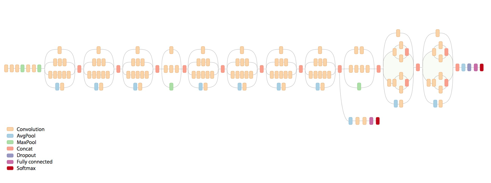

# TensorFlow —— CNN (Inception-V3模型)

`Inception-V3` 模型的核心结构：首先是 5 个卷积层和 2 个池化层交替的普通结构，然后是 3 个 `Inception` 模块组，每个模块组内包含多个结构类似的 `Inception module`

设计 `Inception Net` 的主要原则是：图片尺寸是不断缩小的，从 `229x229` 通过 `5` 个步长为 `2` 的卷积层或池化层后，缩小为 `8x8`；同时，输出通道数持续增加，从一开始的 `3` 到 `2048`，可以看出，每一层卷积、池化或 `Inception` 模块组的目的都是将空间结构建华，同时将空间信息转化为高阶抽象的特征信息，即将空间的维度转化为通道的维度

`Inception Module` 一般情况下有 `4` 个分支，第 `1` 个分支一般是 `1x1` 卷积，第 `2` 个分支一般是 `1x1` 卷积再分解后的 `1xn` 和 `nx1` 卷积，第 `3` 个分支和第二个分支类似，但是一般更深一些，第 `4` 个分支一般具有最大池化或平均池化

故，`Inception Module` 是通过组合比较简单的特征抽象（分支1）、比较复杂的特征抽象（分支2和分支3）和一个简化结构的池化层（分支4），一共 `4` 种不同程度的特征抽象和变化来有选择地保留不同层次的高阶特征，这样可以最大程度地丰富网络的表达能力




（代码参考《TensorFlow 实战》一书实现）

```python
import tensorflow as tf
import time
import math
import datetime
slim = tf.contrib.slim
trunc_normal = lambda stddev: tf.truncated_normal_initializer(0.0, stddev)

def inception_v3_arg_scope(weight_decay=0.00004, stddev=0.1, batch_norm_var_collection='moving_vars'):

    batch_norm_params = {
        'decay': 0.9997,
        'epsilon': 0.001,
        'updates_collection': tf.GraphKeys.UPDATE_OPS,
        'variable_collection': {
            'beta': None,
            'gamma': None,
            'moving_mean': [batch_norm_var_collection],
            'moving_variance': [batch_norm_var_collection]
        }
    }

    with slim.arg_scope([slim.conv2d, slim.fully_connected],
                        weights_regularization=slim.l2_regularizer(weight_decay)):
        with slim.arg_scope(
            [slim.conv2d],
            weights_initializer = tf.truncated_normal_initializer(stddev=stddev),
            activation_fn = tf.nn.relu,
            normalizer_fn = slim.batch_norm,
            normalizer_params = batch_norm_params) as sc:
            return sc

# 生成 Inception V3 网络的卷积部分
def inception_v3_base(inputs, scope=None):
    end_inputs = {}
    # 非 Inception Module 的卷积层
    with tf.variable(scope, 'InceptionV3', [inputs]):
        with slim.arg_scope([slim.conv2d, slim.max_pool2d, slim.avg_pool2d], stride=1, padding='VALID'):
            # slim.conv2d(输入的tensor，输出通道数，卷积核尺寸，步长，padding模式)
            net = slim.conv2d(inputs, 32, [3, 3], stride=2, scope='Conv2d_1a_3x3')
            net = slim.conv2d(net, 32, [3, 3], scope='Conv2d_2a_3x3')
            net = slim.conv2d(net, 64, [3, 3], padding='SAME', scope='Conv2d_2b_3x3')
            net = slim.max_pool2d(net, [3, 3], stride=2, scope='MaxPool_3a_3x3')
            net = slim.conv2d(net, 80, [1, 1], scope='Conv2d_3b_1x1')
            net = slim.conv2d(net, 192, [3, 3], scope='Conv2d_4a_3x3')
            net = slim.max_pool2d(net, [3, 3], stride=2, scope='MaxPool_5a_3x3')

    with slim.arg_scope([slim.conv2d, slim.max_pool2d, slim.avg_pool2d], stride=1, padding='SAME'):
        # 第一个 Inception 模块组的第1个 Inception Module
        with tf.variable_scope('Mixed_5b'):
            with tf.variable_scope('Branch_0'):
                branch_0 = slim.conv2d(net, 64, [1, 1], scope='Conv2d_0a_1x1')
            with tf.variable_scope('Branch_1'):
                branch_1 = slim.conv2d(net, 48, [1, 1], scope='Conv2d_0a_1x1')
                branch_1 = slim.conv2d(branch_1, 64, [5, 5], scope='Conv2d_0b_5x5')
            with tf.variable_scope('Branch_2'):
                branch_2 = slim.conv2d(net, 64, [1, 1], scope='Conv2d_0a_1x1')
                branch_2 = slim.conv2d(branch_2, 96, [3, 3], scope='Conv2d_0b_3x3')
                branch_2 = slim.conv2d(branch_2, 96, [3, 3], scope='Conv2d_0c_3x3')
            with tf.variable_scope('Branch_3'):
                branch_3 = slim.max_pool2d(net, [3, 3], scope='AvgPool_0a_3x3')
                branch_3 = slim.conv2d(branch_3, 32, [1, 1], scope='Conv2d_0b_1x1')
            net = tf.concat([branch_0, branch_1, branch_2, branch_3], 3)

        # 第一个 Inception 模块组的第2个 Inception Module
        with tf.variable_scope('Mixed_5c'):
            with tf.variable_scope('Branch_0'):
                branch_0 = slim.conv2d(net, 64, [1, 1], scope='Conv2d_0a_1x1')
            with tf.variable_scope('Branch_1'):
                branch_1 = slim.conv2d(net, 48, [1, 1], scope='Conv2d_0a_1x1')
                branch_1 = slim.conv2d(branch_1, 64, [5, 5], scope='Conv2d_0b_5x5')
            with tf.variable_scope('Branch_2'):
                branch_2 = slim.conv2d(net, 64, [1, 1], scope='Conv2d_0a_1x1')
                branch_2 = slim.conv2d(branch_2, 96, [3, 3], scope='Conv2d_0b_3x3')
                branch_2 = slim.conv2d(branch_2, 96, [3, 3], scope='Conv2d_0c_3x3')
            with tf.variable_scope('Branch_3'):
                branch_3 = slim.max_pool2d(net, [3, 3], scope='AvgPool_0a_3x3')
                branch_3 = slim.conv2d(branch_3, 64, [1, 1], scope='Conv2d_0b_1x1')
            net = tf.concat([branch_0, branch_1, branch_2, branch_3], 3)

        # 第一个 Inception 模块组的第3个 Inception Module
        with tf.variable_scope('Mixed_5d'):
            with tf.variable_scope('Branch_0'):
                branch_0 = slim.conv2d(net, 64, [1, 1], scope='Conv2d_0a_1x1')
            with tf.variable_scope('Branch_1'):
                branch_1 = slim.conv2d(net, 48, [1, 1], scope='Conv2d_0a_1x1')
                branch_1 = slim.conv2d(branch_1, 64, [5, 5], scope='Conv2d_0b_5x5')
            with tf.variable_scope('Branch_2'):
                branch_2 = slim.conv2d(net, 64, [1, 1], scope='Conv2d_0a_1x1')
                branch_2 = slim.conv2d(branch_2, 96, [3, 3], scope='Conv2d_0b_3x3')
                branch_2 = slim.conv2d(branch_2, 96, [3, 3], scope='Conv2d_0c_3x3')
            with tf.variable_scope('Branch_3'):
                branch_3 = slim.max_pool2d(net, [3, 3], scope='AvgPool_0a_3x3')
                branch_3 = slim.conv2d(branch_3, 64, [1, 1], scope='Conv2d_0b_1x1')
            net = tf.concat([branch_0, branch_1, branch_2, branch_3], 3)

        # 第二个 Inception 模块组的第1个 Inception Module
        with tf.variable_scope('Mixed_6a'):
            with tf.variable_scope('Branch_0'):
                branch_0 = slim.conv2d(net, 384, [3, 3], stride=2, padding='VALID', scope='Conv2d_1a_1x1')
            with tf.variable_scope('Branch_1'):
                branch_1 = slim.conv2d(net, 64, [1, 1], scope='Conv2d_0a_1x1')
                branch_1 = slim.conv2d(branch_1, 96, [3, 3], scope='Conv2d_0b_3x3')
                branch_1 = slim.conv2d(branch_1, 96, [3, 3], stride=2, padding='VALID', scope='Conv2d_1a_3x3')
            with tf.variable_scope('Branch_2'):
                branch_2 = slim.max_pool2d(net, [3, 3], stride=2, padding='VALID', scope='MaxPool_1a_3x3')
            net = tf.concat([branch_0, branch_1, branch_2], 3)

        # 第二个 Inception 模块组的第2个 Inception Module
        with tf.variable_scope('Mixed_6b'):
            with tf.variable_scope('Branch_0'):
                branch_0 = slim.conv2d(net, 192, [1, 1], scope='Conv2d_0a_1x1')
            with tf.variable_scope('Branch_1'):
                branch_1 = slim.conv2d(net, 128, [1, 1], scope='Conv2d_0a_1x1')
                branch_1 = slim.conv2d(branch_1, 128, [1, 7], scope='Conv2d_0b_1x7')
                branch_1 = slim.conv2d(branch_1, 192, [7, 1], scope='Conv2d_0b_7x1')
            with tf.variable_scope('Branch_2'):
                branch_2 = slim.conv2d(net, 128, [1, 1], scope='Conv2d_0a_1x1')
                branch_2 = slim.conv2d(branch_2, 128, [7, 1], scope='Conv2d_0b_7x1')
                branch_2 = slim.conv2d(branch_2, 128, [1, 7], scope='Conv2d_0c_1x7')
                branch_2 = slim.conv2d(branch_2, 128, [7, 1], scope='Conv2d_0d_7x1')
                branch_2 = slim.conv2d(branch_2, 192, [1, 7], scope='Conv2d_0e_1x7')
            with tf.variable_scope('Branch_3'):
                branch_3 = slim.max_pool2d(net, [3, 3], scope='AvgPool_0a_3x3')
                branch_3 = slim.conv2d(branch_3, 192, [1, 1], scope='Conv2d_0b_1x1')
            net = tf.concat([branch_0, branch_1, branch_2, branch_3], 3)

        # 第二个 Inception 模块组的第3个 Inception Module
        with tf.variable_scope('Mixed_6c'):
            with tf.variable_scope('Branch_0'):
                branch_0 = slim.conv2d(net, 192, [1, 1], scope='Conv2d_0a_1x1')
            with tf.variable_scope('Branch_1'):
                branch_1 = slim.conv2d(net, 160, [1, 1], scope='Conv2d_0a_1x1')
                branch_1 = slim.conv2d(branch_1, 160, [1, 7], scope='Conv2d_0b_1x7')
                branch_1 = slim.conv2d(branch_1, 192, [7, 1], scope='Conv2d_0b_7x1')
            with tf.variable_scope('Branch_2'):
                branch_2 = slim.conv2d(net, 160, [1, 1], scope='Conv2d_0a_1x1')
                branch_2 = slim.conv2d(branch_2, 160, [7, 1], scope='Conv2d_0b_7x1')
                branch_2 = slim.conv2d(branch_2, 160, [1, 7], scope='Conv2d_0c_1x7')
                branch_2 = slim.conv2d(branch_2, 160, [7, 1], scope='Conv2d_0d_7x1')
                branch_2 = slim.conv2d(branch_2, 192, [1, 7], scope='Conv2d_0e_1x7')
            with tf.variable_scope('Branch_3'):
                branch_3 = slim.max_pool2d(net, [3, 3], scope='AvgPool_0a_3x3')
                branch_3 = slim.conv2d(branch_3, 192, [1, 1], scope='Conv2d_0b_1x1')
            net = tf.concat([branch_0, branch_1, branch_2, branch_3], 3)

        # 第二个 Inception 模块组的第4个 Inception Module
        with tf.variable_scope('Mixed_6d'):
            with tf.variable_scope('Branch_0'):
                branch_0 = slim.conv2d(net, 192, [1, 1], scope='Conv2d_0a_1x1')
            with tf.variable_scope('Branch_1'):
                branch_1 = slim.conv2d(net, 160, [1, 1], scope='Conv2d_0a_1x1')
                branch_1 = slim.conv2d(branch_1, 160, [1, 7], scope='Conv2d_0b_1x7')
                branch_1 = slim.conv2d(branch_1, 192, [7, 1], scope='Conv2d_0b_7x1')
            with tf.variable_scope('Branch_2'):
                branch_2 = slim.conv2d(net, 160, [1, 1], scope='Conv2d_0a_1x1')
                branch_2 = slim.conv2d(branch_2, 160, [7, 1], scope='Conv2d_0b_7x1')
                branch_2 = slim.conv2d(branch_2, 160, [1, 7], scope='Conv2d_0c_1x7')
                branch_2 = slim.conv2d(branch_2, 160, [7, 1], scope='Conv2d_0d_7x1')
                branch_2 = slim.conv2d(branch_2, 192, [1, 7], scope='Conv2d_0e_1x7')
            with tf.variable_scope('Branch_3'):
                branch_3 = slim.max_pool2d(net, [3, 3], scope='AvgPool_0a_3x3')
                branch_3 = slim.conv2d(branch_3, 192, [1, 1], scope='Conv2d_0b_1x1')
            net = tf.concat([branch_0, branch_1, branch_2, branch_3], 3)

        # 第二个 Inception 模块组的第5个 Inception Module
        with tf.variable_scope('Mixed_6e'):
            with tf.variable_scope('Branch_0'):
                branch_0 = slim.conv2d(net, 192, [1, 1], scope='Conv2d_0a_1x1')
            with tf.variable_scope('Branch_1'):
                branch_1 = slim.conv2d(net, 160, [1, 1], scope='Conv2d_0a_1x1')
                branch_1 = slim.conv2d(branch_1, 160, [1, 7], scope='Conv2d_0b_1x7')
                branch_1 = slim.conv2d(branch_1, 192, [7, 1], scope='Conv2d_0b_7x1')
            with tf.variable_scope('Branch_2'):
                branch_2 = slim.conv2d(net, 160, [1, 1], scope='Conv2d_0a_1x1')
                branch_2 = slim.conv2d(branch_2, 160, [7, 1], scope='Conv2d_0b_7x1')
                branch_2 = slim.conv2d(branch_2, 160, [1, 7], scope='Conv2d_0c_1x7')
                branch_2 = slim.conv2d(branch_2, 160, [7, 1], scope='Conv2d_0d_7x1')
                branch_2 = slim.conv2d(branch_2, 192, [1, 7], scope='Conv2d_0e_1x7')
            with tf.variable_scope('Branch_3'):
                branch_3 = slim.max_pool2d(net, [3, 3], scope='AvgPool_0a_3x3')
                branch_3 = slim.conv2d(branch_3, 192, [1, 1], scope='Conv2d_0b_1x1')
            net = tf.concat([branch_0, branch_1, branch_2, branch_3], 3)

        end_inputs['Mixed_6e'] = net

        # 第三个 Inception 模块组的第1个 Inception Module
        with tf.variable_scope('Mixed_7a'):
            with tf.variable_scope('Branch_0'):
                branch_0 = slim.conv2d(net, 192, [1, 1], scope='Conv2d_1a_1x1')
                branch_0 = slim.conv2d(branch_0, 320, [3, 3], stride=2, padding='VALID', scope='Conv2d_1a_3x3')
            with tf.variable_scope('Branch_1'):
                branch_1 = slim.conv2d(net, 192, [1, 1], scope='Conv2d_0a_1x1')
                branch_1 = slim.conv2d(branch_1, 192, [1, 7], scope='Conv2d_0b_1x7')
                branch_1 = slim.conv2d(branch_1, 192, [7, 1], scope='Conv2d_0c_7x1')
                branch_1 = slim.conv2d(branch_1, 192, [3, 3], stride=2, padding='VALID', scope='Conv2d_1a_3x3')
            with tf.variable_scope('Branch_2'):
                branch_2 = slim.max_pool2d(net, [3, 3], stride=2, padding='VALID', scope='MaxPool_1a_3x3')
            net = tf.concat([branch_0, branch_1, branch_2], 3)

        # 第三个 Inception 模块组的第2个 Inception Module
        with tf.variable_scope('Mixed_7b'):
            with tf.variable_scope('Branch_0'):
                branch_0 = slim.conv2d(net, 320, [1, 1], scope='Conv2d_0a_1x1')
            with tf.variable_scope('Branch_1'):
                branch_1 = slim.conv2d(net, 384, [1, 1], scope='Conv2d_0a_1x1')
                branch_1 = tf.concat([
                    slim.conv2d(branch_1, 384, [1, 3], scope='Conv2d_0b_1x3'),
                    slim.conv2d(branch_1, 384, [3, 1], scope='Conv2d_0b_3x1')
                ], 3)
            with tf.variable_scope('Branch_2'):
                branch_2 = slim.conv2d(net, 448, [3, 3], scope='MaxPool_0a_3x3')
                branch_2 = slim.conv2d(branch_2, 384, [3, 3], scope='MaxPool_0b_3x3')
                branch_2 = tf.concat([
                    slim.conv2d(branch_2, 384, [1, 3], scope='Conv2d_0c_1x3'),
                    slim.conv2d(branch_2, 384, [3, 1], scope='Conv2d_0d_3x1')
                ], 3)
            with tf.variable_scope('Branch_3'):
                branch_3 = slim.max_pool2d(net, [3, 3], scope='MaxPool_0a_3x3')
                branch_3 = slim.conv2d(branch_3, 192, [1, 1], scope='Conv2d_0b_1x1')
            net = tf.concat([branch_0, branch_1, branch_2, branch_3], 3)

        # 第三个 Inception 模块组的第3个 Inception Module
        with tf.variable_scope('Mixed_7c'):
            with tf.variable_scope('Branch_0'):
                branch_0 = slim.conv2d(net, 320, [1, 1], scope='Conv2d_0a_1x1')
            with tf.variable_scope('Branch_1'):
                branch_1 = slim.conv2d(net, 384, [1, 1], scope='Conv2d_0a_1x1')
                branch_1 = tf.concat([
                    slim.conv2d(branch_1, 384, [1, 3], scope='Conv2d_0b_1x3'),
                    slim.conv2d(branch_1, 384, [3, 1], scope='Conv2d_0b_3x1')
                ], 3)
            with tf.variable_scope('Branch_2'):
                branch_2 = slim.conv2d(net, 448, [3, 3], scope='MaxPool_0a_3x3')
                branch_2 = slim.conv2d(branch_2, 384, [3, 3], scope='MaxPool_0b_3x3')
                branch_2 = tf.concat([
                    slim.conv2d(branch_2, 384, [1, 3], scope='Conv2d_0c_1x3'),
                    slim.conv2d(branch_2, 384, [3, 1], scope='Conv2d_0d_3x1')
                ], 3)
            with tf.variable_scope('Branch_3'):
                branch_3 = slim.max_pool2d(net, [3, 3], scope='MaxPool_0a_3x3')
                branch_3 = slim.conv2d(branch_3, 192, [1, 1], scope='Conv2d_0b_1x1')
            net = tf.concat([branch_0, branch_1, branch_2, branch_3], 3)

        return net, end_inputs

def inception_v3(inputs,
                 num_classes=1000,
                 is_training=True,
                 dropout_keep_prob = 0.8,
                 prediciton_fn=slim.softmax,
                 spatial_squeeze=True,
                 reuse=True,
                 scope='InceptionV3'):
    with tf.variable_scope(scope, 'InceptionV3', [inputs, num_classes], reuse=reuse) as scope:
        with slim.arg_scope([slim.batch_norm, slim.dropout], is_training=is_training):
            net, end_points = inception_v3_base(inputs, scope=scope)
            # Auxiliary Logits
            with slim.arg_scope([slim.conv2d, slim.max_pool2d, slim.avg_pool2d], stride=1, padding='SAME'):
                aux_logits = end_points['Mixed_6e']
                with tf.variable_scope('AuxLogits'):
                    aux_logits = slim.avg_pool2d(
                        aux_logits, [5, 5], stride=3, padding='SAME',
                        scope='AvgPool_1a_5x5'
                    )
                    aux_logits = slim.conv2d(aux_logits, 128, [1, 1], scope='Conv2d_1b_1x1')
                    aux_logits = slim.conv2d(
                        aux_logits, 768, [5, 5],
                        weight_initializer=trunc_normal(0.01),
                        padding='VALID', scope='Conv2d_2a_5x5'
                    )
                    aux_logits = slim.conv2d(
                        aux_logits, num_classes, [1, 1], actication_fn=None, normalizer_fn=None,
                        weight_initializer=trunc_normal(0.001), scope='Conv2d_2b_1x1'
                    )
                    # tf.squeeze 即去除维数为 1 的维度，如 5x3x1 转为 5x3
                    if spatial_squeeze:
                        aux_logits = tf.squeeze(aux_logits, [1, 2], name='SpatialSqueeze')

                    end_points['AuxLogits'] = aux_logits
            with tf.variable_scope('Logits'):
                net = slim.avg_pool2d(net, [8, 8], padding='VALID', scope='AvgPool_1a_8x8')
                net = slim.dropout(net, keep_prob=dropout_keep_prob, scope='Dropout_1b')
                end_points['PreLogits'] = net
                logits = slim.conv2d(net, num_classes, [1, 1], activation_fn=None, normalizer_fn=None, scope='Conv2d_1c_1x1')
                if spatial_squeeze:
                    logits = tf.squeeze(logits, [1, 2], name='SpatialSqueeze')
            end_points['Logits'] = logits
            end_points['Predictions'] = prediciton_fn(logits, scope='Prediciton')
    return logits, end_points

def time_tensorflow_run(session, target, feed, info_string):
    num_steps_burn_in = 10
    total_duration = 0.0
    total_duration_squared = 0.0

    for i in range(num_batches + num_steps_burn_in):
        start_time = time.time()
        _ = session.run(target, feed_dict=feed)
        duration = time.time() - start_time
        if i >= num_steps_burn_in:
            if not i % 10:
                print("%s: step %d, duration = %.3f" % (datetime.now(), i - num_steps_burn_in, duration))
            total_duration += duration
            total_duration_squared += duration * duration

    mn = total_duration / num_batches
    vr = total_duration_squared / num_batches - mn * mn
    sd = math.sqrt(vr)
    print("%s: %s across %d steps, %.3f +/- %.3f sec / batch" % (datetime.now, info_string, num_batches, mn, sd))


batch_size = 32
height, width = 229, 229
inputs = tf.random_uniform((batch_size, height, width, 3))
with slim.arg_scope(inception_v3_arg_scope()):
    logits, end_points = inception_v3_base(inputs, is_training=None)

sess = tf.InteractiveSession()
tf.initialize_all_variables().run()
num_batches = 100
time_tensorflow_run(sess, logits, 'Forward')
```