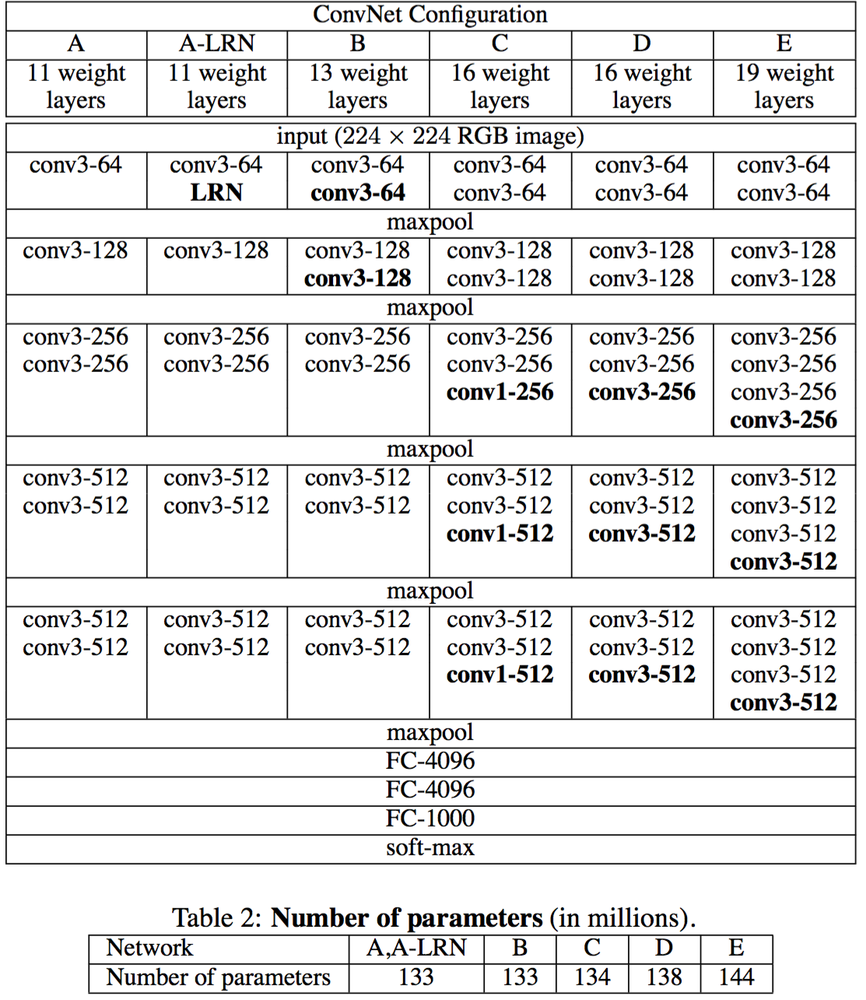

# TensorFlow —— CNN (VGGNet-16模型)

VGGNet-16模型:





参考《TensorFlow实现》实现：

```python
from datetime import datetime
import math
import time
import tensorflow as tf

batch_size = 32
num_batches = 100

# 定义卷积层
def conv_op(input_op, name, kh, kw, n_out, dh, dw, p):
    """
    :param input_op: # 输入
    :param name:
    :param kh: 卷积核高度
    :param kw: 卷积核宽度
    :param n_out: 输出通道数
    :param dh: 纵向步长
    :param dw: 横向步长
    :param p:
    :return:
    """
    n_in = input_op.get_shape()[-1].value # 输入通道数

    with tf.name_scope(name) as scope:
        kernal = tf.get_variable(
            scope + 'w', shape=[kh, kw, n_in, n_out],dtype=tf.float32,
            initializer=tf.contrib.layers.xavier_initializer_conv2d()
        )
        conv = tf.nn.conv2d(input_op, kernal, (1, dh, dw, 1), padding='SAME')
        biases = tf.Variable(tf.constant(0.0, shape=[n_out], dtype=tf.float32), trainable=True, name='b')
        activation = tf.nn.relu(tf.nn.bias_add(conv, biases))
        p += [kernal, biases]
        return activation

# 定义全连接层
def fc_op(input_op, name, n_out, p):
    n_in = input_op.get_shape()[-1].value

    with tf.name_scope(name) as scope:
        kernal = tf.get_variable(
            scope + 'w', shape=[n_in, n_out], dtype=tf.float32,
            initializer=tf.contrib.layers.xavier_initializer()
        )
        biases = tf.Variable(tf.constant(0.1, shape=[n_out], dtype=tf.float32), name='b')
        activation = tf.nn.relu_layer(input_op, kernal, biases, name=scope)
        p += [kernal, biases]
        return activation

# 定义最大池化层
def mpool_op(input_op, name, kh, kw, dh, dw):
    return tf.nn.max_pool(
        input_op, ksize=[1, kh, kw, 1],
        strides=[1, dh, dw, 1], padding='SAME', name=name
    )

def inference_op(input_op, keep_prob):

    p = []

    # 第一卷积层
    conv1_1 = conv_op(input_op, name='conv1_1', kh=3, kw=3, n_out=64, dh=1, dw=1, p=p)
    conv1_2 = conv_op(conv1_1, name='conv1_2', kh=3, kw=3, n_out=64, dh=1, dw=1, p=p)
    pool1 = mpool_op(conv1_2, name='pool1', kh=2, kw=2, dh=2, dw=2)

    # 第二卷积层
    conv2_1 = conv_op(pool1, name='conv2_1', kh=3, kw=3, n_out=128, dh=1, dw=1, p=p)
    conv2_2 = conv_op(conv2_1, name='conv2_2', kh=3, kw=3, n_out=128, dh=1, dw=1, p=p)
    pool2 = mpool_op(conv2_2, name='pool2', kh=2, kw=2, dh=2, dw=2)

    # 第三卷积层
    conv3_1 = conv_op(pool2, name='conv3_1', kh=3, kw=3, n_out=256, dh=1, dw=1, p=p)
    conv3_2 = conv_op(conv3_1, name='conv3_2', kh=3, kw=3, n_out=256, dh=1, dw=1, p=p)
    conv3_3 = conv_op(conv3_2, name='conv3_3', kh=3, kw=3, n_out=256, dh=1, dw=1, p=p)
    pool3 = mpool_op(conv3_3, name='pool3', kh=2, kw=2, dh=2, dw=2)

    # 第四卷积层
    conv4_1 = conv_op(pool3, name='conv4_1', kh=3, kw=3, n_out=512, dh=1, dw=1, p=p)
    conv4_2 = conv_op(conv4_1, name='conv4_2', kh=3, kw=3, n_out=512, dh=1, dw=1, p=p)
    conv4_3 = conv_op(conv4_2, name='conv4_3', kh=3, kw=3, n_out=512, dh=1, dw=1, p=p)
    pool4 = mpool_op(conv4_3, name='pool4', kh=2, kw=2, dh=2, dw=2)

    # 第五卷积层
    conv5_1 = conv_op(pool4, name='conv5_1', kh=3, kw=3, n_out=512, dh=1, dw=1, p=p)
    conv5_2 = conv_op(conv5_1, name='conv5_2', kh=3, kw=3, n_out=512, dh=1, dw=1, p=p)
    conv5_3 = conv_op(conv5_2, name='conv5_3', kh=3, kw=3, n_out=512, dh=1, dw=1, p=p)
    pool5 = mpool_op(conv5_3, name='pool5', kh=2, kw=2, dh=2, dw=2)

    # 卷积层输出结果扁平化
    shp = pool5.get_shape()
    flattened_shape = shp[1].value * shp[2].value * shp[3].value
    resh1 = tf.reshape(pool5, [-1, flattened_shape], name='resh1')

    # 第一全连接层
    fc6 = fc_op(resh1, name='fc6', n_out=4096, p=p)
    fc6_drop = tf.nn.dropout(fc6, keep_prob, name='fc6_drop')

    # 第二全连接层
    fc7 = fc_op(fc6_drop, name='fc7', n_out=4096, p=p)
    fc7_drop = tf.nn.dropout(fc7, keep_prob, name='fc7_drop')

    # 第三全连接层
    fc8 = fc_op(fc7_drop, name='fc8', n_out=1000, p=p)
    softmax = tf.nn.softmax(fc8)
    prediction = tf.argmax(softmax, 1)
    return prediction, softmax, fc8, p

def time_tensorflow_run(session, target, feed, info_string):
    num_steps_burn_in = 10
    total_duration = 0.0
    total_duration_squared = 0.0

    for i in range(num_batches + num_steps_burn_in):
        start_time = time.time()
        _ = session.run(target, feed_dict=feed)
        duration = time.time() - start_time
        if i >= num_steps_burn_in:
            if not i % 10:
                print("%s: step %d, duration = %.3f" % (datetime.now(), i - num_steps_burn_in, duration))
            total_duration += duration
            total_duration_squared += duration * duration

    mn = total_duration / num_batches
    vr = total_duration_squared / num_batches - mn * mn
    sd = math.sqrt(vr)
    print("%s: %s across %d steps, %.3f +/- %.3f sec / batch" % (datetime.now, info_string, num_batches, mn, sd))

def run_benchmark():
    with tf.Graph().as_default():
        image_size = 224
        images = tf.Variable(
            tf.random_normal([batch_size, image_size, image_size, 3], dtype=tf.float32, stddev=1e-1)
        )
        keep_prob = tf.placeholder(tf.float32)
        predictions, softmax, fc8, p = inference_op(images, keep_prob)
        sess = tf.InteractiveSession()
        tf.initialize_all_variables().run()
        time_tensorflow_run(sess, predictions, {keep_prob: 1.0}, 'Forward')
        objective = tf.nn.l2_loss(fc8)
        grad = tf.gradients(objective, p)
        time_tensorflow_run(sess, grad, {keep_prob: 0.5}, 'Forward-backward')

run_benchmark()
```