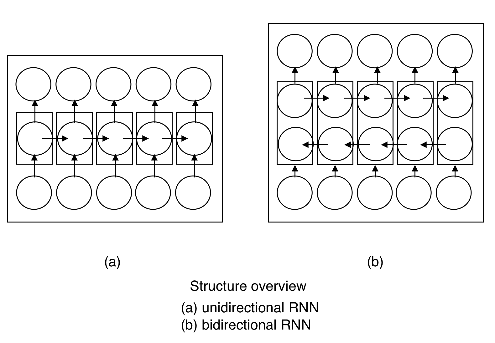

# TensorFlow —— RNN BiRNN

双向循环神经网络 (BiRNN: Bidirectional Recurrent Neural Network)




Bidirectional LSTM classifier 示例（参考《TensorFlow 实战》实现）：

```python
import tensorflow as tf
import numpy as np
from tensorflow.examples.tutorials.mnist import input_data
mnist = input_data.read_data_sets('../MNIST_data', one_hot=True)

learning_rate = 0.01
max_samples = 400000
batch_size = 128
display_step = 10 # 每间隔 10 次训练就展示一次训练情况

# MNIST 数据集的图片为 28x28
n_input = 28 # 输入为图像的宽 28
n_steps = 28 # LSTM 的展开步数，设置为图像的高 28
n_hidden = 256
n_classes = 10

# 和 CNN 中二维空间不同，这里的样本可以理解为一个时间序列，第一个维度是时间点 n_steps，第二个维度为每个时间点的数据 n_input
x = tf.placeholder("float", [None, n_steps, n_input])
y = tf.placeholder("float", [None, n_classes])

# 因为是双向 LSTM，有 forward 和 backward 两个 LSTM 的 cell，所以weights的第一个维度为 2 * n_hidden
weights = tf.Variable(tf.random_normal([2 * n_hidden, n_classes]))
biases = tf.Variable(tf.random_normal([n_classes]))

def BiRNN(x, weights, biases):

    # 把维度为 (batch_size, n_steps, n_input) 的输入变成长度为 n_steps的列表，而其中元素的维度为 (batch_size, n_input)
    x = tf.transpose(x, [1, 0, 2]) # 把第一个维度 batch_size 和第二个维度 n_steps 交换
    x = tf.reshape(x, [-1, n_input]) # 维度转换为 (n_steps * batch_size, n_input)
    x = tf.split(value=x, num_split=n_steps, split_dim=1) # 拆成长度为 n_steps的列表，列表中每个tensor的尺都是 (batch_size, n_input)

    lstm_fw_cell = tf.nn.rnn_cell.BasicLSTMCell(n_hidden, forget_bias=1.0) # forward LSTM 单元
    lstm_bw_cell = tf.nn.rnn_cell.BasicLSTMCell(n_hidden, forget_bias=1.0) # backward LSTM 单元

    outputs, _, _ = tf.nn.bidirectional_rnn(
        cell_fw=lstm_fw_cell, cell_bw=lstm_bw_cell, inputs=x, dtype=tf.float32)
    return tf.matmul(outputs[-1], weights) + biases


pred = BiRNN(x, weights, biases)
cost = tf.reduce_mean(tf.nn.softmax_cross_entropy_with_logits(logits=pred, labels=y))
optimizer = tf.train.AdamOptimizer(learning_rate=learning_rate).minimize(cost)
correct_pred = tf.equal(tf.argmax(pred, 1), tf.argmax(y, 1))
accuracy = tf.reduce_mean(tf.cast(correct_pred, tf.float32))

with tf.Session() as sess:
    tf.initialize_all_variables().run()
    step = 1
    while step * batch_size < max_samples:
        batch_x, batch_y = mnist.train.next_batch(batch_size)
        batch_x = batch_x.reshape((batch_size, n_steps, n_input))
        sess.run(optimizer, feed_dict={x: batch_x, y: batch_y})
        if step % display_step == 0:
            acc = sess.run(accuracy, feed_dict={x: batch_x, y: batch_y})
            loss = sess.run(cost, feed_dict={x: batch_x, y: batch_y})
            print("Iter " + str(step * batch_size) + ", Minibatch Loss = " +
                  "{:.6f}".format(loss) + ", Training Accuracy = " +
                  "{:.5f}".format(acc))
        step += 1
    print("Optimization Finished!")

    test_len = 10000
    test_data = mnist.test.images[:test_len].reshape({-1, n_steps, n_input})
    test_label = mnist.test.labels[:test_len]
    print("Testing Accuracy: ", sess.run(accuracy, feed_dict={x: test_data, y: test_label}))
```