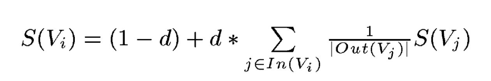
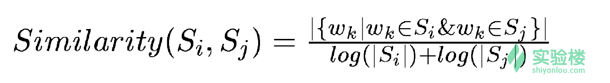
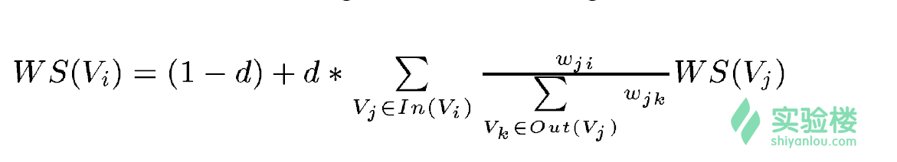

# Python 实现英文新闻摘要自动提取

## 主要思路

1. 给在文章中出现的单词按照算法计算出重要性
2. 按照句子中单词的重要性算出句子的总分
3. 按照句子的总分给文章中的每个句子排序
4. 取出前n个句子作为摘要

## 依赖

首先安装NLTK (Natural Language ToolKit):

```
$ sudo pip3 install nltk
```

先导入需要的包

```python
from nltk.tokenize import sent_tokenize, word_tokenize
from nltk.corpus import stopwords
from collections import defaultdict
from string import punctuation
from heapq import nlargest
```

- nltk.tokenize 是NLTK提供的分词工具包。所谓的分词 (tokenize) 实际就是把段落分成句子，把句子分成一个个单词的过程。导入的 sent_tokenize() 函数对应的是分段为句。 word_tokenize()函数对应的是分句为词
- stopwords 是一个列表，包含了英文中那些频繁出现的词，如am, is, are
- defaultdict 是一个带有默认值的字典容器
- puctuation 是一个列表，包含了英文中的标点和符号
- nlargest() 函数可以很快地求出一个容器中最大的n个数字

## 词频统计

```python
stopwords = set(stopwords.words('english') + list(punctuation))
max_cut = 0.9
min_cut = 0.1
```

stopwords包含的是日常生活中会遇到的出现频率很高的词，如do, I, am, is, are等等，这种词汇是不应该算是关键字。同样的标点符号（punctuation）也不能被算作是关键字。

max_cut 变量限制了在文本中出现重要性过高的词。就像在一些比赛中会去掉最高分和最低分一样，也需要去掉那些重要性过高和过低的词来提升算法的效果。

同理，min_cut 限制了出现频率过低的词。

```python
def compute_frequencies(word_sent):

    freq = defaultdict(int)
    # defaultdict和普通的dict的区别是它可以设default值
    # 参数是int默认值是0

    for s in word_sent:
        for word in s:
            if word not in stopwords:
                freq[word] += 1

    m = float(max(freq.values()))
    for key in list(freq.keys()):
        freq[key] /= m
        if freq[key] >= max_cut or freq[key] <= min_cut:
            del(freq[key])

    return freq
```

## 获得重要性前n的句子，即摘要

```python
def summerize(text, n):

    sents = sent_tokenize(text)
    assert n <= len(sents)

    words = [word_tokenize(s.lower()) for s in sents]
    freq = compute_frequencies(words)  # freq 是一个词和词重要性的字典
    rank = defaultdict(int)  # rank 则是句子和句子重要性的词典
    for i, sent in enumerate(words):
        for word in sent:
            if word in freq:
                rank[i] += freq[word]

    n_sent_index = nlargest(n, rank, key=rank.get)
    return [sents[i] for i in n_sent_index]
```

------

**code:**

```python
# -*- coding: utf-8 -*-
from nltk.tokenize import sent_tokenize, word_tokenize
from nltk.corpus import stopwords
from collections import defaultdict
from string import punctuation
from heapq import nlargest

stopwords = set(stopwords.words('english') + list(punctuation))  # 去除常用词和标点符号
max_cut = 0.9  # 限制频率过高的词
min_cut = 0.1  # 限制频率过低的词


def compute_frequencies(word_sent):

    freq = defaultdict(int)

    for s in word_sent:
        for word in s:
            if word not in stopwords:
                freq[word] += 1

    m = float(max(freq.values()))
    for key in list(freq.keys()):
        freq[key] /= m
        if freq[key] >= max_cut or freq[key] <= min_cut:
            del(freq[key])

    return freq


def summerize(text, n):

    sents = sent_tokenize(text)
    assert n <= len(sents)

    words = [word_tokenize(s.lower()) for s in sents]
    freq = compute_frequencies(words)  # freq 是一个词和词重要性的字典
    rank = defaultdict(int)  # rank 则是句子和句子重要性的词典
    for i, sent in enumerate(words):
        for word in sent:
            if word in freq:
                rank[i] += freq[word]

    n_sent_index = nlargest(n, rank, key=rank.get)
    return [sents[i] for i in n_sent_index]


if __name__ == '__main__':
    with open("news.txt", "r") as myfile:
        text = myfile.read().replace('\n', '')
    res = summerize(text, 2)
    for i in range(len(res)):
        print(res[i])
```


------


# TextRank 算法完成摘要提取

## PageRank算法



- Vi 代表的是每一个顶点，及页面
- d 代表的是一个阻尼常数 (0<d<1)，用来确保每一个页面都至少有 (1-d)的分数
- In(Vi) 代表的是推荐Vi的页面
- Out(Vi) 代表的是Vi推荐的页面
- |Out(Vi)| 代表的是Vi推荐页面的数量

每一个页面的分数 S(Vi) 都是依赖于别的页面的分数 S(Vj) 的。需要对每个页面的分数进行初始化。初始化的数字并不重要，因为通过数学可以证明初始化的值对于最终的结果并不影响，只不过会影响算法迭代的次数

## TextRank算法



- Si 代表的是第 i 个句子
- wk 代表的是句子中第 k 个单词
- |Si| 代表的是句子中单词的个数
- { wk| wk ∈ Si & wk ∈ Sj } 代表着同时在 Si 和 Sj 中出现的单词

根据这个就可以求出两个句子之间的相似度，也就是推荐程度

由此可以写出来类似PageRank中的邻接矩阵。

在此基础上，可以应用新的PageRank算法来完成分数的计算



- WS(Vi) 代表的是Vi这个页面的分数
- d 代表的是一个阻尼常数 (0<d<1)，用来确保每一个页面都至少有 (1-d)的分数
- In(Vi) 代表的是推荐Vi的页面
- Out(Vi) 代表的是Vi推荐的页面
- wji 代表的是 Vi 和 Vj 之间的相似度

## 计算相似性

```python
def calculate_simiarity(sent1, sent2):
    cnt = 0
    for w in sent1:
        if w in sent2:
            cnt += 1
    return cnt / (math.log(len(sent1)) + math.log(len(sent2)))
```

## 创建相似度邻接矩阵

```python
def create_graph(word_sent):
    num = len(word_sent)
    mat = [[0.0 for _ in range(num)] for _ in range(num)]
    for i, j in product(range(num), repeat=2):
        if i != j:
            mat[i][j] = calculate_simiarity(word_sent[i], word_sent[j])
    return mat
```

## 根据PageRank算法，算出句子分数

```python
# 判断前后分数有没有变化
def different(scores, old_scores):
    for i in range(len(scores)):
        if math.fabs(scores[i] - old_scores[i]) >= 0.0001:
            return True
    return False


# 根据公式求出指定句子的分数
def calculate_score(weight_graph, scores, i):

    length = len(weight_graph)
    d = 0.85
    added_score = 0.0

    for j in range(length):
        fraction = 0.0
        denominator = 0.0
        fraction = weight_graph[j][i] * scores[j]
        for k in range(length):
            denominator += weight_graph[j][k]
        added_score += fraction / denominator

    weighted_score = (1 - d) + d * added_score
    return weighted_score


# 输入相似度邻接矩阵, 返回各个句子的分数
def weighted_pagerank(weight_graph):
    # 把初始的分数值设置为0.5
    scores = [0.5 for _ in range(len(weight_graph))]
    old_scores = [0.0 for _ in range(len(weight_graph))]

    while different(scores, old_scores):
        for i in range(len(scores)):
            old_scores[i] = scores[i]
        for i in range(len(scores)):
            scores[i] = calculate_score(weight_graph, scores, i)

    return scores
```

## 找出分数最高的句子

```python
def Summarize(text, n):

    sents = sent_tokenize(text)
    word_sent = [word_tokenize(s.lower()) for s in sents]

    for i in range(len(word_sent)):
        for word in word_sent[i]:
            if word in stopwords:
                word_sent[i].remove(word)

    similarity_gragh = create_graph(word_sent)
    scores = weighted_pagerank(similarity_gragh)
    sent_selected = nlargest(n, zip(scores, count()))
    sent_index = []
    for i in range(n):
        sent_index.append(sent_selected[i][1])

    return [sents[i] for i in sent_index]
```

------

**code:**

```python
# -*- coding: utf-8 -*-
from nltk.tokenize import sent_tokenize, word_tokenize
from nltk.corpus import stopwords
import math
from itertools import product, count
from string import punctuation
from heapq import nlargest

stopwords = set(stopwords.words('english') + list(punctuation))


def calculate_simiarity(sent1, sent2):
    cnt = 0
    for w in sent1:
        if w in sent2:
            cnt += 1
    return cnt / (math.log(len(sent1)) + math.log(len(sent2)))


# 创建相似度邻接矩阵
def create_graph(word_sent):
    num = len(word_sent)
    mat = [[0.0 for _ in range(num)] for _ in range(num)]
    for i, j in product(range(num), repeat=2):
        if i != j:
            mat[i][j] = calculate_simiarity(word_sent[i], word_sent[j])
    return mat


# 判断前后分数有没有变化
def different(scores, old_scores):
    for i in range(len(scores)):
        if math.fabs(scores[i] - old_scores[i]) >= 0.0001:
            return True
    return False


# 根据公式求出指定句子的分数
def calculate_score(weight_graph, scores, i):

    length = len(weight_graph)
    d = 0.85
    added_score = 0.0

    for j in range(length):
        fraction = 0.0
        denominator = 0.0
        fraction = weight_graph[j][i] * scores[j]
        for k in range(length):
            denominator += weight_graph[j][k]
        added_score += fraction / denominator

    weighted_score = (1 - d) + d * added_score
    return weighted_score


# 输入相似度邻接矩阵, 返回各个句子的分数
def weighted_pagerank(weight_graph):
    # 把初始的分数值设置为0.5
    scores = [0.5 for _ in range(len(weight_graph))]
    old_scores = [0.0 for _ in range(len(weight_graph))]

    while different(scores, old_scores):
        for i in range(len(scores)):
            old_scores[i] = scores[i]
        for i in range(len(scores)):
            scores[i] = calculate_score(weight_graph, scores, i)

    return scores


def Summarize(text, n):

    sents = sent_tokenize(text)
    word_sent = [word_tokenize(s.lower()) for s in sents]

    for i in range(len(word_sent)):
        for word in word_sent[i]:
            if word in stopwords:
                word_sent[i].remove(word)

    similarity_gragh = create_graph(word_sent)
    scores = weighted_pagerank(similarity_gragh)
    sent_selected = nlargest(n, zip(scores, count()))
    sent_index = []
    for i in range(n):
        sent_index.append(sent_selected[i][1])

    return [sents[i] for i in sent_index]


if __name__ == '__main__':
    with open("news.txt", "r") as myfile:
        text = myfile.read().replace('\n' , '')
    print(Summarize(text, 2))
```
