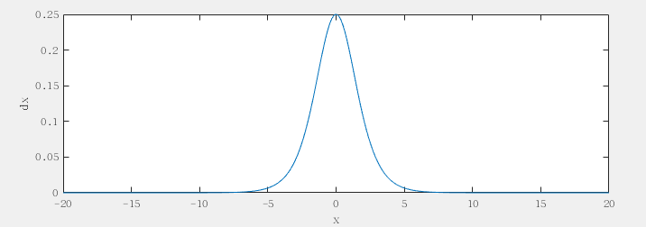
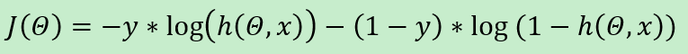

# 深度神经网络

## 前向传播算法和反向传播算法

```python
import numpy as np


class Sigmoid:
    def __init__(self):
        pass

    def sigmoid(self, x):
        return 1 / (1 + np.exp(x))

    def forward(self, x):
        self.x = x
        self.y = self.sigmoid(x)
        return self.y

    def backword(self):  # 这里sigmoid是最后一层，所以从这里开始反向计算梯度
        sig = self.sigmoid(self.x)
        self.dx = sig * (1 - sig)
        return self.dx


class FullyConnect:
    def __init__(self, l_x, l_y):
        """
        :param l_x: 输入层的长度
        :param l_y: 输出层的长度
        """
        self.weights = np.random.randn(l_y, l_x)
        self.bias = np.random.randn(l_y)

    def forward(self, x):
        self.x = x  # 把中间结果保存下来，以备反向传播时使用
        self.y = np.dot(self.weights, x) + self.bias
        return self.y

    def backward(self, d):
        self.dw = d * self.x  # 运用求导链式法则，将前面的网络层向后传递的导数值与本层的相关数值相乘，得到最后一层对本层参数的梯度
        self.db = d
        self.dx = d * self.weights  # 注意这里如果要继续反向传递梯度（如果后面还有别的层的话），backward()应该返回self.dx
        return self.dw, self.db


def main():
    fc = FullyConnect(2, 1)
    sigmoid = Sigmoid()
    x = np.array([[1], [2]])
    print('weights:', fc.weights, ' bias:', fc.bias, ' input: ', x)
    # 前向计算
    y1 = fc.forward(x)
    y2 = sigmoid.forward(y1)
    print('forward result: ', y2)
    # 反向传播
    d1 = sigmoid.backword()
    dx = fc.backward(d1)
    print('backward result: ', dx)


if __name__ == "__main__":
    main()
```


## 使用浅层神经网络识别图片中的英文字母

训练数据：

```
$ wget http://labfile.oss.aliyuncs.com/courses/814/data.tar.gz
$ tar zxvf data.tar.gz
```

解压之后，得到了一个文件夹`pic`和三个分别名为`train`、`validate`、`test`的`txt`格式文件，`pic`文件夹下一共有60000张图片，每张图片的尺寸为`17*17`，包含一个不等宽的大写英文字母。`train.txt`文件有40000行，每行的格式为"图片路径 标签"，代表一张有标签训练图片，`validate.txt`和`test.txt`文件格式与`train.txt`类似，且都包含10000行

### 预处理训练数据

`preprocess.py`

```python
# -*- coding: utf-8 -*-
import sys
from scipy import misc
import numpy as np


def main():
    l = len(sys.argv)
    if l < 2:  # 检查参数的数量是否足够
        print('eg: python img2pkl.py list.txt dst.npy\n' \
             'convert image to npy\n')
        return

    src = sys.argv[1]
    dst = sys.argv[2] if l > 2 else 'data.pkl'
    with open(src, 'r') as f:  # 读取图片列表
        list = f.readlines()

    data = []
    labels = []
    for i in list:
        name, label = i.strip('\n').split(' ')  # 将图片列表中的每一行拆分成图片名和图片标签
        print(name + ' processed')
        img = misc.imread(name)  # 将图片读取出来，存入一个矩阵
        img /= 255  # 将图片转换为只有0、1值的矩阵
        img.resize((img.size, 1))  # 为了之后的运算方便，将图片存储到一个img.size*1的列向量里面
        data.append(img)
        labels.append(int(label))

    print('write to npy')
    np.save(dst, [data, labels])  # 将训练数据以npy的形式保存到成本地文件
    print('completed')


if __name__ == '__main__':
    main()
```

### 数据层 && 一次处理一个batch的全连接层 && 激活函数层 && 损失函数层

```python
import numpy as np

class Data:
    def __init__(self, name, batch_size):
        with open(name, 'rb') as f:
            data = np.load(f)
        self.x = data[0]
        self.y = data[1]
        self.l = len(self.x)
        self.batch_size = batch_size
        self.pos = 0

    def forward(self):
        pos = self.pos
        bat = self.batch_size
        l = self.l
        if pos + bat >= l:
            ret = (self.x[pos:l], self.y[pos:l])
            self.pos = 0
            index = list(range(l))
            np.random.shuffle(index)
            self.x = self.x[index]
            self.y = self.y[index]
        else:
            ret = (self.x[pos:pos + bat], self.y[pos:pos + bat])
            self.pos += self.batch_size

        return ret, self.pos

    def backward(self, d):
        pass  # 数据层无反向传播操作


class FullyConnect:
    def __init__(self, l_x, l_y):
        self.weights = np.random.randn(l_y, l_x) / np.sqrt(l_x)
        self.bias = np.random.randn(l_y, 1)
        self.lr = 0

    def forward(self, x):
        self.x = x
        self.y = np.array([np.dot(self.weights, xx) + self.bias for xx in x])
        return self.y

    def backward(self, d):
        ddw = [np.dot(dd, xx.T) for dd, xx in zip(d, self.x)]
        self.dw = np.sum(ddw, axis=0) / self.x.shape[0]
        self.db = np.sum(d, axis=0) / self.x.shape[0]
        self.dx = np.array([np.dot(self.weights.T, dd) for dd in d])

        self.weights -= self.lr * self.dw
        self.bias -= self.lr * self.db
        return self.dx


class Sigmoid:
    def __init__(self):
        pass

    def sigmoid(self, x):
        return 1 / (1 + np.exp(-x))

    def forward(self, x):
        self.x = x
        self.y = self.sigmoid(x)
        return self.y

    def backward(self, d):
        sig = self.sigmoid(self.x)
        self.dx = d * sig * (1 - sig)
        return self.dx


class QuadraticLoss:
    def __init__(self):
        pass

    def forward(self, x, label):
        self.x = x
        self.label = np.zeros_like(x)
        for a, b in zip(self.label, label):
            a[b] = 1.0  # 只有正确标签所代表的位置概率为1，其他为0
        self.loss = np.sum(np.square(x - self.label)) / self.x.shape[0] / 2
        return self.loss

    def backward(self):
        self.dx = (self.x - self.label) / self.x.shape[0]
        return self.dx


class Accuracy:
    def __init__(self):
        pass

    def forward(self, x, label):
        self.accuracy = np.sum([np.argmax(xx) == ll for xx, ll in zip(x, label)])
        self.accuracy = 1.0 * self.accuracy / x.shape[0]
        return self.accuracy
```

## 构建浅层神经网络

`shallow.py`:

```python
import numpy as np
from layers import *

def main():
    datalayer1 = Data('train.npy', 1024)
    datalayer2 = Data('validate.npy', 10000)
    inner_layers = []
    inner_layers.append(FullyConnect(17 * 17, 26))
    inner_layers.append(Sigmoid())
    losslayer = QuadraticLoss()
    accuracy = Accuracy()

    for layer in inner_layers:
        layer.lr = 1000.0

    epochs = 20
    for i in range(epochs):
        print('epochs: ', i)
        losssum = 0
        iters = 0
        while True:
            # 正向计算
            data, pos = datalayer1.forward()
            x, label = data
            for layer in inner_layers:
                x = layer.forward(x)

            loss = losslayer.forward(x, label)
            losssum += loss
            iters += 1
            # 反向传播
            d = losslayer.backward()
            for layer in inner_layers[::-1]:
                d = layer.backward(d)

            if pos == 0:
                data, _ = datalayer2.forward()
                x, label = data
                for layer in inner_layers:
                    x = layer.forward(x)
                accu = accuracy.forward(x, label)
                print('loss: ', losssum / iters)
                print('accuracy: ', accu)
                break

if __name__ == '__main__':
    main()
```


## 增加网络深度

只需要在 `shallow.py` 中改动几行，增加一层隐含层，即使网络的深度更深了一层：

`shallow.py`:

```python
inner_layers.append(FullyConnect(17 * 17, 26))
inner_layers.append(Sigmoid())
```

`deep.py`:

```python
inner_layers.append(FullyConnect(17 * 17, 20))
inner_layers.append(Sigmoid())
inner_layers.append(FullyConnect(20, 26))
inner_layers.append(Sigmoid())
```


## 解决深度学习中梯度消失的问题

网络的深度增加，会导致准确率增长的缓慢，需要训练较多的epochs，深度神经网络的准确率才开始超过浅层神经网络

增大学习率，准确率增长缓慢的问题会得到缓解，但和之前浅层神经网络比起来还是慢了很多

主要问题出在Sigmoid层。Sigmoid层是这样反向传递梯度的



当输入为0时，sigmoid函数的导函数最大值为0.25，当输入数据的绝对值增大时，导函数值迅速减小，马上就会接近于0

这便是导致深度神经网络学习的更慢的“元凶”，由于这里多了一个Sigmoid层，梯度值经过Sigmoid层时，会减小很多，梯度就像是“消失了”（vanishing gradient），导致模型学习的非常慢

### 交叉熵损失函数



导函数:


> 这个导函数似乎有些复杂，但其实有一个非常巧妙有趣的巧合在这里，观察导函数的分母，这里的`h(theta,x)`就是从上一个`Sigmoid`层前向计算传过来的输出，而`Sigmoid`层之所以会导致梯度消失，是因为它反向传递梯度的过程中将梯度值乘以了一个非常小的数：`sigmoid(x)*(1-sigmoid(x))`，而`sigmoid(x)*(1-sigmoid(x))`就是`h(thera,x)*(1-h(theta,x))`，所以损失函数层反向传递时先除以`h(thera,x)*(1-h(theta,x))`，而`Sigmoid`层再乘以`sigmoid(x)*(1-sigmoid(x))`，两者刚好相互抵消，于是梯度就不会变小

`layers.py` 中新增交叉熵层：

```python
class CrossEntropyLoss:
    def __init__(self):
        pass

    def forward(self, x, label):
        self.x = x
        self.label = np.zeros_like(x)
        for a, b in zip(self.label, label):
            a[b] = 1.0
        self.loss = np.nan_to_num(
            -self.label * np.log(x) - ((1 - self.label) * np.log(1 - x)))  # np.nan_to_num()避免log(0)得到负无穷的情况
        self.loss = np.sum(self.loss) / x.shape[0]
        return self.loss

    def backward(self):
        self.dx = (self.x - self.label) / self.x / (1 - self.x)  # 分母会与Sigmoid层中的对应部分抵消，从而避免梯度消失问题
        return self.dx
```

`deep.py` 中用交叉熵替换之前的二次损失函数：

```python
losslayer = CrossEntropyLoss()

# 学习率此时设置为 1.0 即可
for layer in inner_layers:
        layer.lr = 1.0
```

**参考**：

- [使用python实现深度神经网络 1](http://blog.csdn.net/oxuzhenyi/article/details/73026790)
- [使用python实现深度神经网络 2](http://blog.csdn.net/oxuzhenyi/article/details/73026796)
- [使用python实现深度神经网络 3](http://blog.csdn.net/oxuzhenyi/article/details/73026799)
- [使用python实现深度神经网络 4](http://blog.csdn.net/oxuzhenyi/article/details/73026807)
- [使用python实现深度神经网络 5](http://blog.csdn.net/oxuzhenyi/article/details/73026811)