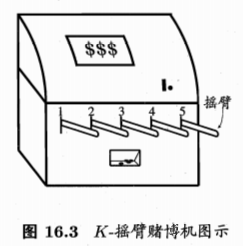

# 强化学习


## K-摇臂赌博机

单步强化学习任务对应了一个理论模型，即 `K-摇臂赌博机`

`K-摇臂赌博机`：如图所示，赌徒投入一个硬币后，选择一个摇杆，每个摇杆有一定的概率吐出硬币，这个概率赌徒并不知道，赌徒的目标就是通过找到一个策略来使自己在等量成本下，收益最大



`仅探索`：将所有的禅师机会平均分配给每个摇臂（即轮流按下每个摇臂），最后以每个摇臂各自的平均吐币概率作为其奖赏期望的近似估计

`仅利用`：按下目前最优的（即到目前为止平均奖赏最大的）摇臂，若有多个摇臂同为最优，则丛中随机选取一个

`仅探索` 法能很好的估计每个摇臂的奖赏，却会失去很多选择最优摇臂的机会；`仅利用` 法则相反，没有能够很好的估计摇臂期望奖赏，很可能经常选不到最优摇臂

## ϵ-贪心法

`ϵ-贪心法`：每次尝试时，以 `ϵ` 的概率进行探索，即以均匀概率随机选取一个摇臂；以 `1 - ϵ` 的概率进行利用，即选择当前平均奖赏最高的摇臂（若有多个，则随机选取一个）

伪代码：

```
输入：摇臂数 K;
      奖赏函数 R;
      尝试次数 T;
      探索概率 ϵ;
过程：
r = 0;
for i = 1, 2, ... K: Q(i) - 0, count(i) = 0;
for t = 1, 2, ... T do
    if rand() < ϵ then // 以 ϵ 的概率进行探索
        k = 从  1, 2, ... K 中以均匀分布随机选取;
    else // 以 (1 - ϵ) 的概率进行利用
        k = argmax Q(i);
    end if
    v = R(k); // 本次尝试的奖赏值
    r = r + v;
    Q(k) = [Q(k) * count(k) + v] / [count(k) + 1] // 更新平均奖赏
    count(k) = count(k) + 1;
end for
```

若摇臂奖赏的不确定性较大，例如概率分布较宽时，则需要更多的探索，此时需要较大的 `ϵ` 值；若摇臂的不确定性较小，例如概率分布比较集中时，则少量的尝试就能很好的近似真是奖赏，此时需要的 `ϵ` 较小，通常令 `ϵ` 去一个较小的常数，如 0.1 或 0.01


## softmax

```
输入：摇臂数 K;
      奖赏函数 R;
      尝试次数 T;
      探索概率 ϵ;
过程：
r = 0;
for i = 1, 2, ... K: Q(i) - 0, count(i) = 0;
for t = 1, 2, ... T do
    k = 从  1, 2, ... K 中以 Boltzmann 分布随机选取;
    v = R(k); // 本次尝试的奖赏值
    r = r + v;
    Q(k) = [Q(k) * count(k) + v] / [count(k) + 1] // 更新平均奖赏
    count(k) = count(k) + 1;
end for
```

## Q-Learning

