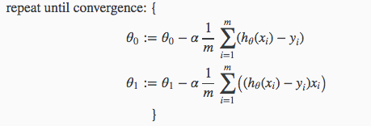

# 梯度下降

## Gradient Descent

```math
\theta_j := \theta_j - \alpha \frac{\partial}{\partial \theta_j} J(\theta_0, \theta_1)
```

## Gradient Descent For Linear Regression



where m is the size of the training set, θ0 a constant that will be changing simultaneously with θ1 and xi,yiare values of the given training set (data).