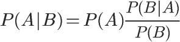
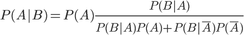

# 贝叶斯分类器 (Bayes Classifier)

**全概率公式：**

**P(B) = P(B|A) * P(A) + P(B|A') * p(A')**

它的含义是，如果 `A` 和 `A'` 构成样本空间的一个划分，那么事件 `B` 的概率，就等于 `A` 和 `A'` 的概率分别乘以 `B` 对这两个事件的条件概率之和

**条件概率公式：**

**P(A|B) = P(A) * [P(B|A) / P(B)]**



带入全概率公式可得：

**P(A|B) = P(A) * {p(B|A) / [P(B|A) * P(A) + P(B|~A) * P(~A)]}**



把 `P(A)` 称为 `“先验概率”`，即在 `B` 事件发生之前，对 `A` 事件概率的一个判断；

`P(A|B)` 称为 `“后验概率”`，即在 `B` 事件发生之后，对 `A` 事件概率的重新评估；

`P(B|A) / P(B)` 称为 `“可能性函数”`，这是一个调整因子，使得预估概率更接近真实概率；

所以，条件概率可以理解成下面的式子：

**后验概率　＝　先验概率 ｘ 调整因子**

在这里，如果 “可能性函数” `P(B|A) / P(B) > 1`，意味着“先验概率”被增强，事件 `A` 的发生的可能性变大；如果“可能性函数” `P(B|A) / P(B) = 1`，意味着 `B` 事件无助于判断事件 `A` 的可能性；如果“可能性函数” `P(B|A) / P(B) < 1`，意味着“先验概率”被削弱，事件 `A` 的可能性变小

参考：

[贝叶斯推断及其互联网应用（一）：定理简介](http://www.ruanyifeng.com/blog/2011/08/bayesian_inference_part_one.html)

[贝叶斯推断及其互联网应用（二）：过滤垃圾邮件](http://www.ruanyifeng.com/blog/2011/08/bayesian_inference_part_two.html)

[贝叶斯推断及其互联网应用（三）：拼写检查](http://www.ruanyifeng.com/blog/2012/10/spelling_corrector.html)

### 贝叶斯推断及其互联网应用（三）：拼写检查

参考：[贝叶斯推断及其互联网应用（三）：拼写检查](http://www.ruanyifeng.com/blog/2012/10/spelling_corrector.html)

用户输入了一个单词。这时分成两种情况：拼写正确，或者拼写不正确。把拼写正确的情况记做c（代表correct），拼写错误的情况记做w（代表wrong）。
所谓"拼写检查"，就是在发生w的情况下，试图推断出c。从概率论的角度看，就是已知w，然后在若干个备选方案中，找出可能性最大的那个c，也就是求下面这个式子的最大值

```
P(c|w)
```

根据贝叶斯定理：

```
P(c|w) = P(w|c) * P(c) / P(w)
```

对于所有备选的c来说，对应的都是同一个w，所以它们的`P(w)`是相同的，因此我们求的其实是

```
P(w|c) * P(c)
```

的最大值。

`P(c)`的含义是，某个正确的词的出现"概率"，它可以用"频率"代替。如果有一个足够大的文本库，那么这个文本库中每个单词的出现频率，就相当于它的发生概率。某个词的出现频率越高，P(c)就越大

`P(w|c)`的含义是，在试图拼写c的情况下，出现拼写错误w的概率。这需要统计数据的支持，但是为了简化问题，假设两个单词在字形上越接近，就有越可能拼错，P(w|C)就越大。举例来说，相差一个字母的拼法，就比相差两个字母的拼法，发生概率更高。想拼写单词hello，那么错误拼成hallo（相差一个字母）的可能性，就比拼成haallo高（相差两个字母）

所以，只要找到与输入单词在字形上最相近的那些词，再在其中挑出出现频率最高的一个，就能实现 P(w|c) * P(c) 的最大值

代码：

```python
import re, collections

# 用来取出文本库的每一个词
def words(text):
    return re.findall('[a-z]+', text.lower())

# 建立一个"字典"结构
# 文本库的每一个词，都是这个"字典"的键；所对应的值，就是这个词在文本库的出现频率
def train(features):
    """
    collections.defaultdict(lambda: 1)的意思是：每一个词的默认出现频率为1，这是针对那些没有出现在文本库的词
    如果一个词没有在文本库出现，我们并不能认定它就是一个不存在的词，因此将每个词出现的默认频率设为1
    以后每出现一次，频率就增加1
    """
    model = collections.defaultdict(lambda: 1)
    for f in features:
        model[f] += 1
    return model

# with open('big.txt', 'r') as f:
NWORDS = train(words(open('big.txt', 'r').read()))
alphabet = 'abcdefghijklmnopqrstuvwxyz'

# 用来生成所有与输入参数word的"编辑距离"为1的词
def edits1(word):
    # splits：将word依次按照每一位分割成前后两半。比如，'abc'会被分割成 [('', 'abc'), ('a', 'bc'), ('ab', 'c'), ('abc', '')]
    splits = [(word[:i], word[i:]) for i in range(len(word) + 1)]
    # beletes：依次删除word的每一位后、所形成的所有新词。比如，'abc'对应的deletes就是 ['bc', 'ac', 'ab']
    deletes = [a + b[1:] for a, b in splits if b]
    # transposes：依次交换word的邻近两位，所形成的所有新词。比如，'abc'对应的transposes就是 ['bac', 'acb']
    transposes = [a + b[1] + b[0] + b[2:] for a, b in splits if len(b) > 1]
    # replaces：将word的每一位依次替换成其他25个字母，所形成的所有新词。比如，'abc'对应的replaces就是 ['abc', 'bbc', 'cbc', ... , 'abx', ' aby', 'abz' ] ，一共包含78个词（26 × 3）
    replaces = [a + c + b[1:] for a, b in splits for c in alphabet if b]
    # inserts：在word的邻近两位之间依次插入一个字母，所形成的所有新词。比如，'abc' 对应的inserts就是['aabc', 'babc', 'cabc', ..., 'abcx', 'abcy', 'abcz']，一共包含104个词（26 × 4）
    inserts = [a + c + b for a, b in splits for c in alphabet]
    # 返回 deletes、transposes、replaces、inserts 的合集，这就是与 word "编辑距离"等于 1 的所有词。对于一个 n 位的词，会返回 54n + 25 个词
    return set(deletes + transposes + replaces + inserts)

# 用来生成所有与word的"编辑距离"为2的词语
# 直接将函数写成这样
# def edits2(word):
# 　　　　return set(e2 for e1 in edits1(word) for e2 in edits1(e1))
# 但是这样的话，会返回一个 (54n+25) * (54n+25) 的数组，实在是太大了
# 因此，将edit2()改为known_edits2()函数，将返回的词限定为在文本库中出现过的词
def known_edits2(word):
    return set(e2 for e1 in edits1(word) for e2 in edits1(e1) if e2 in NWORDS)

def know(words):
    return set(w for w in words if w in NWORDS)

# 从所有备选的词中，选出用户最可能想要拼写的词
def correct(word):
    candidates = know([word]) or know(edits1(word)) or known_edits2(word) or [word]
    return max(candidates, key=NWORDS.get)

if __name__ == '__main__':
    print(correct('speling')) # spelling
    print(correct('korrecter')) # corrected
```