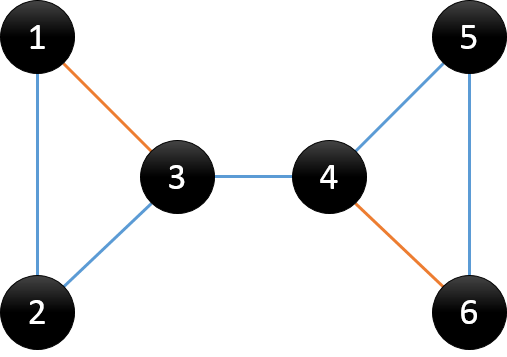

# 图的连通性 —— Tarjan算法

**割边**：在连通图中，删除了连通图的某条边后，图不再连通。这样的边被称为割边，也叫做桥。

**割点**：在连通图中，删除了连通图的某个点以及与这个点相连的边后，图不再连通。这样的点被称为割点。

**DFS搜索树**：用DFS对图进行遍历时，按照遍历次序的不同，我们可以得到一棵DFS搜索树。在上面例子中，得到的搜索树为：



树边：在搜索树中的蓝色线所示，可理解为在DFS过程中访问未访问节点时所经过的边，也称为父子边

回边：在搜索树中的橙色线所示，可理解为在DFS过程中遇到已访问节点时所经过的边，也称为返祖边、后向边

观察DFS搜索树，我们可以发现有两类节点可以成为割点：

对根节点`u`，若其有两棵或两棵以上的子树，则该根结点u为割点；

对非叶子节点`u`（非根节点），若其中的某棵子树的节点均没有指向u的祖先节点的回边，说明删除u之后，根结点与该棵子树的节点不再连通；则节点u为割点。

对于根结点，显然很好处理；但是对于非叶子节点，怎么去判断有没有回边是一个值得深思的问题。

我们用`dfn[u]`记录节点`u`在DFS过程中被遍历到的次序号，`low[u]`记录节点`u`或`u`的子树通过非父子边追溯到最早的祖先节点（即DFS次序号最小），那么`low[u]`的计算过程如下：


对于给的例子，其求出的dfn和low数组为：

```
id  1 2 3 4 5 6
dfn 1 2 3 4 5 6
low 1 1 1 4 4 4
```

可以发现，对于情况2，当`(u,v)`为树边且`low[v]≥dfn[u]`时，节点`u`才为割点。

而当`(u,v)`为树边且`low[v]>dfn[u]`时，表示`v`节点只能通过该边`(u,v)`与`u`连通，那么`(u,v)`即为割边。

```c
void dfs(int u) {
	//记录dfs遍历次序
	static int counter = 0;

	//记录节点u的子树数
	int children = 0;

	ArcNode *p = graph[u].firstArc;
	visit[u] = 1;

	//初始化dfn与low
	dfn[u] = low[u] = ++counter;

	for(; p != NULL; p = p->next) {
		int v = p->adjvex;

		//节点v未被访问，则(u,v)为树边
		if(!visit[v]) {
			children++;
			parent[v] = u;
			dfs(v);

			low[u] = min(low[u], low[v]);

			//case (1)
			if(parent[u] == NIL && children > 1) {
				printf("articulation point: %d\n", u);
			}

			//case (2)
			if(parent[u] != NIL && low[v] >= dfn[u]) {
				printf("articulation point: %d\n", u);
			}

			//bridge
			if(low[v] > dfn[u]) {
				printf("bridge: %d %d\n", u, v);
			}
		}
		//节点v已访问，则(u,v)为回边
		else if(v != parent[u]) {
			low[u] = min(low[u], dfn[v]);
		}
	}
}
```

## 强连通分量

其定义为：对于有向图上的2个点a,b，若存在一条从a到b的路径，也存在一条从b到a的路径，那么称a,b是强连通的。

对于有向图上的一个子图，若子图内任意点对(a,b)都满足强连通，则称该子图为强连通子图。

非强连通图有向图的极大强连通子图，称为强连通分量。

求强连通分量用Tarjan算法实现：

```c
tarjan(u)
{
    Dfn[u]=Low[u]=++Index                      // 为节点u设定次序编号和Low初值
    Stack.push(u)                              // 将节点u压入栈中
    for each (u, v) in E                       // 枚举每一条边
        if (v is not visted)                   // 如果节点v未被访问过
            tarjan(v)                          // 继续向下找
            Low[u] = min(Low[u], Low[v])
        else if (v in Stack)                   // 如果节点v还在栈内(很重要,无向图没有这一步)
            Low[u] = min(Low[u], Dfn[v])
    if (Dfn[u] == Low[u])                      // 如果节点u是强连通分量的根
        repeat
            v = Stack.pop                      // 将v退栈，为该强连通分量中一个顶点
            mark v                             // 标记v，同样通过栈来找连通分量
        until (u == v)
}
```