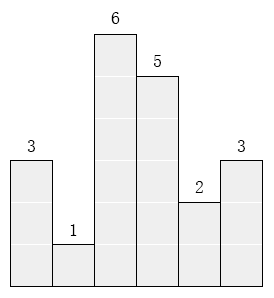

# CCF 201312

## CCF201312-1 出现次数最多的数

试题编号：	201312-1

试题名称：	出现次数最多的数

时间限制：	1.0s

内存限制：	256.0MB

**问题描述**：给定n个正整数，找出它们中出现次数最多的数。如果这样的数有多个，请输出其中最小的一个。

**输入格式**

输入的第一行只有一个正整数n(1 ≤ n ≤ 1000)，表示数字的个数。

输入的第二行有n个整数s1, s2, …, sn (1 ≤ si ≤ 10000, 1 ≤ i ≤ n)。相邻的数用空格分隔。

**输出格式**

输出这n个次数中出现次数最多的数。如果这样的数有多个，输出其中最小的一个。

**样例输入**

```
6
10 1 10 20 30 20
```

**样例输出**

```
10
```

```c
#include <iostream>
#include <map>
#include <algorithm>
using namespace std;

int main () {

	int n, num;
	cin >> n;
	map<int, int> times;
	while (n--) {
		cin >> num;
		if (times.find(num) == times.end()) times[num] = 1;
		else times[num]++;
	}
	int ans, max_times = 0;
	for (map<int, int>::iterator it = times.begin(); it != times.end(); it++) {
		if (it->second > max_times) {
			max_times = it->second;
			ans = it->first;
		} else if (it->second == max_times) {
			ans = min(ans, it->first);
		}
	}
	cout << ans << endl;

	return 0;
}
```


------


## CCF201312-2 ISBN号码

试题编号：	201312-2

试题名称：	ISBN号码

时间限制：	1.0s

内存限制：	256.0MB

**问题描述**：每一本正式出版的图书都有一个ISBN号码与之对应，ISBN码包括9位数字、1位识别码和3位分隔符，其规定格式如“x-xxx-xxxxx-x”，其中符号“-”是分隔符（键盘上的减号），最后一位是识别码，例如0-670-82162-4就是一个标准的ISBN码。ISBN码的首位数字表示书籍的出版语言，例如0代表英语；第一个分隔符“-”之后的三位数字代表出版社，例如670代表维京出版社；第二个分隔之后的五位数字代表该书在出版社的编号；最后一位为识别码。

识别码的计算方法如下：

首位数字乘以1加上次位数字乘以2……以此类推，用所得的结果mod 11，所得的余数即为识别码，如果余数为10，则识别码为大写字母X。例如ISBN号码0-670-82162-4中的识别码4是这样得到的：对067082162这9个数字，从左至右，分别乘以1，2，…，9，再求和，即0×1+6×2+……+2×9=158，然后取158 mod 11的结果4作为识别码。

编写程序判断输入的ISBN号码中识别码是否正确，如果正确，则仅输出“Right”；如果错误，则输出是正确的ISBN号码。

**输入格式**

输入只有一行，是一个字符序列，表示一本书的ISBN号码（保证输入符合ISBN号码的格式要求）。

**输出格式**

输出一行，假如输入的ISBN号码的识别码正确，那么输出“Right”，否则，按照规定的格式，输出正确的ISBN号码（包括分隔符“-”）。

**样例输入**

```
0-670-82162-4
```

**样例输出**

```
Right
```

**样例输入**

```
0-670-82162-0
```

**样例输出**

```
0-670-82162-4
```

```c
#include <iostream>
#include <string>
using namespace std;

int main () {

	string isbn;
	cin >> isbn;
	int sum = 0, w = 1;
	for (int i = 0; w < 10; i++) {
		if (isbn[i] == '-') continue;
		sum += (isbn[i] - '0') * w;
		w++;
	}
	sum %= 11;
	if (sum == isbn[isbn.length() - 1] - '0') cout << "Right" << endl;
	else {
		isbn[isbn.length() - 1] = sum + '0';
		cout << isbn << endl;
	}

	return 0;
}
```


------


## CCF201312-3 最大的矩形

试题编号：	201312-3

试题名称：	最大的矩形

时间限制：	1.0s

内存限制：	256.0MB

**问题描述**：在横轴上放了n个相邻的矩形，每个矩形的宽度是1，而第i（1 ≤ i ≤ n）个矩形的高度是hi。这n个矩形构成了一个直方图。例如，下图中六个矩形的高度就分别是3, 1, 6, 5, 2, 3。



请找出能放在给定直方图里面积最大的矩形，它的边要与坐标轴平行。对于上面给出的例子，最大矩形如下图所示的阴影部分，面积是10。


**输入格式**

第一行包含一个整数n，即矩形的数量(1 ≤ n ≤ 1000)。

第二行包含n 个整数h1, h2, … , hn，相邻的数之间由空格分隔。(1 ≤ hi ≤ 10000)。hi是第i个矩形的高度。

**输出格式**

输出一行，包含一个整数，即给定直方图内的最大矩形的面积。

**样例输入**

```
6
3 1 6 5 2 3
```

**样例输出**

```
10
```

```c
#include <iostream>
#include <vector>
#include <algorithm>
using namespace std;

int main () {

	int n, m;
	cin >> n;
	vector<int> v;
	for (int i = 0; i < n; i++) {
		cin >> m;
		v.push_back(m);
	}
	int max_area = 0;
	for (int i = 0; i < n; i++) {
		int min_height = v[i];
		for (int j = i; j < n; j++) {
			min_height = min(min_height, v[j]);
			max_area = max(max_area, min_height * (j - i + 1));
		}
	}
	cout << max_area << endl;

	return 0;
}
```


------


## CCF201312-4 有趣的数

试题编号：	201312-4

试题名称：	有趣的数

时间限制：	1.0s

内存限制：	256.0MB

**问题描述**：我们把一个数称为有趣的，当且仅当：

1. 它的数字只包含0, 1, 2, 3，且这四个数字都出现过至少一次。
2. 所有的0都出现在所有的1之前，而所有的2都出现在所有的3之前。
3. 最高位数字不为0。

因此，符合我们定义的最小的有趣的数是2013。除此以外，4位的有趣的数还有两个：2031和2301。

请计算恰好有n位的有趣的数的个数。由于答案可能非常大，只需要输出答案除以1000000007的余数。

**输入格式**

输入只有一行，包括恰好一个正整数n (4 ≤ n ≤ 1000)。

**输出格式**

输出只有一行，包括恰好n 位的整数中有趣的数的个数除以1000000007的余数。

**样例输入**

```
4
```

**样例输出**

```
3
```

参考 [CCF201312-4 有趣的数](http://blog.csdn.net/tigerisland45/article/details/55270910)

根据题意，有趣的数满足以下约束条件如下：

1. 只包含数字0、1、2和3
2. 0、1、2和3各自至少出现一次
3. 所有的0都出现在1之前
4. 所有的2都出现在3之前
5. 最高位数字不为0

数（字符串）可以分为以下六种情况（或称为状态）：

1. 只包含数字2，记为S1
2. 只包含数字2和0（0开始的数0个，以此数为前缀的数均不是以0开始），记为S2
3. 只包含数字2和3，并且满足所有2在3之前，记为S3
4. 只包含数字2、0和1，并且满足所有0在1之前，记为S4
5. 只包含数字2、0和3，并且满足所有2在3之前，记为S5
6. 包含任意数字（包含0、1、2和3），满足所有0在1之前，满足所有2在3之前，记为S6

考虑递推式：

1. 对于S1，考虑其长度l，定义f(l,S1)为长度l的S1数的数量，则f(l,S1)＝１。也就是说长度为l的只包含2的数只有1个。
2. 对于S2，考虑其长度l，定义f(l,S2)为长度l的S2数的数量，当l=1则那么f(l,S2)=0，即f(1,S2)=0，当l>1则f(l,S2)=f(l-1,S2)*2+f(l-1,S1)。这是因为，长度为l的S2数可以是由长度为l-1的S2的数加上2或0构成，例20为长度为2的S2数，那么202和200为长度为3的S2数；另外，长度为l的S2数可以是由长度为l-1的S1的数加上0构成，例如22为长度为2的S1数，那么220为长度为3的S2数。
3. 对于S3，考虑其长度l，定义f(l,S3)为长度l的S3数的数量，当l=1则那么f(l,S3)=0，即那么f(1,S3)=0，当l>1则f(l,S3)=f(l-1,S3)+f(l-1,S1)。这是因为，长度为l的S3数可以是由长度为l-1的S3的数加上2或3构成，例23为长度为2的S3数，那么232和233为长度为3的S3数；另外，长度为l的S3数可以是由长度为l-1的S1的数加上3构成，例如22为长度为2的S1数，那么223为长度为3的S3数。
4. 对于S4，考虑其长度l，定义f(l,S4)为长度l的S4数的数量，当l=1则那么f(l,S4)=0，即f(1,S4)=0，当l>1则f(l,S4)=f(l-1,S4)*2+f(l-1,S2)+f(l-1,S3)。这是因为，长度为l的S4数可以是由长度为l-1的S4的数加上2或1构成（满足所有0在1之前，不可以加上0），例201为长度为3的S4数，那么2012和2011为长度为4的S4数；另外，长度为l的S4数可以是由长度为l-1的S2的数加上1构成，例如20为长度为2的S2数，那么201为长度为3的S4数。

同理，对于S5和S6，可以得到相应的递推公式。详细参见以下的源程序。

有了递推式，程序就可以根据递推式，逐步进行计算。

```c
#include <iostream>
#include <vector>
using namespace std;
const int MOD = 1000000007;

int main () {

	int n;
	cin >> n;
	vector<vector<int>> dp(n + 1, vector<int>(6, 0));

	dp[1][0] = 1;
	for (int i = 2; i <= n; i++) {
		dp[i][0] = 1;
		dp[i][1] = (2 * dp[i - 1][1] + dp[i - 1][0]) % MOD;
		dp[i][2] = (dp[i - 1][2] + dp[i - 1][0]) % MOD;
		dp[i][3] = (2 * dp[i - 1][3] + dp[i - 1][1]) % MOD;
		dp[i][4] = (2 * dp[i - 1][4] + dp[i - 1][1] + dp[i - 1][2]) % MOD;
		dp[i][5] = (2 * dp[i - 1][5] + dp[i - 1][4] + dp[i - 1][3]) % MOD;
	}

	cout << dp[n][5] << endl;

	return 0;
}
```


------


## CCF201312-5 I’m stuck!

试题编号：	201312-5

试题名称：	I’m stuck!

时间限制：	1.0s

内存限制：	256.0MB

**问题描述**：给定一个R行C列的地图，地图的每一个方格可能是'#', '+', '-', '|', '.', 'S', 'T'七个字符中的一个，分别表示如下意思：

'#': 任何时候玩家都不能移动到此方格；

'+': 当玩家到达这一方格后，下一步可以向上下左右四个方向相邻的任意一个非'#'方格移动一格；

'-': 当玩家到达这一方格后，下一步可以向左右两个方向相邻的一个非'#'方格移动一格；

'|': 当玩家到达这一方格后，下一步可以向上下两个方向相邻的一个非'#'方格移动一格；

'.': 当玩家到达这一方格后，下一步只能向下移动一格。如果下面相邻的方格为'#'，则玩家不能再移动；

'S': 玩家的初始位置，地图中只会有一个初始位置。玩家到达这一方格后，下一步可以向上下左右四个方向相邻的任意一个非'#'方格移动一格；

'T': 玩家的目标位置，地图中只会有一个目标位置。玩家到达这一方格后，可以选择完成任务，也可以选择不完成任务继续移动。如果继续移动下一步可以向上下左右四个方向相邻的任意一个非'#'方格移动一格。

此外，玩家不能移动出地图。

请找出满足下面两个性质的方格个数：

1. 玩家可以从初始位置移动到此方格；
2. 玩家不可以从此方格移动到目标位置。

**输入格式**

输入的第一行包括两个整数R 和C，分别表示地图的行和列数。(1 ≤ R, C ≤ 50)。

接下来的R行每行都包含C个字符。它们表示地图的格子。地图上恰好有一个'S'和一个'T'。

**输出格式**

如果玩家在初始位置就已经不能到达终点了，就输出“I'm stuck!”（不含双引号）。否则的话，输出满足性质的方格的个数。

**样例输入**

```
5 5
--+-+
..|#.
..|##
S-+-T
####.
```

**样例输出**

```
2
```

**样例说明**

如果把满足性质的方格在地图上用'X'标记出来的话，地图如下所示：

```
--+-+
..|#X
..|##
S-+-T
####X
```
　　
```c
#include <iostream>
#include <string>
#include <vector>
using namespace std;

struct Direct {
	int x, y;
	Direct(int x, int y): x(x), y(y) {};
};

Direct d1[4] = { Direct(-1, 0), Direct(1, 0), Direct(0, 1), Direct(0, -1) };
Direct d2[2] = { Direct(-1, 0), Direct(1, 0) };
Direct d3[2] = { Direct(0, 1), Direct(0, -1) };
Direct d4[1] = { Direct(1, 0) };

bool isValid (int x, int y, int n, int m) {
	if (0 <= x && x < m && 0 <= y && y < n) return true;
	else return false;
}

void dfs (vector<vector<char>> G, vector<vector<bool>> &vis, int x, int y) {
	vis[y][x] = true;
	int n = G.size();
	int m = G[0].size();
	if (y == 3 && x == 4) {
		int a = 0;
	}
	if (G[y][x] == '+' || G[y][x] == 'S' || G[y][x] == 'T') {
		for (int i = 0; i < 4; i++) {
			int next_x = x + d1[i].x, next_y = y + d1[i].y;
			if (isValid(next_x, next_y, n, m) && !vis[next_y][next_x] && G[next_y][next_x] != '#')
				dfs(G, vis, next_x, next_y);
		}
	} else if (G[y][x] == '-') {
		for (int i = 0; i < 2; i++) {
			int next_x = x + d2[i].x, next_y = y + d2[i].y;
			if (isValid(next_x, next_y, n, m) && !vis[next_y][next_x] && G[next_y][next_x] != '#')
				dfs(G, vis, next_x, next_y);
		}

	} else if (G[y][x] == '|') {
		for (int i = 0; i < 2; i++) {
			int next_x = x + d3[i].x, next_y = y + d3[i].y;
			if (isValid(next_x, next_y, n, m) && !vis[next_y][next_x] && G[next_y][next_x] != '#')
				dfs(G, vis, next_x, next_y);
		}
	} else if (G[y][x] == '.') {
		for (int i = 0; i < 1; i++) {
			int next_x = x + d4[i].x, next_y = y + d4[i].y;
			if (isValid(next_x, next_y, n, m) && !vis[next_y][next_x] && G[next_y][next_x] != '#')
				dfs(G, vis, next_x, next_y);
		}
	}
}

int main () {

	freopen("data5.txt", "r", stdin);
	int n, m, start_x, start_y, dest_x, dest_y;
	string line;
	cin >> n >> m;
	vector<vector<char>> G(n, vector<char>(m));
	for (int i = 0; i < n; i++) {
		cin >> line;
		for (int j = 0; j < m; j++) {
			G[i][j] = line[j];
			if (line[j] == 'S') { start_x = j; start_y = i; }
			if (line[j] == 'T') { dest_x = j; dest_y = i; }
		}
	}

	vector<vector<bool>> vis(n, vector<bool>(m, false));
	dfs(G, vis, start_x, start_y);

	vector<vector<bool>> vis_cpy(vis);
	int count = 0;
	if (vis_cpy[dest_y][dest_x]) {
		for (int i = 0; i < n; i++) {
			for (int j = 0; j < m; j++) {
				if (vis_cpy[i][j]) {
					fill(vis.begin(), vis.end(), vector<bool>(m, false));
					dfs(G, vis, j, i);
					if (!vis[dest_y][dest_y])
						count++;
				}
			}
		}
		cout << count << endl;
	} else {
		cout << "I'm stuck!" << endl;
	}

	return 0;
}
```
