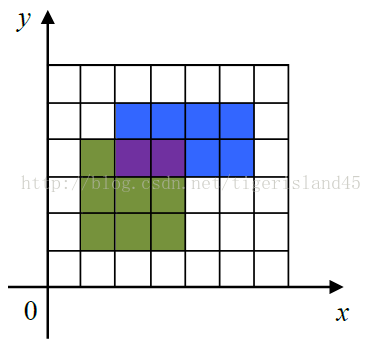
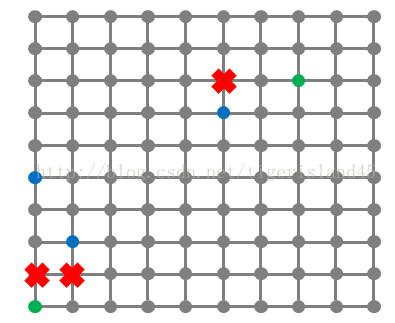
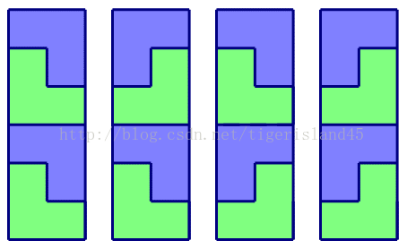

# CCF 201409

## CCF201409-1 相邻数对

试题编号：	201409-1

试题名称：	相邻数对

时间限制：	1.0s

内存限制：	256.0MB

**问题描述**：给定n个不同的整数，问这些数中有多少对整数，它们的值正好相差1。

**输入格式**

输入的第一行包含一个整数n，表示给定整数的个数。

第二行包含所给定的n个整数。

**输出格式**

输出一个整数，表示值正好相差1的数对的个数。

**样例输入**

```
6
10 2 6 3 7 8
```

**样例输出**

```
3
```

**样例说明**

值正好相差1的数对包括(2, 3), (6, 7), (7, 8)。
评测用例规模与约定

1<=n<=1000，给定的整数为不超过10000的非负整数。

```c
#include <iostream>
#include <vector>
#include <algorithm>
using namespace std;

int main () {

	int n, num;
	cin >> n;
	vector<int> v;
	while (n--) { cin >> num; v.push_back(num); }
	sort(v.begin(), v.end());
	int result = 0;
	for (int i = 1; i < v.size(); i++) {
		if (v[i] == v[i - 1] + 1) result++;
	}
	cout << result << endl;

	return 0;
}
```


------


## CCF201409-2 画图

试题编号：	201409-2

试题名称：	画图

时间限制：	1.0s

内存限制：	256.0MB

**问题描述**：在一个定义了直角坐标系的纸上，画一个(x1,y1)到(x2,y2)的矩形指将横坐标范围从x1到x2，纵坐标范围从y1到y2之间的区域涂上颜色。

下图给出了一个画了两个矩形的例子。第一个矩形是(1,1) 到(4, 4)，用绿色和紫色表示。第二个矩形是(2, 3)到(6, 5)，用蓝色和紫色表示。图中，一共有15个单位的面积被涂上颜色，其中紫色部分被涂了两次，但在计算面积时只计算一次。在实际的涂色过程中，所有的矩形都涂成统一的颜色，图中显示不同颜色仅为说明方便。



给出所有要画的矩形，请问总共有多少个单位的面积被涂上颜色。

**输入格式**

输入的第一行包含一个整数n，表示要画的矩形的个数。

接下来n行，每行4个非负整数，分别表示要画的矩形的左下角的横坐标与纵坐标，以及右上角的横坐标与纵坐标。

**输出格式**

输出一个整数，表示有多少个单位的面积被涂上颜色。

**样例输入**

```
2
1 1 4 4
2 3 6 5
```

**样例输出**

```
15
```

**评测用例规模与约定**

1<=n<=100，0<=横坐标、纵坐标<=100。

```c
#include <iostream>
#include <algorithm>
const int MAXN = 101;
using namespace std;
int rect[MAXN][MAXN];

int main () {

	int n, x1, x2, y1, y2;
	cin >> n;
	int count = 0;
	memset(rect, 0, sizeof(rect));
	while (n--) {
		cin >> x1 >> y1 >> x2 >> y2;
		for (int i = y1; i < y2; i++) {
			for (int j = x1; j < x2; j++) {
				if (rect[i][j] == 0) {
					rect[i][j] = 1;
					count++;
				}
			}
		}
	}
	cout << count << endl;

	return 0;
}
```


------


## CCF201409-3 字符串匹配

试题编号：	201409-3

试题名称：	字符串匹配

时间限制：	1.0s

内存限制：	256.0MB

**问题描述**：给出一个字符串和多行文字，在这些文字中找到字符串出现的那些行。你的程序还需支持大小写敏感选项：当选项打开时，表示同一个字母的大写和小写看作不同的字符；当选项关闭时，表示同一个字母的大写和小写看作相同的字符。

**输入格式**

输入的第一行包含一个字符串S，由大小写英文字母组成。

第二行包含一个数字，表示大小写敏感的选项，当数字为0时表示大小写不敏感，当数字为1时表示大小写敏感。

第三行包含一个整数n，表示给出的文字的行数。

接下来n行，每行包含一个字符串，字符串由大小写英文字母组成，不含空格和其他字符。

**输出格式**

输出多行，每行包含一个字符串，按出现的顺序依次给出那些包含了字符串S的行。

**样例输入**

```
Hello
1
5
HelloWorld
HiHiHelloHiHi
GrepIsAGreatTool
HELLO
HELLOisNOTHello
```

**样例输出**

```
HelloWorld
HiHiHelloHiHi
HELLOisNOTHello
```

**样例说明**

在上面的样例中，第四个字符串虽然也是Hello，但是大小写不正确。如果将输入的第二行改为0，则第四个字符串应该输出。

**评测用例规模与约定**

1<=n<=100，每个字符串的长度不超过100。
　　
```c
#include <iostream>
#include <string>
using namespace std;

char to_lower_case (char c) {
	if (65 <= c && c <= 90) return c + 'a' - 'A';
}

bool match (string str, string pattern, bool flag) {
	int i = 0, j = 0;
	while (i < str.length() && j < pattern.length()) {
		if (str[i] == pattern[j]) { i++; j++; }
		else if (!flag && to_lower_case(str[i]) == to_lower_case(pattern[j])) { i++; j++; }
		else { i = i - j + 1; j = 0; }
	}
	if (j == pattern.length()) return true;
	else return false;
}

int main () {

	string pattern, str;
	int flag, n;
	cin >> pattern;
	cin >> flag >> n;
	while (n--) {
		cin >> str;
		if (match(str, pattern, flag))
			cout << str << endl;
	}

	return 0;
}
```


------


## CCF201409-4 最优配餐

试题编号：	201409-4

试题名称：	最优配餐

时间限制：	1.0s

内存限制：	256.0MB

问题描述：栋栋最近开了一家餐饮连锁店，提供外卖服务。随着连锁店越来越多，怎么合理的给客户送餐成为了一个急需解决的问题。

栋栋的连锁店所在的区域可以看成是一个n×n的方格图（如下图所示），方格的格点上的位置上可能包含栋栋的分店（绿色标注）或者客户（蓝色标注），有一些格点是不能经过的（红色标注）。

方格图中的线表示可以行走的道路，相邻两个格点的距离为1。栋栋要送餐必须走可以行走的道路，而且不能经过红色标注的点。



送餐的主要成本体现在路上所花的时间，每一份餐每走一个单位的距离需要花费1块钱。每个客户的需求都可以由栋栋的任意分店配送，每个分店没有配送总量的限制。

现在你得到了栋栋的客户的需求，请问在最优的送餐方式下，送这些餐需要花费多大的成本。

**输入格式**

输入的第一行包含四个整数n, m, k, d，分别表示方格图的大小、栋栋的分店数量、客户的数量，以及不能经过的点的数量。

接下来m行，每行两个整数xi, yi，表示栋栋的一个分店在方格图中的横坐标和纵坐标。

接下来k行，每行三个整数xi, yi, ci，分别表示每个客户在方格图中的横坐标、纵坐标和订餐的量。（注意，可能有多个客户在方格图中的同一个位置）

接下来d行，每行两个整数，分别表示每个不能经过的点的横坐标和纵坐标。

**输出格式**

输出一个整数，表示最优送餐方式下所需要花费的成本。

**样例输入**

```
10 2 3 3
1 1
8 8
1 5 1
2 3 3
6 7 2
1 2
2 2
6 8
```

**样例输出**

```
29
```

**评测用例规模与约定**

前30%的评测用例满足：1<=n <=20。

前60%的评测用例满足：1<=n<=100。

所有评测用例都满足：1<=n<=1000，1<=m, k, d<=n^2。可能有多个客户在同一个格点上。每个客户的订餐量不超过1000，每个客户所需要的餐都能被送到。

```c
#include <iostream>
#include <vector>
#include <queue>
#include <algorithm>
using namespace std;

struct Coord {
	int x, y, dis;
	Coord(int x, int y, int dis): x(x), y(y), dis(dis) {}
};

struct Direct {
	int row, col;
} directs[4] = { { -1, 0 }, { 1, 0 }, { 0, -1 }, { 0, 1 }};

bool isValid (int x, int y, int n) {
	if (x > n || y > n || x <= 0 || y <= 0) return false;
	else return true;
}

queue<Coord> q;
vector<pair<int, int>> users;
int user_num = 0;

int bfs (vector<vector<int>> grid, vector<vector<bool>> vis) {
	int n = grid.size() - 1;
	int min_cost = 0;
	while (!q.empty()) {
		Coord front = q.front();
		q.pop();
		for (int i = 0; i < 4; i++) {
			Direct dir = directs[i];
			int x = front.x + dir.row;
			int y = front.y + dir.col;
			int dis = front.dis + 1;
			if (!isValid(x, y, n) || vis[x][y] || grid[x][y] == -1) continue;
			vis[x][y] = true;
			if (grid[x][y] > 0) {
				min_cost += dis * grid[x][y];
				if (--user_num == 0) return min_cost;
			}
			q.push(Coord(x, y, dis));
		}
	}
	return min_cost;
}


int main () {

	int n, m, k, d, x, y, c;
	cin >> n >> m >> k >> d;
	vector<vector<int>> grid(n + 1, vector<int>(n + 1, 0));
	vector<vector<bool>> vis(n + 1, vector<bool>(n + 1, false));
	while (m--) {
		cin >> x >> y;
		q.push(Coord(x, y, 0));
		vis[x][y] = true;
	}
	while (k--) {
		cin >> x >> y >> c;
		grid[x][y] += c;
		users.push_back(make_pair(x, y));
		user_num++;
	}
	while (d--) {
		cin >> x >> y;
		grid[x][y] = -1;
	}

	cout << bfs(grid, vis) << endl;

	return 0;
}
```


------


## CCF201409-5 拼图

试题编号：	201409-5

试题名称：	拼图

时间限制：	3.0s

内存限制：	256.0MB

**问题描述**：给出一个n×m的方格图，现在要用如下L型的积木拼到这个图中，使得方格图正好被拼满，请问总共有多少种拼法。其中，方格图的每一个方格正好能放积木中的一块。积木可以任意旋转。

**输入格式**

输入的第一行包含两个整数n, m，表示方格图的大小。

**输出格式**

输出一行，表示可以放的方案数，由于方案数可能很多，所以请输出方案数除以1,000,000,007的余数。

**样例输入**

```
6 2
```

**样例输出**

```
4
```

**样例说明**

四种拼法如下图所示：



**评测用例规模与约定**

在评测时将使用10个评测用例对你的程序进行评测。

评测用例1和2满足：1<=n<=30，m=2。

评测用例3和4满足：1<=n, m<=6。

评测用例5满足：1<=n<=100，1<=m<=6。

评测用例6和7满足：1<=n<=1000，1<=m<=6。

评测用例8、9和10满足：1<=n<=10^15，1<=m<=7。

```c

```
