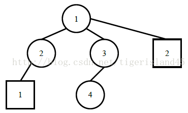
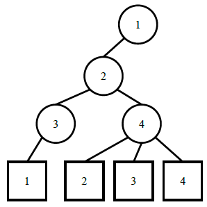

# CCF 201503

## CCF201503-1 图像旋转

试题编号：	201503-1

试题名称：	图像旋转

时间限制：	5.0s

内存限制：	256.0MB

**问题描述**：旋转是图像处理的基本操作，在这个问题中，你需要将一个图像逆时针旋转90度。

计算机中的图像表示可以用一个矩阵来表示，为了旋转一个图像，只需要将对应的矩阵旋转即可。

**输入格式**

输入的第一行包含两个整数n, m，分别表示图像矩阵的行数和列数。

接下来n行每行包含m个整数，表示输入的图像。

**输出格式**

输出m行，每行包含n个整数，表示原始矩阵逆时针旋转90度后的矩阵。

**样例输入**

```
2 3
1 5 3
3 2 4
```

**样例输出**

```
3 4
5 2
1 3
```

**评测用例规模与约定**

1 ≤ n, m ≤ 1,000，矩阵中的数都是不超过1000的非负整数。

```c
#include <iostream>
#include <vector>
using namespace std;

int main (int argc, const char * argv[]) {

	int n, m, d;
	cin >> n >> m;
	vector<vector<int>> mat(n, m);
	for (int i = 0; i < n; i++) {
		for (int j = 0; j < m; j++) {
			cin >> d;
			mat[i][j] = d;
		}
	}
	for (int j = m - 1; j >= 0; j--) {
		for (int i = 0; i < n; i++) {
			cout << mat[i][j] << " ";
		}
		cout << endl;
	}

	return 0;
}
```


------


## CCF201503-2 数字排序

试题编号：	201503-2

试题名称：	数字排序

时间限制：	1.0s

内存限制：	256.0MB

**问题描述**：给定n个整数，请统计出每个整数出现的次数，按出现次数从多到少的顺序输出。

**输入格式**

输入的第一行包含一个整数n，表示给定数字的个数。

第二行包含n个整数，相邻的整数之间用一个空格分隔，表示所给定的整数。

**输出格式**

输出多行，每行包含两个整数，分别表示一个给定的整数和它出现的次数。按出现次数递减的顺序输出。如果两个整数出现的次数一样多，则先输出值较小的，然后输出值较大的。

**样例输入**

```
12
5 2 3 3 1 3 4 2 5 2 3 5
```

**样例输出**

```
3 4
2 3
5 3
1 1
4 1
```

**评测用例规模与约定**

1 ≤ n ≤ 1000，给出的数都是不超过1000的非负整数。

```c
#include <iostream>
#include <vector>
#include <map>
#include <algorithm>
using namespace std;

bool cmp (pair<int, int> a, pair<int, int> b) {
	if (a.second != b.second) return a.second > b.second;
	else return a.first < b.first;
}

int main (int argc, const char * argv[]) {

	int n, num;
	cin >> n;
	map<int, int> hashmap;
	while (n--) {
		cin >> num;
		if (hashmap.find(num) == hashmap.end()) hashmap[num] = 1;
		else hashmap[num]++;
	}
	vector<pair<int, int>> v;
	for (map<int, int>::iterator it = hashmap.begin(); it != hashmap.end(); it++)
		v.push_back(make_pair(it->first, it->second));
	sort(v.begin(), v.end(), cmp);
	for (int i = 0; i < v.size(); i++)
		cout << v[i].first << " " << v[i].second << endl;

	return 0;
}
```


------


## CCF201503-3 节日

试题编号：	201503-3

试题名称：	节日

时间限制：	1.0s

内存限制：	256.0MB

**问题描述**：有一类节日的日期并不是固定的，而是以“a月的第b个星期c”的形式定下来的，比如说母亲节就定为每年的五月的第二个星期日。

现在，给你a，b，c和y1, y2(1850 ≤ y1, y2 ≤ 2050)，希望你输出从公元y1年到公元y2年间的每年的a月的第b个星期c的日期。

提示：关于闰年的规则：年份是400的整数倍时是闰年，否则年份是4的倍数并且不是100的倍数时是闰年，其他年份都不是闰年。例如1900年就不是闰年，而2000年是闰年。

为了方便你推算，已知1850年1月1日是星期二。

**输入格式**

输入包含恰好一行，有五个整数a, b, c, y1, y2。其中c=1, 2, ……, 6, 7分别表示星期一、二、……、六、日。

**输出格式**

对于y1和y2之间的每一个年份，包括y1和y2，按照年份从小到大的顺序输出一行。

如果该年的a月第b个星期c确实存在，则以"yyyy/mm/dd"的格式输出，即输出四位数的年份，两位数的月份，两位数的日期，中间用斜杠“/”分隔，位数不足时前补零。

如果该年的a月第b个星期c并不存在，则输出"none"（不包含双引号)。

**样例输入**

```
5 2 7 2014 2015
```

**样例输出**

```
2014/05/11
2015/05/10
```

**评测用例规模与约定**

所有评测用例都满足：1 ≤ a ≤ 12，1 ≤ b ≤ 5，1 ≤ c ≤ 7，1850 ≤ y1, y2 ≤ 2050。

```c
#include <iostream>
#include <string>
using namespace std;

int days_of_month[13] = { 0, 31, 28, 31, 30, 31, 30, 31, 31, 30, 31, 30, 31 };

bool isLeapYear (int year) {
    if (year % 4 == 0 && (year % 100 != 0 || year % 400 == 0)) return true;
    else return false;
}

string format (int num) {
    if (num < 10) return "0" + to_string(num);
    else return to_string(num);
}

int main (int argc, const char * argv[]) {

    int a, b, c, y1, y2;
    cin >> a >> b >> c >> y1 >> y2;
    int total_days = 0, temp, day;
    for (int i = 1850; i < y1; i++)
        total_days += isLeapYear(i) ? 366 : 365;
    for (int i = y1; i <= y2; i++) {
        temp = total_days;
        total_days += isLeapYear(i) ? 366 : 365;
        for (int j = 1; j < a; j++)
            temp += (j == 2 && isLeapYear(i)) ? 29 : days_of_month[j];
        temp = (temp + 1) % 7 + 1;
        if (temp <= c) day = (b - 1) * 7 + (c - temp + 1);
        else day = b * 7 + (temp - c + 1);
        cout << i << "/" << format(a) << "/" << format(day) << endl;
    }

    return 0;
}
```


------


## CCF201503-4 网络延时

试题编号：	201503-4

试题名称：	网络延时

时间限制：	1.0s

内存限制：	256.0MB

**问题描述**：给定一个公司的网络，由n台交换机和m台终端电脑组成，交换机与交换机、交换机与电脑之间使用网络连接。交换机按层级设置，编号为1的交换机为根交换机，层级为1。其他的交换机都连接到一台比自己上一层的交换机上，其层级为对应交换机的层级加1。所有的终端电脑都直接连接到交换机上。

当信息在电脑、交换机之间传递时，每一步只能通过自己传递到自己所连接的另一台电脑或交换机。请问，电脑与电脑之间传递消息、或者电脑与交换机之间传递消息、或者交换机与交换机之间传递消息最多需要多少步。

**输入格式**

输入的第一行包含两个整数n, m，分别表示交换机的台数和终端电脑的台数。

第二行包含n - 1个整数，分别表示第2、3、……、n台交换机所连接的比自己上一层的交换机的编号。第i台交换机所连接的上一层的交换机编号一定比自己的编号小。

第三行包含m个整数，分别表示第1、2、……、m台终端电脑所连接的交换机的编号。

**输出格式**

输出一个整数，表示消息传递最多需要的步数。

**样例输入**

```
4 2
1 1 3
2 1
```

**样例输出**

```
4
```

**样例说明**

样例的网络连接模式如下，其中圆圈表示交换机，方框表示电脑：



其中电脑1与交换机4之间的消息传递花费的时间最长，为4个单位时间。

**样例输入**

```
4 4
1 2 2
3 4 4 4
```

**样例输出**

```
4
```

**样例说明**

样例的网络连接模式如下：



其中电脑1与电脑4之间的消息传递花费的时间最长，为4个单位时间。

**评测用例规模与约定**

前30%的评测用例满足：n ≤ 5, m ≤ 5。

前50%的评测用例满足：n ≤ 20, m ≤ 20。

前70%的评测用例满足：n ≤ 100, m ≤ 100。

所有评测用例都满足：1 ≤ n ≤ 10000，1 ≤ m ≤ 10000。

```c
#include <iostream>
#include <algorithm>
#include <vector>
#include <climits>
using namespace std;

void dfs (int now, vector<vector<int>> Tree, vector<int> vis, int d, int &max_d, int &max_i) {
	if (d > max_d) {
		max_d = d;
		max_i = now;
	}
	vis[now] = true;
	for (int i = 0; i < Tree[now].size(); i++) {
		int next = Tree[now][i];
		if (!vis[next])
			dfs(next, Tree, vis, d + 1, max_d, max_i);
	}
}

int main (int argc, const char * argv[]) {

	int n, m, a;
	cin >> n >> m;
	vector<vector<int>> Tree(n + m + 1); // 交换机 0~n; PC n+1~n+m
	vector<int> vis(n + m + 1, false);
	for (int i = 2; i <= n; i++) {
		cin >> a;
		Tree[i].push_back(a);
		Tree[a].push_back(i);
	}
	for (int i = 1; i <= m; i++) {
		cin >> a;
		Tree[a].push_back(n + i);
		Tree[n + i].push_back(a);
	}

	int max_d = INT_MIN, max_i = -1;
	dfs(1, Tree, vis, 0, max_d, max_i);
	max_d = INT_MIN;
	fill(vis.begin(), vis.end(), false);
	dfs(max_i, Tree, vis, 0, max_d, max_i);
	cout << max_d << endl;

	return 0;
}
```


------


## CCF201503-5 最小花费

试题编号：	201503-5

试题名称：	最小花费

时间限制：	4.0s

内存限制：	256.0MB

**问题描述**：C国共有n个城市。有n-1条双向道路，每条道路连接两个城市，任意两个城市之间能互相到达。小R来到C国旅行，他共规划了m条旅行的路线，第i条旅行路线的起点是si，终点是ti。在旅行过程中，小R每行走一单位长度的路需要吃一单位的食物。C国的食物只能在各个城市中买到，而且不同城市的食物价格可能不同。

然而，小R不希望在旅行中为了购买较低价的粮食而绕远路，因此他总会选择最近的路走。现在，请你计算小R规划的每条旅行路线的最小花费是多少。

**输入格式**

第一行包含2个整数n和m。

第二行包含n个整数。第i个整数wi表示城市i的食物价格。

接下来n-1行，每行包括3个整数u, v, e，表示城市u和城市v之间有一条长为e的双向道路。

接下来m行，每行包含2个整数si和ti，分别表示一条旅行路线的起点和终点。

**输出格式**

输出m行，分别代表每一条旅行方案的最小花费。

**样例输入**

```
6 4
1 7 3 2 5 6
1 2 4
1 3 5
2 4 1
3 5 2
3 6 1
2 5
4 6
6 4
5 6
```

**样例输出**

```
35
16
26
13
```

**样例说明**

对于第一条路线，小R会经过2->1->3->5。其中在城市2处以7的价格购买4单位粮食，到城市1时全部吃完，并用1的价格购买7单位粮食，然后到达终点。

**评测用例规模与约定**

前10%的评测用例满足：n, m ≤ 20, wi ≤ 20；

前30%的评测用例满足：n, m ≤ 200；

另有40%的评测用例满足：一个城市至多与其它两个城市相连。

所有评测用例都满足：1 ≤ n, m ≤ 105，1 ≤ wi ≤ 106，1 ≤ e ≤ 10000。

```c
#include <iostream>
#include <algorithm>
#include <vector>
#include <climits>
using namespace std;
vector<int> prices;
vector<bool> vis;
vector<int> route;
vector<int> path;
int min_d;

void init () {
	fill(vis.begin(), vis.end(), false);
	route.clear();
	path.clear();
	min_d = INT_MAX;
}

void dfs (int u, int end, vector<vector<int>> G, int d) {
	if (u == end) {
		if (d < min_d) {
			min_d = d;
			path = route;
		}
		return;
	}
	for (int v = 1; v < G[u].size(); v++) {
		if (G[u][v] != -1 && !vis[v]) {
			vis[v] = true;
			route.push_back(v);
			dfs(v, end, G, d + G[u][v]);
			route.pop_back();
			vis[v] = false;
		}
	}
}

int main (int argc, const char * argv[]) {

	int n, m, price, u, v, e;
	cin >> n >> m;
	prices.resize(n + 1);
	for (int i = 1; i <= n; i++) {
		cin >> price;
		prices[i] = price;
	}
	vector<vector<int>> G(n + 1, vector<int>(n + 1, -1));
	vis.resize(n + 1);
	while (--n) {
		cin >> u >> v >> e;
		G[u][v] = e;
		G[v][u] = e;
	}
	while (m--) {
		int start, end;
		cin >> start >> end;
		init();
		vis[start] = true;
		route.push_back(start);
		dfs(start, end, G, 0);
		int min_price = prices[path[0]], cost = 0;
		for (int i = 1; i < path.size(); i++) {
			cost += G[path[i - 1]][path[i]] * min_price;
			min_price = min(min_price, prices[path[i]]);
		}
		cout << cost << endl;
	}
	return 0;
}
```