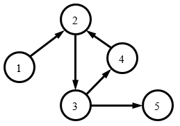

# CCF 201509

## CCF201509-1 数列分段

试题编号：	201509-1

试题名称：	数列分段

时间限制：	1.0s

内存限制：	256.0MB

**问题描述**：给定一个整数数列，数列中连续相同的最长整数序列算成一段，问数列中共有多少段？

**输入格式**

输入的第一行包含一个整数n，表示数列中整数的个数。

第二行包含n个整数a1, a2, …, an，表示给定的数列，相邻的整数之间用一个空格分隔。

**输出格式**

输出一个整数，表示给定的数列有多个段。

**样例输入**

```
8
8 8 8 0 12 12 8 0
```

**样例输出**

```
5
```

**样例说明**

8 8 8是第一段，0是第二段，12 12是第三段，倒数第二个整数8是第四段，最后一个0是第五段。

**评测用例规模与约定**

1 ≤ n ≤ 1000，0 ≤ ai ≤ 1000。

```c
#include <iostream>
#include <vector>
using namespace std;

int main (int argc, const char * argv[]) {

	int n, num;
	cin >> n;
	vector<int> v;
	while (n--) {
		cin >> num;
		v.push_back(num);
	}
	int count = 0, prev = -1;
	for (int i = 0; i < v.size(); i++) {
		if (v[i] != prev) count++;
		prev = v[i];
	}
	cout << count << endl;

	return 0;
}
```


------


## CCF201509-2 日期计算

试题编号：	201509-2

试题名称：	日期计算

时间限制：	1.0s

内存限制：	256.0MB

**问题描述**：给定一个年份y和一个整数d，问这一年的第d天是几月几日？

注意闰年的2月有29天。满足下面条件之一的是闰年：
1. 年份是4的整数倍，而且不是100的整数倍；
2. 年份是400的整数倍。

**输入格式**

输入的第一行包含一个整数y，表示年份，年份在1900到2015之间（包含1900和2015）。

输入的第二行包含一个整数d，d在1至365之间。

**输出格式**

输出两行，每行一个整数，分别表示答案的月份和日期。

**样例输入**

```
2015
80
```

**样例输出**

```
3
21
```

**样例输入**

```
2000
40
```

**样例输出**

```
2
9
```

```c
#include <iostream>
using namespace std;

bool isLeapYear (int year) {
	if (year % 4 == 0 && (year % 100 != 0 || year % 400 == 0)) return true;
	else return false;
}

int days_of_month[13] = {0, 31, 28, 31, 30, 31, 30, 31, 31, 30, 31, 30, 31};

int main (int argc, const char * argv[]) {

	int year, days;
	cin >> year >> days;
	bool leap_year = isLeapYear(year);
	int i = 1;
	for (i = 1; i <= 12; i++) {
		if (i == 2 && isLeapYear(year)) {
			days -= 29;
			if (days <= 0) { days += 29; break; }
		} else {
			days -= days_of_month[i];
			if (days <= 0) { days += days_of_month[i]; break; }
		}
	}
	cout << i << endl << days << endl;

	return 0;
}
```


------


## CCF201509-3 模板生成系统

试题编号：	201509-3

试题名称：	模板生成系统

时间限制：	1.0s

内存限制：	256.0MB

**问题描述**：成成最近在搭建一个网站，其中一些页面的部分内容来自数据库中不同的数据记录，但是页面的基本结构是相同的。

这样的例子在包含动态内容的网站中还有很多。为了简化生成网页的工作，成成觉得他需要引入一套模板生成系统。

模板是包含特殊标记的文本。成成用到的模板只包含一种特殊标记，格式为 {{ VAR }}，其中 VAR 是一个变量。该标记在模板生成时会被变量 VAR 的值所替代。例如，如果变量 name = "Tom"，则 {{ name }} 会生成 Tom。具体的规则如下：
- 变量名由大小写字母、数字和下划线 (_) 构成，且第一个字符不是数字，长度不超过 16 个字符。
- 变量名是大小写敏感的，Name 和 name 是两个不同的变量。
- 变量的值是字符串。
- 如果标记中的变量没有定义，则生成空串，相当于把标记从模板中删除。
- 模板不递归生成。也就是说，如果变量的值中包含形如 {{ VAR }} 的内容，不再做进一步的替换。

**输入格式**

输入的第一行包含两个整数 m, n，分别表示模板的行数和模板生成时给出的变量个数。

接下来 m 行，每行是一个字符串，表示模板。

接下来 n 行，每行表示一个变量和它的值，中间用一个空格分隔。值是字符串，用双引号 (") 括起来，内容可包含除双引号以外的任意可打印 ASCII 字符（ASCII 码范围 32, 33, 35-126）。

**输出格式**

输出包含若干行，表示模板生成的结果。

**样例输入**

```html
11 2
<!DOCTYPE html>
<html>
<head>
    <title>User {{ name }}</title>
</head>
<body>
    <h1>{{ name }}</h1>
    <p>Email: <a href="mailto:{{ email }}">{{ email }}</a></p>
    <p>Address: {{ address }}</p>
</body>
</html>
name "David Beckham"
email "david@beckham.com"
```

**样例输出**

```html
<!DOCTYPE html>
<html>
<head>
    <title>User David Beckham</title>
</head>
<body>
    <h1>David Beckham</h1>
    <p>Email: <a href="mailto:david@beckham.com">david@beckham.com</a></p>
    <p>Address: </p>
</body>
</html>
```

**评测用例规模与约定**

0 ≤ m ≤ 100

0 ≤ n ≤ 100

输入的模板每行长度不超过 80 个字符（不包含换行符）。

输入保证模板中所有以 `{{` 开始的子串都是合法的标记，开始是两个左大括号和一个空格，然后是变量名，结尾是一个空格和两个右大括号。

输入中所有变量的值字符串长度不超过 100 个字符（不包括双引号）。

保证输入的所有变量的名字各不相同。

```c
#include <iostream>
#include <string>
#include <vector>
#include <map>
using namespace std;

void trim (string &str) {
	if (str.length() == 0) return;
	while (str.find(" ") == 0)
		str.erase(0, 1);
	while (str.find(" ", str.length() - 1) != string::npos)
		str.erase(str.length() - 1, 1);
}

void getVar (string &line, map<string, string> vars) {
	string var;
	int l_pos = line.find("{{"), r_pos;
	while (l_pos != string::npos) {
		r_pos = line.find("}}", l_pos + 2);
		var = line.substr(l_pos + 2, r_pos - l_pos - 2);
		trim(var);
		line.erase(l_pos, r_pos - l_pos + 2);
		line.insert(l_pos, vars[var]);
		l_pos = line.find("{{", r_pos + 2);
	}
}

int main (int argc, const char * argv[]) {

	int m, n;
	cin >> m >> n;
	string line;
	vector<string> doc;
	map<string, string> vars;
	getline(cin, line);
	while (m--) {
		getline(cin, line);
		doc.push_back(line);
	}
	string var, value;
	while (n--) {
		getline(cin, line);
		int pos = line.find(" ");
		var = line.substr(0, pos);
		value = line.substr(pos + 2, line.length() - pos - 3);
		vars[var] = value;
	}
	for (int i = 0; i < doc.size(); i++) {
		line = doc[i];
		getVar(doc[i], vars);
	}
	for (int i = 0; i < doc.size(); i++)
		cout << doc[i] << endl;
	return 0;
}
```


------


## CCF201509-4 高速公路

试题编号：	201509-4

试题名称：	高速公路

时间限制：	1.0s

内存限制：	256.0MB

**问题描述**：某国有n个城市，为了使得城市间的交通更便利，该国国王打算在城市之间修一些高速公路，由于经费限制，国王打算第一阶段先在部分城市之间修一些单向的高速公路。

现在，大臣们帮国王拟了一个修高速公路的计划。看了计划后，国王发现，有些城市之间可以通过高速公路直接（不经过其他城市）或间接（经过一个或多个其他城市）到达，而有的却不能。如果城市A可以通过高速公路到达城市B，而且城市B也可以通过高速公路到达城市A，则这两个城市被称为便利城市对。

国王想知道，在大臣们给他的计划中，有多少个便利城市对。

**输入格式**

输入的第一行包含两个整数n, m，分别表示城市和单向高速公路的数量。

接下来m行，每行两个整数a, b，表示城市a有一条单向的高速公路连向城市b。

**输出格式**

输出一行，包含一个整数，表示便利城市对的数量。

**样例输入**

```
5 5
1 2
2 3
3 4
4 2
3 5
```

**样例输出**

```
3
```

**样例说明**



城市间的连接如图所示。有3个便利城市对，它们分别是(2, 3), (2, 4), (3, 4)，请注意(2, 3)和(3, 2)看成同一个便利城市对。

**评测用例规模与约定**

前30%的评测用例满足1 ≤ n ≤ 100, 1 ≤ m ≤ 1000；

前60%的评测用例满足1 ≤ n ≤ 1000, 1 ≤ m ≤ 10000；

所有评测用例满足1 ≤ n ≤ 10000, 1 ≤ m ≤ 100000。

```c
#include <iostream>
#include <stack>
#include <vector>
#include <algorithm>
using namespace std;
const int MAXN = 101;
vector<int> dfn(MAXN + 1, 0);
vector<int> low(MAXN + 1, 0);
vector<bool> vis(MAXN + 1, false);
vector<int> inStack(MAXN + 1, false);
stack<int> s;
int counter = 0;
int key_node = 0;

void init () {
	counter = 0;
	key_node = 0;
	fill(dfn.begin(), dfn.end(), 0);
	fill(low.begin(), low.end(), 0);
	fill(vis.begin(), vis.end(), false);
	fill(inStack.begin(), inStack.end(), false);
}

void Tarjan (int u, vector<vector<int>> G) {
	s.push(u);
	inStack[u] = true;
	vis[u] = true;
	low[u] = dfn[u] = ++counter;
	for (int i = 0; i < G[u].size(); i++) {
		int v = G[u][i];
		if (!vis[v]) {
			Tarjan(v, G);
			low[u] = min(low[u], low[v]);
		} else if (inStack[v]) {
			low[u] = min(low[u], dfn[v]);
		}
	}
	int num = 0;
	if (low[u] == dfn[u]) {
		while (!s.empty()) {
			int top = s.top();
			num++;
			s.pop();
			inStack[top] = false;
			if (top == u) {
				if (num > 1) key_node += num;
				break;
			}
		}
	}
}

int main (int argc, const char * argv[]) {

	int n, m, a, b;
	cin >> n >> m;
	vector<vector<int>> G(n + 1);
	while (m--) {
		cin >> a >> b;
		G[a].push_back(b);
	}
	init();
	Tarjan(1, G);
	cout << key_node << endl;

	return 0;
}
```