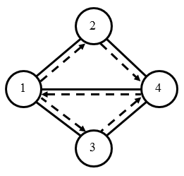
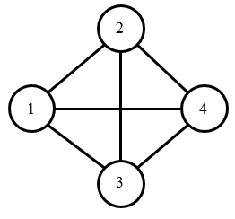

# CCF 201512


## CCF201512-1 数位之和

试题编号：	201512-1

试题名称：	数位之和

时间限制：	1.0s

内存限制：	256.0MB

**问题描述**：给定一个十进制整数n，输出n的各位数字之和。

**输入格式**

输入一个整数n。

**输出格式**

输出一个整数，表示答案。

**样例输入**

```
20151220
```

**样例输出**

```
13
```

**样例说明**

20151220的各位数字之和为2+0+1+5+1+2+2+0=13。

**评测用例规模与约定**

所有评测用例满足：0 ≤ n ≤ 1000000000。

```c
#include <cstdio>

int main (int argc, const char * argv[]) {

	int n, num, sum = 0;
	scanf("%d", &n);
	while (n > 0) {
		num = n % 10;
		n /= 10;
		sum += num;
	}
	printf("%d", sum);

	return 0;
}
```


------


## CCF201512-2 消除类游戏

试题编号： 	201512-2

试题名称： 	消除类游戏

时间限制： 	1.0s

内存限制： 	256.0MB

**问题描述**：消除类游戏是深受大众欢迎的一种游戏，游戏在一个包含有n行m列的游戏棋盘上进行，棋盘的每一行每一列的方格上放着一个有颜色的棋子，当一行或一列上有连续三个或更多的相同颜色的棋子时，这些棋子都被消除。当有多处可以被消除时，这些地方的棋子将同时被消除。

现在给你一个n行m列的棋盘，棋盘中的每一个方格上有一个棋子，请给出经过一次消除后的棋盘。

请注意：一个棋子可能在某一行和某一列同时被消除。

**输入格式**

输入的第一行包含两个整数n, m，用空格分隔，分别表示棋盘的行数和列数。

接下来n行，每行m个整数，用空格分隔，分别表示每一个方格中的棋子的颜色。颜色使用1至9编号。

**输出格式**

输出n行，每行m个整数，相邻的整数之间使用一个空格分隔，表示经过一次消除后的棋盘。如果一个方格中的棋子被消除，则对应的方格输出0，否则输出棋子的颜色编号。

**样例输入**

```
4 5
2 2 3 1 2
3 4 5 1 4
2 3 2 1 3
2 2 2 4 4
```

**样例输出**

```
2 2 3 0 2
3 4 5 0 4
2 3 2 0 3
0 0 0 4 4
```

**样例说明**

棋盘中第4列的1和第4行的2可以被消除，其他的方格中的棋子均保留。

**样例输入**

```
4 5
2 2 3 1 2
3 1 1 1 1
2 3 2 1 3
2 2 3 3 3
```

**样例输出**

```
2 2 3 0 2
3 0 0 0 0
2 3 2 0 3
2 2 0 0 0
```

**样例说明**

棋盘中所有的1以及最后一行的3可以被同时消除，其他的方格中的棋子均保留。

**评测用例规模与约定**

所有的评测用例满足：1 ≤ n, m ≤ 30。

```c
#include <cstdio>
#include <algorithm>
#include <vector>
using namespace std;
const int MAXN = 30;
int field[MAXN][MAXN];

int main (int argc, const char * argv[]) {

	int n, m, i, j, k;
	scanf("%d %d", &n, &m);
	for (i = 0; i < n; i++)
		for (j = 0; j < m; j++)
			scanf("%d", &field[i][j]);

	vector<pair<int, int> > v;
	for (i = 0; i < n; i++) {
		for (j = 0; j < m; j++) {
			int now = field[i][j];
			if (j > 0 && field[i][j - 1] == now && j < m - 1 && field[i][j + 1] == now) {
				int start_j, end_j;
				start_j = j - 1;
				end_j = j + 1;
				while (end_j < m) {
					if (field[i][++end_j] != now) break;
				}
				for (k = start_j; k < end_j; k++) v.push_back(make_pair(i, k));
			}
			if (i > 0 && field[i - 1][j] == now && i < n - 1 && field[i + 1][j] == now) {
				int start_i, end_i;
				start_i = i - 1;
				end_i = i + 1;
				while (end_i < m) {
					if (field[++end_i][j] != now) break;
				}
				for (k = start_i; k < end_i; k++) v.push_back(make_pair(k, j));
			}
		}
	}

	for (i = 0; i < v.size(); i++) {
		field[v[i].first][v[i].second] = 0;
	}

	for (i = 0; i < n; i++) {
		for (j = 0; j < m; j++) {
			printf("%d", field[i][j]);
			if (j < m - 1) printf(" ");
			else printf("\n");
		}
	}


	return 0;
}
```


------


## CCF201512-3 画图

试题编号：	201512-3

试题名称：	画图

时间限制：	1.0s

内存限制：	256.0MB

**问题描述**：用 ASCII 字符来画图是一件有趣的事情，并形成了一门被称为 ASCII Art 的艺术。例如，下图是用 ASCII 字符画出来的 CSPRO 字样。
```
..____.____..____..____...___..
./.___/.___||.._.\|.._.\./._.\.
|.|...\___.\|.|_).|.|_).|.|.|.|
|.|___.___).|..__/|.._.<|.|_|.|
.\____|____/|_|...|_|.\_\\___/.
```
本题要求编程实现一个用 ASCII 字符来画图的程序，支持以下两种操作：

- 画线：给出两个端点的坐标，画一条连接这两个端点的线段。简便起见题目保证要画的每条线段都是水平或者竖直的。水平线段用字符 - 来画，竖直线段用字符 | 来画。如果一条水平线段和一条竖直线段在某个位置相交，则相交位置用字符 + 代替。
- 填充：给出填充的起始位置坐标和需要填充的字符，从起始位置开始，用该字符填充相邻位置，直到遇到画布边缘或已经画好的线段。注意这里的相邻位置只需要考虑上下左右 4 个方向，如下图所示，字符 @ 只和 4 个字符 * 相邻。

```
.*.
*@*
.*.
```

**输入格式**

第1行有三个整数m, n和q。m和n分别表示画布的宽度和高度，以字符为单位。q表示画图操作的个数。

第2行至第q + 1行，每行是以下两种形式之一：

- 0 x1 y1 x2 y2：表示画线段的操作，(x1, y1)和(x2, y2)分别是线段的两端，满足要么x1 = x2 且y1 ≠ y2，要么 y1 = y2 且 x1 ≠ x2。
- 1 x y c：表示填充操作，(x, y)是起始位置，保证不会落在任何已有的线段上；c 为填充字符，是大小写字母。

画布的左下角是坐标为 (0, 0) 的位置，向右为x坐标增大的方向，向上为y坐标增大的方向。这q个操作按照数据给出的顺序依次执行。画布最初时所有位置都是字符 .（小数点）。

**输出格式**

输出有n行，每行m个字符，表示依次执行这q个操作后得到的画图结果。

**样例输入**

```
4 2 3
1 0 0 B
0 1 0 2 0
1 0 0 A
```

**样例输出**

```
AAAA
A--A
```

**样例输入**

```
16 13 9
0 3 1 12 1
0 12 1 12 3
0 12 3 6 3
0 6 3 6 9
0 6 9 12 9
0 12 9 12 11
0 12 11 3 11
0 3 11 3 1
1 4 2 C
```

**样例输出**

```
................
...+--------+...
...|CCCCCCCC|...
...|CC+-----+...
...|CC|.........
...|CC|.........
...|CC|.........
...|CC|.........
...|CC|.........
...|CC+-----+...
...|CCCCCCCC|...
...+--------+...
................
```

**评测用例规模与约定**

所有的评测用例满足：2 ≤ m, n ≤ 100，0 ≤ q ≤ 100，0 ≤ x < m（x表示输入数据中所有位置的x坐标），0 ≤ y < n（y表示输入数据中所有位置的y坐标）。


```c
#include <cstdio>
#include <algorithm>
#include <map>
using namespace std;
const int MAXN = 100;
char G[MAXN][MAXN];
bool visit[MAXN][MAXN];

bool isValid(int x, int y, int m, int n) {
	if (x >= 0 && x <= m - 1 && y >= 0 && y <= n - 1 && visit[y][x] == false && G[y][x] != '|' && G[y][x] != '-' && G[y][x] != '+') {
		return true;
	} else {
		return false;
	}
}

void dfs (int x, int y, char p, int m, int n) {
	G[y][x] = p;
	visit[y][x] = true;
	if (isValid(x - 1, y, m, n)) dfs(x - 1, y, p, m, n);
	if (isValid(x + 1, y, m, n)) dfs(x + 1, y, p, m, n);
	if (isValid(x, y - 1, m, n)) dfs(x, y - 1, p, m, n);
	if (isValid(x, y + 1, m, n)) dfs(x, y + 1, p, m, n);
}

int main (int argc, const char * argv[]) {

	int i, j, m, n, q;
	scanf("%d%d%d", &m, &n, &q);

	int temp;
	map<pair<int, int>, char> temp_m;
	memset(G, '.', sizeof(G));
	memset(visit, false, sizeof(visit));

	for (i = 0; i < q; i++) {
		scanf("%d", &temp);
		if (temp == 1) {
			int x, y;
			char c;
			scanf("%d %d %c", &x, &y, &c);
			pair<int, int> p = make_pair(x, y);
			temp_m[p] = c;
		} else if (temp == 0) {
			int x1, x2, y1, y2;
			int _min, _max;
			scanf("%d%d%d%d", &x1, &y1, &x2, &y2);
			if (y1 == y2) {
				G[n - y1 - 1][x1] = '+';
				G[n - y2 - 1][x2] = '+';
				_min = (x1 < x2) ? x1 : x2;
				_max = (x1 > x2) ? x1 : x2;
				for (j = _min + 1; j <= _max - 1; j++)
					G[n - y1 - 1][j] = '-';
			} else if (x1 == x2) {
				G[n - y1 - 1][x1] = '+';
				G[n - y2 - 1][x2] = '+';
				_min = (y1 < y2) ? y1 : y2;
				_max = (y1 > y2) ? y1 : y2;
				for (j = _min + 1; j <= _max - 1; j++)
					G[n - j - 1][x1] = '|';
			}
		}
	}


	for (map<pair<int, int>, char>::iterator it = temp_m.begin(); it != temp_m.end(); it++) {
		pair<int, int> coord = it->first;
		char pattern = it->second;
		dfs(coord.first, n - coord.second - 1, pattern, m, n);
	}

	for (i = 0; i < n; i++) {
		for (j = 0; j < m; j++) {
			printf("%c ", G[n - i - 1][j]);
		}
		printf("\n");
	}

	return 0;
}
```


------


## CCF201512-4 送货

试题编号：	201512-4

试题名称：	送货

时间限制：	1.0s

内存限制：	256.0MB

**问题描述**：为了增加公司收入，F公司新开设了物流业务。由于F公司在业界的良好口碑，物流业务一开通即受到了消费者的欢迎，物流业务马上遍及了城市的每条街道。然而，F公司现在只安排了小明一个人负责所有街道的服务。
　　
任务虽然繁重，但是小明有足够的信心，他拿到了城市的地图，准备研究最好的方案。城市中有n个交叉路口，m条街道连接在这些交叉路口之间，每条街道的首尾都正好连接着一个交叉路口。除开街道的首尾端点，街道不会在其他位置与其他街道相交。每个交叉路口都至少连接着一条街道，有的交叉路口可能只连接着一条或两条街道。

小明希望设计一个方案，从编号为1的交叉路口出发，每次必须沿街道去往街道另一端的路口，再从新的路口出发去往下一个路口，直到所有的街道都经过了正好一次。

**输入格式**

输入的第一行包含两个整数n, m，表示交叉路口的数量和街道的数量，交叉路口从1到n标号。

接下来m行，每行两个整数a, b，表示和标号为a的交叉路口和标号为b的交叉路口之间有一条街道，街道是双向的，小明可以从任意一端走向另一端。两个路口之间最多有一条街道。

**输出格式**

如果小明可以经过每条街道正好一次，则输出一行包含m+1个整数p1, p2, p3, ..., pm+1，表示小明经过的路口的顺序，相邻两个整数之间用一个空格分隔。如果有多种方案满足条件，则输出字典序最小的一种方案，即首先保证p1最小，p1最小的前提下再保证p2最小，依此类推。

如果不存在方案使得小明经过每条街道正好一次，则输出一个整数-1。

**样例输入**

```
4 5
1 2
1 3
1 4
2 4
3 4
```

**样例输出**

```
1 2 4 1 3 4
```

**样例说明**

城市的地图和小明的路径如下图所示。



**样例输入**

```
4 6
1 2
1 3
1 4
2 4
3 4
2 3
```

**样例输出**

```
-1
```

**样例说明**

城市的地图如下图所示，不存在满足条件的路径。



**评测用例规模与约定**

前30%的评测用例满足：1 ≤ n ≤ 10, n-1 ≤ m ≤ 20。

前50%的评测用例满足：1 ≤ n ≤ 100, n-1 ≤ m ≤ 10000。

所有评测用例满足：1 ≤ n ≤ 10000，n-1 ≤ m ≤ 100000。

```c
#include <iostream>
#include <vector>
#include <map>
#include <algorithm>
using namespace std;
map<pair<int, int>, bool> vis;

bool isLess (vector<int> a, vector<int> b) {
    for (int i = 0; i < a.size(); i++) {
        if (a[i] != b[i])
            return a[i] < b[i];
    }
    return false;
}

void dfs (int u, vector<vector<int>> &G, vector<int> route, vector<int> &path) {
    if (vis.size() == 0) {
        if (path.size() == 0 || isLess(route, path))
            path = route;
        return;
    }
    for (int v = 1; v < G[u].size(); v++) {
        if (G[u][v] == 1 && vis.find(make_pair(u, v)) != vis.end()) {
            route.push_back(v);
            vis.erase(vis.find(make_pair(u, v)));
            vis.erase(vis.find(make_pair(v, u)));
            dfs(v, G, route, path);
            route.pop_back();
            vis[make_pair(u, v)] = true;
            vis[make_pair(v, u)] = true;
        }
    }
}

int main (int argc, const char * argv[]) {

    int n, m, a, b;
    cin >> n >> m;
    vector<vector<int>> G(n + 1, vector<int>(n + 1, 0));
    while (m--) {
        cin >> a >> b;
        G[a][b] = 1;
        G[b][a] = 1;
        vis[make_pair(a, b)] = true;
        vis[make_pair(b, a)] = true;
    }
    vector<int> route, path;
    route.push_back(1);
    dfs(1, G, route, path);
	if (path.empty()) cout << "-1";
    else for (int i = 0; i < path.size(); i++) cout << path[i] << " ";
    cout << endl;

    return 0;
}
```


------


## CCF201512-5 矩阵

试题编号：	201512-5

试题名称：	矩阵

时间限制：	1.0s

内存限制：	256.0MB

**问题描述**：创造一个世界只需要定义一个初状态和状态转移规则。

宏观世界的物体运动规律始终跟物体当前的状态有关，也就是说只要知道物体足够多的状态信息，例如位置、速度等，我们就能知道物体之后任意时刻的状态。

现在小M创造了一个简化的世界。

这个世界中，时间是离散的，物理规律是线性的：世界的初始状态可以用一个m维向量b(0)表示，状态的转移方式用m×m的矩阵A表示。

若已知这个世界当前的状态是b，那么下一时刻就等于b左乘状态转移矩阵A，即Ab。

这个世界中，物体的状态也是离散的，也就是说可以用整数表示。再进一步，整数都可以用二进制编码拆分为有限位0和1。因此，这里的矩阵A和向量b的每个元素都是0或1，矩阵乘法中的加法运算视为异或运算（xor），乘法运算视为与运算（and）。

具体地，设矩阵A第i行第j列的元素为ai, j，向量b的第i个元素为bi。那么乘法Ab所得的第k个元素为

(ak,1 and b1) xor (ak,2 and b2) xor ⋯ xor (ak,m and bm)

矩阵和矩阵的乘法也有类似的表达。

小M发现，这样的矩阵运算也有乘法结合律，例如有A(Ab)=(AA)b=A2b。

为了保证自己创造的世界维度不轻易下降，小M保证了矩阵A可逆，也就是说存在一个矩阵A-1，使得对任意向量d，都有A-1Ad=d。

小M想了解自己创造的世界是否合理，他希望知道这个世界在不同时刻的状态。

具体地，小M有n组询问，每组询问会给出一个非负整数k，小M希望你帮他求出Akb。

**输入格式**

输入第一行包含一个整数m，表示矩阵和向量的规模。

接下来m行，每行包含一个长度为m的01串，表示矩阵A。

接下来一行，包含一个长度为m的01串，表示初始向量b(0)。（b(0)是列向量，这里表示它的转置）

注意：01串两个相邻的数字之间均没有空格。
接下来一行，包含一个正整数n，表示询问的个数。

最后n行，每行包含一个非负整数k，表示询问Akb(0)。

注意：k可能为0，此时是求A0b(0) =b(0)。

**输出格式**

输出n行，每行包含一个01串，表示对应询问中Akb(0)的结果。
注意：01串两个相邻的数字之间不要输出空格。

**样例输入**

```
3
110
011
111
101
10
0
2
3
14
1
1325
6
124124
151
12312
```

**样例输出**

```
101
010
111
101
110
010
100
101
001
100
```

**评测用例规模与约定**

本题使用10个评测用例来测试你的程序。

对于评测用例1，m = 10，n = 100，k ≤ 103。

对于评测用例2，m = 10，n = 100，k ≤ 104。

对于评测用例3，m = 30，n = 100，k ≤ 105。

对于评测用例4，m = 180，n = 100，k ≤ 105。

对于评测用例5，m = 10，n = 100，k ≤ 109。

对于评测用例6，m = 30，n = 100，k ≤ 109。

对于评测用例7，m = 180，n = 100，k ≤ 109。

对于评测用例8，m = 600，n = 100，k ≤ 109。

对于评测用例9，m = 800，n = 100，k ≤ 109。

对于评测用例10，m = 1000，n = 100，k ≤ 109。

```c

```
