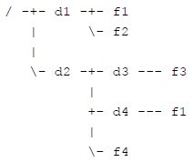
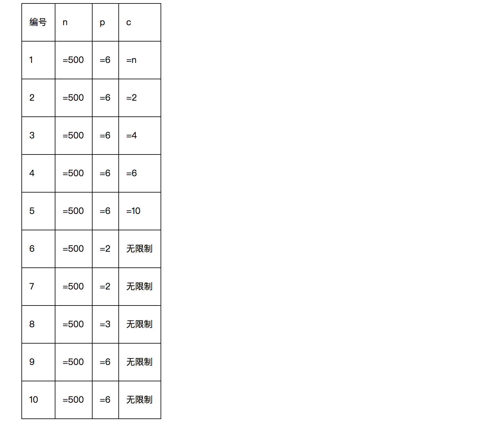

# CCF 201604

## CCF201604-1 折点计数

试题编号：	201604-1

试题名称：	折点计数

时间限制：	1.0s

内存限制：	256.0MB

**问题描述**：给定n个整数表示一个商店连续n天的销售量。如果某天之前销售量在增长，而后一天销售量减少，则称这一天为折点，反过来如果之前销售量减少而后一天销售量增长，也称这一天为折点。其他的天都不是折点。如下图中，第3天和第6天是折点。

给定n个整数a1, a2, …, an表示销售量，请计算出这些天总共有多少个折点。

为了减少歧义，我们给定的数据保证：在这n天中相邻两天的销售量总是不同的，即ai-1≠ai。注意，如果两天不相邻，销售量可能相同。

**输入格式**

输入的第一行包含一个整数n。

第二行包含n个整数，用空格分隔，分别表示a1, a2, …, an。

**输出格式**

输出一个整数，表示折点出现的数量。

**样例输入**

```
7
5 4 1 2 3 6 4
```

**样例输出**

```
2
```

**评测用例规模与约定**

所有评测用例满足：1 ≤ n ≤ 1000，每天的销售量是不超过10000的非负整数。

```c
#include <cstdio>
using namespace std;

int main(int argc, const char * argv[]) {

	int n, cur, pre, _pre, count = 0;
	scanf("%d", &n);
	for (int i = 0; i < n; i++) {
		scanf("%d", &cur);
		if (i > 1) {
			if ((pre > _pre && pre > cur) || (pre < _pre && pre < cur)) count++;
		}
		_pre = pre;
		pre = cur;
	}

	printf("%d", count);

	return 0;
}
```


------


## CCF201604-2 俄罗斯方块

试题编号：	201604-2

试题名称：	俄罗斯方块

时间限制：	1.0s

内存限制：	256.0MB

**问题描述**：俄罗斯方块是俄罗斯人阿列克谢·帕基特诺夫发明的一款休闲游戏。

游戏在一个15行10列的方格图上进行，方格图上的每一个格子可能已经放置了方块，或者没有放置方块。每一轮，都会有一个新的由4个小方块组成的板块从方格图的上方落下，玩家可以操作板块左右移动放到合适的位置，当板块中某一个方块的下边缘与方格图上的方块上边缘重合或者达到下边界时，板块不再移动，如果此时方格图的某一行全放满了方块，则该行被消除并得分。

在这个问题中，你需要写一个程序来模拟板块下落，你不需要处理玩家的操作，也不需要处理消行和得分。

具体的，给定一个初始的方格图，以及一个板块的形状和它下落的初始位置，你要给出最终的方格图。

**输入格式**

输入的前15行包含初始的方格图，每行包含10个数字，相邻的数字用空格分隔。如果一个数字是0，表示对应的方格中没有方块，如果数字是1，则表示初始的时候有方块。输入保证前4行中的数字都是0。

输入的第16至第19行包含新加入的板块的形状，每行包含4个数字，组成了板块图案，同样0表示没方块，1表示有方块。输入保证板块的图案中正好包含4个方块，且4个方块是连在一起的（准确的说，4个方块是四连通的，即给定的板块是俄罗斯方块的标准板块）。

第20行包含一个1到7之间的整数，表示板块图案最左边开始的时候是在方格图的哪一列中。注意，这里的板块图案指的是16至19行所输入的板块图案，如果板块图案的最左边一列全是0，则它的左边和实际所表示的板块的左边是不一致的（见样例）

**输出格式**

输出15行，每行10个数字，相邻的数字之间用一个空格分隔，表示板块下落后的方格图。注意，你不需要处理最终的消行。

**样例输入**

```
0 0 0 0 0 0 0 0 0 0
0 0 0 0 0 0 0 0 0 0
0 0 0 0 0 0 0 0 0 0
0 0 0 0 0 0 0 0 0 0
0 0 0 0 0 0 0 0 0 0
0 0 0 0 0 0 0 0 0 0
0 0 0 0 0 0 0 0 0 0
0 0 0 0 0 0 0 0 0 0
0 0 0 0 0 0 0 0 0 0
0 0 0 0 0 0 0 0 0 0
0 0 0 0 0 0 0 1 0 0
0 0 0 0 0 0 1 0 0 0
0 0 0 0 0 0 1 0 0 0
1 1 1 0 0 0 1 1 1 1
0 0 0 0 1 0 0 0 0 0
0 0 0 0
0 1 1 1
0 0 0 1
0 0 0 0
3
```

**样例输出**

```
0 0 0 0 0 0 0 0 0 0
0 0 0 0 0 0 0 0 0 0
0 0 0 0 0 0 0 0 0 0
0 0 0 0 0 0 0 0 0 0
0 0 0 0 0 0 0 0 0 0
0 0 0 0 0 0 0 0 0 0
0 0 0 0 0 0 0 0 0 0
0 0 0 0 0 0 0 0 0 0
0 0 0 0 0 0 0 0 0 0
0 0 0 0 0 0 0 0 0 0
0 0 0 0 0 0 0 1 0 0
0 0 0 0 0 0 1 0 0 0
0 0 0 0 0 0 1 0 0 0
1 1 1 1 1 1 1 1 1 1
0 0 0 0 1 1 0 0 0 0
```

```c
#include <cstdio>
#include <algorithm>
#include <vector>
using namespace std;
const int NUM_RAW = 15;
const int NUM_COL = 10;

int main (int argc, const char * argv[]) {

	int field[NUM_RAW][NUM_COL] = {0};
	for (int i = 0; i < NUM_RAW; i++) {
		for (int j = 0; j < NUM_COL; j++) {
			scanf("%d", &field[i][j]);
		}
	}

	int obj[4][4];
	int height, left = 3, right = 0;
	for (int i = 0; i < 4; i++) {
		for (int j = 0; j < 4; j++) {
			scanf("%d", &obj[i][j]);
		}
	}

	int n;
	scanf("%d", &n);
	vector<pair<int, int>> now, next;
	for (int i = 0; i < 4; i++) {
		for (int j = n - 1; j < n + 3; j++) {
			if (obj[i][j - n + 1] == 1) next.push_back(make_pair(i, j));
		}
	}
	bool flag = true;
	while (flag) {
		now = next;
		next.clear();
		for (int i = 0; i < now.size(); i++) {
			pair<int, int> temp = now[i];
			temp.first++;
			next.push_back(temp);
		}
		for (int i = 0; i < next.size(); i++) {
			pair<int, int> temp = next[i];
			if (field[temp.first][temp.second] == 1)
				flag = false;
		}
	}

	for (int i = 0; i < now.size(); i++) {
		pair<int, int> temp = now[i];
		field[temp.first][temp.second] = 1;
	}

	for (int i = 0; i < NUM_RAW; i++) {
		for (int j = 0; j < NUM_COL; j++) {
			printf("%d", field[i][j]);
			if (j < NUM_COL - 1) printf(" ");
			else printf("\n");
		}
	}
	return 0;
}
```


------


## CCF201604-3 路径解析

试题编号：	201604-3

试题名称：	路径解析

时间限制：	1.0s

内存限制：	256.0MB

**问题描述**：在操作系统中，数据通常以文件的形式存储在文件系统中。文件系统一般采用层次化的组织形式，由目录（或者文件夹）和文件构成，形成一棵树的形状。文件有内容，用于存储数据。目录是容器，可包含文件或其他目录。同一个目录下的所有文件和目录的名字各不相同，不同目录下可以有名字相同的文件或目录。

为了指定文件系统中的某个文件，需要用路径来定位。在类 Unix 系统（Linux、Max OS X、FreeBSD等）中，路径由若干部分构成，每个部分是一个目录或者文件的名字，相邻两个部分之间用 / 符号分隔。

有一个特殊的目录被称为根目录，是整个文件系统形成的这棵树的根节点，用一个单独的 / 符号表示。在操作系统中，有当前目录的概念，表示用户目前正在工作的目录。根据出发点可以把路径分为两类：

- 绝对路径：以 / 符号开头，表示从根目录开始构建的路径。　
- 相对路径：不以 / 符号开头，表示从当前目录开始构建的路径。

例如，有一个文件系统的结构如下图所示。在这个文件系统中，有根目录 / 和其他普通目录 d1、d2、d3、d4，以及文件 f1、f2、f3、f1、f4。其中，两个 f1 是同名文件，但在不同的目录下。



对于 d4 目录下的 f1 文件，可以用绝对路径 /d2/d4/f1 来指定。如果当前目录是 /d2/d3，这个文件也可以用相对路径 ../d4/f1 来指定，这里 .. 表示上一级目录（注意，根目录的上一级目录是它本身）。还有 . 表示本目录，例如 /d1/./f1 指定的就是 /d1/f1。注意，如果有多个连续的 / 出现，其效果等同于一个 /，例如 /d1///f1 指定的也是 /d1/f1。

本题会给出一些路径，要求对于每个路径，给出正规化以后的形式。一个路径经过正规化操作后，其指定的文件不变，但是会变成一个不包含 . 和 .. 的绝对路径，且不包含连续多个 / 符号。如果一个路径以 / 结尾，那么它代表的一定是一个目录，正规化操作要去掉结尾的 /。若这个路径代表根目录，则正规化操作的结果是 /。若路径为空字符串，则正规化操作的结果是当前目录。

**输入格式**

第一行包含一个整数 P，表示需要进行正规化操作的路径个数。

第二行包含一个字符串，表示当前目录。

以下 P 行，每行包含一个字符串，表示需要进行正规化操作的路径。

**输出格式**

共 P 行，每行一个字符串，表示经过正规化操作后的路径，顺序与输入对应。

**样例输入**

```
7
/d2/d3
/d2/d4/f1
../d4/f1
/d1/./f1
/d1///f1
/d1/
///
/d1/../../d2
```

**样例输出**

```
/d2/d4/f1
/d2/d4/f1
/d1/f1
/d1/f1
/d1
/
/d2
```

**评测用例规模与约定**

1 ≤ P ≤ 10。

文件和目录的名字只包含大小写字母、数字和小数点 .、减号 - 以及下划线 _。

不会有文件或目录的名字是 . 或 .. ，它们具有题目描述中给出的特殊含义。

输入的所有路径每个长度不超过 1000 个字符。

输入的当前目录保证是一个经过正规化操作后的路径。

对于前 30% 的测试用例，需要正规化的路径的组成部分不包含 . 和 .. 。

对于前 60% 的测试用例，需要正规化的路径都是绝对路径。


```c
#include <cstdio>
#include <iostream>
#include <string>
#include <deque>
using namespace std;

int main (int argc, const char * argv[]) {

	int n;
	string pwd, d;
	scanf("%d", &n);
	cin >> pwd;
	deque<string> s_pwd;
	pwd.erase(0, 1); // 去除当前路径 最开始的 "/"
	pwd += "/"; // 当前路径最后加上一个 "/"，方便之后处理
	while ((int) pwd.length() > 0) {
		int pos = pwd.find("/");
		s_pwd.push_back(pwd.substr(0, pos));
		pwd.erase(0, pos + 1);
	}

	deque<string> s;
	for (int i = 0; i < n; i++) {
		cin >> d;
		string ans = "";
		d += (d.substr((int)d.length() - 1, 1) == "/") ? "" : "/";
		if (d.find("/") == 0) {
			while (d.length() > 0) {
				while (d.find("/") == 0) { d.erase(0, 1); } // 去除最开始的 "/"
				int pos = d.find("/");
				string str = d.substr(0, pos);
				if (str == "..") {
					if (!s.empty()) s.pop_back();
				} else if (str == ".") {
					// do nothing
				} else {
					s.push_back(d.substr(0, pos));
				}
				d.erase(0, pos + 1);
			}
			while (!s.empty()) {
				ans += "/" + s.front();
				s.pop_front();
			}
		} else {
			string temp = "";
			while (d.length() > 0) {
				while (d.find("/") == 0) { d.erase(0, 1); } // 去除最开始的 "/"
				int pos = d.find("/");
				string str = d.substr(0, pos);
				if (str == "..") {
					if (!s_pwd.empty()) s_pwd.pop_back();
				} else if (str == ".") {
					// do nothing
				} else {
					if (pos != (int)d.length() - 1) {
						s_pwd.push_back(d.substr(0, pos));
					} else {
						temp = d.substr(0, pos);
					}
				}
				d.erase(0, pos + 1);
			}
			deque<string> s_temp;
			while (!s_pwd.empty()) {
				string front = s_pwd.front();
				ans += "/" + front;
				s_temp.push_back(front);
				s_pwd.pop_front();
			}
			ans += "/" + temp;
			while (!s_temp.empty()) {
				s_pwd.push_back(s_temp.front());
				s_temp.pop_front();
			}
		}

		printf("%s\n", ans.c_str());
	}

	return 0;
}
```


------


## CCF201604-4 游戏

试题编号：	201604-4

试题名称：	游戏

时间限制：	1.0s

内存限制：	256.0MB

**问题描述**：小明在玩一个电脑游戏，游戏在一个n×m的方格图上进行，小明控制的角色开始的时候站在第一行第一列，目标是前往第n行第m列。

方格图上有一些方格是始终安全的，有一些在一段时间是危险的，如果小明控制的角色到达一个方格的时候方格是危险的，则小明输掉了游戏，如果小明的角色到达了第n行第m列，则小明过关。第一行第一列和第n行第m列永远都是安全的。

每个单位时间，小明的角色必须向上下左右四个方向相邻的方格中的一个移动一格。

经过很多次尝试，小明掌握了方格图的安全和危险的规律：每一个方格出现危险的时间一定是连续的。并且，小明还掌握了每个方格在哪段时间是危险的。

现在，小明想知道，自己最快经过几个时间单位可以达到第n行第m列过关。

**输入格式**

输入的第一行包含三个整数n, m, t，用一个空格分隔，表示方格图的行数n、列数m，以及方格图中有危险的方格数量。

接下来t行，每行4个整数r, c, a, b，表示第r行第c列的方格在第a个时刻到第b个时刻之间是危险的，包括a和b。游戏开始时的时刻为0。输入数据保证r和c不同时为1，而且当r为n时c不为m。一个方格只有一段时间是危险的（或者说不会出现两行拥有相同的r和c）。

**输出格式**

输出一个整数，表示小明最快经过几个时间单位可以过关。输入数据保证小明一定可以过关。

**样例输入**

```
3 3 3
2 1 1 1
1 3 2 10
2 2 2 10
```

**样例输出**

```
6
```

**样例说明**

第2行第1列时刻1是危险的，因此第一步必须走到第1行第2列。

第二步可以走到第1行第1列，第三步走到第2行第1列，后面经过第3行第1列、第3行第2列到达第3行第3列。

**评测用例规模与约定**

前30%的评测用例满足：0 < n, m ≤ 10，0 ≤ t < 99。

所有评测用例满足：0 < n, m ≤ 100，0 ≤ t < 9999，1 ≤ r ≤ n，1 ≤ c ≤ m，0 ≤ a ≤ b ≤ 100。

```c
#include <iostream>
#include <vector>
#include <map>
#include <climits>
#include <algorithm>
using namespace std;
map<pair<int, int>, pair<int, int>> danger;

void dfs (int r, int c, vector<vector<int>> grid, int time, int &min_steps) {
    if (r >= grid.size() || c >= grid[0].size()) return;
    if (r == grid.size() - 1 && c == grid[0].size() - 1) {
        if (time < min_steps) min_steps = time;
        return;
    }

    int danger_num = 0;

    if (danger.find(make_pair(r + 1, c)) == danger.end()) { // 下方方块安全
        dfs(r + 1, c, grid, time + 1, min_steps);
    } else { // 下方方块危险
        pair<int, int> p = danger[make_pair(r + 1, c)];
        int t_start = p.first, t_end = p.second;
        if (time + 1 < t_start || time + 1 > t_end) dfs(r + 1, c, grid, time + 1, min_steps); // 下一时刻安全
        else {
            /*此步为原地踱步，但是题目要求每一时刻必须移动一格，即禁止踱步*/
            /*dfs(r + 1, c, grid, t_end + 1, min_steps);*/
            danger_num++;
        }
    }

    if (danger.find(make_pair(r, c + 1)) == danger.end()) {
        dfs(r, c + 1, grid, time + 1, min_steps);
    } else {
        pair<int, int> p = danger[make_pair(r, c + 1)];
        int t_start = p.first, t_end = p.second;
        if (time + 1 < t_start || time + 1 > t_end) dfs(r, c + 1, grid, time + 1, min_steps);
        else {
            /*此步为原地踱步，但是题目要求每一时刻必须移动一格，即禁止踱步*/
            /*dfs(r, c + 1, grid, t_end + 1, min_steps);*/
            danger_num++;
        }
    }

    if (danger_num >= 2) {
        if (danger.find(make_pair(r, c - 1)) == danger.end()) {
            dfs(r, c - 1, grid, time + 1, min_steps);
        } else {
            pair<int, int> p = danger[make_pair(r, c - 1)];
            int t_start = p.first, t_end = p.second;
            if (time + 1 < t_start || time + 1 > t_end) dfs(r, c - 1, grid, time + 1, min_steps);
            else {
                /*此步为原地踱步，但是题目要求每一时刻必须移动一格，即禁止踱步*/
                /*dfs(r, c - 1, grid, t_end + 1, min_steps);*/
            }
        }

        if (danger.find(make_pair(r - 1, c)) == danger.end()) {
            dfs(r - 1, c, grid, time + 1, min_steps);
        } else {
            pair<int, int> p = danger[make_pair(r - 1, c)];
            int t_start = p.first, t_end = p.second;
            if (time + 1 < t_start || time + 1 > t_end) dfs(r - 1, c, grid, time + 1, min_steps);
            else {
                /*此步为原地踱步，但是题目要求每一时刻必须移动一格，即禁止踱步*/
                /*dfs(r - 1, c, grid, t_end + 1, min_steps);*/
            }
        }

    }
}

int main (int argc, const char * argv[]) {

    int n, m, t;
    cin >> n >> m >> t;
    vector<vector<int>> grid(n + 1, vector<int>(m + 1, 0));
    while (t--) {
        int r, c, a, b;
        cin >> r >> c >> a >> b;
        grid[r][c] = 1;
        danger[make_pair(r, c)] = make_pair(a, b);
    }
    int min_steps = INT_MAX;
    dfs(1, 1, grid, 0, min_steps);
    cout << min_steps << endl;

    return 0;
}
```


------


## CCF201604-5 网络连接

试题编号：	201604-5

试题名称：	网络连接

时间限制：	5.0s

内存限制：	256.0MB

**问题描述**：某校新建的大楼中有n台设备，学校需要利用这些设备搭建一个网络。我们用1到n的整数给这些设备编号。

这些设备之间一共可以建立m条连线，建立每条连线会消耗一定的费用。连接建立后两台设备就可以相互通信了。两台设备可以借助其他设备进行通信，即通信关系可传递：如果设备A和设备B都能与设备C相互通信，那么设备A和设备B也能相互通信。

由于大楼的拓扑结构所限，可以建立连线的两台设备，一定满足其编号之差的绝对值不超过p。

这n台设备中的一部分属于用户设备。学校要求在最终的网络中，用户设备必须两两能够相互通信，其他设备则可以根据需要选择连线或不连线。

现在问要达到学校的要求最少要消耗多少的费用。

**输入格式**

输入的第一行包含一个正整数T，表示数据的组数，保证T=5。接下来依次描述每组数据。

每组数据的第一行包含3个正整数n, m, p，表示设备的总数，可以建立的连线数量和拓扑结构的参数。

第二行包含一个长度为n的01字符串，依次表示这n台设备是否为用户设备；为1表示是，为0表示不是。相邻字符之间无空格隔开，保证不会出现除了0和1之外的字符。保证至少有2个设备是用户设备。

接下来m行，每行包含3个非负整数u, v, w，表示设备u和设备v可以消耗w的费用建立连线。其中0 < u < v ≤ n，v – u ≤ p，w ≤ 106。

除第二行外，所有的数之间用一个空格隔开。

保证两台设备之间最多只有一条可以建立的连线，保证至少存在一种方案能够满足学校的要求。

**输出格式**

对于每组数据，输出一行一个整数，表示能达到要求所需的最少费用。

**样例输入**

```
1
20 11 6
10000100001100000000
1 6 300
1 3 100
3 6 100
4 10 100
4 6 100
6 10 400
10 15 100
11 15 100
10 11 500
12 15 100
15 20 100
```

**样例输出**

```
700
```

**样例说明**

用户设备分别是1、6、11、12。最优的方案需要选择以下连线：设备1和3，费用100；设备3和6，费用100；设备4和6，费用100；设备4和10，费用100；设备10和15，费用100；设备11和15，费用100；设备12和15，费用100。共计700。
子任务

每个测试点的每组数据分别都满足以下限制（其中c表示用户设备总数）：



**样例输入**

```
5
20 93 6
11111111111111111111
1 2 727765
2 3 263881
1 4 514909
2 4 131844
3 4 933178
1 5 438613
2 5 603733
3 5 859906
4 5 38725
1 6 599082
2 6 225184
3 6 365575
4 6 126126
5 6 25505
2 7 546601
3 7 63931
4 7 419406
5 7 531790
6 7 265271
2 8 724126
3 8 163879
4 8 59317
5 8 545880
6 8 126779
7 8 938859
4 9 387231
5 9 600880
6 9 927742
7 9 56690
8 9 987324
4 10 23106
5 10 328383
6 10 757082
7 10 787341
8 10 218539
9 10 282814
5 11 506005
6 11 257575
7 11 524808
8 11 223439
9 11 402018
10 11 580131
6 12 711292
7 12 314072
8 12 752595
9 12 141042
10 12 339498
11 12 321201
7 13 100337
8 13 969444
9 13 683912
10 13 973527
11 13 776443
12 13 436444
8 14 826460
9 14 453950
10 14 231374
11 14 667343
13 14 754318
10 15 46540
11 15 741941
12 15 909374
13 15 901791
14 15 246817
10 16 34192
11 16 866848
12 16 488324
13 16 824636
14 16 319615
15 16 472537
11 17 661823
12 17 595773
13 17 912773
14 17 674733
15 17 880787
16 17 168668
12 18 621903
13 18 894662
14 18 994829
15 18 80344
16 18 343121
17 18 697098
13 19 569872
14 19 599332
15 19 417377
16 19 837022
18 19 270641
14 20 748579
15 20 724926
16 20 367572
17 20 103857
18 20 443540
19 20 932348
20 92 6
00000010000000001000
1 2 113099
1 3 587351
2 3 209419
1 4 412024
2 4 526550
3 4 74575
1 5 627809
2 5 488889
3 5 78667
4 5 853953
1 6 914999
2 6 60305
3 6 52666
4 6 39394
5 6 243622
1 7 843636
2 7 752452
3 7 206953
4 7 209536
5 7 105503
6 7 179097
2 8 938375
3 8 449664
4 8 464591
5 8 312120
6 8 943383
7 8 798642
3 9 759837
4 9 655902
5 9 367024
6 9 560174
7 9 421235
8 9 552637
4 10 251605
5 10 453809
6 10 942947
7 10 378285
8 10 944748
9 10 761726
5 11 7926
6 11 237034
8 11 860297
9 11 224152
10 11 62671
7 12 518894
9 12 265459
10 12 399585
11 12 16993
7 13 935813
8 13 675125
9 13 986248
10 13 801332
11 13 775825
12 13 483974
8 14 879925
9 14 568657
10 14 539371
11 14 392819
12 14 673171
13 14 593981
9 15 893512
10 15 459005
11 15 935151
13 15 984026
14 15 352506
10 16 847405
11 16 902823
12 16 924659
14 16 31185
15 16 83802
11 17 225697
12 17 697702
13 17 431672
14 17 934227
15 17 64055
16 17 714592
12 18 429691
13 18 69217
16 18 916446
17 18 859123
13 19 675753
14 19 427831
15 19 3386
16 19 179655
17 19 148897
18 19 307554
14 20 291004
15 20 497622
16 20 669001
17 20 742221
18 20 662204
19 20 966218
20 93 6
00000101001110000010
1 2 710445
1 3 390108
2 3 871795
1 4 323940
2 4 1557
3 4 853515
1 5 987497
2 5 791951
3 5 565856
4 5 401932
1 6 49223
2 6 59889
3 6 300678
4 6 123895
5 6 160344
1 7 196308
3 7 787087
5 7 224478
6 7 104395
3 8 344509
4 8 173377
5 8 100930
7 8 544113
3 9 475119
4 9 673881
5 9 234187
6 9 191885
7 9 35559
8 9 872991
4 10 339910
5 10 624600
6 10 442925
7 10 821981
8 10 805172
9 10 463188
5 11 745511
6 11 444346
7 11 856170
8 11 10706
9 11 582739
10 11 666926
6 12 838187
7 12 711050
8 12 386931
9 12 886249
10 12 356669
11 12 14156
7 13 339092
8 13 578454
9 13 195419
10 13 600017
11 13 504670
12 13 753722
8 14 219160
9 14 281523
10 14 730539
11 14 890253
12 14 789909
13 14 995665
9 15 227552
10 15 125146
11 15 737706
12 15 697809
13 15 753633
14 15 248107
10 16 15962
11 16 178154
12 16 586355
13 16 32073
14 16 912542
15 16 913266
11 17 158548
12 17 35601
14 17 818081
15 17 39970
16 17 330500
12 18 207654
13 18 729538
14 18 642935
15 18 73734
16 18 676418
17 18 455930
13 19 945333
15 19 723755
16 19 67978
17 19 128589
18 19 647790
14 20 294150
15 20 681124
16 20 749167
17 20 480962
18 20 133266
19 20 928077
20 34 2
10000111010111001100
1 2 175025
1 3 372293
2 3 723523
2 4 828462
3 4 96614
3 5 496039
4 5 435856
4 6 728072
5 6 26736
5 7 658831
6 7 294479
6 8 971178
7 8 755365
7 9 467364
8 9 912893
8 10 88692
9 10 132051
9 11 939008
10 11 986048
11 12 676052
11 13 287187
12 13 304051
13 14 305223
14 15 610873
14 16 540274
15 16 494014
15 17 90777
16 17 157248
16 18 211384
17 18 718096
17 19 822166
18 19 366585
18 20 250962
19 20 231236
20 89 6
00110010100101111001
1 2 758268
1 3 205716
2 3 295263
1 4 207862
2 4 69876
3 4 179798
2 5 479889
3 5 953848
4 5 68337
1 6 833892
2 6 234107
4 6 772558
5 6 675566
2 7 942986
3 7 253909
4 7 95158
5 7 119424
6 7 316766
2 8 477692
3 8 406515
4 8 987774
5 8 808702
6 8 184409
7 8 500278
3 9 887393
4 9 469162
6 9 293078
7 9 205359
8 9 777079
5 10 313301
6 10 636761
7 10 846529
8 10 315392
9 10 477016
5 11 29206
6 11 840608
7 11 151527
8 11 877001
9 11 439665
10 11 907197
7 12 815137
8 12 530916
9 12 922868
11 12 827381
7 13 887939
8 13 638323
9 13 311582
10 13 169399
11 13 763999
12 13 695711
8 14 686748
9 14 400272
10 14 39935
11 14 528026
12 14 776064
13 14 965438
10 15 457267
12 15 318406
13 15 3489
14 15 217063
11 16 763755
12 16 711741
13 16 617167
14 16 469274
15 16 845875
11 17 776936
12 17 464487
13 17 682511
14 17 11831
15 17 447702
16 17 10247
12 18 10991
13 18 388512
14 18 312431
15 18 427326
16 18 846191
17 18 977005
13 19 941472
14 19 709497
15 19 343667
16 19 346238
17 19 777055
18 19 703066
14 20 779760
15 20 559561
16 20 810681
17 20 436275
18 20 371192
19 20 42384
```

**样例输出**

```
2402044
339126
523926
4622029
1721412
```

```c

```