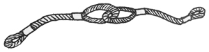
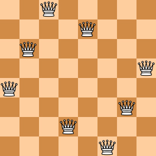
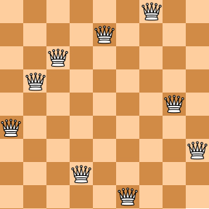
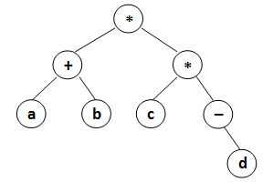
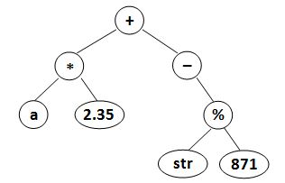

# PAT A 121 - 130


## [A1121. Damn Single (25)](https://www.patest.cn/contests/pat-a-practise/1121)

"Damn Single (单身狗)" is the Chinese nickname for someone who is being single. You are supposed to find those who are alone in a big party, so they can be taken care of.

**Input Specification:**

Each input file contains one test case. For each case, the first line gives a positive integer N (<=50000), the total number of couples. Then N lines of the couples follow, each gives a couple of ID's which are 5-digit numbers (i.e. from 00000 to 99999). After the list of couples, there is a positive integer M (<=10000) followed by M ID's of the party guests. The numbers are separated by spaces. It is guaranteed that nobody is having bigamous marriage (重婚) or dangling with more than one companion.

**Output Specification:**

First print in a line the total number of lonely guests. Then in the next line, print their ID's in increasing order. The numbers must be separated by exactly 1 space, and there must be no extra space at the end of the line.

**Sample Input:**

```
3
11111 22222
33333 44444
55555 66666
7
55555 44444 10000 88888 22222 11111 23333
```

**Sample Output:**

```
5
10000 23333 44444 55555 88888
```

```c
#include <iostream>
#include <vector>
#include <set>
#include <map>
#include <algorithm>
using namespace std;
const int MAX_ID = 100000;
map<int, int> companion;

int main () {

	int n, a, b, m, query;
	vector<int> ans;
	set<int> party;
	cin >> n;
	while (n--) {
		cin >> a >> b;
		companion[a] = b;
		companion[b] = a;
	}
	cin >> m;
	while (m--) {
		cin >> query;
		party.insert(query);
	}
	for (set<int>::iterator it = party.begin(); it != party.end(); it++) {
		if (companion.find(*it) == companion.end()) { ans.push_back(*it); continue; }
		if (party.find(companion[*it]) == party.end()) { ans.push_back(*it); continue; }
	}
	sort(ans.begin(), ans.end());
	cout << ans.size() << endl;
	for (int i = 0; i < ans.size(); i++) {
		printf("%05d", ans[i]);
		if (i < ans.size() - 1) printf(" ");
	}

	return 0;
}
```


------


## [A1122. Hamiltonian Cycle (25)](https://www.patest.cn/contests/pat-a-practise/1122)

The "Hamilton cycle problem" is to find a simple cycle that contains every vertex in a graph. Such a cycle is called a "Hamiltonian cycle".

In this problem, you are supposed to tell if a given cycle is a Hamiltonian cycle.

**Input Specification:**

Each input file contains one test case. For each case, the first line contains 2 positive integers N (2< N <= 200), the number of vertices, and M, the number of edges in an undirected graph. Then M lines follow, each describes an edge in the format "Vertex1 Vertex2", where the vertices are numbered from 1 to N. The next line gives a positive integer K which is the number of queries, followed by K lines of queries, each in the format:

```
n V1 V2 ... Vn
```

where n is the number of vertices in the list, and Vi's are the vertices on a path.

**Output Specification:**

For each query, print in a line "YES" if the path does form a Hamiltonian cycle, or "NO" if not.

**Sample Input:**

```
6 10
6 2
3 4
1 5
2 5
3 1
4 1
1 6
6 3
1 2
4 5
6
7 5 1 4 3 6 2 5
6 5 1 4 3 6 2
9 6 2 1 6 3 4 5 2 6
4 1 2 5 1
7 6 1 3 4 5 2 6
7 6 1 2 5 4 3 1
```

**Sample Output:**

```
YES
NO
NO
NO
YES
NO
```

尚未完全通过（22/25）

```c
#include <iostream>
#include <vector>
#include <set>
using namespace std;

int main () {

	int N, M, a, b, k, n, vex, start, prev;
	cin >> N >> M;
	vector<vector<int>> G(N + 1, vector<int>(N + 1, 0));
	while (M--) {
		cin >> a >> b;
		G[a][b] = 1;
		G[b][a] = 1;
	}
	cin >> k;
	set<int> path;
	bool flag = true;
	while (k--) {
		cin >> n;
		flag = true;
		if (n != N + 1) flag = false;
		for (int i = 0; i < n; i++) {
			cin >> vex;
			if (flag) {
				if (i == 0) start = vex;
				else if (G[prev][vex] == 0) flag = false;
				path.insert(vex);
				prev = vex;
				if (i == n - 2 && path.size() < N) flag = false;
				if (i == n - 1 && vex != start) flag = false;
			} else continue;
		}
		if (flag) cout << "YES" << endl;
		else cout << "NO" << endl;
	}


	return 0;
}
```


------


## [A1123. Is It a Complete AVL Tree (30)](https://www.patest.cn/contests/pat-a-practise/1123)

An AVL tree is a self-balancing binary search tree. In an AVL tree, the heights of the two child subtrees of any node differ by at most one; if at any time they differ by more than one, rebalancing is done to restore this property. Figures 1-4 illustrate the rotation rules.


Now given a sequence of insertions, you are supposed to output the level-order traversal sequence of the resulting AVL tree, and to tell if it is a complete binary tree.

**Input Specification:**

Each input file contains one test case. For each case, the first line contains a positive integer N (<= 20). Then N distinct integer keys are given in the next line. All the numbers in a line are separated by a space.

**Output Specification:**

For each test case, insert the keys one by one into an initially empty AVL tree. Then first print in a line the level-order traversal sequence of the resulting AVL tree. All the numbers in a line must be separated by a space, and there must be no extra space at the end of the line. Then in the next line, print "YES" if the tree is complete, or "NO" if not.

**Sample Input 1:**

```
5
88 70 61 63 65
```

**Sample Output 1:**

```
70 63 88 61 65
YES
```

**Sample Input 2:**

```
8
88 70 61 96 120 90 65 68
```

**Sample Output 2:**

```
88 65 96 61 70 90 120 68
NO
```

```c
#include <iostream>
#include <queue>
using namespace std;

int n;

struct TreeNode {
	int val, height;
	TreeNode *left, *right;
	TreeNode(int x): val(x), height(1), left(NULL), right(NULL) {};
};

bool bfs (TreeNode* root) {
	queue<TreeNode*> q;
	q.push(root);
	int i = 0;
	bool isComplete = true, isEnd = false;;
	while (!q.empty()) {
		TreeNode* cur = q.front();
		q.pop();
		cout << cur->val;
		if (i < n - 1) cout << " ";
		i++;
		if (cur->left) {
			if (isEnd) isComplete = false;
			q.push(cur->left);
		} else isEnd = true;
		if (cur->right) {
			if (isEnd) isComplete = false;
			q.push(cur->right);
		} else isEnd = true;
	}
	return isComplete;
}

int getHeight (TreeNode* root) {
	if (root == NULL) return 0;
	else return root->height;
}

void updateHeight (TreeNode* root) {
	root->height = max(getHeight(root->left), getHeight(root->right)) + 1;
}

void leftRotate (TreeNode* &root) {
	TreeNode* temp = root->right;
	root->right = temp->left;
	temp->left = root;
	updateHeight(root);
	updateHeight(temp);
	root = temp;
}

void rightRotate (TreeNode* &root) {
	TreeNode* temp = root->left;
	root->left = temp->right;
	temp->right = root;
	updateHeight(root);
	updateHeight(temp);
	root = temp;
}

void insertNode (TreeNode* &root, int x) {
	if (root == NULL) {
		root = new TreeNode(x);
		return;
	}
	if (x < root->val) {
		insertNode(root->left, x);
		updateHeight(root->left);
		if (getHeight(root->left) - getHeight(root->right) == 2) {
			if (getHeight(root->left->left) - getHeight(root->left->right) == 1) {
				rightRotate(root);
			} else if (getHeight(root->left->right) - getHeight(root->left->left) == 1) {
				leftRotate(root->left);
				rightRotate(root);
			}
		}
	} else {
		insertNode(root->right, x);
		updateHeight(root->right);
		if (getHeight(root->right) - getHeight(root->left) == 2) {
			if (getHeight(root->right->right) - getHeight(root->right->left) == 1) {
				leftRotate(root);
			} else if (getHeight(root->right->left) - getHeight(root->right->right) == 1) {
				rightRotate(root->right);
				leftRotate(root);
			}
		}
	}
}

int main () {

	int num;
	cin >> n;
	TreeNode* root = NULL;
	for (int i = 0; i < n; i++) {
		cin >> num;
		insertNode(root, num);
	}
	if (bfs(root))
		cout << endl << "YES" << endl;
	else
		cout << endl << "NO" << endl;

	return 0;
}
```


------


## [A1124. Raffle for Weibo Followers (20)](https://www.patest.cn/contests/pat-a-practise/1124)

John got a full mark on PAT. He was so happy that he decided to hold a raffle（抽奖） for his followers on Weibo -- that is, he would select winners from every N followers who forwarded his post, and give away gifts. Now you are supposed to help him generate the list of winners.

**Input Specification:**

Each input file contains one test case. For each case, the first line gives three positive integers M (<= 1000), N and S, being the total number of forwards, the skip number of winners, and the index of the first winner (the indices start from 1). Then M lines follow, each gives the nickname (a nonempty string of no more than 20 characters, with no white space or return) of a follower who has forwarded John's post.

Note: it is possible that someone would forward more than once, but no one can win more than once. Hence if the current candidate of a winner has won before, we must skip him/her and consider the next one.

**Output Specification:**

For each case, print the list of winners in the same order as in the input, each nickname occupies a line. If there is no winner yet, print "Keep going..." instead.

**Sample Input 1:**

```
9 3 2
Imgonnawin!
PickMe
PickMeMeMeee
LookHere
Imgonnawin!
TryAgainAgain
TryAgainAgain
Imgonnawin!
TryAgainAgain
```

**Sample Output 1:**

```
PickMe
Imgonnawin!
TryAgainAgain
```

**Sample Input 2:**

```
2 3 5
Imgonnawin!
PickMe
```

**Sample Output 2:**

```
Keep going...
```

```c
#include <iostream>
#include <string>
#include <vector>
#include <unordered_set>
using namespace std;

int main () {

	int m, n, s;
	string nickname;
	unordered_set<string> winners;
	vector<string> w;
	cin >> m >> n >> s;
	int j = 1;
	for (int i = 1; i <= m; i++) {
		cin >> nickname;
		if ((i > s && j == n) || i == s) {
			if (winners.find(nickname) == winners.end()) {
				winners.insert(nickname);
				w.push_back(nickname);
			} else {
				continue;
			}
			j = 1;
		} else {
			j++;
		}
	}

	if (winners.empty()) {
		cout << "Keep going..." << endl;
	} else {
		for (string s : w)
			cout << s << endl;
	}

	return 0;
}
```


------


## [A1125. Chain the Ropes (25)](https://www.patest.cn/contests/pat-a-practise/1125)

Given some segments of rope, you are supposed to chain them into one rope. Each time you may only fold two segments into loops and chain them into one piece, as shown by the figure. The resulting chain will be treated as another segment of rope and can be folded again. After each chaining, the lengths of the original two segments will be halved.



Your job is to make the longest possible rope out of N given segments.

**Input Specification:**

Each input file contains one test case. For each case, the first line gives a positive integer N (2 <= N <= 104). Then N positive integer lengths of the segments are given in the next line, separated by spaces. All the integers are no more than 104.

**Output Specification:**

For each case, print in a line the length of the longest possible rope that can be made by the given segments. The result must be rounded to the nearest integer that is no greater than the maximum length.

**Sample Input:**

```
8
10 15 12 3 4 13 1 15
```

**Sample Output:**

```
14
```

```c
#include <iostream>
#include <vector>
#include <cmath>
#include <algorithm>
using namespace std;

int main () {

	int n;
	cin >> n;
	vector<int> v(n);
	for (int i = 0; i < n; i++)
		cin >> v[i];
	sort(v.begin(), v.end());
	double len = v[0];
	for (int i = 1; i < v.size(); i++)
		len = (len + v[i]) / 2;
	cout << floor(len) << endl;

	return 0;
}
```


------


## [A1126. Eulerian Path (25)](https://www.patest.cn/contests/pat-a-practise/1126)

In graph theory, an Eulerian path is a path in a graph which visits every edge exactly once. Similarly, an Eulerian circuit is an Eulerian path which starts and ends on the same vertex. They were first discussed by Leonhard Euler while solving the famous Seven Bridges of Konigsberg problem in 1736. It has been proven that connected graphs with all vertices of even degree have an Eulerian circuit, and such graphs are called Eulerian. If there are exactly two vertices of odd degree, all Eulerian paths start at one of them and end at the other. A graph that has an Eulerian path but not an Eulerian circuit is called semi-Eulerian. (Cited from https://en.wikipedia.org/wiki/Eulerian_path)

Given an undirected graph, you are supposed to tell if it is Eulerian, semi-Eulerian, or non-Eulerian.

**Input Specification:**

Each input file contains one test case. Each case starts with a line containing 2 numbers N (<= 500), and M, which are the total number of vertices, and the number of edges, respectively. Then M lines follow, each describes an edge by giving the two ends of the edge (the vertices are numbered from 1 to N).

**Output Specification:**

For each test case, first print in a line the degrees of the vertices in ascending order of their indices. Then in the next line print your conclusion about the graph -- either "Eulerian", "Semi-Eulerian", or "Non-Eulerian". Note that all the numbers in the first line must be separated by exactly 1 space, and there must be no extra space at the beginning or the end of the line.

**Sample Input 1:**

```
7 12
5 7
1 2
1 3
2 3
2 4
3 4
5 2
7 6
6 3
4 5
6 4
5 6
```

**Sample Output 1:**

```
2 4 4 4 4 4 2
Eulerian
```

**Sample Input 2:**

```
6 10
1 2
1 3
2 3
2 4
3 4
5 2
6 3
4 5
6 4
5 6
```

**Sample Output 2:**

```
2 4 4 4 3 3
Semi-Eulerian
```

**Sample Input 3:**

```
5 8
1 2
2 5
5 4
4 1
1 3
3 2
3 4
5 3
```

**Sample Output 3:**

```
3 3 4 3 3
Non-Eulerian
```

```c
#include <iostream>
#include <vector>
using namespace std;
vector<vector<int>> G;
vector<bool> vis;
int num = 0;

void dfs (int now) {
	num++;
	vis[now] = true;
	for (int i = 0; i < G[now].size(); i++) {
		if (!vis[G[now][i]])
			dfs(G[now][i]);
	}
}

int main () {

	int n, m, a, b;
	cin >> n >> m;
	G.resize(n + 1);
	vis.resize(n + 1, false);
	vector<int> degree(n + 1, 0);
	while (m--) {
		cin >> a >> b;
		G[a].push_back(b);
		G[b].push_back(a);
		degree[a]++;
		degree[b]++;
	}

	int cnt = 0;
	for (int i = 1; i <= n; i++) {
		if (degree[i] % 2 == 1) cnt++;
		cout << degree[i];
		if (i < n) cout << " ";
	}
	cout << endl;

	dfs(1);
	if (num == n) {
		if (cnt == 0) cout << "Eulerian" << endl;
		else if (cnt == 2) cout << "Semi-Eulerian" << endl;
		else cout << "Non-Eulerian" << endl;
	} else {
		cout << "Non-Eulerian" << endl;
	}

	return 0;
}
```


------


## [A1127. ZigZagging on a Tree (30)](https://www.patest.cn/contests/pat-a-practise/1127)

Suppose that all the keys in a binary tree are distinct positive integers. A unique binary tree can be determined by a given pair of postorder and inorder traversal sequences. And it is a simple standard routine to print the numbers in level-order. However, if you think the problem is too simple, then you are too naive. This time you are supposed to print the numbers in "zigzagging order" -- that is, starting from the root, print the numbers level-by-level, alternating between left to right and right to left. For example, for the following tree you must output: 1 11 5 8 17 12 20 15.


**Input Specification:**

Each input file contains one test case. For each case, the first line gives a positive integer N (<= 30), the total number of nodes in the binary tree. The second line gives the inorder sequence and the third line gives the postorder sequence. All the numbers in a line are separated by a space.

**Output Specification:**

For each test case, print the zigzagging sequence of the tree in a line. All the numbers in a line must be separated by exactly one space, and there must be no extra space at the end of the line.

**Sample Input:**

```
8
12 11 20 17 1 15 8 5
12 20 17 11 15 8 5 1
```

**Sample Output:**

```
1 11 5 8 17 12 20 15
```

```c
#include <iostream>
#include <stack>
using namespace std;
const int MAXN = 30;
int n;
int cnt = 0;

struct TreeNode {
	int val;
	TreeNode *left, *right;
	TreeNode(int x): val(x), left(NULL), right(NULL) {};
};

int getIndex (int v[], int x, int len) {
	for (int i = 0; i < len; i++)
		if (v[i] == x) return i;
	return -1;
}

TreeNode* buildTree (int* in, int* post, int len) {
	if (len == 0) return NULL;
	TreeNode *root = new TreeNode(post[len - 1]);
	int r_index = getIndex(in, post[len - 1], len);
	root->left = buildTree(in, post, r_index);
	root->right = buildTree(in + r_index + 1, post + r_index, len - r_index - 1);
	return root;
}

void bfs (TreeNode *root) {
	stack<TreeNode*> s1, s2;
	bool flag = true;
	s1.push(root);
	while (!s1.empty() || !s2.empty()) {
		if (flag) {
			while (!s1.empty()) {
				TreeNode* cur = s1.top();
				s1.pop();
				cout << cur->val; cnt++;
				if (cnt < n) cout << " ";
				if (cur->right) s2.push(cur->right);
				if (cur->left) s2.push(cur->left);
			}
		} else {
			while (!s2.empty()) {
				TreeNode* cur = s2.top();
				s2.pop();
				cout << cur->val; cnt++;
				if (cnt < n) cout << " ";
				if (cur->left) s1.push(cur->left);
				if (cur->right) s1.push(cur->right);
			}
		}
		flag = !flag;
	}
}

int main () {

	cin >> n;
	int in[MAXN], post[MAXN];
	for (int i = 0; i < n; i++)
		cin >> in[i];
	for (int i = 0; i < n; i++)
		cin >> post[i];

	TreeNode *root = buildTree(in, post, n);
	bfs(root);
	cout << endl;

	return 0;
}
```


------


## [A1128. N Queens Puzzle (20)](https://www.patest.cn/contests/pat-a-practise/1128)

The "eight queens puzzle" is the problem of placing eight chess queens on an 8×8 chessboard so that no two queens threaten each other. Thus, a solution requires that no two queens share the same row, column, or diagonal. The eight queens puzzle is an example of the more general N queens problem of placing N non-attacking queens on an N×N chessboard. (From Wikipedia - "Eight queens puzzle".)

Here you are NOT asked to solve the puzzles. Instead, you are supposed to judge whether or not a given configuration of the chessboard is a solution. To simplify the representation of a chessboard, let us assume that no two queens will be placed in the same column. Then a configuration can be represented by a simple integer sequence (Q1, Q2, ..., QN), where Qi is the row number of the queen in the i-th column. For example, Figure 1 can be represented by (4, 6, 8, 2, 7, 1, 3, 5) and it is indeed a solution to the 8 queens puzzle; while Figure 2 can be represented by (4, 6, 7, 2, 8, 1, 9, 5, 3) and is NOT a 9 queens' solution.





**Input Specification:**

Each input file contains several test cases. The first line gives an integer K (1 < K <= 200). Then K lines follow, each gives a configuration in the format "N Q1 Q2 ... QN", where 4 <= N <= 1000 and it is guaranteed that 1 <= Qi <= N for all i=1, ..., N. The numbers are separated by spaces.

**Output Specification:**

For each configuration, if it is a solution to the N queens problem, print "YES" in a line; or "NO" if not.

**Sample Input:**

```
4
8 4 6 8 2 7 1 3 5
9 4 6 7 2 8 1 9 5 3
6 1 5 2 6 4 3
5 1 3 5 2 4
```

**Sample Output:**

```
YES
NO
NO
YES
```

```c
#include <iostream>
#include <set>
using namespace std;

int main () {

	int k, n, num;
	set<int> row, diagonal1, diagonal2;
	cin >> k;
	while (k--) {
		cin >> n;
		bool flag = true;
		row.clear();
		diagonal1.clear();
		diagonal2.clear();
		for (int i = 1; i <= n; i++) {
			cin >> num;
			if (row.find(num) != row.end()
				|| diagonal1.find(i - num) != diagonal1.end()
				|| diagonal2.find(i + num) != diagonal2.end())
				flag = false;
			row.insert(num);
			diagonal1.insert(i - num);
			diagonal2.insert(i + num);
		}
		if (flag) cout << "YES" << endl;
		else cout << "NO" << endl;
	}

	return 0;
}
```


------


## [A1129. Recommendation System (25)](https://www.patest.cn/contests/pat-a-practise/1129)

Recommendation system predicts the preference that a user would give to an item. Now you are asked to program a very simple recommendation system that rates the user's preference by the number of times that an item has been accessed by this user.

**Input Specification:**

Each input file contains one test case. For each test case, the first line contains two positive integers: N (<= 50000), the total number of queries, and K (<= 10), the maximum number of recommendations the system must show to the user. Then given in the second line are the indices of items that the user is accessing -- for the sake of simplicity, all the items are indexed from 1 to N. All the numbers in a line are separated by a space.

**Output Specification:**

For each case, process the queries one by one. Output the recommendations for each query in a line in the format:

```
query: rec[1] rec[2] ... rec[K]
```

where query is the item that the user is accessing, and rec[i] (i = 1, ... K) is the i-th item that the system recommends to the user. The first K items that have been accessed most frequently are supposed to be recommended in non-increasing order of their frequencies. If there is a tie, the items will be ordered by their indices in increasing order.

Note: there is no output for the first item since it is impossible to give any recommendation at the time. It is guaranteed to have the output for at least one query.

**Sample Input:**

```
12 3
3 5 7 5 5 3 2 1 8 3 8 12
```

**Sample Output:**

```
5: 3
7: 3 5
5: 3 5 7
5: 5 3 7
3: 5 3 7
2: 5 3 7
1: 5 3 2
8: 5 3 1
3: 5 3 1
8: 3 5 1
12: 3 5 8
```

**未完全通过，有两组数据超时，`18/25`；[查看提交](https://www.patest.cn/submissions/3525956)**

```c
#include <iostream>
#include <vector>
#include <algorithm>
using namespace std;

struct Rec {
	int val, num;
	Rec(int v): val(v), num(1) {};
};

bool cmp (Rec r1, Rec r2) {
	if (r1.num != r2.num)
		return r1.num >= r2.num;
	else
		return r1.val < r2.val;
}

int find_rec (vector<Rec> v, int val) {
	for (int i = 0; i < v.size(); i++) {
		if (v[i].val == val) return i;
	}
	return -1;
}

int main () {

	int n, k, query;
	cin >> n >> k;
	vector<Rec> recs;
	for (int i = 0; i < n; i++) {
		cin >> query;
		if (i > 0) {
			cout << query << ": ";
			sort(recs.begin(), recs.end(), cmp);
			for (int x = 0; x < recs.size(); x++) {
				if (x >= k) break;
				cout << recs[x].val;
				if (x < recs.size() - 1 && x < k - 1) cout << " ";
			}
			cout << endl;
		}
		int j = find_rec(recs, query);
		if (j == -1) recs.push_back(Rec(query));
		else recs[j].num++;
	}

	return 0;
}
```

**下面代码参考 [柳婼 の blog](http://www.liuchuo.net/archives/3848)，全部通过**

**主要思路是自定义一个 `struct` 然后重载 `operator < `，插入 `set` 的时候会自动依据自定义的规则进行排序**

```c
#include <iostream>
#include <vector>
#include <set>
using namespace std;
const int MAXN = 50001;
vector<int> freq(MAXN, 0);

struct Rec {
	int val, freq;
	Rec(int v, int f): val(v), freq(f) {};
	bool operator < (const Rec &a) const {
		if (freq != a.freq)
			return freq > a.freq;
		else
			return val < a.val;
	}
};

int main () {

	int n, k, query;
	cin >> n >> k;
	set<Rec> recs;
	for (int i = 0; i < n; i++) {
		cin >> query;
		if (i > 0) {
			cout << query << ":";
			int cnt = 0;
			for (set<Rec>::iterator it = recs.begin(); cnt < k && it != recs.end(); it++) {
				cout << " " << it->val;
				cnt++;
			}
			cout << endl;
		}
		set<Rec>::iterator it = recs.find(Rec(query, freq[query]));
		if (it != recs.end()) recs.erase(it);
		freq[query]++;
		recs.insert(Rec(query, freq[query]));
	}

	return 0;
}
```


------


## [A1130. Infix Expression (25)](https://www.patest.cn/contests/pat-a-practise/1130)

Given a syntax tree (binary), you are supposed to output the corresponding infix expression, with parentheses reflecting the precedences of the operators.

**Input Specification:**

Each input file contains one test case. For each case, the first line gives a positive integer N ( <= 20 ) which is the total number of nodes in the syntax tree. Then N lines follow, each gives the information of a node (the i-th line corresponds to the i-th node) in the format:

```
data left_child right_child
```

where data is a string of no more than 10 characters, left_child and right_child are the indices of this node's left and right children, respectively. The nodes are indexed from 1 to N. The NULL link is represented by -1. The figures 1 and 2 correspond to the samples 1 and 2, respectively.





**Output Specification:**

For each case, print in a line the infix expression, with parentheses reflecting the precedences of the operators. Note that there must be no extra parentheses for the final expression, as is shown by the samples. There must be no space between any symbols.

**Sample Input 1:**

```
8
* 8 7
a -1 -1
* 4 1
+ 2 5
b -1 -1
d -1 -1
- -1 6
c -1 -1
```

**Sample Output 1:**

```
(a+b)*(c*(-d))
```

**Sample Input 2:**

```
8
2.35 -1 -1
* 6 1
- -1 4
% 7 8
+ 2 3
a -1 -1
str -1 -1
871 -1 -1
```

**Sample Output 2:**

```
(a*2.35)+(-(str%871))
```

```c
#include <cstdio>
#include <iostream>
#include <string>
#include <vector>
using namespace std;
const int maxn = 30;
int n;
struct TreeNode {
    string value;
    int lchild, rchild;
};

vector<TreeNode> nodes;
bool isRoot[maxn];

void dfs (int root, bool flag) {
    if (root == -1) return;
    if (nodes[root].rchild == -1) flag = true;
    if (flag) { // 如果是跟节点或者是叶子节点就不打印括号
        dfs(nodes[root].lchild, false);
        cout << nodes[root].value;
        dfs(nodes[root].rchild, false);
    } else {
        cout << "(";
        dfs(nodes[root].lchild, false);
        cout << nodes[root].value;
        dfs(nodes[root].rchild, false);
        cout << ")";
    }
}

int findRoot () {
    int root = 1;
    for (int i = 1; i <= n; i++) {
        if (isRoot[i] == true) {
            root = i;
            break;
        }
    }
    return root;
}

int main (int argc, const char * argv[]) {

    scanf("%d", &n);
    nodes.resize(n + 1);
    fill(isRoot, isRoot + n + 1, true);
    for (int i = 1; i <= n; i++) {
        cin >> nodes[i].value >> nodes[i].lchild >> nodes[i].rchild;
        if (nodes[i].lchild != -1) isRoot[nodes[i].lchild] = false;
        if (nodes[i].rchild != -1) isRoot[nodes[i].rchild] = false;
    }

    int root = findRoot();
    dfs(root, true);

    return 0;
}
```

**下面的代码未完全通过，`24/25`，原因未知；[查看提交](https://www.patest.cn/submissions/3526177)**

```c
#include <iostream>
#include <vector>
#include <string>
using namespace std;

struct TreeNode {
	string val;
	int left, right;
	TreeNode(string v, int l, int r): val(v), left(l), right(r) {};
};

vector<TreeNode*> tree;

string inOrder (int now) {
	if (now == -1) return "";
	if (tree[now]->left != -1 || tree[now]->right != -1)
		return "(" + inOrder(tree[now]->left) + tree[now]->val + inOrder(tree[now]->right) + ")";
	else
		return tree[now]->val;
}

int main () {

	int n, left, right;
	string c;
	cin >> n;
	tree.resize(n + 1);
	vector<bool> vis(n + 1, false);
	for (int i = 1; i <= n; i++) {
		cin >> c >> left >> right;
		if (left != -1) vis[left] = true;
		if (right != -1) vis[right] = true;
		tree[i] = new TreeNode(c, left, right);
	}
	int root = -1;
	for (int i = 1; i <= n; i++) {
		if (!vis[i]) {
			root = i; break;
		}
	}
	string ans = inOrder(root);
	ans.erase(0, 1); ans.erase(ans.length() - 1, 1);
	cout << ans << endl;

	return 0;
}
```
