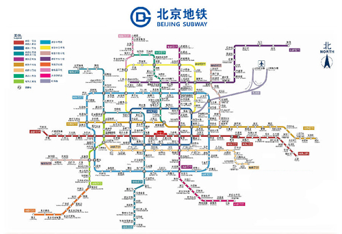

# PAT A 131 - 140


## [A1131. Subway Map (30)](https://www.patest.cn/contests/pat-a-practise/1131)

In the big cities, the subway systems always look so complex to the visitors. To give you some sense, the following figure shows the map of Beijing subway. Now you are supposed to help people with your computer skills! Given the starting position of your user, your task is to find the quickest way to his/her destination.



**Input Specification:**

Each input file contains one test case. For each case, the first line contains a positive integer N (< =100), the number of subway lines. Then N lines follow, with the i-th (i = 1, ..., N) line describes the i-th subway line in the format:

```
M S[1] S[2] ... S[M]
```

where M (<= 100) is the number of stops, and S[i]'s (i = 1, ... M) are the indices of the stations (the indices are 4-digit numbers from 0000 to 9999) along the line. It is guaranteed that the stations are given in the correct order -- that is, the train travels between S[i] and S[i+1] (i = 1, ..., M-1) without any stop.

Note: It is possible to have loops, but not self-loop (no train starts from S and stops at S without passing through another station). Each station interval belongs to a unique subway line. Although the lines may cross each other at some stations (so called "transfer stations"), no station can be the conjunction of more than 5 lines.

After the description of the subway, another positive integer K (<= 10) is given. Then K lines follow, each gives a query from your user: the two indices as the starting station and the destination, respectively.

The following figure shows the sample map.


Note: It is guaranteed that all the stations are reachable, and all the queries consist of legal station numbers.

**Output Specification:**

For each query, first print in a line the minimum number of stops. Then you are supposed to show the optimal path in a friendly format as the following:

```
Take Line#X1 from S1 to S2.
Take Line#X2 from S2 to S3.
......
```

where Xi's are the line numbers and Si's are the station indices. Note: Besides the starting and ending stations, only the transfer stations shall be printed.

If the quickest path is not unique, output the one with the minimum number of transfers, which is guaranteed to be unique.

**Sample Input:**

```
4
7 1001 3212 1003 1204 1005 1306 7797
9 9988 2333 1204 2006 2005 2004 2003 2302 2001
13 3011 3812 3013 3001 1306 3003 2333 3066 3212 3008 2302 3010 3011
4 6666 8432 4011 1306
3
3011 3013
6666 2001
2004 3001
```

**Sample Output:**

```
2
Take Line#3 from 3011 to 3013.
10
Take Line#4 from 6666 to 1306.
Take Line#3 from 1306 to 2302.
Take Line#2 from 2302 to 2001.
6
Take Line#2 from 2004 to 1204.
Take Line#1 from 1204 to 1306.
Take Line#3 from 1306 to 3001.
```

```c
#include <iostream>
#include <vector>
#include <map>
#include <climits>
using namespace std;
const int MAX_ID = 10000;
vector<vector<int>> G(MAX_ID);
vector<bool> vis(MAX_ID, false);
map<pair<int, int>, int> line;
vector<int> path, route;
int shortest = INT_MAX;

void init () {
	shortest = INT_MAX;
	fill(vis.begin(), vis.end(), false);
	path.clear();
	route.clear();
}

int get_transfer (vector<int> p) {
	int cnt = 0;
	int prev_l = -1;
	for (int i = 1; i < p.size(); i++) {
		int l = line[make_pair(p[i - 1], p[i])];
		if (l != prev_l) cnt++;
		prev_l = l;
	}
	return cnt;
}

void dfs (int now, int dest) {
	if (now == dest) {
		if (route.size() < shortest) {
			path = route;
			shortest = route.size();
		} else if (route.size() == shortest) {
			if (get_transfer(route) < get_transfer(path))
				path = route;
		}
	}
	for (int i = 0; i < G[now].size(); i++) {
		if (!vis[G[now][i]]) {
			vis[G[now][i]] = true;
			route.push_back(G[now][i]);
			dfs(G[now][i], dest);
			route.pop_back();
			vis[G[now][i]] = false;
		}
	}
}

int main () {

	int n, m, id, prev_id, k, start, dest;
	cin >> n;
	for (int i = 1; i <= n; i++) {
		cin >> m;
		prev_id = -1;
		while (m--) {
			cin >> id;
			if (prev_id != -1) {
				G[prev_id].push_back(id);
				G[id].push_back(prev_id);
				line[make_pair(prev_id, id)] = i;
				line[make_pair(id, prev_id)] = i;
			}
			prev_id = id;
		}
	}
	cin >> k;
	while (k--) {
		cin >> start >> dest;
		init();
		route.push_back(start);
		dfs(start, dest);
		cout << path.size() - 1 << endl;
		int prev_line = -1;
		for (int i = 1; i < path.size(); i++) {
			int l = line[make_pair(path[i - 1], path[i])];
			if (l != prev_line) {
				if (prev_line != -1) printf(" to %04d.\n", path[i - 1]);
				printf("Take Line#%d from %04d", l, path[i - 1]);
			}
			if (i == path.size() - 1) printf(" to %04d.\n", path[i]);
			prev_line = l;
		}
	}

	return 0;
}
```


------


## [A1132. Cut Integer (20)](https://www.patest.cn/contests/pat-a-practise/1132)

Cutting an integer means to cut a K digits long integer Z into two integers of (K/2) digits long integers A and B. For example, after cutting Z = 167334, we have A = 167 and B = 334. It is interesting to see that Z can be devided by the product of A and B, as 167334 / (167 x 334) = 3. Given an integer Z, you are supposed to test if it is such an integer.

**Input Specification:**

Each input file contains one test case. For each case, the first line gives a positive integer N (<= 20). Then N lines follow, each gives an integer Z (10<=Z<=231). It is guaranteed that the number of digits of Z is an even number.

**Output Specification:**

For each case, print a single line "Yes" if it is such a number, or "No" if not.

**Sample Input:**

```
3
167334
2333
12345678
```

**Sample Output:**

```
Yes
No
No
```

```c
#include <iostream>
#include <string>
using namespace std;

int main () {

	int n;
	string c;
	cin >> n;
	while (n--) {
		cin >> c;
		int a = stoi(c.substr(0, c.length() / 2));
		int b = stoi(c.substr(c.length() / 2));
		if (a * b == 0) {
			cout << "No" << endl;
		} else {
			if (stoi(c) % (a * b) == 0) cout << "Yes" << endl;
			else cout << "No" <<endl;
		}
	}

	return 0;
}
```


------


## [A1133. Splitting A Linked List (25)](https://www.patest.cn/contests/pat-a-practise/1133)

Given a singly linked list, you are supposed to rearrange its elements so that all the negative values appear before all of the non-negatives, and all the values in [0, K] appear before all those greater than K. The order of the elements inside each class must not be changed. For example, given the list being 18→7→-4→0→5→-6→10→11→-2 and K being 10, you must output -4→-6→-2→7→0→5→10→18→11.

**Input Specification:**

Each input file contains one test case. For each case, the first line contains the address of the first node, a positive N (<= 105) which is the total number of nodes, and a positive K (<=1000). The address of a node is a 5-digit nonnegative integer, and NULL is represented by -1.

Then N lines follow, each describes a node in the format:

```
Address Data Next
```

where Address is the position of the node, Data is an integer in [-105, 105], and Next is the position of the next node. It is guaranteed that the list is not empty.

**Output Specification:**

For each case, output in order (from beginning to the end of the list) the resulting linked list. Each node occupies a line, and is printed in the same format as in the input.

**Sample Input:**

```
00100 9 10
23333 10 27777
00000 0 99999
00100 18 12309
68237 -6 23333
33218 -4 00000
48652 -2 -1
99999 5 68237
27777 11 48652
12309 7 33218
```

**Sample Output:**

```
33218 -4 68237
68237 -6 48652
48652 -2 12309
12309 7 00000
00000 0 99999
99999 5 23333
23333 10 00100
00100 18 27777
27777 11 -1
```

**下面的代码没有考虑列表中会有重复的值的情况，
所以有一个验证没有通过；`20/25`；[查看提交](https://www.patest.cn/submissions/3663906)**

```c
#include <iostream>
#include <vector>
#include <map>
using namespace std;

struct Node {
	int val, next;
	Node (int val, int next): val(val), next(next) {};
};

int main () {

	int head, n, k, addr, val, next;
	cin >> head >> n >> k;
	map<int, int> val2addr;
	map<int, Node*> list;
	vector<int> v1, v2, v3;
	while (n--) {
		cin >> addr >> val >> next;
		val2addr[val] = addr;
		list[addr] = new Node (val, next);
	}

	int now = head;
	while (now != -1) {
		int val = list[now]->val;
		if (val < 0) v1.push_back(val);
		else if (val > k) v3.push_back(val);
		else v2.push_back(val);
		now = list[now]->next;
	}

	for (int i = 0; i < v1.size(); i++) {
		if (i > 0) printf("%05d\n", val2addr[v1[i]]);
		printf("%05d %d ", val2addr[v1[i]], v1[i]);
	}
	if (!v1.empty() && !v2.empty()) printf("%05d\n", val2addr[v2[0]]);
	for (int i = 0; i < v2.size(); i++) {
		if (i > 0) printf("%05d\n", val2addr[v2[i]]);
		printf("%05d %d ", val2addr[v2[i]], v2[i]);
	}
	if ((!v1.empty() || !v2.empty()) && !v3.empty()) printf("%05d\n", val2addr[v3[0]]);
	for (int i = 0; i < v3.size(); i++) {
		if (i > 0) printf("%05d\n", val2addr[v3[i]]);
		printf("%05d %d ", val2addr[v3[i]], v3[i]);
	}
	if (!v1.empty() || !v2.empty() || !v3.empty()) printf("-1\n");

	return 0;
}
```

**考虑重复的值的情况之后，即：一个值会对应多个地址。全部通过**

```c
#include <iostream>
#include <vector>
#include <map>
#include <queue>
using namespace std;

struct Node {
	int val, next;
	Node (int val, int next): val(val), next(next) {};
};

int main () {

	int head, n, k, addr, val, next;
	cin >> head >> n >> k;
	map<int, queue<int>> val2addr;
	map<int, Node*> list;
	vector<int> v1, v2, v3;
	while (n--) {
		cin >> addr >> val >> next;
		list[addr] = new Node (val, next);
	}

	int now = head;
	while (now != -1) {
		int val = list[now]->val;
		val2addr[val].push(now);
		if (val < 0) v1.push_back(val);
		else if (val > k) v3.push_back(val);
		else v2.push_back(val);
		now = list[now]->next;
	}

	for (int i = 0; i < v1.size(); i++) {
		if (i > 0) printf("%05d\n", val2addr[v1[i]].front());
		printf("%05d %d ", val2addr[v1[i]].front(), v1[i]);
		val2addr[v1[i]].pop();
	}
	if (!v1.empty() && !v2.empty()) printf("%05d\n", val2addr[v2[0]].front());
	for (int i = 0; i < v2.size(); i++) {
		if (i > 0) printf("%05d\n", val2addr[v2[i]].front());
		printf("%05d %d ", val2addr[v2[i]].front(), v2[i]);
		val2addr[v2[i]].pop();
	}
	if ((!v1.empty() || !v2.empty()) && !v3.empty()) printf("%05d\n", val2addr[v3[0]].front());
	for (int i = 0; i < v3.size(); i++) {
		if (i > 0) printf("%05d\n", val2addr[v3[i]].front());
		printf("%05d %d ", val2addr[v3[i]].front(), v3[i]);
		val2addr[v3[i]].pop();
	}
	if (!v1.empty() || !v2.empty() || !v3.empty()) printf("-1\n");

	return 0;
}
```


------


## [A1134. Vertex Cover (25)](https://www.patest.cn/contests/pat-a-practise/1134)

A vertex cover of a graph is a set of vertices such that each edge of the graph is incident to at least one vertex of the set. Now given a graph with several vertex sets, you are supposed to tell if each of them is a vertex cover or not.

**Input Specification:**

Each input file contains one test case. For each case, the first line gives two positive integers N and M (both no more than 104), being the total numbers of vertices and the edges, respectively. Then M lines follow, each describes an edge by giving the indices (from 0 to N-1) of the two ends of the edge.

After the graph, a positive integer K (<= 100) is given, which is the number of queries. Then K lines of queries follow, each in the format:

```
Nv v[1] v[2] ... v[Nv]
```

where Nv is the number of vertices in the set, and v[i]'s are the indices of the vertices.

**Output Specification:**

For each query, print in a line "Yes" if the set is a vertex cover, or "No" if not.

**Sample Input:**

```
10 11
8 7
6 8
4 5
8 4
8 1
1 2
1 4
9 8
9 1
1 0
2 4
5
4 0 3 8 4
6 6 1 7 5 4 9
3 1 8 4
2 2 8
7 9 8 7 6 5 4 2
```

**Sample Output:**

```
No
Yes
Yes
No
No
```

```c
#include <iostream>
#include <vector>
#include <set>
using namespace std;

int main () {

	int n, m, a, b;
	cin >> n >> m;
	vector<vector<int>> G(n);
	for (int i = 0; i < m; i++) {
		cin >> a >> b;
		G[a].push_back(b);
		G[b].push_back(a);
	}

	int k, nv, v;
	cin >> k;
	while (k--) {
		cin >> nv;
		set<int> s;
		while (nv--) {
			cin >> v;
			s.insert(v);
		}
		bool flag = true;
		for (int i = 0; i < n; i++) {
			if (!flag) break;
			if (s.find(i) == s.end()) {
				for (int j = 0; j < G[i].size(); j++) {
					if (s.find(G[i][j]) == s.end()) { flag = false; break; }
				}
			}
		}
		if (!flag) cout << "No" << endl;
		else cout << "Yes" << endl;
	}

	return 0;

}
```


------


## [A1135. Is It A Red-Black Tree (30)](https://www.patest.cn/contests/pat-a-practise/1135)

There is a kind of balanced binary search tree named red-black tree in the data structure. It has the following 5 properties:

1. Every node is either red or black.
2. The root is black.
3. Every leaf (NULL) is black.
4. If a node is red, then both its children are black.
5. For each node, all simple paths from the node to descendant leaves contain the same number of black nodes.

For example, the tree in Figure 1 is a red-black tree, while the ones in Figure 2 and 3 are not.


For each given binary search tree, you are supposed to tell if it is a legal red-black tree.

**Input Specification:**

Each input file contains several test cases. The first line gives a positive integer K (<=30) which is the total number of cases. For each case, the first line gives a positive integer N (<=30), the total number of nodes in the binary tree. The second line gives the preorder traversal sequence of the tree. While all the keys in a tree are positive integers, we use negative signs to represent red nodes. All the numbers in a line are separated by a space. The sample input cases correspond to the trees shown in Figure 1, 2 and 3.

**Output Specification:**

For each test case, print in a line "Yes" if the given tree is a red-black tree, or "No" if not.

**Sample Input:**

```
3
9
7 -2 1 5 -4 -11 8 14 -15
9
11 -2 1 -7 5 -4 8 14 -15
8
10 -7 5 -6 8 15 -11 17
```

**Sample Output:**

```
Yes
No
No
```

```c
#include <iostream>
#include <vector>
#include <cmath>
#include <queue>
using namespace std;
const int MAXN = 30;
vector<int> path_cnt;

struct TreeNode {
	int val;
	bool color; // true is black, false is red
	TreeNode *left, *right;
	TreeNode (int val, bool color): val(val), color(color), left(NULL), right(NULL) {};
};

int get_right_index (int* arr, int len) {
	for (int i = 1; i < len; i++)
		if (abs(*(arr + i)) > abs(*arr)) return i;
	return len;
}

TreeNode* buildTree (int *pre, int len) {
	if (len == 0) return NULL;
	TreeNode* root;
	if (pre[0] < 0) root = new TreeNode(abs(pre[0]), false);
	else root = new TreeNode(pre[0], true);
	int right = get_right_index(pre, len);
	root->left = buildTree(pre + 1, right - 1);
	root->right = buildTree(pre + right, len - right);
	return root;
}

bool case4 (TreeNode* root) {
	if (root == NULL) return true;
	if (root->color == false) {
		if (root->left && !root->left->color) return false;
		if (root->right && !root->right->color) return false;
	}
	return case4(root->left) && case4(root->right);
}

void dfs (TreeNode* root, int cnt) {
	if (root == NULL) { path_cnt.push_back(cnt + 1); return; }
	if (root->color) cnt++;
	dfs(root->left, cnt);
	dfs(root->right, cnt);
}

bool case5 (TreeNode* root) {
	queue<TreeNode*> q;
	q.push(root);
	while (!q.empty()) {
		TreeNode* node = q.front();
		q.pop();
		path_cnt.clear();
		dfs(node, 0);
		for (int i = 0; i < path_cnt.size(); i++)
			if (path_cnt[i] != path_cnt[0]) return false;
		if (node->left) q.push(node->left);
		if (node->right) q.push(node->right);
	}
	return true;
}

int main () {

	int k, n;
	cin >> k;
	int pre[MAXN];
	while (k--) {
		cin >> n;
		for (int i = 0; i < n; i++) cin >> pre[i];
		TreeNode* root = buildTree(pre, n);
		if (!root->color) {
			cout << "No" << endl;
		} else {
			if (!case4(root)) {
				cout << "No" << endl;
			} else {
				if (!case5(root)) cout << "No" << endl;
				else cout << "Yes" << endl;
			}
		}
	}

	return 0;
}
```
