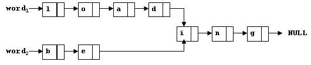

# PAT A 31 - 40


## [A1031. Hello World for U (20)](https://www.patest.cn/contests/pat-a-practise/1031)

Given any string of N (>=5) characters, you are asked to form the characters into the shape of U. For example, "helloworld" can be printed as:

```
h  d
e  l
l  r
lowo
```

That is, the characters must be printed in the original order, starting top-down from the left vertical line with n1 characters, then left to right along the bottom line with n2 characters, and finally bottom-up along the vertical line with n3 characters. And more, we would like U to be as squared as possible -- that is, it must be satisfied that n1 = n3 = max { k| k <= n2 for all 3 <= n2 <= N } with n1 + n2 + n3 - 2 = N.

**Input Specification:**

Each input file contains one test case. Each case contains one string with no less than 5 and no more than 80 characters in a line. The string contains no white space.

**Output Specification:**

For each test case, print the input string in the shape of U as specified in the description.

**Sample Input:**

```
helloworld!
```

**Sample Output:**

```
h   !
e   d
l   l
lowor
```

```c
#include <stdio.h>
#include <string.h>

int main(){
    char str[100];
    gets(str);
    int len = (int)strlen(str);

    // left, right, bottom分别代表左边，右边，底边的字母数
    int left, right, bottom;
    if((len + 2) % 3 == 0){
        left = right = bottom = (len + 2) / 3;
    }else{
        left = right = (len + 2) / 3;
        bottom = left + (len + 2) % 3;
    }

    int i, j;
    for(i = 0; i < left - 1; i++){
        printf("%c", str[i]);
        for(j = 0; j < bottom - 2; j++)
            printf(" ");
        printf("%c\n", str[len - i - 1]);
    }
    for(i = left - 1; i < left - 1 + bottom; i++){
        printf("%c", str[i]);
    }

    return 0;
}
```


------


## [A1032. Sharing (25)](https://www.patest.cn/contests/pat-a-practise/1032)

To store English words, one method is to use linked lists and store a word letter by letter. To save some space, we may let the words share the same sublist if they share the same suffix. For example, "loading" and "being" are stored as showed in Figure 1.



You are supposed to find the starting position of the common suffix (e.g. the position of "i" in Figure 1).

**Input Specification:**

Each input file contains one test case. For each case, the first line contains two addresses of nodes and a positive N (<= 105), where the two addresses are the addresses of the first nodes of the two words, and N is the total number of nodes. The address of a node is a 5-digit positive integer, and NULL is represented by -1.

Then N lines follow, each describes a node in the format:

```
Address Data Next
```

where Address is the position of the node, Data is the letter contained by this node which is an English letter chosen from {a-z, A-Z}, and Next is the position of the next node.

```
Output Specification:
```

For each case, simply output the 5-digit starting position of the common suffix. If the two words have no common suffix, output "-1" instead.

**Sample Input 1:**

```
11111 22222 9
67890 i 00002
00010 a 12345
00003 g -1
12345 D 67890
00002 n 00003
22222 B 23456
11111 L 00001
23456 e 67890
00001 o 00010
```

**Sample Output 1:**

```
67890
```

**Sample Input 2:**

```
00001 00002 4
00001 a 10001
10001 s -1
00002 a 10002
10002 t -1
```

**Sample Output 2:**

```
-1
```

```c
#include <cstdio>
#include <queue>
using namespace std;

struct Node{
    char data;
    int next;
    bool flag = false;
}nodes[100010];

int main(){
    int addr1, addr2, N, i;
    scanf("%d %d %d", &addr1, &addr2, &N);

    int addr, next;
    char data;
    for(i = 0; i < N; i++){
        scanf("%d %c %d", &addr, &data, &next);
        nodes[addr].data = data;
        nodes[addr].next = next;
    }

    // 遍历链表1，并标记
    for(i = addr1; i != -1; i = nodes[i].next)
        nodes[i].flag = true;

    // 遍历链表2，如果有共用节点就跳出
    for(i = addr2; i != -1; i = nodes[i].next){
        if(nodes[i].flag)
            break;
    }

    if(i == -1)
        printf("-1\n");
    else
        printf("%05d\n", i);

    return 0;
}
```

------


## [A1033. To Fill or Not to Fill (25)](https://www.patest.cn/contests/pat-a-practise/1033)

With highways available, driving a car from Hangzhou to any other city is easy. But since the tank capacity of a car is limited, we have to find gas stations on the way from time to time. Different gas station may give different price. You are asked to carefully design the cheapest route to go.

**Input Specification:**

Each input file contains one test case. For each case, the first line contains 4 positive numbers: Cmax (<= 100), the maximum capacity of the tank; D (<=30000), the distance between Hangzhou and the destination city; Davg (<=20), the average distance per unit gas that the car can run; and N (<= 500), the total number of gas stations. Then N lines follow, each contains a pair of non-negative numbers: Pi, the unit gas price, and Di (<=D), the distance between this station and Hangzhou, for i=1,...N. All the numbers in a line are separated by a space.

**Output Specification:**

For each test case, print the cheapest price in a line, accurate up to 2 decimal places. It is assumed that the tank is empty at the beginning. If it is impossible to reach the destination, print "The maximum travel distance = X" where X is the maximum possible distance the car can run, accurate up to 2 decimal places.

**Sample Input 1:**

```
50 1300 12 8
6.00 1250
7.00 600
7.00 150
7.10 0
7.20 200
7.50 400
7.30 1000
6.85 300
```

**Sample Output 1:**

```
749.17
```

**Sample Input 2:**

```
50 1300 12 2
7.10 0
7.00 600
```

**Sample Output 2:**

```
The maximum travel distance = 1200.00
```

**有两组数据答案错误；`10/25`；[查看提交](https://www.patest.cn/submissions/3573065)**

```c
#include <iostream>
#include <vector>
#include <algorithm>
using namespace std;
int c, d, d_avg, n;
int max_dist = 0;
double max_price = 0.0;

struct Station {
	double p;
	int dist;
};

vector<Station> stations;

bool cmp (Station a, Station b) { return a.dist < b.dist; }


int main () {

	int dist;
	cin >> c >> d >> d_avg >> n;
	double p;
	stations.resize(n);
	for (int i = 0; i < n; i++)
		cin >> stations[i].p >> stations[i].dist;
	sort(stations.begin(), stations.end(), cmp);

	int max_d = c * d_avg;
	for (int i = 1; i < stations.size(); i++)
		if (stations[i].dist <= max_d) max_d = stations[i].dist + c * d_avg;
	if (max_d < d ) {
		printf("The maximum travel distance = %.2f", max_d);
	} else {
		double cost = 0.0;
		double min_p = stations[0].p;
		int min_id = 0;
		for (int i = 1; i < stations.size(); i++) {
			if (c * d_avg >= stations[i].dist - stations[min_id].dist) {
				cost += (stations[i].dist - stations[i - 1].dist) * 1.0 / d_avg * min_p;
			} else {
				int prev_min_id = min_id;
				cost -= (stations[i - 1].dist - stations[min_id].dist) * 1.0 / d_avg * min_p;
				while (stations[i].dist - stations[min_id].dist > c * d_avg) min_id++;
				min_p = stations[min_id].p;
				double temp = (stations[min_id].dist - stations[prev_min_id].dist) * 1.0 / d_avg * stations[prev_min_id].p
					+ (stations[i].dist - stations[min_id].dist) * 1.0 / d_avg * min_p;
				for (int j = min_id + 1; j < i; j++) {
					double _temp = (stations[j].dist - stations[prev_min_id].dist) * 1.0 / d_avg * stations[prev_min_id].p
						+ (stations[i].dist - stations[j].dist) * 1.0 / d_avg * stations[j].p;
					if (temp > _temp) {
						min_id = j;
						min_p = stations[j].p;
						temp = _temp;
					}
				}
				cost += temp;
			}
			if (min_p > stations[i].p) {
				min_p = stations[i].p;
				min_id = i;
			}
		}
		cost += (d - stations[stations.size() - 1].dist) * 1.0 / d_avg * min_p;
		printf("%.2f", cost);
	}

	return 0;
}
```


------


## [A1034. Head of a Gang (30)](https://www.patest.cn/contests/pat-a-practise/1034)

One way that the police finds the head of a gang is to check people's phone calls. If there is a phone call between A and B, we say that A and B is related. The weight of a relation is defined to be the total time length of all the phone calls made between the two persons. A "Gang" is a cluster of more than 2 persons who are related to each other with total relation weight being greater than a given threshold K. In each gang, the one with maximum total weight is the head. Now given a list of phone calls, you are supposed to find the gangs and the heads.

Input Specification:

Each input file contains one test case. For each case, the first line contains two positive numbers N and K (both less than or equal to 1000), the number of phone calls and the weight threthold, respectively. Then N lines follow, each in the following format:

Name1 Name2 Time

where Name1 and Name2 are the names of people at the two ends of the call, and Time is the length of the call. A name is a string of three capital letters chosen from A-Z. A time length is a positive integer which is no more than 1000 minutes.

Output Specification:

For each test case, first print in a line the total number of gangs. Then for each gang, print in a line the name of the head and the total number of the members. It is guaranteed that the head is unique for each gang. The output must be sorted according to the alphabetical order of the names of the heads.

**Sample Input 1:**

```
8 59
AAA BBB 10
BBB AAA 20
AAA CCC 40
DDD EEE 5
EEE DDD 70
FFF GGG 30
GGG HHH 20
HHH FFF 10
```

**Sample Output 1:**

```
2
AAA 3
GGG 3
```

**Sample Input 2:**

```
8 70
AAA BBB 10
BBB AAA 20
AAA CCC 40
DDD EEE 5
EEE DDD 70
FFF GGG 30
GGG HHH 20
HHH FFF 10
```

**Sample Output 2:**

```
0
```

```c
#include <iostream>
#include <algorithm>
#include <vector>
#include <map>
#include <string>
using namespace std;
map<string, int> string2int; // 编号 -> 名字
map<int, string> int2string; // 名字 -> 编号
map<string, int> Gang; // head -> 人数
bool visit[2010] = {false};
int weight[2010] = {0};
int G[2010][2010];
int n, k, id = 0;
// 根据名字，返回编号
int findId (string str) {
    if (string2int.find(str) != string2int.end()) { // 已经创建过了
        return string2int[str];
    } else { // 如果还没有创建
        string2int[str] = id;
        int2string[id] = str;
        return id++;
    }
}

void dfs (int now, int &head, int &numMember, int &totalValue) {
    numMember++;
    visit[now] = true;
    if (weight[now] > weight[head]) { // 更新头目head
        head = now;
    }
    for (int i = 0; i < id; i++) {
        if (G[now][i] > 0) {
            totalValue += G[now][i];
            G[now][i] = G[i][now] = 0; // 防止回头
            if (visit[i] == false) {
                dfs(i, head, numMember, totalValue);
            }
        }
    }
}

void DFSTrave () {
    for (int i = 0; i < id; i++) {
        if (visit[id] == false) {
            int head = i, numMember = 0, totalValue = 0;
            dfs(i, head, numMember, totalValue);
            if (numMember > 2 && totalValue > k) { // 题目条件
                Gang[int2string[head]] = numMember;
            }
        }
    }
}

int main (int argc, const char * argv[]) {
    scanf("%d %d", &n, &k);
    string p1, p2;
    int w;
    for (int i = 0; i < n; i++) {
        cin >> p1 >> p2 >> w;
        int id1 = findId(p1);
        int id2 = findId(p2);
        weight[id1] += w;
        weight[id2] += w;
        G[id1][id2] += w;
        G[id2][id1] += w;
    }
    DFSTrave();
    cout << Gang.size() << endl;
    for (map<string, int>::iterator it = Gang.begin(); it != Gang.end(); it++) {
        cout << it->first << " " << it->second << endl;
    }

    return 0;
}
```


------


## [A1035. Password (20)](https://www.patest.cn/contests/pat-a-practise/1035)

To prepare for PAT, the judge sometimes has to generate random passwords for the users. The problem is that there are always some confusing passwords since it is hard to distinguish 1 (one) from l (L in lowercase), or 0 (zero) from O (o in uppercase). One solution is to replace 1 (one) by @, 0 (zero) by %, l by L, and O by o. Now it is your job to write a program to check the accounts generated by the judge, and to help the juge modify the confusing passwords.

**Input Specification:**

Each input file contains one test case. Each case contains a positive integer N (<= 1000), followed by N lines of accounts. Each account consists of a user name and a password, both are strings of no more than 10 characters with no space.

**Output Specification:**

For each test case, first print the number M of accounts that have been modified, then print in the following M lines the modified accounts info, that is, the user names and the corresponding modified passwords. The accounts must be printed in the same order as they are read in. If no account is modified, print in one line "There are N accounts and no account is modified" where N is the total number of accounts. However, if N is one, you must print "There is 1 account and no account is modified" instead.

**Sample Input 1:**

```
3
Team000002 Rlsp0dfa
Team000003 perfectpwd
Team000001 R1spOdfa
```

**Sample Output 1:**

```
2
Team000002 RLsp%dfa
Team000001 R@spodfa
```

**Sample Input 2:**

```
1
team110 abcdefg332
```

**Sample Output 2:**

```
There is 1 account and no account is modified
```

**Sample Input 3:**

```
2
team110 abcdefg222
team220 abcdefg333
```

**Sample Output 3:**

```
There are 2 accounts and no account is modified
```

```c
#include <stdio.h>
#include <string.h>

struct team{
    char name[20], pwd[20];
    int ischange;
}teams[1000];

void pwdcrypt(struct team *t, int *counter){
    int len = (int)strlen(t->pwd);
    for(int i = 0; i < len; i++){
        switch (t->pwd[i]) {
            case '1':
                t->pwd[i] = '@';
                t->ischange = 1;
                break;
            case '0':
                t->pwd[i] = '%';
                t->ischange = 1;
                break;
            case 'l':
                t->pwd[i] = 'L';
                t->ischange = 1;
                break;
            case 'O':
                t->pwd[i] = 'o';
                t->ischange = 1;
                break;
            default:
                break;
        }
    }
    if(t->ischange == 1)
        *counter += 1;
}

int main(int argc, const char * argv[]) {

    int N;
    scanf("%d", &N);
    for(int i = 0; i < N; i++){
        scanf("%s %s", teams[i].name, teams[i].pwd);
        teams[i].ischange = 0;
    }

    int counter = 0;
    for(int i = 0; i < N; i++){
        pwdcrypt(&teams[i], &counter);
    }

    if(counter == 0){
        if(N == 1)
            printf("There is %d account and no account is modified", N);
        else
            printf("There are %d accounts and no account is modified", N);
    } else {
        printf("%d\n", counter);
        for(int i = 0; i < N; i++){
            if(teams[i].ischange == 1)
                printf("%s %s\n", teams[i].name, teams[i].pwd);
        }
    }

    return 0;
}
```


------


## [A1036. Boys vs Girls (25)](https://www.patest.cn/contests/pat-a-practise/1036)

This time you are asked to tell the difference between the lowest grade of all the male students and the highest grade of all the female students.

**Input Specification:**

Each input file contains one test case. Each case contains a positive integer N, followed by N lines of student information. Each line contains a student's name, gender, ID and grade, separated by a space, where name and ID are strings of no more than 10 characters with no space, gender is either F (female) or M (male), and grade is an integer between 0 and 100. It is guaranteed that all the grades are distinct.

**Output Specification:**

For each test case, output in 3 lines. The first line gives the name and ID of the female student with the highest grade, and the second line gives that of the male student with the lowest grade. The third line gives the difference gradeF-gradeM. If one such kind of student is missing, output "Absent" in the corresponding line, and output "NA" in the third line instead.

**Sample Input 1:**

```
3
Joe M Math990112 89
Mike M CS991301 100
Mary F EE990830 95
```

**Sample Output 1:**

```
Mary EE990830
Joe Math990112
6
```

**Sample Input 2:**

```
1
Jean M AA980920 60
```

**Sample Output 2:**

```
Absent
Jean AA980920
NA
```

```c
#include <stdio.h>
#include <string.h>

struct student {
    char name[11];
    char sex;
    char id[11];
    int grade;
}tmp, lowest, highest;

int main(){
    int N, i;
    scanf("%d", &N);

    lowest.grade = 100;
    highest.grade = 0;
    for(i = 0; i < N; i++){
        scanf("%s %c %s %d", tmp.name, &tmp.sex, tmp.id, &tmp.grade);
        if(tmp.sex == 'F'){
            if(tmp.grade > highest.grade)
                highest = tmp;
        } else if(tmp.sex == 'M'){
            if(tmp.grade < lowest.grade)
                lowest = tmp;
        }
    }

    if(!strlen(highest.name))
        printf("Absent\n");
    else
        printf("%s %s\n", highest.name, highest.id);

    if(!strlen(lowest.name))
        printf("Absent\n");
    else
        printf("%s %s\n", lowest.name, lowest.id);

    if(strlen(highest.name) && strlen(lowest.name))
        printf("%d", highest.grade - lowest.grade);
    else
        printf("NA");

    return 0;
}
```


------


## [A1037. Magic Coupon (25)](https://www.patest.cn/contests/pat-a-practise/1037)

The magic shop in Mars is offering some magic coupons. Each coupon has an integer N printed on it, meaning that when you use this coupon with a product, you may get N times the value of that product back! What is more, the shop also offers some bonus product for free. However, if you apply a coupon with a positive N to this bonus product, you will have to pay the shop N times the value of the bonus product... but hey, magically, they have some coupons with negative N's!

For example, given a set of coupons {1 2 4 -1}, and a set of product values {7 6 -2 -3} (in Mars dollars M$) where a negative value corresponds to a bonus product. You can apply coupon 3 (with N being 4) to product 1 (with value M$7) to get M$28 back; coupon 2 to product 2 to get M$12 back; and coupon 4 to product 4 to get M$3 back. On the other hand, if you apply coupon 3 to product 4, you will have to pay M$12 to the shop.

Each coupon and each product may be selected at most once. Your task is to get as much money back as possible.

**Input Specification:**

Each input file contains one test case. For each case, the first line contains the number of coupons NC, followed by a line with NC coupon integers. Then the next line contains the number of products NP, followed by a line with NP product values. Here 1<= NC, NP <= 105, and it is guaranteed that all the numbers will not exceed 230.

**Output Specification:**

For each test case, simply print in a line the maximum amount of money you can get back.

**Sample Input:**

```
4
1 2 4 -1
4
7 6 -2 -3
```

**Sample Output:**

```
43
```

```c
#include <iostream>
#include <vector>
#include <algorithm>
using namespace std;

int main () {

	int nc, np;
	cin >> nc;
	vector<int> c(nc);
	for (int i = 0; i < nc; i++) cin >> c[i];
	cin >> np;
	vector<int> p(np);
	for (int i = 0; i < np; i++) cin >> p[i];
	sort(c.begin(), c.end());
	sort(p.begin(), p.end());
	int back = 0;
	for (int i = 0, j = 0 ; i < nc && j < np; i++, j++) {
		if (c[i] < 0 && p[j] < 0) back += c[i] * p[j];
		else break;
	}
	for (int i = nc - 1, j = np - 1; i >= 0 && j >= 0; i--, j--) {
		if (c[i] > 0 && p[j] > 0) back += c[i] * p[j];
		else break;
	}
	cout << back << endl;

	return 0;
}
```


------


## [A1038. Recover the Smallest Number (30)](https://www.patest.cn/contests/pat-a-practise/1038)

Given a collection of number segments, you are supposed to recover the smallest number from them. For example, given {32, 321, 3214, 0229, 87}, we can recover many numbers such like 32-321-3214-0229-87 or 0229-32-87-321-3214 with respect to different orders of combinations of these segments, and the smallest number is 0229-321-3214-32-87.

**Input Specification:**

Each input file contains one test case. Each case gives a positive integer N (<=10000) followed by N number segments. Each segment contains a non-negative integer of no more than 8 digits. All the numbers in a line are separated by a space.

**Output Specification:**

For each test case, print the smallest number in one line. Do not output leading zeros.

**Sample Input:**

```
5 32 321 3214 0229 87
```

**Sample Output:**

```
22932132143287
```

**有两组数据答案错误，原因未知；`26/30`；[查看提交](https://www.patest.cn/submissions/3572318)**

```c
#include <iostream>
#include <vector>
#include <string>
#include <algorithm>
using namespace std;

bool cmp (string a, string b) {
	if (a.length() == b.length()) return a < b;
	else {
		int max_len = max(a.length(), b.length());
		a.insert(a.length(), max_len - a.length(), b[0]);
		b.insert(b.length(), max_len - b.length(), a[0]);
		return a < b;
	}
}

int main () {

	int n, max_head_zero = 0;
	string num, min_head;
	vector<string> v;
	cin >> n;
	while (n--) {
		cin >> num;
		v.push_back(num);
	}
	sort(v.begin(), v.end(), cmp);
	string result;
	for (int i = 0; i < v.size(); i++)
		result += v[i];
	while (result[0] == '0') result.erase(0, 1);
	cout << result << endl;

	return 0;
}
```


------


## [A1039. Course List for Student (25)](https://www.patest.cn/contests/pat-a-practise/1039)

Zhejiang University has 40000 students and provides 2500 courses. Now given the student name lists of all the courses, you are supposed to output the registered course list for each student who comes for a query.

**Input Specification:**

Each input file contains one test case. For each case, the first line contains 2 positive integers: N (<=40000), the number of students who look for their course lists, and K (<=2500), the total number of courses. Then the student name lists are given for the courses (numbered from 1 to K) in the following format: for each course i, first the course index i and the number of registered students Ni (<= 200) are given in a line. Then in the next line, Ni student names are given. A student name consists of 3 capital English letters plus a one-digit number. Finally the last line contains the N names of students who come for a query. All the names and numbers in a line are separated by a space.

**Output Specification:**

For each test case, print your results in N lines. Each line corresponds to one student, in the following format: first print the student's name, then the total number of registered courses of that student, and finally the indices of the courses in increasing order. The query results must be printed in the same order as input. All the data in a line must be separated by a space, with no extra space at the end of the line.

**Sample Input:**

```
11 5
4 7
BOB5 DON2 FRA8 JAY9 KAT3 LOR6 ZOE1
1 4
ANN0 BOB5 JAY9 LOR6
2 7
ANN0 BOB5 FRA8 JAY9 JOE4 KAT3 LOR6
3 1
BOB5
5 9
AMY7 ANN0 BOB5 DON2 FRA8 JAY9 KAT3 LOR6 ZOE1
ZOE1 ANN0 BOB5 JOE4 JAY9 FRA8 DON2 AMY7 KAT3 LOR6 NON9
```

**Sample Output:**

```
ZOE1 2 4 5
ANN0 3 1 2 5
BOB5 5 1 2 3 4 5
JOE4 1 2
JAY9 4 1 2 4 5
FRA8 3 2 4 5
DON2 2 4 5
AMY7 1 5
KAT3 3 2 4 5
LOR6 4 1 2 4 5
NON9 0
```

**有一组数据运行超时；`23/25`；[查看提交](https://www.patest.cn/submissions/3571927)**

```c
#include <iostream>
#include <set>
#include <map>
#include <string>
using namespace std;

int main () {

	int n, k, m, id;
	string name;
	map<string, set<int>> list;
	cin >> n >> k;
	while (k--) {
		cin >> id >> m;
		while (m--) {
			cin >> name;
			list[name].insert(id);
		}
	}
	while (cin >> name) {
		cout << name << " " << list[name].size();
		for (set<int>::iterator it = list[name].begin(); it != list[name].end(); it++)
			cout << " " << *it;
		cout << endl;
	}

	return 0;
}
```


------


## [A1040. Longest Symmetric String (25)](https://www.patest.cn/contests/pat-a-practise/1040)

Given a string, you are supposed to output the length of the longest symmetric sub-string. For example, given "Is PAT&TAP symmetric?", the longest symmetric sub-string is "s PAT&TAP s", hence you must output 11.

**Input Specification:**

Each input file contains one test case which gives a non-empty string of length no more than 1000.

**Output Specification:**

For each test case, simply print the maximum length in a line.

**Sample Input:**

```
Is PAT&TAP symmetric?
```

**Sample Output:**

```
11
```

最长回文子串的状态方程：

```
dp[i][j] = dp[i + 1][j - 1], if S[i] == S[j]
dp[i][j] = 0, if S[i] != S[j]
边界：dp[i][i] == 1, dp[i][i + 1] = (S[i] == s[i + 1]) ? 1 : 0
```

```c
#include <cstdio>
#include <algorithm>
#include <cstring>
using namespace std;
const int maxn = 1010;
char str[maxn];
int dp[maxn][maxn] = {0}; // dp[i][j] 记录从 i 到 j 之间是否为回文串，是为 1；否为 0

int main (int argc, const char * argv[]) {

    gets(str);
    int len = (int)strlen(str);
    int count = 1;

    for (int i = 0; i < len; i++) {
        dp[i][i] = 1;
        if (i < len - 1 && str[i] == str[i + 1]) {
            dp[i][i + 1] = 1;
            count = 2;
        }
    }

    for (int l = 3; l <= len; l++) { // l 为字串长度
        for (int i = 0; i + l - 1 < len; i++) { // i 为字串起点位置
            int j = i + l - 1; // j 为字串终点位置
            if (str[i] == str[j] && dp[i + 1][j - 1] == 1) {
                dp[i][j] = 1;
                count = l;
            }
        }
    }

    printf("%d\n", count);
    return 0;
}
```
