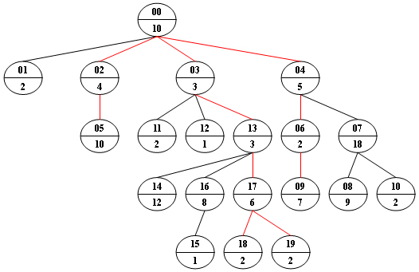

# PAT A 51 - 60


## [A1051. Pop Sequence (25)](https://www.patest.cn/contests/pat-a-practise/1051)

Given a stack which can keep M numbers at most. Push N numbers in the order of 1, 2, 3, ..., N and pop randomly. You are supposed to tell if a given sequence of numbers is a possible pop sequence of the stack. For example, if M is 5 and N is 7, we can obtain 1, 2, 3, 4, 5, 6, 7 from the stack, but not 3, 2, 1, 7, 5, 6, 4.

**Input Specification:**

Each input file contains one test case. For each case, the first line contains 3 numbers (all no more than 1000): M (the maximum capacity of the stack), N (the length of push sequence), and K (the number of pop sequences to be checked). Then K lines follow, each contains a pop sequence of N numbers. All the numbers in a line are separated by a space.

**Output Specification:**

For each pop sequence, print in one line "YES" if it is indeed a possible pop sequence of the stack, or "NO" if not.

**Sample Input:**

```
5 7 5
1 2 3 4 5 6 7
3 2 1 7 5 6 4
7 6 5 4 3 2 1
5 6 4 3 7 2 1
1 7 6 5 4 3 2
```

**Sample Output:**

```
YES
NO
NO
YES
NO
```

```c
#include <iostream>
#include <stack>
#include <vector>
using namespace std;

int main () {

	int m, n, k, num;
	cin >> m >> n >> k;
	for (int j = 0; j < k; j++) {
		int index = 1;
		bool possible = true;
		stack<int> s;
		for (int i = 1; i <= n; i++) {
			cin >> num;
			if (possible) {
				if (s.empty() || num >= index) {
					for ( ; index <= num; index++) s.push(index);
					if (s.size() > m) {
						possible = false;
						continue;
					}
					s.pop();
				} else {
					if (num == s.top()) s.pop();
					else possible = false;
				}
			} else continue;
		}
		if (possible) cout << "YES" << endl;
		else cout << "NO" << endl;
	}

	return 0;
}
```

```c
#include <iostream>
#include <vector>
#include <stack>
using namespace std;

int main () {

	int m, n, k;
	cin >> m >> n >> k;
	while (k--) {
		vector<int> v;
		stack<int> s;
		v.resize(n);
		for (int i = 0; i < n; i++) cin >> v[i];
		int index = 0;
		for (int i = 1; i <= n; i++) {
			s.push(i);
			if (s.size() > m) break;
			while (!s.empty() && s.top() == v[index]) {
				s.pop();
				index++;
			}
		}
		if (index == n) cout << "YES" << endl;
		else cout << "NO" << endl;
	}

	return 0;
}
```


------


## [A1052. Linked List Sorting (25)](https://www.patest.cn/contests/pat-a-practise/1052)

A linked list consists of a series of structures, which are not necessarily adjacent in memory. We assume that each structure contains an integer key and a Next pointer to the next structure. Now given a linked list, you are supposed to sort the structures according to their key values in increasing order.

**Input Specification:**

Each input file contains one test case. For each case, the first line contains a positive N (< 105) and an address of the head node, where N is the total number of nodes in memory and the address of a node is a 5-digit positive integer. NULL is represented by -1.

Then N lines follow, each describes a node in the format:

```
Address Key Next
```

where Address is the address of the node in memory, Key is an integer in [-105, 105], and Next is the address of the next node. It is guaranteed that all the keys are distinct and there is no cycle in the linked list starting from the head node.

**Output Specification:**

For each test case, the output format is the same as that of the input, where N is the total number of nodes in the list and all the nodes must be sorted order.

**Sample Input:**

```
5 00001
11111 100 -1
00001 0 22222
33333 100000 11111
12345 -1 33333
22222 1000 12345
```

**Sample Output:**

```
5 12345
12345 -1 00001
00001 0 11111
11111 100 22222
22222 1000 33333
33333 100000 -1
```

**老实按照链表的排序算法写的，未完全通过；`21/25`；[查看提交](https://www.patest.cn/submissions/3564780)**

```c
#include <iostream>
#include <vector>
using namespace std;
const int MAX_ID = 100001;

struct Node {
	int val, next;
	Node(int v, int n): val(v), next(n) {};
};

int main () {

	int n, head, addr, val, next;
	cin >> n >> head;
	vector<Node*> list(MAX_ID, NULL);
	for (int i = 0; i < n; i++) {
		cin >> addr >> val >> next;
		list[addr] = new Node(val, next);
	}
	list[100000] = new Node(-1, -1);
	int new_head = 100000, now = head;
	while (now != -1) {
		int prev = new_head;
		while (list[prev]->next != -1 && list[list[prev]->next]->val < list[now]->val)
			prev = list[prev]->next;
		int next = list[now]->next;
		list[now]->next = list[prev]->next;
		list[prev]->next = now;
		now = next;
	}

	now = list[new_head]->next;
	printf("%d %05d\n", n, now);
	while (true) {
		printf("%05d %d ", now, list[now]->val);
		now = list[now]->next;
		if (now == -1) { cout << "-1" << endl; break; }
		else printf("%05d\n", now);
	}

	return 0;
}
```

**下面是一个“假的”链表排序**

```c
#include <iostream>
#include <vector>
#include <algorithm>
using namespace std;

struct Node {
	int val, addr;
	Node(int a, int v): val(v), addr(a) {};
};

bool cmp (Node a, Node b) {
	return a.val < b.val;
}

int main () {

	int n, head, addr, val, next;
	vector<Node> v;
	cin >> n >> head;
	for (int i = 0; i < n; i++) {
		cin >> addr >> val >> next;
		v.push_back(Node(addr, val));
	}
	sort(v.begin(), v.end(), cmp);
	printf("%d %05d\n", n, v[0].addr);
	for (int i = 0; i < n; i++) {
		printf("%05d %d ", v[i].addr, v[i].val);
		if (i < n - 1) printf("%05d\n", v[i + 1].addr);
		else printf("-1\n");
	}

	return 0;
}
```


------


## [A1053. Path of Equal Weight (30)](https://www.patest.cn/contests/pat-a-practise/1053)

Given a non-empty tree with root R, and with weight Wi assigned to each tree node Ti. The weight of a path from R to L is defined to be the sum of the weights of all the nodes along the path from R to any leaf node L.

Now given any weighted tree, you are supposed to find all the paths with their weights equal to a given number. For example, let's consider the tree showed in Figure 1: for each node, the upper number is the node ID which is a two-digit number, and the lower number is the weight of that node. Suppose that the given number is 24, then there exists 4 different paths which have the same given weight: {10 5 2 7}, {10 4 10}, {10 3 3 6 2} and {10 3 3 6 2}, which correspond to the red edges in Figure 1.



**Input Specification:**

Each input file contains one test case. Each case starts with a line containing 0 < N <= 100, the number of nodes in a tree, M (< N), the number of non-leaf nodes, and 0 < S < 230, the given weight number. The next line contains N positive numbers where Wi (< 1000) corresponds to the tree node Ti. Then M lines follow, each in the format:

```
ID K ID[1] ID[2] ... ID[K]
```

where ID is a two-digit number representing a given non-leaf node, K is the number of its children, followed by a sequence of two-digit ID's of its children. For the sake of simplicity, let us fix the root ID to be 00.

**Output Specification:**

For each test case, print all the paths with weight S in non-increasing order. Each path occupies a line with printed weights from the root to the leaf in order. All the numbers must be separated by a space with no extra space at the end of the line.

Note: sequence {A1, A2, ..., An} is said to be greater than sequence {B1, B2, ..., Bm} if there exists 1 <= k < min{n, m} such that Ai = Bi for i=1, ... k, and Ak+1 > Bk+1.

**Sample Input:**

```
20 9 24
10 2 4 3 5 10 2 18 9 7 2 2 1 3 12 1 8 6 2 2
00 4 01 02 03 04
02 1 05
04 2 06 07
03 3 11 12 13
06 1 09
07 2 08 10
16 1 15
13 3 14 16 17
17 2 18 19
```

**Sample Output:**

```
10 5 2 7
10 4 10
10 3 3 6 2
10 3 3 6 2
```

```c
#include <iostream>
#include <vector>
#include <algorithm>
using namespace std;
int n, m, s;
vector<int> route, weights;
vector<vector<int>> path;
vector<vector<int>> tree;

void dfs (int now, int sum) {
	if (tree[now].size() == 0) {
		if (sum == s) path.push_back(route);
	}
	for (int i = 0; i < tree[now].size(); i++) {
		route.push_back(weights[tree[now][i]]);
		dfs(tree[now][i], sum + weights[tree[now][i]]);
		route.pop_back();
	}
}

bool cmp (vector<int> a, vector<int> b) {
	for (int i = 0; i < a.size() && i < b.size(); i++) {
		if (a[i] != b[i]) return a[i] > b[i];
	}
	return a.size() > b.size();
}

int main () {

	int id, k;
	cin >> n >> m >> s;
	tree.resize(n);
	weights.resize(n);
	for (int i = 0; i < n; i++) cin >> weights[i];
	for (int i = 0; i < n; i++) {
		cin >> id >> k;
		tree[id].resize(k);
		for (int j = 0; j < k; j++) cin >> tree[id][j];
	}
	route.push_back(weights[0]);
	dfs(0, weights[0]);
	sort(path.begin(), path.end(), cmp);
	for (int i = 0; i < path.size(); i++) {
		for (int j = 0; j < path[i].size(); j++) {
			cout << path[i][j];
			if (j < path[i].size() - 1) cout << " ";
		}
		cout << endl;
	}

	return 0;
}
```


------


## [A1054. The Dominant Color (20)](https://www.patest.cn/contests/pat-a-practise/1054)

Behind the scenes in the computer's memory, color is always talked about as a series of 24 bits of information for each pixel. In an image, the color with the largest proportional area is called the dominant color. A strictly dominant color takes more than half of the total area. Now given an image of resolution M by N (for example, 800x600), you are supposed to point out the strictly dominant color.

**Input Specification:**

Each input file contains one test case. For each case, the first line contains 2 positive numbers: M (<=800) and N (<=600) which are the resolutions of the image. Then N lines follow, each contains M digital colors in the range [0, 224). It is guaranteed that the strictly dominant color exists for each input image. All the numbers in a line are separated by a space.

**Output Specification:**

For each test case, simply print the dominant color in a line.

**Sample Input:**

```
5 3
0 0 255 16777215 24
24 24 0 0 24
24 0 24 24 24
```

**Sample Output:**

```
24
```

**有一组数据运行超时，`18/20`；[查看提交](https://www.patest.cn/submissions/3559864)**

```c
#include <iostream>
#include <map>
using namespace std;

int main () {

	int m, n, color;
	cin >> m >> n;
	map<int, int> freq;
	for (int i = 0; i < n; i++) {
		for (int j = 0; j < m; j++) {
			cin >> color;
			if (freq.find(color) == freq.end()) freq[color] = 1;
			else freq[color]++;
		}
	}
	int domaint_color, max_freq = 0;
	for (map<int, int>::iterator it = freq.begin(); it != freq.end(); it++) {
		if (it->second > max_freq) {
			max_freq = it->second;
			domaint_color = it->first;
		}
	}
	if (max_freq > (m * n) / 2) cout << domaint_color << endl;

	return 0;
}
```


------


## [A1055. The World's Richest (25)](https://www.patest.cn/contests/pat-a-practise/1055)

Forbes magazine publishes every year its list of billionaires based on the annual ranking of the world's wealthiest people. Now you are supposed to simulate this job, but concentrate only on the people in a certain range of ages. That is, given the net worths of N people, you must find the M richest people in a given range of their ages.

**Input Specification:**

Each input file contains one test case. For each case, the first line contains 2 positive integers: N (<=105) - the total number of people, and K (<=103) - the number of queries. Then N lines follow, each contains the name (string of no more than 8 characters without space), age (integer in (0, 200]), and the net worth (integer in [-106, 106]) of a person. Finally there are K lines of queries, each contains three positive integers: M (<= 100) - the maximum number of outputs, and [Amin, Amax] which are the range of ages. All the numbers in a line are separated by a space.

**Output Specification:**

For each query, first print in a line "Case #X:" where X is the query number starting from 1. Then output the M richest people with their ages in the range [Amin, Amax]. Each person's information occupies a line, in the format

```
Name Age Net_Worth
```

The outputs must be in non-increasing order of the net worths. In case there are equal worths, it must be in non-decreasing order of the ages. If both worths and ages are the same, then the output must be in non-decreasing alphabetical order of the names. It is guaranteed that there is no two persons share all the same of the three pieces of information. In case no one is found, output "None".

**Sample Input:**

```
12 4
Zoe_Bill 35 2333
Bob_Volk 24 5888
Anny_Cin 95 999999
Williams 30 -22
Cindy 76 76000
Alice 18 88888
Joe_Mike 32 3222
Michael 5 300000
Rosemary 40 5888
Dobby 24 5888
Billy 24 5888
Nobody 5 0
4 15 45
4 30 35
4 5 95
1 45 50
```

**Sample Output:**

```
Case #1:
Alice 18 88888
Billy 24 5888
Bob_Volk 24 5888
Dobby 24 5888
Case #2:
Joe_Mike 32 3222
Zoe_Bill 35 2333
Williams 30 -22
Case #3:
Anny_Cin 95 999999
Michael 5 300000
Alice 18 88888
Cindy 76 76000
Case #4:
None
```

**有一组数据运行超时；`21/25`；[查看提交](https://www.patest.cn/submissions/3567879)**

```c
#include <iostream>
#include <vector>
#include <string>
#include <algorithm>
using namespace std;

struct Person {
	string name;
	int age, worth;
};

bool cmp (Person a, Person b) {
	if (a.worth != b.worth) return a.worth > b.worth;
	else if (a.age != b.age) return a.age < b.age;
	else return a.name < b.name;
}

int main () {

	int n, k;
	cin >> n >> k;
	vector<Person> persons(n);
	for (int i = 0; i < n; i++) {
		cin >> persons[i].name >> persons[i].age >> persons[i].worth;
	}
	sort(persons.begin(), persons.end(), cmp);
	int m, l, h;
	for (int i = 1; i <= k; i++) {
		cout << "Case #" << i << ":" << endl;
		cin >> m >> l >> h;
		int cnt = 0;
		for (int j = 0; j < persons.size(); j++) {
			if (persons[j].age >= l && persons[j].age <= h) {
				cout << persons[j].name << " " << persons[j].age << " " << persons[j].worth << endl;
				cnt++;
			}
			if (cnt >= m) break;
		}
		if (cnt == 0) cout << "None" << endl;
	}

	return 0;
}
```

**但是不用 vector 就不会超时...；下面代码全部通过**

```c
#include <iostream>
#include <string>
#include <algorithm>
using namespace std;
const int maxn = 100010;
const int maxm = 1010;
struct person {
    string name;
    int age;
    int worth;
} person[maxn];

struct query {
    int num;
    int minAge;
    int maxAge;
} query[maxm];

bool cmp (struct person a, struct person b) {
    if (a.worth != b.worth) {
        return a.worth > b.worth;
    } else if (a.age != b.age) {
        return a.age < b.age;
    } else {
        return a.name < b.name;
    }
}

int main (int argc, const char * argv[]) {
    int n, k;
    cin >> n >> k;
    for (int i = 0; i < n; i++) {
        cin >> person[i].name >> person[i].age >> person[i].worth;
    }
    for (int i = 0; i < k; i++) {
        cin >> query[i].num >> query[i].minAge >> query[i].maxAge;
    }
    sort(person, person + n, cmp);
    int num = 0;
    for (int i = 0; i < k; i++) {
        cout << "Case #" << i + 1 << ":" << endl;
        num = 0;
        for (int j = 0; j < n; j++) {
            if (person[j].age >= query[i].minAge && person[j].age <= query[i].maxAge) {
                cout << person[j].name << " " << person[j].age << " " << person[j].worth << endl;
                num++;
                if (num >= query[i].num) {
                    break;
                }
            }
        }
        if (num == 0) {
            cout << "None" << endl;
        }
    }

    return 0;
}
```


------


## [A1056. Mice and Rice (25)](https://www.patest.cn/contests/pat-a-practise/1056)

Mice and Rice is the name of a programming contest in which each programmer must write a piece of code to control the movements of a mouse in a given map. The goal of each mouse is to eat as much rice as possible in order to become a FatMouse.

First the playing order is randomly decided for NP programmers. Then every NG programmers are grouped in a match. The fattest mouse in a group wins and enters the next turn. All the losers in this turn are ranked the same. Every NG winners are then grouped in the next match until a final winner is determined.

For the sake of simplicity, assume that the weight of each mouse is fixed once the programmer submits his/her code. Given the weights of all the mice and the initial playing order, you are supposed to output the ranks for the programmers.

**Input Specification:**

Each input file contains one test case. For each case, the first line contains 2 positive integers: NP and NG (<= 1000), the number of programmers and the maximum number of mice in a group, respectively. If there are less than NG mice at the end of the player's list, then all the mice left will be put into the last group. The second line contains NP distinct non-negative numbers Wi (i=0,...NP-1) where each Wi is the weight of the i-th mouse respectively. The third line gives the initial playing order which is a permutation of 0,...NP-1 (assume that the programmers are numbered from 0 to NP-1). All the numbers in a line are separated by a space.

**Output Specification:**

For each test case, print the final ranks in a line. The i-th number is the rank of the i-th programmer, and all the numbers must be separated by a space, with no extra space at the end of the line.

**Sample Input:**

```
11 3
25 18 0 46 37 3 19 22 57 56 10
6 0 8 7 10 5 9 1 4 2 3
```

**Sample Output:**

```
5 5 5 2 5 5 5 3 1 3 5
```

```c
#include <iostream>
#include <vector>
#include <queue>
#include <cmath>
using namespace std;

int main () {

	int np, ng, order;
	queue<int> q;
	cin >> np >> ng;
	vector<int> w(np), rank(np);
	for (int i = 0; i < np; i++) cin >> w[i];
	for (int i = 0; i < np; i++) { cin >> order; q.push(order); }

	while (q.size() > 1) {
		int num = q.size();
		int g_num = ceil(num * 1.0 / ng);
		for (int i = 0; i < g_num; i++) {
			int max_id = q.front();
			for (int j = 0; j < ng; j++) {
				if (i * ng + j >= num) break;
				int now = q.front();
				if(w[now] > w[max_id]) max_id = now;
				q.pop();
				rank[now] = g_num + 1;
			}
			q.push(max_id);
		}
	}
	rank[q.front()] = 1;
	for (int i = 0; i < rank.size(); i++) {
		cout << rank[i];
		if (i < rank.size() - 1) cout << " ";
	}
	cout << endl;

	return 0;
}
```

本题也可以不用队列，只用简单数组实现，毕竟逻辑不复杂

```c
#include <cstdio>
#include <cstring>
#include <algorithm>
//#include <queue>
using namespace std;

struct mouse {
    int weight;
    int rank;
};

int main(){
    int NP, NG, i, j;
    scanf("%d %d", &NP, &NG); // NP: mouse总数； NG: 每组mouse数
    struct mouse mouse[NP];
    int order[NP], nextorder[NP];
    for(i = 0; i < NP; i++){
        scanf("%d", &mouse[i].weight);
    }
    for(i = 0; i < NP; i++){
        scanf("%d", &order[i]);
    }

    int np = NP, ng = NG;
    while(np != 1){
        int gnum = (np % ng == 0) ? (np / ng) : (np / ng + 1);
        // 遍历每组
        for(i = 0; i < gnum; i++){
            int win= order[0];
            // 遍历第i组
            for(j = 0; j < ng; j++){
                // 防止超出
                if(i * ng + j >= np)
                    break;
                int ckey = order[i * ng + j];
                if(mouse[ckey].weight > mouse[win].weight){
                    win = ckey;
                }
                mouse[ckey].rank = gnum + 1;
            }
            nextorder[i] = win;
        }
        np = gnum;
        for(i = 0; i < np; i++){
            order[i] = nextorder[i];
        }
    }
    mouse[order[0]].rank = 1;
    for(i = 0; i < NP; i++){
        printf("%d", mouse[i].rank);
        if(i < NP - 1)
            printf(" ");
    }

    return 0;
}
```


------


## [A1057. Stack (30)](https://www.patest.cn/contests/pat-a-practise/1057)

Stack is one of the most fundamental data structures, which is based on the principle of Last In First Out (LIFO). The basic operations include Push (inserting an element onto the top position) and Pop (deleting the top element). Now you are supposed to implement a stack with an extra operation: PeekMedian -- return the median value of all the elements in the stack. With N elements, the median value is defined to be the (N/2)-th smallest element if N is even, or ((N+1)/2)-th if N is odd.

**Input Specification:**

Each input file contains one test case. For each case, the first line contains a positive integer N (<= 105). Then N lines follow, each contains a command in one of the following 3 formats:

```
Push key
Pop
PeekMedian
where key is a positive integer no more than 105.
```

**Output Specification:**

For each Push command, insert key into the stack and output nothing. For each Pop or PeekMedian command, print in a line the corresponding returned value. If the command is invalid, print "Invalid" instead.

**Sample Input:**

```
17
Pop
PeekMedian
Push 3
PeekMedian
Push 2
PeekMedian
Push 1
PeekMedian
Pop
Pop
Push 5
Push 4
PeekMedian
Pop
Pop
Pop
Pop
```

**Sample Output:**

```
Invalid
Invalid
3
2
2
1
2
4
4
5
3
Invalid
```

**有三组数据运行超时；`15/30`；[查看提交](https://www.patest.cn/submissions/3553529)**

```c
#include <iostream>
#include <vector>
#include <string>
using namespace std;

int main () {

	int n, key;
	string command;
	vector<int> stack, sorted;
	cin >> n;
	while (n--) {
		cin >> command;
		if (command == "Push") {
			cin >> key;
			stack.push_back(key);
			int i = 0;
			for (i = sorted.size() - 1; i >= 0; i--)
				if (key > sorted[i]) break;
			sorted.insert(sorted.begin() + (i + 1), key);
		} else if (command == "Pop") {
			if (stack.empty()) cout << "Invalid" << endl;
			else {
				int tail = stack[stack.size() - 1];
				cout << tail << endl;
				stack.pop_back();
				for (int i = 0; i < sorted.size(); i++)
					if (sorted[i] == tail) sorted.erase(sorted.begin() + i);
			}
		} else if (command == "PeekMedian") {
			if (stack.empty()) cout << "Invalid" << endl;
			else {
				int mid = (stack.size() % 2 == 0) ? (stack.size() - 1) / 2 : (stack.size() / 2);
				cout << sorted[mid] << endl;
			}
		}
	}

	return 0;
}
```


------


## [A1058. A+B in Hogwarts (20)](https://www.patest.cn/contests/pat-a-practise/1058)

If you are a fan of Harry Potter, you would know the world of magic has its own currency system -- as Hagrid explained it to Harry, "Seventeen silver Sickles to a Galleon and twenty-nine Knuts to a Sickle, it's easy enough." Your job is to write a program to compute A+B where A and B are given in the standard form of "Galleon.Sickle.Knut" (Galleon is an integer in [0, 107], Sickle is an integer in [0, 17), and Knut is an integer in [0, 29)).

**Input Specification:**

Each input file contains one test case which occupies a line with A and B in the standard form, separated by one space.

**Output Specification:**

For each test case you should output the sum of A and B in one line, with the same format as the input.

**Sample Input:**

```
3.2.1 10.16.27
```

**Sample Output:**

```
14.1.28
```

```c
#include <stdio.h>

int main(){
    int a[3], b[3], c[3];
    int arr[3] = {29, 17};
    scanf("%d.%d.%d %d.%d.%d", &a[2], &a[1], &a[0], &b[2], &b[1], &b[0]);

    int cy = 0;
    for(int i = 0; i < 2; i++){
        c[i] = (a[i] + b[i] + cy) % arr[i];
        cy = (a[i] + b[i] + cy) / arr[i];
    }
    c[2] = a[2] + b[2] + cy;

    printf("%d.%d.%d", c[2], c[1], c[0]);

    return 0;
}
```


------


## [A1059. Prime Factors (25)](https://www.patest.cn/contests/pat-a-practise/1059)

Given any positive integer N, you are supposed to find all of its prime factors, and write them in the format N = p1^k1 * p2^k2 *…*pm^km.

**Input Specification:**

Each input file contains one test case which gives a positive integer N in the range of long int.

**Output Specification:**

Factor N in the format N = p1^k1 * p2^k2 *…*pm^km, where pi's are prime factors of N in increasing order, and the exponent ki is the number of pi -- hence when there is only one pi, ki is 1 and must NOT be printed out.

**Sample Input:**

```
97532468
```

**Sample Output:**

```
97532468=2^2*11*17*101*1291
```

```c
#include <iostream>
#include <cmath>
#include <vector>
#include <map>
using namespace std;
long long num;

bool isPrime (int n) {
	int _sqrt = int(sqrt(n * 1.0));
	for (int i = 2; i <= _sqrt; i++)
		if (n % i == 0) return false;
	return true;
}

vector<int> get_primes (long long n) {
	vector<int> primes;
	int _sqrt = ceil(sqrt(n * 1.0));
	for (int i = 2; i <= _sqrt; i++) {
		if (isPrime(i)) primes.push_back(i);
	}
	return primes;
}

int main () {

	cin >> num;
	cout << num << "=";
	if (num == 1) {
		cout << "1";
	} else {
		if (isPrime(num)) {
			cout << num;
		} else {
			vector<int> primes = get_primes(num);
			map<int, int> factors;
			for (int i = 0; i < primes.size(); i++) {
				if (num > 0 && num % primes[i] == 0) {
					factors[primes[i]] = 1;
					num /= primes[i];
					while (num > 0 && num % primes[i] == 0) {
						factors[primes[i]]++;
						num /= primes[i];
					}
				}
			}
			int index = 0;
			for (map<int, int>::iterator it = factors.begin(); it != factors.end(); it++, index++) {
				cout << it->first;
				if (it->second > 1) cout << "^" << it->second;
				if (index < factors.size() - 1) cout << "*";
			}
		}
	}

	return 0;
}
```


------


## [A1060. Are They Equal (25)](https://www.patest.cn/contests/pat-a-practise/1060)

If a machine can save only 3 significant digits, the float numbers 12300 and 12358.9 are considered equal since they are both saved as 0.123*105 with simple chopping. Now given the number of significant digits on a machine and two float numbers, you are supposed to tell if they are treated equal in that machine.

**Input Specification:**

Each input file contains one test case which gives three numbers N, A and B, where N (< 100) is the number of significant digits, and A and B are the two float numbers to be compared. Each float number is non-negative, no greater than 10100, and that its total digit number is less than 100.

**Output Specification:**

For each test case, print in a line "YES" if the two numbers are treated equal, and then the number in the standard form "0.d1...dN*10^k" (d1>0 unless the number is 0); or "NO" if they are not treated equal, and then the two numbers in their standard form. All the terms must be separated by a space, with no extra space at the end of a line.

Note: Simple chopping is assumed without rounding.

**Sample Input 1:**

```
3 12300 12358.9
```

**Sample Output 1:**

```
YES 0.123*10^5
```

**Sample Input 2:**

```
3 120 128
```

**Sample Output 2:**

```
NO 0.120*10^3 0.128*10^3
```

```c

```
