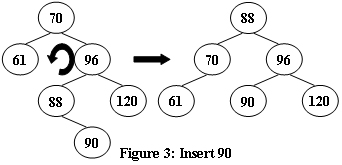

# PAT A 61 - 70


## [A1061. Dating (20)](https://www.patest.cn/contests/pat-a-practise/1061)

Sherlock Holmes received a note with some strange strings: "Let's date! 3485djDkxh4hhGE 2984akDfkkkkggEdsb s&hgsfdk d&Hyscvnm". It took him only a minute to figure out that those strange strings are actually referring to the coded time "Thursday 14:04" -- since the first common capital English letter (case sensitive) shared by the first two strings is the 4th capital letter 'D', representing the 4th day in a week; the second common character is the 5th capital letter 'E', representing the 14th hour (hence the hours from 0 to 23 in a day are represented by the numbers from 0 to 9 and the capital letters from A to N, respectively); and the English letter shared by the last two strings is 's' at the 4th position, representing the 4th minute. Now given two pairs of strings, you are supposed to help Sherlock decode the dating time.

**Input Specification:**

Each input file contains one test case. Each case gives 4 non-empty strings of no more than 60 characters without white space in 4 lines.

**Output Specification:**

For each test case, print the decoded time in one line, in the format "DAY HH:MM", where "DAY" is a 3-character abbreviation for the days in a week -- that is, "MON" for Monday, "TUE" for Tuesday, "WED" for Wednesday, "THU" for Thursday, "FRI" for Friday, "SAT" for Saturday, and "SUN" for Sunday. It is guaranteed that the result is unique for each case.

**Sample Input:**

```
3485djDkxh4hhGE
2984akDfkkkkggEdsb
s&hgsfdk
d&Hyscvnm
```

**Sample Output:**

```
THU 14:04
```

```c
#include <iostream>
#include <string>
#include <vector>
using namespace std;
string week[7] = { "MON", "TUE", "WED", "THU", "FRI", "SAT", "SUN" };

int main () {

	string str1, str2;
	int w = -1, hour, min, cnt = 0;
	cin >> str1 >> str2;
	for (int i = 0; i < str1.length() && i < str2.length(); i++) {
		if (cnt == 0) {
			if (str1[i] == str2[i] && 'A' <= str1[i] && str1[i] <= 'G') {
				w = str1[i] - 'A';
				cnt++;
			}
		} else if (cnt == 1) {
			if (str1[i] == str2[i] && '0' <= str1[i] && str1[i] <= '9') {
				hour = str1[i] - '0';
				cnt++;
			} else if (str1[i] == str2[i] && 'A' <= str1[i] && str1[i] <= 'N') {
				hour = str1[i] - 'A' + 10;
				cnt++;
			}
		} else {
			break;
		}
	}
	cin >> str1 >> str2;
	for (int i = 0; i < str1.length() && i < str2.length(); i++) {
		if (str1[i] == str2[i] && (('A' <= str1[i] && str1[i] <= 'Z') || 'a' <= str1[i] && str1[i] <= 'z')) { min = i; break; }
	}
	printf("%s %02d:%02d\n", week[w].c_str(), hour, min);

	return 0;
}
```


------


## [A1062. Talent and Virtue (25)](https://www.patest.cn/contests/pat-a-practise/1062)

About 900 years ago, a Chinese philosopher Sima Guang wrote a history book in which he talked about people's talent and virtue. According to his theory, a man being outstanding in both talent and virtue must be a "sage（圣人）"; being less excellent but with one's virtue outweighs talent can be called a "nobleman（君子）"; being good in neither is a "fool man（愚人）"; yet a fool man is better than a "small man（小人）" who prefers talent than virtue.

Now given the grades of talent and virtue of a group of people, you are supposed to rank them according to Sima Guang's theory.

**Input Specification:**

Each input file contains one test case. Each case first gives 3 positive integers in a line: N (<=105), the total number of people to be ranked; L (>=60), the lower bound of the qualified grades -- that is, only the ones whose grades of talent and virtue are both not below this line will be ranked; and H (< 100), the higher line of qualification -- that is, those with both grades not below this line are considered as the "sages", and will be ranked in non-increasing order according to their total grades. Those with talent grades below H but virtue grades not are cosidered as the "noblemen", and are also ranked in non-increasing order according to their total grades, but they are listed after the "sages". Those with both grades below H, but with virtue not lower than talent are considered as the "fool men". They are ranked in the same way but after the "noblemen". The rest of people whose grades both pass the L line are ranked after the "fool men".

Then N lines follow, each gives the information of a person in the format:

```
ID_Number Virtue_Grade Talent_Grade
```

where ID_Number is an 8-digit number, and both grades are integers in [0, 100]. All the numbers are separated by a space.

**Output Specification:**

The first line of output must give M (<=N), the total number of people that are actually ranked. Then M lines follow, each gives the information of a person in the same format as the input, according to the ranking rules. If there is a tie of the total grade, they must be ranked with respect to their virtue grades in non-increasing order. If there is still a tie, then output in increasing order of their ID's.

**Sample Input:**

```
14 60 80
10000001 64 90
10000002 90 60
10000011 85 80
10000003 85 80
10000004 80 85
10000005 82 77
10000006 83 76
10000007 90 78
10000008 75 79
10000009 59 90
10000010 88 45
10000012 80 100
10000013 90 99
10000014 66 60
```

**Sample Output:**

```
12
10000013 90 99
10000012 80 100
10000003 85 80
10000011 85 80
10000004 80 85
10000007 90 78
10000006 83 76
10000005 82 77
10000002 90 60
10000014 66 60
10000008 75 79
10000001 64 90
```

**有两组数据运行超时，`19/25`；[查看提交](https://www.patest.cn/submissions/3529735)**
```c
#include <iostream>
#include <string>
#include <vector>
#include <algorithm>
using namespace std;

struct Person {
	string id;
	int talent, virtue, total;
	Person(string id, int v, int t): id(id), talent(t), virtue(v), total(t + v) {};
};

bool cmp (Person p1, Person p2) {
	if (p1.total != p2.total) {
		return p1.total > p2.total;
	} else if (p1.virtue != p2.virtue) {
		return p1.virtue > p2.virtue;
	} else {
		return p1.id < p2.id;
	}
}

void display (vector<Person> v) {
	for (int i = 0; i < v.size(); i++)
		cout << v[i].id << " " << v[i].virtue << " " << v[i].talent << endl;
}

int main () {

	int n, l, h, talent, virtue;
	string id;
	vector<Person> sages, noblemen, fool_men, others;
	cin >> n >> l >> h;
	while (n--) {
		cin >> id >> virtue >> talent;
		if (talent < l || virtue < l) {
			continue;
		} else if (talent >= h && virtue >= h) {
			sages.push_back(Person(id, virtue, talent));
		} else if (talent < h && virtue >= h) {
			noblemen.push_back(Person(id, virtue, talent));
		} else if (talent < h && virtue < h && virtue >= talent) {
			fool_men.push_back(Person(id, virtue, talent));
		} else {
			others.push_back(Person(id, virtue, talent));
		}
	}
	sort(sages.begin(), sages.end(), cmp);
	sort(noblemen.begin(), noblemen.end(), cmp);
	sort(fool_men.begin(), fool_men.end(), cmp);
	sort(others.begin(), others.end(), cmp);
	cout << sages.size() + noblemen.size() + fool_men.size() + others.size() << endl;
	display(sages);
	display(noblemen);
	display(fool_men);
	display(others);

	return 0;
}
```


------


## [A1063. Set Similarity (25)](https://www.patest.cn/contests/pat-a-practise/1063)

Given two sets of integers, the similarity of the sets is defined to be Nc/Nt*100%, where Nc is the number of distinct common numbers shared by the two sets, and Nt is the total number of distinct numbers in the two sets. Your job is to calculate the similarity of any given pair of sets.

**Input Specification:**

Each input file contains one test case. Each case first gives a positive integer N (<=50) which is the total number of sets. Then N lines follow, each gives a set with a positive M (<=104) and followed by M integers in the range [0, 109]. After the input of sets, a positive integer K (<=2000) is given, followed by K lines of queries. Each query gives a pair of set numbers (the sets are numbered from 1 to N). All the numbers in a line are separated by a space.

**Output Specification:**

For each query, print in one line the similarity of the sets, in the percentage form accurate up to 1 decimal place.

**Sample Input:**

```
3
3 99 87 101
4 87 101 5 87
7 99 101 18 5 135 18 99
2
1 2
1 3
```

**Sample Output:**

```
50.0%
33.3%
```

```c
#include <iostream>
#include <vector>
#include <set>
using namespace std;
vector<set<int>> sets;

double get_similarity (int a, int b) {
	int nc = 0, nt = sets[b].size();
	for (set<int>::iterator it = sets[a].begin(); it != sets[a].end(); it++) {
		if (sets[b].find(*it) == sets[b].end())
			nt++;
		else
			nc++;
	}
	return (double) nc / nt * 100;
}

int main () {

	int n, m, k, num, a, b;
	cin >> n;
	while (n--) {
		cin >> m;
		set<int> s;
		while (m--) {
			cin >> num;
			s.insert(num);
		}
		sets.push_back(s);
	}
	cin >> k;
	while (k--) {
		cin >> a >> b;
		printf("%.1f%%\n", get_similarity(a - 1, b - 1));
	}

	return 0;
}
```


------


## [A1064. Complete Binary Search Tree (30)](https://www.patest.cn/contests/pat-a-practise/1064)

A Binary Search Tree (BST) is recursively defined as a binary tree which has the following properties:

- The left subtree of a node contains only nodes with keys less than the node's key.
- The right subtree of a node contains only nodes with keys greater than or equal to the node's key.
- Both the left and right subtrees must also be binary search trees.

A Complete Binary Tree (CBT) is a tree that is completely filled, with the possible exception of the bottom level, which is filled from left to right.

Now given a sequence of distinct non-negative integer keys, a unique BST can be constructed if it is required that the tree must also be a CBT. You are supposed to output the level order traversal sequence of this BST.

**Input Specification:**

Each input file contains one test case. For each case, the first line contains a positive integer N (<=1000). Then N distinct non-negative integer keys are given in the next line. All the numbers in a line are separated by a space and are no greater than 2000.

**Output Specification:**

For each test case, print in one line the level order traversal sequence of the corresponding complete binary search tree. All the numbers in a line must be separated by a space, and there must be no extra space at the end of the line.

**Sample Input:**

```
10
1 2 3 4 5 6 7 8 9 0
```

**Sample Output:**

```
6 3 8 1 5 7 9 0 2 4
```

```c
#include <iostream>
#include <vector>
#include <queue>
#include <algorithm>
using namespace std;
vector<int> v;
int n;

struct TreeNode {
	int val;
	TreeNode *left, *right;
	TreeNode(int v): val(v), left(NULL), right(NULL) {};
};

void buildCBT (int n, TreeNode* &root) {
	queue<TreeNode*> q;
	q.push(root);
	int cnt = 1;
	while (!q.empty()) {
		TreeNode* node = q.front();
		q.pop();
		if (cnt < n) {
			node->left = new TreeNode(-1);
			q.push(node->left);
			cnt++;
		} else break;
		if (cnt < n) {
			node->right = new TreeNode(-1);
			q.push(node->right);
			cnt++;
		} else break;
	}
}

void inOrder (TreeNode* root, int &index) {
	if (root->left) inOrder(root->left, index);
	root->val = v[index];
	index++;
	if (root->right) inOrder(root->right, index);
}

void bfs (TreeNode* root) {
	queue<TreeNode*> q;
	q.push(root);
	int i = 0;
	while (!q.empty()) {
		TreeNode* node = q.front();
		q.pop();
		cout << node->val;
		if (i < n - 1) cout << " ";
		i++;
		if (node->left) q.push(node->left);
		if (node->right) q.push(node->right);
	}
	cout << endl;
}

int main () {

	int num;
	cin >> n;
	for (int i = 0; i < n; i++) {
		cin >> num;
		v.push_back(num);
	}
	TreeNode* root = new TreeNode(-1);
	buildCBT(n, root);
	sort(v.begin(), v.end());
	int index = 0;
	inOrder(root, index);
	bfs(root);

	return 0;
}
```

**下面的代码参考《算法笔记》，比上面的简洁**

```c
#include <iostream>
#include <vector>
#include <algorithm>
using namespace std;
vector<int> v, tree;
int n, index = 0;

void inOrder (int root) {
	if (2 * root + 1 < n) inOrder(2 * root + 1);
	tree[root] = v[index++];
	if (2 * root + 2 < n) inOrder(2 * root + 2);
}

int main () {

	int num;
	cin >> n;
	tree.resize(n);
	for (int i = 0; i < n; i++) {
		cin >> num;
		v.push_back(num);
	}
	sort(v.begin(), v.end());
	inOrder(0);
	for (int i = 0; i < n; i++) {
		cout << tree[i];
		if (i < n - 1) cout << " ";
	}
	cout << endl;

	return 0;
}
```


------


## [A1065. A+B and C (64bit) (20)](https://www.patest.cn/contests/pat-a-practise/1065)

Given three integers A, B and C in [-2^63, 2^63], you are supposed to tell whether A+B > C.

**Input Specification:**

The first line of the input gives the positive number of test cases, T (<=10). Then T test cases follow, each consists of a single line containing three integers A, B and C, separated by single spaces.

**Output Specification:**

For each test case, output in one line "Case #X: true" if A+B>C, or "Case #X: false" otherwise, where X is the case number (starting from 1).

**Sample Input:**

```
3
1 2 3
2 3 4
9223372036854775807 -9223372036854775808 0
```

**Sample Output:**

```
Case #1: false
Case #2: true
Case #3: false
```

**直接用 `long long` 或是 `int` 是不行的！**

```c
#include <iostream>
using namespace std;

int main(){

    int n;
    cin >> n;
    long long a, b, c, d;
    for (int i = 1; i <= n; i++){
        scanf("%lld%lld%lld", &a, &b, &c);
        d = a + b;
        if(a > 0 && b > 0 && d < 0) // a + b 很大导致溢出
            printf("Case #%d: true\n", i);
        else if(a < 0 && b < 0 && d >= 0) // a + b 很小导致溢出
            printf("Case #%d: false\n", i);
        else if(d > c)
            printf("Case #%d: true\n", i);
        else
            printf("Case #%d: false\n", i);
    }

    return 0;
}
```


-------


## [A1066. Root of AVL Tree (25)](https://www.patest.cn/contests/pat-a-practise/1066)

An AVL tree is a self-balancing binary search tree. In an AVL tree, the heights of the two child subtrees of any node differ by at most one; if at any time they differ by more than one, rebalancing is done to restore this property. Figures 1-4 illustrate the rotation rules.





Now given a sequence of insertions, you are supposed to tell the root of the resulting AVL tree.

**Input Specification:**

Each input file contains one test case. For each case, the first line contains a positive integer N (<=20) which is the total number of keys to be inserted. Then N distinct integer keys are given in the next line. All the numbers in a line are separated by a space.

**Output Specification:**

For each test case, print ythe root of the resulting AVL tree in one line.

**Sample Input 1:**

```
5
88 70 61 96 120
```

**Sample Output 1:**

```
70
```

**Sample Input 2:**

```
7
88 70 61 96 120 90 65
```

**Sample Output 2:**

```
88
```

```c
#include <iostream>
#include <algorithm>
using namespace std;

struct TreeNode {
	int val, height;
	TreeNode *left, *right;
	TreeNode(int v): val(v), height(1), left(NULL), right(NULL) {};
};

int getHeight (TreeNode* root) {
	return (root) ? root->height : 0;
}

void updateHeight (TreeNode* root) {
	root->height = max(getHeight(root->left), getHeight(root->right)) + 1;
}

void leftRotate (TreeNode* &root) {
	TreeNode* temp = root->right;
	root->right = temp->left;
	temp->left = root;
	updateHeight(root);
	updateHeight(temp);
	root = temp;
}

void rightRotate (TreeNode* &root) {
	TreeNode* temp = root->left;
	root->left = temp->right;
	temp->right = root;
	updateHeight(root);
	updateHeight(temp);
	root = temp;
}

void insert (TreeNode* &root, int n) {
	if (root == NULL) {
		root = new TreeNode(n);
		return;
	}
	if (n < root->val) {
		insert(root->left, n);
		updateHeight(root->left);
		if (getHeight(root->left) - getHeight(root->right) == 2) {
			if (getHeight(root->left->left) - getHeight(root->left->right) == 1) {
				rightRotate(root);
			} else if (getHeight(root->left->left) - getHeight(root->left->right) == -1) {
				leftRotate(root->left);
				rightRotate(root);
			}
		}
	} else {
		insert(root->right, n);
		updateHeight(root->right);
		if (getHeight(root->right) - getHeight(root->left) == 2) {
			if (getHeight(root->right->right) - getHeight(root->right->left) == 1) {
				leftRotate(root);
			} else if (getHeight(root->right->right) - getHeight(root->right->left) == -1) {
				rightRotate(root->right);
				leftRotate(root);
			}
		}
	}
}

int main () {

	int n, num;
	cin >> n;
	TreeNode* root = NULL;
	while (n--) {
		cin >> num;
		insert(root, num);
	}
	cout << root->val << endl;

	return 0;
}
```


------


## [A1067. Sort with Swap(0,*) (25)](https://www.patest.cn/contests/pat-a-practise/1067)

Given any permutation of the numbers {0, 1, 2,..., N-1}, it is easy to sort them in increasing order. But what if Swap(0, *) is the ONLY operation that is allowed to use? For example, to sort {4, 0, 2, 1, 3} we may apply the swap operations in the following way:

```
Swap(0, 1) => {4, 1, 2, 0, 3}
Swap(0, 3) => {4, 1, 2, 3, 0}
Swap(0, 4) => {0, 1, 2, 3, 4}
```

Now you are asked to find the minimum number of swaps need to sort the given permutation of the first N nonnegative integers.

**Input Specification:**

Each input file contains one test case, which gives a positive N (<=105) followed by a permutation sequence of {0, 1, ..., N-1}. All the numbers in a line are separated by a space.

**Output Specification:**

For each case, simply print in a line the minimum number of swaps need to sort the given permutation.

**Sample Input:**

```
10 3 5 7 2 6 4 9 0 8 1
```

**Sample Output:**

```
9
```

**最开始没有看清题，看成任意两个数都可以交换了，这种情况题解如下面的代码**

```c
#include <iostream>
#include <vector>
#include <set>
using namespace std;

int main () {

	int n, num, cnt = 0;
	cin >> n;
	set<pair<int, int>> wrong; // (index, value) 存储放在错误位置的数及其 index
	for (int i = 0; i < n; i++) {
		cin >> num;
		if (num != i) {
			if (wrong.find(make_pair(num, i)) != wrong.end())
				continue;
			else
				cnt++;
			wrong.insert(make_pair(i, num));
		}
	}

	cout << ((cnt <= 1) ? cnt : cnt - 1) << endl;

	return 0;
}
```

**正确解法参考 [1067. Sort with Swap(0,*) (25)-PAT甲级真题（贪心算法） – 柳婼 の  blog](https://www.liuchuo.net/archives/2301)**

分析：贪心算法，每次只能用0交换，有两种情况：

1. 0不在0位，那么0如果在第i位，而第i位本应该是i，就应该把0和i数字所在的位置交换。

2. 如果0在0位，而且整个序列到现在还不是有序的，那就把0和第一个序列没在该在的位置上的数字交换。

我们每次交换的时候都统计好ans的值，表示一共交换了多少次，每当把一个数复原的时候，让cnt–;就可以通过cnt是否大于0判断什么时候退出while循环~~~

所以说，首先我们想要知道除了0到底有多少个数字是不在位置上的（cnt），这个可以在输入的时候就判断好cnt的大小

注意：因为多次涉及到想要知道某个数所在的位置，每次都遍历数组太麻烦了，干脆在保存的时候就保存每个数字所在的位置好了，即v[i] = j表示i数字在j位置，所以每次交换i和0只需要交换v[i]和v[0]就好了

第二个注意点，很重要，如果不处理会产生两个测试点超时：在0在0位的时候，找寻第一个不在该在的位置的数的时候，如果每次都for循环从头开始找，那么时间复杂度会很高，但是我们知道，找的时候找的是第一个不在该在位置的数，那么index每前进一步都说明前面的数字是符合在该在的位置上的，而且在该在的位置上的数是不可能再交换变化的，所以直接设置一个index的变量，每次找第一个数的时候就可以直接从上一次index开始查找，避免了每次都从头找。

```c
#include <iostream>
#include <vector>
#include <algorithm>
using namespace std;

int main () {

	int n, num, cnt = 0, result = 0, index = 1;
	cin >> n;
	vector<int> v(n);
	for (int i = 0; i < n; i++) {
		cin >> num;
		v[num] = i;
		if (num != i && num != 0) cnt++;
	}
	while (cnt > 0) {
		if (v[0] == 0){
			while (index < n && v[index] == index) {
				index++;
			}
			if (index < n) {
				swap(v[0], v[index]);
				result++;
			}
		} else {
			swap(v[0], v[v[0]]);
			cnt--;
			result++;
		}
	}

	cout << result << endl;

	return 0;
}
```


------


## [A1068. Find More Coins (30)](https://www.patest.cn/contests/pat-a-practise/1068)

Eva loves to collect coins from all over the universe, including some other planets like Mars. One day she visited a universal shopping mall which could accept all kinds of coins as payments. However, there was a special requirement of the payment: for each bill, she must pay the exact amount. Since she has as many as 104 coins with her, she definitely needs your help. You are supposed to tell her, for any given amount of money, whether or not she can find some coins to pay for it.

**Input Specification:**

Each input file contains one test case. For each case, the first line contains 2 positive numbers: N (<=104, the total number of coins) and M(<=102, the amount of money Eva has to pay). The second line contains N face values of the coins, which are all positive numbers. All the numbers in a line are separated by a space.

**Output Specification:**

For each test case, print in one line the face values V1 <= V2 <= ... <= Vk such that V1 + V2 + ... + Vk = M. All the numbers must be separated by a space, and there must be no extra space at the end of the line. If such a solution is not unique, output the smallest sequence. If there is no solution, output "No Solution" instead.

Note: sequence {A[1], A[2], ...} is said to be "smaller" than sequence {B[1], B[2], ...} if there exists k >= 1 such that A[i]=B[i] for all i < k, and A[k] < B[k].

**Sample Input 1:**

```
8 9
5 9 8 7 2 3 4 1
```

**Sample Output 1:**

```
1 3 5
```

**Sample Input 2:**

```
4 8
7 2 4 3
```

**Sample Output 2:**

```
No Solution
```

**用 DFS 部分数据运行超时，`22/30`；[查看提交](https://www.patest.cn/submissions/3533303)**

```c
#include <iostream>
#include <vector>
#include <algorithm>
using namespace std;
int n, m;
vector<int> v, seq, ans;

bool isLess (vector<int> a, vector<int> b) {
	for (int i = 0; i < a.size(); i++)
		if (a[i] != b[i]) return a[i] < b[i];
	return true;
}

void dfs (int index, int sum) {
	if (sum > m) return;
	if (sum == m) {
		if (seq.size() > ans.size()) {
			ans = seq;
		} else if (seq.size() == ans.size()) {
			if (isLess(seq, ans))
				ans = seq;
		}
	}
	for (int i = index; i < n; i++) {
		if (i < n - 1) {
			seq.push_back(v[i]);
			sum += v[i];
			dfs(i + 1, sum);
			seq.pop_back();
			sum -= v[i];
			dfs(i + 1, sum);
		}
	}
}

int main () {

	cin >> n >> m;
	v.resize(n);
	for (int i = 0; i < n; i++)
		cin >> v[i];
	sort(v.begin(), v.end());
	dfs(0, 0);

	if (!ans.empty()) {
		for (int i = 0; i < ans.size(); i++) {
			cout << ans[i];
			if (i < ans.size() - 1) cout << " ";
		}
	} else {
		cout << "No Solution";
	}
	cout << endl;

	return 0;
}
```

**实际上问题可以归为 `01背包问题`，下面的代码参考《算法笔记》实现，全部通过**

```c
#include <cstdio>
#include <algorithm>
#include <cstring>
using namespace std;
const int maxn = 10010;
const int maxv = 110;
int w[maxn], dp[maxv] = {0}; // w[i] 为钱币的价值;
bool choice[maxn][maxn], flag[maxn];

bool cmp (int a, int b) {
    return a > b;
}

int main (int argc, const char * argv[]) {
    int n, m;
    scanf("%d %d", &n, &m);
    for (int i = 1; i <= n; i++) {
        scanf("%d", &w[i]);
    }

    sort(w + 1, w + n + 1, cmp);

    for (int i = 1; i <= n; i++) {
        for (int v = m; v >= w[i]; v--) {
            if (dp[v] <= dp[v - w[i]] + w[i]) {
                dp[v] = dp[v - w[i]] + w[i];
                choice[i][v] = true; // 放入第 i 个 coin
            } else {
                choice[i][v] = false; // 不放入第 i 个 coin
            }
        }
    }

    if (dp[m] != m) {
        printf("No Solution");
    } else {
        int k = n, num = 0, v = m;
        while(k >= 0) {
            if (choice[k][v] == 1) {
                flag[k] = true;
                v -= w[k];
                num++;
            } else {
                flag[k] = false;
            }
            k--;
        }
        for (int i = n; i >= 1; i--) {
            if (flag[i] == true) {
                printf("%d", w[i]);
                num--;
                if (num > 0) {
                    printf(" ");
                }
            }
        }
    }

    return 0;
}
```

**下面的代码参考 [1068. Find More Coins (30)-PAT甲级真题（01背包） – 柳婼 の  blog](https://www.liuchuo.net/archives/2323)**

```c
#include <iostream>
#include <vector>
#include <algorithm>
using namespace std;

bool cmp (int a, int b) {
	return a > b;
}

int main () {

	int n, m;
	cin >> n >> m;
	vector<int> v(n), dp(m + 1, 0);
	vector<vector<bool>> vis(n, vector<bool>(m + 1, false));
	for (int i = 0; i < n; i++)
		cin >> v[i];
	sort(v.begin(), v.end(), cmp);
	for (int i = 0; i < n; i++) {
		for (int j = m; j >= v[i]; j--) {
			if (dp[j] <= dp[j - v[i]] + v[i]) {
				dp[j] = dp[j - v[i]] + v[i];
				vis[i][j] = true;
			}
		}
	}

	if (dp[m] != m) {
		cout << "No Solution" << endl;
	} else {
		int index = n - 1, w = m;
		vector<int> ans;
		while (w > 0) {
			if (vis[index][w] == true) {
				ans.push_back(v[index]);
				w -= v[index];
			}
			index--;
		}
		for (int i = 0; i < ans.size(); i++) {
			cout << ans[i];
			if (i < ans.size() - 1) cout << " ";
		}
		cout << endl;
	}


	return 0;
}
```


------


## [A1069. The Black Hole of Numbers (20)](https://www.patest.cn/contests/pat-a-practise/1069)

For any 4-digit integer except the ones with all the digits being the same, if we sort the digits in non-increasing order first, and then in non-decreasing order, a new number can be obtained by taking the second number from the first one. Repeat in this manner we will soon end up at the number 6174 -- the "black hole" of 4-digit numbers. This number is named Kaprekar Constant.

For example, start from 6767, we'll get:

```
7766 - 6677 = 1089
9810 - 0189 = 9621
9621 - 1269 = 8352
8532 - 2358 = 6174
7641 - 1467 = 6174
... ...
```

Given any 4-digit number, you are supposed to illustrate the way it gets into the black hole.

**Input Specification:**

Each input file contains one test case which gives a positive integer N in the range (0, 10000).

**Output Specification:**

If all the 4 digits of N are the same, print in one line the equation "N - N = 0000". Else print each step of calculation in a line until 6174 comes out as the difference. All the numbers must be printed as 4-digit numbers.

**Sample Input 1:**

```
6767
```

**Sample Output 1:**

```
7766 - 6677 = 1089
9810 - 0189 = 9621
9621 - 1269 = 8352
8532 - 2358 = 6174
```

**Sample Input 2:**

```
2222
```

**Sample Output 2:**

```
2222 - 2222 = 0000
```

```c
#include <iostream>
#include <algorithm>
#include <string>
using namespace std;

bool cmp (char c1, char c2) {
	return c1 > c2;
}

int main () {

	string a, b, c;
	cin >> c;
	c.insert(0, 4 - c.length(), '0'); // 因为输入的数可能少于四位，所以必须有这一句
	do {
		a = c;
		b = c;
		sort(a.begin(), a.end(), cmp);
		sort(b.begin(), b.end());
		int sub = stoi(a.c_str()) - stoi(b.c_str());
		c = to_string(sub);
		c.insert(0, 4 - c.length(), '0');
		cout << a << " - " << b << " = " << c << endl;
	} while (c != "6174" && c != "0000");

	return 0;
}
```


------


## [A1070. Mooncake (25)](https://www.patest.cn/contests/pat-a-practise/1070)

Mooncake is a Chinese bakery product traditionally eaten during the Mid-Autumn Festival. Many types of fillings and crusts can be found in traditional mooncakes according to the region's culture. Now given the inventory amounts and the prices of all kinds of the mooncakes, together with the maximum total demand of the market, you are supposed to tell the maximum profit that can be made.

Note: partial inventory storage can be taken. The sample shows the following situation: given three kinds of mooncakes with inventory amounts being 180, 150, and 100 thousand tons, and the prices being 7.5, 7.2, and 4.5 billion yuans. If the market demand can be at most 200 thousand tons, the best we can do is to sell 150 thousand tons of the second kind of mooncake, and 50 thousand tons of the third kind. Hence the total profit is 7.2 + 4.5/2 = 9.45 (billion yuans).

**Input Specification:**

Each input file contains one test case. For each case, the first line contains 2 positive integers N (<=1000), the number of different kinds of mooncakes, and D (<=500 thousand tons), the maximum total demand of the market. Then the second line gives the positive inventory amounts (in thousand tons), and the third line gives the positive prices (in billion yuans) of N kinds of mooncakes. All the numbers in a line are separated by a space.

**Output Specification:**

For each test case, print the maximum profit (in billion yuans) in one line, accurate up to 2 decimal places.

**Sample Input:**

```
3 200
180 150 100
7.5 7.2 4.5
```

**Sample Output:**

```
9.45
```

**未完全通过，`22/25`；原因未知；[查看提交](https://www.patest.cn/submissions/3534508)**

```c
#include <iostream>
#include <vector>
#include <algorithm>
using namespace std;

struct Mooncake {
	double weight, price, average;
	Mooncake(double w, double p): weight(w), price(p), average(p / w) {};
};

bool cmp (Mooncake m1, Mooncake m2) {
	return m1.average > m2.average;
}

int main () {

	int n;
	double d, p, profit = 0.0;
	cin >> n >> d;
	vector<int> weight(n);
	vector<Mooncake> mooncakes;
	for (int i = 0; i < n; i++) cin >> weight[i];
	for (int i = 0; i < n; i++) { cin >> p; mooncakes.push_back(Mooncake(weight[i], p)); }
	sort(mooncakes.begin(), mooncakes.end(), cmp);
	for (int i = 0; i < mooncakes.size(); i++) {
		if (mooncakes[i].weight <= d) {
			profit += mooncakes[i].price;
			d -= mooncakes[i].weight;
		} else {
			profit += d / mooncakes[i].weight * mooncakes[i].price;
			d = 0;
		}
		if (d == 0) break;
	}
	printf("%.2f\n", profit);

	return 0;
}
```

**下面代码参考《算法笔记》实现，就全部通过了，思路和上面代码一样，可能有一些细节或特殊情况未发现**

```c
#include <iostream>
#include <algorithm>
using namespace std;
const int maxn = 1010;
struct mooncake {
    double price; // 单价
    double sell; // 总售价
    double store; // 存货量
} mooncake[maxn];

bool cmp (struct mooncake a, struct mooncake b) {
    return a.price > b.price;
}

int main (int argc, const char * argv[]) {
    int n;
    double demande;
    scanf("%d %lf", &n, &demande);
    for (int i = 0; i < n; i++) {
        cin >> mooncake[i].store;
    }
    for (int i = 0; i < n; i++) {
        cin >> mooncake[i].sell;
        mooncake[i].price = mooncake[i].sell / mooncake[i].store;
    }
    sort(mooncake, mooncake + n, cmp);
    double profits = 0;
    for (int i = 0; i < n && demande > 0; i++) {
        if (demande >= mooncake[i].store) {
            profits += mooncake[i].sell;
            demande -= mooncake[i].store;
        } else {
            profits += mooncake[i].price * demande;
            demande = 0;
        }
    }
    printf("%.2f", profits);
    return 0;
}
```
