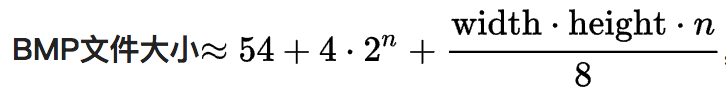

# 图片存储格式

## JPEG

Joint Photographic Experts Group（联合图像专家小组）

每个像素24位（24 bits per pixel，红、蓝、绿各有八比特）

JPEG/JFIF 是万维网上最普遍的被用来存储和传输照片的格式。它并不适合于线条绘图（drawing）和其他文字或图标（iconic）的图形，因为它的压缩方法用在这些类型的图形上，得到的结果并不好（PNG和GIF格式通常是用来存储这类的图形；GIF每个像素只有8比特，并不很适合于存储彩色照片，PNG可以无损地存储照片，但是文件太大的缺点让它不太适合在网络上传输）

------

## BMP

`BMP` 取自位图 `BitMaP` 的缩写

图像通常保存的颜色深度有2（1位）、16（4位）、256（8位）、65536（16位）和1670万（24位）种颜色（其中位是表示每点所用的数据位）

#### 存储算法

BMP文件通常是不压缩的，所以它们通常比同一幅图像的压缩图像文件格式要大很多

54是位图文件的文件头， `4 * 2 ^ n` 是彩色调色板的大小； 如果位图文件不包含调色板，如24位，32位位图，则该项可忽略

#### 调色板

这部分定义了图像中所用的颜色。如上所述，位图图像一个像素接着一个像素储存，每个像素使用一个或者多个字节的值表示，所以调色板的目的就是要告诉应用程序这些值所对应的实际颜色

典型的位图文件使用RGB彩色模型。在这种模型中，每种颜色都是由不同强度（从0到最大强度）的红色（R）、绿色（G）和蓝色（B）组成的，也就是说，每种颜色都可以使用红色、绿色和蓝色的值所定义

在位图文件的实现中，调色板可以包含很多条目，条目个数就是图像中所使用的颜色的个数。每个条目用来描述一种颜色，包含4个字节，其中三个表示红色、绿色和蓝色，第四个字节没有使用（大多数应用程序将它设为0）；对于每个字节，数值0表示该颜色分量在当前的颜色中没有使用，而数值255表示这种颜色分量使用最大的强度

------

## PNG

便携式网络图形（Portable Network Graphics，PNG）是一种无损压缩的位图图形格式，支持索引、灰度、RGB三种颜色方案以及Alpha通道等特性

------

## GIF

图像互换格式（GIF，Graphics Interchange Format）是一种位图图形文件格式，以8位色（即256种颜色）重现真彩色的图像

它实际上是一种压缩文档，采用LZW压缩算法进行编码，有效地减少了图像文件在网络上传输的时间