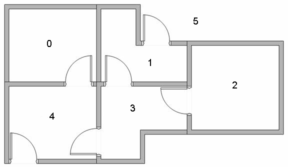
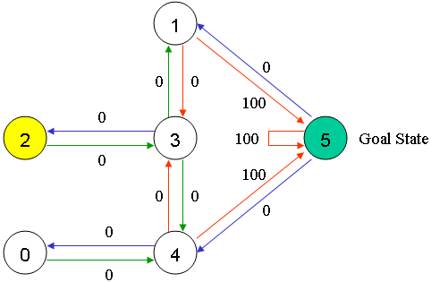
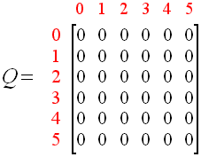
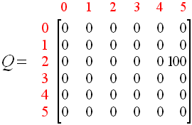
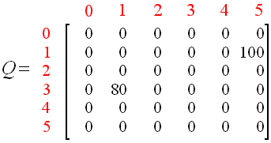
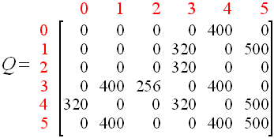
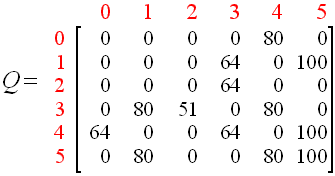
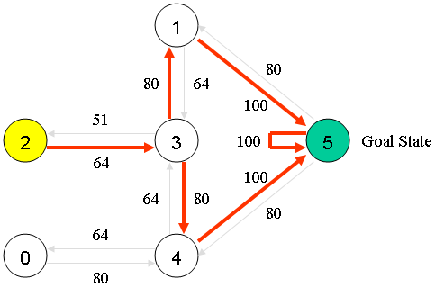

# 一个简单的 Q-Learning 示例

（原文：[A Painless Q-Learning Tutorial](http://mnemstudio.org/path-finding-q-learning-tutorial.htm)）

这个示例通过一个简单但是全面的数字例子，介绍了 `Q-Learning` 的概念。这个例子描述了一个使用无监督训练去学习一个未知环境的代理。你同样可以将这个例子和附加的源代码比较，这会很有帮助。

假设在一个建筑物内，我们有五个房间，他们通过门相连，如下图所示。我们将房间从 0 到 4 编号，建筑物外可以视为一个巨大的房间，编号为 5。注意门 1 和 4 连接建筑物内和房间 5（建筑物外）。



我们可以将房间抽象为一个图，每一个房间对应一个节点，每一个门对应一条边。


例如，我们可以放置一个代理到任何一个房间，然后从那个房间开始，走出建筑物（即我们的目标房间）。换句话说，我们的目标房间标号是 5。为了将这个房间设置为目标，我们给每一个门上（即图中顶点之间的边）赋予一个“奖励值”。直接通向目标房间的门有一个常数奖励值 —— 100，其他不直接通向目标房间的门拥有 0 奖励值。因为门有两个方向，两个方向的边被赋予每个房间，每条边包含一个常数奖励值，如下图所示：


当然，房间 5 循环通向它自己，奖励值为 100。而且其他直接连接到目标房间的门也拥有一个 100 奖励值。在 Q-Learning 中，目标是到达奖励值最高的状态，所以如果代理到达目标房间，它将永远待在那儿。这种类型的目标被称为“absorbing goal”

想象我们的代理是一个可以通过经验进行学习的，哑的虚拟机器人。这个代理可以从一个房间到达另一个，但是没有任何环境信息，即不知道哪个门通向建筑物外。

假设我们想要代理模型，从任何一个房间撤离到建筑物外。现在假设我们有一个代理在房间 2，然后我们希望它学习如何走到建筑物外（房间 5）。


Q-Learning 的术语中包含“状态”和“动作”。

我们可以称每个房间（包括建筑物外）为“状态”，称代理从一个房间到另一个房间的移动为“动作”。在我们的图中，“状态”被描述为节点，“动作”被描述为边。



假设代理在状态 2，从状态 2，它可以去状态 3 因为状态 2 连接到了状态 3。然而从状态 2，代理不能直接走到状态 1 因为没有一个门把房间 1 和 2 直接相连。从状态 3，它可以走到状态 1 或 4 或者返回状态 2。如果代理在状态 4，它有三个可能的动作：0，5 和 3。如果代理在状态 1，它可以走到状态 5 或着 3。从状态 0，它只能返回状态 4。

我们可以把状态图和奖励值抽象到下面的奖励表中，矩阵 R：


（-1 表示 null (即没有节点之间的连接)，例如，状态 0 不能走到状态 1）

现在我们增加一个相似的矩阵 Q，代理的大脑，代表了代理从经验中学习到的记忆。矩阵 Q 的行代表代理的当前状态，列代表导向新状态的可能动作。

代理最开始什么都不知道，矩阵 Q 被初始化为 0。在这个例子中，为了表述简单，我们假设状态的数量已知（6）。如果我们不知道有多少个状态，矩阵 Q 应该被初始化为一个数值，如果一个新的状态被发现，就将矩阵 Q 增加一列。

Q-Learning 的转换规则公式非常简单：

```
Q(state, action) = R(state, action) + Gamma * Max[Q(next state, all action)]
```

通过这个公式，矩阵 R 中对应的值加上学习率 Gamma 与下一状态中所有可能动作对应的 Q 的最大值，被赋予为矩阵 Q 每一个具体元素的新的值。

我们的虚拟代理通过经验学习，没有人去教（即无监督学习）。代理将要探索从这个状态到那个状态，直到它到达目标。我们称每一次探索为一个“训练”。每次训练都由代理从初始状态到目标状态的移动组成。每次代理到达目标状态，程序就进行下一次训练。


Q-Learning 算法：

```
1. 设置学习率 gamma 和环境奖励值矩阵 R

2. 初始化矩阵 Q 为 0 矩阵

3. for 每次训练：

    选择一个随机的状态

    do {

    - 为当前状态，从所有可能的动作中选择一个动作;

    - 执行这个动作，进入下一个状态;

    - 基于通过所有可能的动作而到达的下一状态，获得最大的 Q 值;

    - 计算：Q(state, action) = R(state, action) + Gamma * Max[Q(next state, all action)];

    - 设置下一状态为当前状态;

    } while (未到达目标状态);

    End for;
```

我们的代理使用上面的算法从经验中学习，每次训练就是一次训练会话。每次会话中，代理探索周围环境（即矩阵 R），获得奖励值直到它到达目标状态，训练的目的是增强代理的“大脑”，即矩阵 Q。训练次数越多，矩阵 Q 优化的就越好。在这种情况下，如果矩阵 Q 被增强，代理会找到到达目标状态的最快路径，而不是对周围随意探索，在相同的房间里来回出入。

学习率 gamma 取值在 0 到 1 之间。如果 gamma 太接近 0 ，那么代理会只考虑最近的奖励值。如果 gamma 太接近 1，那么代理会对未来的奖励值给予更大权重，可能会推迟奖励的获得。

使用矩阵 Q，代理从初始状态到目标状态追踪状态序列。算法会根据矩阵 Q 为当前状态找到拥有最高奖励值的动作：

使用矩阵 Q 的算法：

1. 设置当前状态为初始状态
2. 从当前状态，找到能获得最大奖励值 Q 的动作
3. 设置当前状态为下一个状态
4. 重复 2 到 3 步，直到当前状态等于目标状态

上面的算法将会返回一个从初始状态到目标状态的状态序列。


## Q-Learning 示例

为了理解 Q-Learning 算法如何工作，我们将通过一些训练步骤一步一步推导。

我们最开始设置学习率 gamma = 0.8 ，初始状态为房间 1。

初始的矩阵 Q 是一个零矩阵：



现在观察矩阵 R 的第二行（状态1），这里有两个可能的动作：走向状态 3 或者状态 5 。通过随机选择，我们选择状态 5 。


现在想象如果我们的代理位于状态 5 会发生什么。看到奖励矩阵 R 的第 6 行（状态 5）。它有 3 个可能的动作：走向状态 1，4 或者 5 。

```
Q(state, action) = R(state, action) + Gamma * Max[Q(next state, next actions)]
Q(1, 5) = R(1, 5) + 0.8 * Max[Q(5, 1), Q(5, 4), Q(5, 5)] = 100 + 0.8 * 0 = 100
```

因为矩阵 Q 被初始化为 0 矩阵，Q(5, 1), Q(5, 4), Q(5, 5) 全都为 0 。这次计算的结果：Q(1, 5) = 100 。

下一状态：状态 5 现在成为了当前状态，因为状态 5 是目标状态，我们完成了一次训练。现在我们代理的“大脑” 即更新之后的矩阵 Q ：



下一次训练，我们随机选择一个初始状态，这次我们选择状态 3 。

矩阵 R 的第四行，有 3 个可能的动作：走到状态 1，2 或者 4 。通过随机选择，我们选择走到状态 1 。

现在我们想象我们在状态 1 。观察矩阵 R 的第二行（状态 1）。它有 2 可能的动作：走到状态 3 或者 5 。然后我们计算 Q 值：

```
Q(state, action) = R(state, action) + Gamma * Max[Q(next state, next actions)]
Q(3, 1) = R(3, 1) + 0.8 * Max[Q(1, 2), Q(1, 5)] = 0  + 0.8 * 100 = 80
```

我们通过上一次的训练更新矩阵 Q ：Q(1, 3) = 0 和 Q(1, 5) = 100 。计算的结果 Q(1, 3) = 80 因为奖励值为 0 。矩阵Q变为：



下一状态，状态 1，现在成为当前状态。我们重复 Q-Learning 的内循环，因为状态 1 不是目标状态。

所以，我们开始新的循环，当前状态为 1，有 2 种可能的动作：走向状态 3 或者状态 5 。遵循幸运指引，我们选择走向状态 5 。


现在，想象我们在状态 5，有三种可能的动作：走向状态 1，4 或者 5 。我们使用这三个动作的最大值计算 Q 值：

```
Q(state, action) = R(state, action) + Gamma * Max[Q(next state, next actions)]
Q(1, 5) = R(1, 5) + 0.8 * Max[Q(5, 1), Q(5, 4), Q(5, 5)] = 100  + 0.8 * 0 = 100
```

因为 Q(5, 1), Q(5, 4), Q(5, 5) 全都为 0，所以计算结果为 Q(1, 5) = 100 。这个结果并没有改变矩阵 Q 。

因为 5 是目标状态，我们完成此次训练，我们的代理的“大脑” 即更新后的矩阵 Q：

.gif)

如果我们的代理通过更多次训练学习之后，矩阵 Q 的值将会收敛成如下矩阵：



这个矩阵 Q 可以被归一化（归一化为百分比值）：



既然矩阵 Q 已经到达了收敛，我们知道代理已经学习到了到达目标状态的最优化的路径。沿着拥有最大 Q 值的“状态-动作”链，即最优的状态序列。



例如，从初始状态 2 ，代理可以使用矩阵 Q 作为指导：

- 从状态 2，最大的 Q 值 指向 走向状态3 的动作
- 从状态 3，最大的 Q 值 指向 走向状态 1 或 4 动作，假设我们选择状态 1
- 从状态 1，最大的 Q 值指向 走向状态 5 的动作
- 因此路径为 2 - 3 - 1 - 5